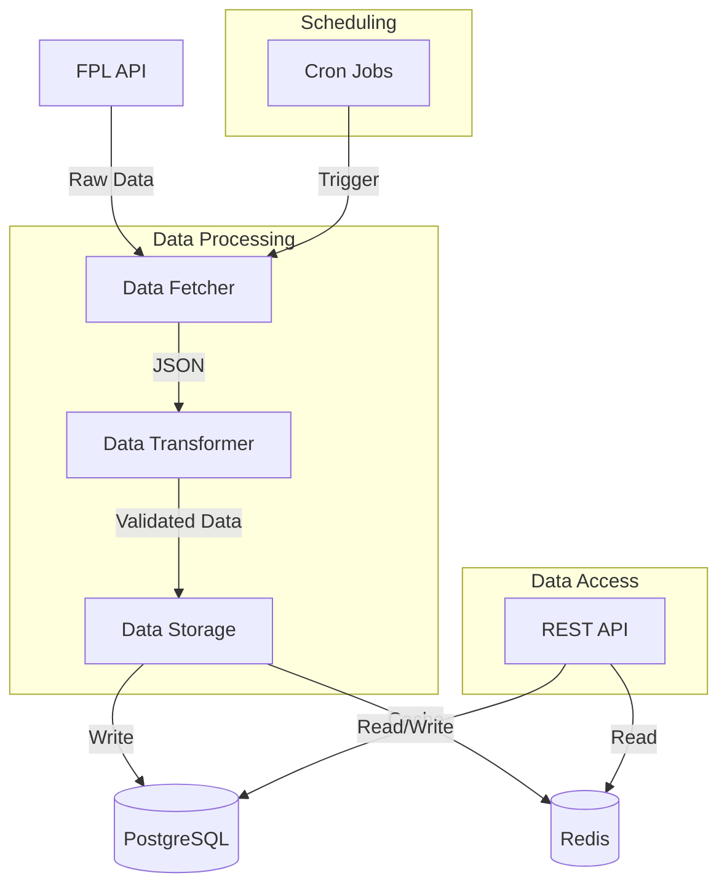
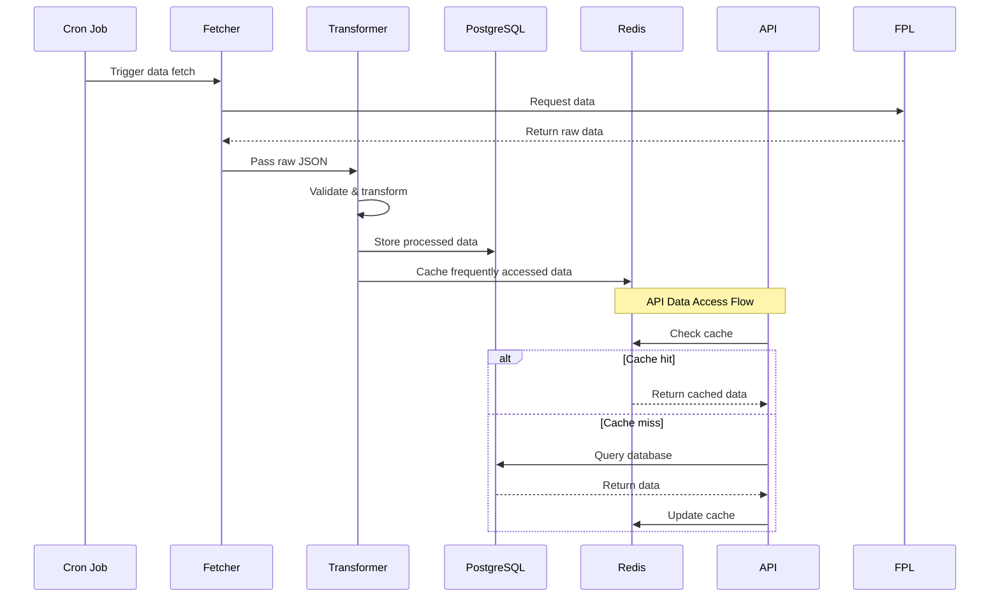
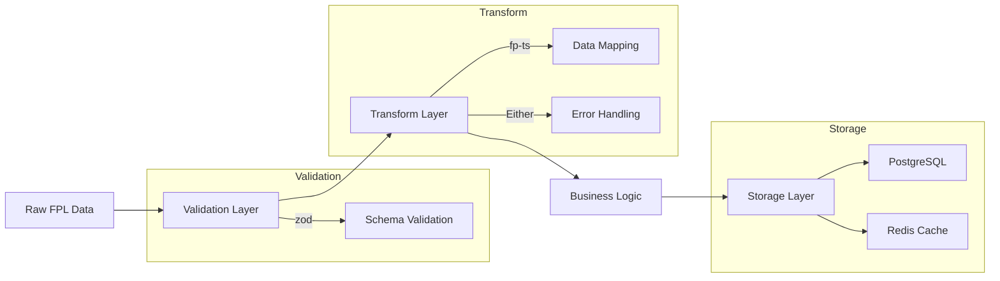
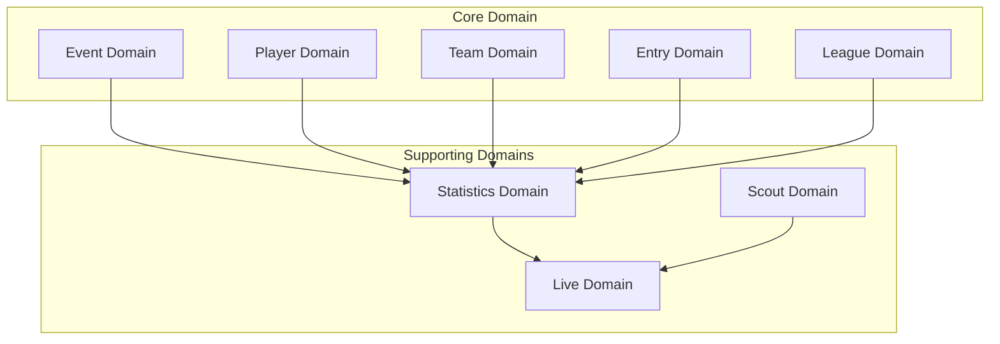

# Overall

Letletme_data is a robust data service that fetches data from the Fantasy Premier League (FPL) servers, cleans and transforms the data, and then stores it in PostgreSQL and Redis, providing RESTful APIs for querying data. The service is built with TypeScript using functional programming principles, ensuring type safety and maintainability.

Key Features:

- Real-time FPL data fetching and transformation
- Clean, structured data through RESTful APIs
- Efficient data persistence with PostgreSQL
- Performance optimization using Redis caching
- Type-safe implementation with strict TypeScript
- Docker containerization for easy deployment

# Architecture & Workflow

## System Architecture



## Data Flow



## Data Processing Pipeline



# Tech Stack

Core:

- TypeScript (with strict type checking)
- Node.js (v18+)
- Bun (runtime & package manager)
- ElysiaJS (REST API framework)

Storage:

- PostgreSQL (primary database)
- Redis (caching layer, via ioredis)
- Drizzle ORM (type-safe ORM)

Testing & Quality:

- Bun Test Runner (Jest-compatible)
- ESLint & Prettier (code quality tools)

Utilities:

- Pino (structured logging)
- Zod (runtime type validation)
- fp-ts (functional programming utilities)

DevOps:

- Docker (containerization)
- Docker Compose (multi-container orchestration)

# Functional Programming

This project is designed using functional programming principles, making it particularly well-suited for data transformation workflows. The FP approach offers several benefits:

1. Data Flow:

   - Clear, unidirectional data flow
   - Immutable data transformations
   - Pure functions for predictable results
   - Extensive use of fp-ts for functional patterns

2. Type Safety:

   - Advanced TypeScript generics
   - No 'any' types allowed
   - Strong type inference
   - Runtime type validation with Zod

3. Benefits:
   - Highly testable code
   - Easy to maintain and extend
   - Reduced side effects
   - Better error handling through Either and Option types
   - Composable functions

While the learning curve with TypeScript generics and FP patterns can be steep, especially coming from an OOP background, the resulting codebase is more maintainable, predictable, and elegant.

# Getting Started

1. Prerequisites:

   ```bash
   Node.js v18+
   Bun v1+
   Docker & Docker Compose
   PostgreSQL
   Redis
   ```

2. Installation:

   ```bash
   git clone [repository-url]
   cd letletme_data
   bun install
   ```

3. Configuration:

   ```bash
   cp .env.example .env
   # Edit .env with your settings
   ```

4. Run:
   ```bash
   docker-compose up -d
   bun run dev
   ```

# Domain-Driven Design

The project follows DDD principles with clear domain boundaries and type-safe implementations.



Each domain follows a standard structure with entities, repositories, services, and types, ensuring clear separation of concerns and maintainable code. For detailed design documentation, please refer to the design docs.
