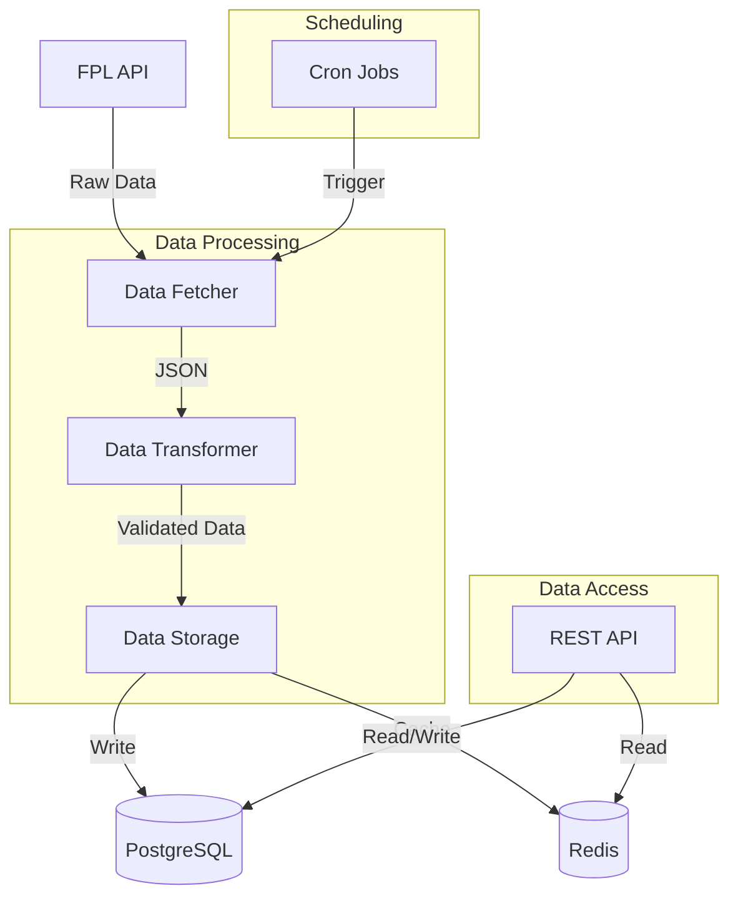
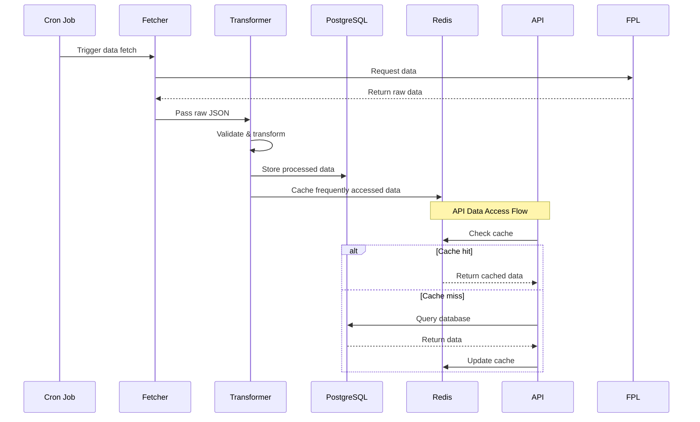
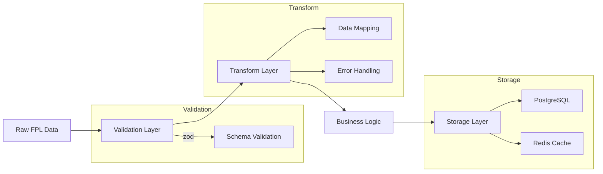
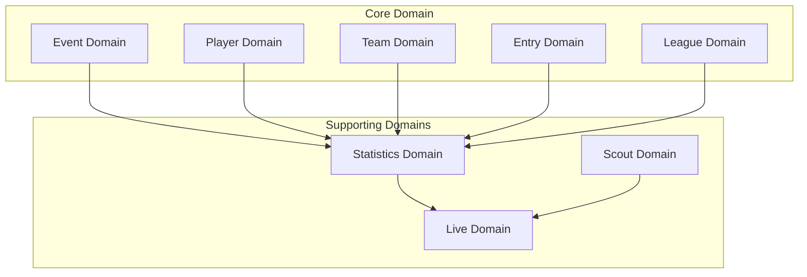

# Overall

Letletme_data is the sole writer for LetLetMe's FPL domain data. It fetches the
Fantasy Premier League (FPL) APIs, validates and transforms the responses, and
persists canonical rows in PostgreSQL plus disposable read models in Redis.
Its REST surface is an internal ingestion/control plane; `letletme-graphql` is
the public product data API.

Key Features:

- Real-time FPL data fetching and transformation
- Protected operational REST endpoints for sync and tournament commands
- Efficient data persistence with PostgreSQL
- Performance optimization using Redis caching
- Type-safe implementation with strict TypeScript
- Docker containerization for easy deployment

# Architecture & Workflow

## System Architecture

```mermaid
graph TB
    FPL[FPL API] --> |Raw Data| Fetcher[Data Fetcher]
    Fetcher --> |JSON| Transform[Data Transformer]
    Transform --> |Validated Data| Storage[Data Storage]
    Storage --> |Write| DB[(PostgreSQL)]
    Storage --> |Cache| Cache[(Redis)]
    API[REST API] --> |Read| Cache
    API --> |Read/Write| DB
    Cron[Cron Jobs] --> |Trigger| Fetcher

    subgraph Data Processing
        Fetcher
        Transform
        Storage
    end

    subgraph Data Access
        API
    end

    subgraph Scheduling
        Cron
    end
```

## Data Flow

```mermaid
sequenceDiagram
    participant C as Cron Job
    participant F as Fetcher
    participant T as Transformer
    participant P as PostgreSQL
    participant R as Redis
    participant A as API

    C->>F: Trigger data fetch
    F->>FPL: Request data
    FPL-->>F: Return raw data
    F->>T: Pass raw JSON
    T->>T: Validate & transform
    T->>P: Store processed data
    T->>R: Cache frequently accessed data

    Note over A,R: API Data Access Flow
    A->>R: Check cache
    alt Cache hit
        R-->>A: Return cached data
    else Cache miss
        A->>P: Query database
        P-->>A: Return data
        A->>R: Update cache
    end
```

See [docs/SYSTEM_CONTRACTS.md](docs/SYSTEM_CONTRACTS.md) for repository
ownership, trust boundaries, authentication, cache ownership, and rollout
rules. See [docs/redis-contract.md](docs/redis-contract.md) for the binding key
inventory.

## Data Processing Pipeline

```mermaid
flowchart LR
    A[Raw FPL Data] --> B[Validation Layer]
    B --> C[Transform Layer]
    C --> D[Business Logic]
    D --> E[Storage Layer]

    subgraph Validation
        B --> |zod| B1[Schema Validation]
    end

    subgraph Transform
        C --> C1[Data Mapping]
        C --> C2[Error Handling]
    end

    subgraph Storage
        E --> E1[PostgreSQL]
        E --> E2[Redis Cache]
    end
```

# Tech Stack

Core:

- TypeScript (with strict type checking)
- Bun (runtime, package manager, bundler, and test runner)
- ElysiaJS (REST API framework)

Storage:

- PostgreSQL (primary database)
- Redis (caching layer and BullMQ queues, via ioredis)
- Drizzle ORM (type-safe ORM)

Testing & Quality:

- Bun Test Runner
- ESLint & Prettier (code quality tools)

Utilities:

- Pino (structured logging)
- Zod (runtime type validation)

DevOps:

- Docker (containerization)
- Docker Compose (multi-container orchestration)

# Domain-Driven Design

The project follows DDD principles with clear domain boundaries and type-safe implementations.

```mermaid
graph TB
    subgraph Core Domain
        Event[Event Domain]
        Player[Player Domain]
        Team[Team Domain]
        Entry[Entry Domain]
        League[League Domain]
    end

    subgraph Supporting Domains
        Scout[Scout Domain]
        Stats[Statistics Domain]
        Live[Live Domain]
    end

    Event --> Stats
    Player --> Stats
    Team --> Stats
    Entry --> Stats
    League --> Stats

    Stats --> Live
    Scout --> Live
```

Each domain follows a standard structure with entities, repositories, services, and types, ensuring clear separation of concerns and maintainable code.

## Deployment

- The production stack runs inside Docker containers orchestrated by `docker compose`; copy `.env.deploy.example` to `.env.deploy`, then run `scripts/deploy.sh` to build images, start services, and execute database migrations locally or on the VPS.
- Continuous delivery is handled via GitHub Actions (`.github/workflows/deploy.yml`), which builds a container image, pushes it to GHCR, and refreshes the VPS stack using the same compose file.
- Refer to `DEPLOYMENT.md` for the full checklist and required GitHub secrets.
- Production mutations require `ENABLE_AUTH=true` and one or more SHA-256
  digests in `DATA_API_KEY_HASHES`. The web server keeps the matching plaintext
  key in its server-only `TOURNAMENT_API_KEY`; browsers never receive it.

## Testing

- Run `bun test tests/unit` for the fast, deterministic suite that validates transformers, repositories, and utilities (this is what the CI workflow executes).
- Run `bun run test:integration` locally before production releases; these tests require PostgreSQL and Redis and are gated to test-only infrastructure. See `tests/README.md` for setup details.

## Scheduled major upgrades

The following major-version upgrades are planned once the current fix plan lands and CI is green:

- Zod 4
- Pino 10
- ESLint 10

Track them in dependency-renovation PRs; do not mix them with fix-plan items.
