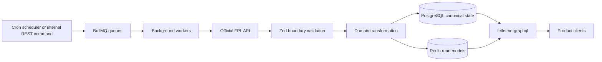

# LetLetMe Data

`letletme_data` is the sole writer for LetLetMe's Fantasy Premier League (FPL)
domain data. It fetches official FPL endpoints, validates and transforms every
accepted payload, persists canonical rows in PostgreSQL, and publishes
rebuildable Redis read models. Its REST API is an internal ingestion and
operations surface; product clients read through `letletme-graphql`.

## What this service owns

- Official FPL API access, retries, timeouts, and boundary validation.
- Independent Understat Team and Player ingestion with canonical PostgreSQL facts and durable
  normalized staging evidence; no Data-owned Understat Redis read model.
- Core season data: events, teams, fixtures, players, and phases.
- Current-gameweek, entry, league, tournament, live, and price-change jobs.
- Canonical FPL and tournament rows in PostgreSQL.
- Immutable `llm:data:*` Redis publications and BullMQ/coordination jobs.
- Protected operational endpoints for manual synchronization and recovery.

It does not own browser authentication or the public product schema. See
[System contracts](docs/SYSTEM_CONTRACTS.md) for the four-repository ownership
model and [Redis contract](docs/redis-contract.md) for the binding key shapes.

## Architecture


```mermaid
flowchart LR
    S["Cron scheduler or internal REST command"] --> Q["BullMQ queues"]
    Q --> W["Background workers"]
    W --> F["Official FPL API"]
    F --> V["Zod boundary validation"]
    V --> T["Domain transformation"]
    T --> P[("PostgreSQL canonical state")]
    T --> R[("Redis read models")]
    P --> G["letletme-graphql"]
    R --> G
    G --> C["Product clients"]
```

The API process owns HTTP routes and cron registration. The worker process
consumes the data, entry, live, league, tournament, and tournament-setup queue
families, plus independent Understat Team and Player queues when enabled. Run both processes; an
API-only deployment can enqueue work but cannot complete it.

PostgreSQL is authoritative. Redis is disposable acceleration state. A failed
FPL request or validation error fails the sync without replacing the last
accepted canonical state.

Understat is deliberately PostgreSQL-only at the business-data layer. Its workers use the queue
Redis endpoint only for BullMQ, mutation locks, and short-lived request permits.

## Multi-season and preseason provider boundaries

The current code accepts the official pre-season placeholders observed for
2026/27 without inventing substitute values:

| Upstream field | Accepted value | Meaning in this service |
|---|---:|---|
| Team `strength` | `null` | FPL has not published a strength rating |
| Team `position` | `0` | Team is not ranked yet; it sorts after ranked teams |
| Fixture `pulse_id` | `0` | Pulse identifier has not been assigned |

`fpl.seasons.is_current` is the only current-season authority. Wall-clock
inference and Redis are never allowed to select a season. A core job receives
that explicit season, derives the upstream season from GW1 metadata, and fails
before persistence if the two do not match.

The core snapshot reads FPL bootstrap and fixtures once each, validates the
complete season together, updates five season-keyed PostgreSQL tables in one
transaction, and publishes one immutable Redis revision:

| Domain | PostgreSQL | Redis |
|---|---|---|
| Events | `fpl.events` | Core item `events` |
| Teams | `fpl.teams` | Core item `teams` |
| Fixtures | `fpl.fixtures` | Core item `fixtures` |
| Players | `fpl.players` | Core item `players` |
| Phases | `fpl.phases` | Core item `phases` |

The active manifest is `llm:data:fpl:core:{season}:active`; all six items,
including `currentEventId`, belong to the revision named by that manifest.
Readers either accept the complete revision or use one coherent PostgreSQL
fallback.

Entry records, player statistics and values, picks, event-live data, results,
and tournament derivatives require their own upstream data and job gates. They
are not evidence that the core bootstrap failed when GW1 or a current event has
not been published yet.

Endpoint availability changes throughout pre-season. Do not copy a one-time
"active endpoint count" into operational decisions. Use the read-only checks
and staged update matrix in the
[FPL season readiness runbook](docs/fpl-season-readiness.md).

## Season and publication guarantees

- Historical and current seasons coexist in the same plural physical tables,
  keyed by `season_id`; no table-name suffix or history-parent routing exists.
- Empty or identity-incomplete core arrays preserve existing database and cache state.
- Same-season core snapshots reserve a durable database revision before their
  two upstream reads; an older delayed attempt cannot overwrite a newer one.
- Events, teams, players, phases, and season-wide fixtures have one writer: the
  complete core snapshot. Their REST sync routes all enqueue that job.
- PostgreSQL commits before the Redis pointer moves. Staged keys expire after
  15 minutes, active items do not expire, and retired revision items expire
  after 24 hours. Recovery reconciles an active manifest only with its exact
  `ops.dataset_publications` row.
- Switching `fpl.seasons.is_current` is an explicit season-readiness operation;
  an ordinary sync cannot discover and activate a different season.
- Player market history and player season summaries remain PostgreSQL/reporting
  reads. Data publishes neither `PlayerValue:*` nor `EventLiveSummary:*` keys.
- Player stats/values and live/selection jobs require both the fixture-derived
  season window and a current event. Core discovery jobs do not; bounded
  post-match result jobs intentionally remain eligible after the GW38 date.
- League and tournament results poll only during the bounded 24-hour window
  after the final fixture's expected end. Hourly provisional/final job IDs
  deduplicate repeated ticks, failed deterministic jobs remain retryable, and
  a final league correction runs after fresh `fpl.player_gameweek_stats` persistence.

## Local setup

Prerequisites:

- Bun `1.3.3` (the version pinned in `package.json`)
- PostgreSQL
- Redis with distinct cache-publication and BullMQ/coordination endpoints or databases

Install and configure:

```bash
cp .env.example .env
bun install --frozen-lockfile
bun run env:check
bun run db:migrate
bun run db:migrate:status
```

At minimum, configure `DATABASE_URL`, `CACHE_REDIS_*`, and `QUEUE_REDIS_*`.
Cache and queue settings must not resolve to the same host/port/database tuple;
production requires both sets explicitly. Supabase and notification variables
are optional runtime integrations. When `WECHAT_NOTIFICATION_URL` is configured
in production, `WECHAT_NOTIFICATION_API_TOKEN` is mandatory and is sent as a
Bearer header. Production must use `ENABLE_AUTH=true` with at least one
SHA-256 digest in `DATA_API_KEY_HASHES`.

### WeChat notification contract

`src/utils/notify.ts` sends a bounded 10-second request with a stable
`Idempotency-Key`. A caller can supply a key through `notifyTwoBots`; the
player-market freshness watchdog uses
`player-market-freshness:<scheduled-run-UTC-minute>` and reuses it for retries.
The caller logs only status/category/request ID. It never logs the token,
notification body, or provider response body. `401`, `409`, `429`, `5xx`,
timeouts, and network failures are classified separately for operations.

Start the two processes in separate terminals:

```bash
bun run dev
```

```bash
bun run worker:dev
```

The API listens on `http://localhost:3000` by default.

## Health and readiness

```bash
curl http://localhost:3000/health
curl http://localhost:3000/ready
```

- `/health` checks API process liveness.
- `/ready` requires PostgreSQL, both Redis endpoints, and exactly one valid
  `fpl.seasons.is_current` row. Cache publication completeness is monitored
  separately and does not become season authority.

To rebuild a missing core publication, trigger the complete core snapshot. Do
not create Redis manifests manually:

```bash
curl -X POST http://localhost:3000/events/sync \
  -H "x-api-key: $DATA_API_KEY"
```

The header is required when `ENABLE_AUTH=true` and may be omitted in an
explicitly unauthenticated local environment.

## Manual core-season bootstrap

The mutation returns after enqueueing one atomic core-snapshot job. Keep the
worker running and inspect the resulting job/report before continuing:

```bash
curl -X POST http://localhost:3000/events/sync \
  -H "x-api-key: $DATA_API_KEY"
```

`POST /events/sync`, `/teams/sync`, `/players/sync`, `/phases/sync`, and
`/fixtures/sync` all enqueue the same complete snapshot. There is no
event-specific or 38-request fixture mutation route.

Use `GET /jobs` to list manual operational triggers. Full request examples are
in the [API cheat sheet](docs/api-cheat-sheet.md).

## Development commands

| Command | Purpose |
|---|---|
| `bun run dev` | Start the API with watch mode |
| `bun run worker:dev` | Start all BullMQ workers with watch mode |
| `bun run build` | Build API and worker into `dist/` |
| `bun start` | Run the production API bundle |
| `bun run worker:start` | Run the production worker bundle |
| `bun run test` or `bun test tests/unit` | Run the hermetic unit suite |
| `bun run test:integration` | Run guarded PostgreSQL/Redis integration tests |
| `RUN_INTEGRATION=1 bun run test:all` | Run unit and integration tests with the guarded test environment |
| `bun run typecheck` | Type-check without emitting files |
| `bun run lint` | Run ESLint |
| `bun run coverage` | Run unit tests with coverage |
| `bun run db:migrate` | Apply canonical SQL migrations |
| `bun run db:migrate:status` | Verify the canonical migration ledger and checksums |

Integration tests refuse production-like database or Redis targets. See
[tests/README.md](tests/README.md) for the required isolated setup.

## Deployment

Production uses the API and worker images in `docker-compose.yml`. Migrations
run before either service is restarted, logs go to bounded Docker JSON files,
and the worker health check uses its heartbeat file.

```bash
cp .env.deploy.example .env.deploy
bash scripts/deploy.sh deploy
```

After `main` CI succeeds, the deployment workflow builds one image digest, stops writers, applies
migrations, republishes core data from PostgreSQL, and verifies API/worker health. See
[DEPLOYMENT.md](DEPLOYMENT.md) for host bootstrap, GitHub configuration, recovery boundaries, and
troubleshooting. A successful image rollout does not replace the data audit in the season-readiness
runbook.

## Documentation

- [Understat sync, storage, and consumer architecture](docs/understat-pipeline.md)
- [FPL season readiness runbook](docs/fpl-season-readiness.md)
- [System contracts](docs/SYSTEM_CONTRACTS.md)
- [Redis key contract](docs/redis-contract.md)
- [Database security boundary](docs/database-security.md)
- [Job schedule and gates](docs/job-schedule.md)
- [Internal API cheat sheet](docs/api-cheat-sheet.md)
- [Migration ownership](migrations/README.md)
- [Test strategy](tests/README.md)
- [Deployment guide](DEPLOYMENT.md)
