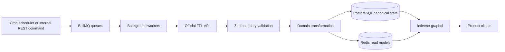

# LetLetMe Data

`letletme_data` is the sole writer for LetLetMe's Fantasy Premier League (FPL)
domain data. It fetches official FPL endpoints, validates and transforms every
accepted payload, persists canonical rows in PostgreSQL, and publishes
rebuildable Redis read models. Its REST API is an internal ingestion and
operations surface; product clients read through `letletme-graphql`.

## What this service owns

- Official FPL API access, retries, timeouts, and boundary validation.
- Core season data: events, teams, fixtures, players, and phases.
- Current-gameweek, entry, league, tournament, live, and price-change jobs.
- Canonical FPL and tournament rows in PostgreSQL.
- Data-owned Redis hashes, the `Season:active` authority key, and BullMQ jobs.
- Protected operational endpoints for manual synchronization and recovery.

It does not own browser authentication or the public product schema. See
[System contracts](docs/SYSTEM_CONTRACTS.md) for the four-repository ownership
model and [Redis contract](docs/redis-contract.md) for the binding key shapes.

## Architecture


```mermaid
flowchart LR
    S["Cron scheduler or internal REST command"] --> Q["BullMQ queues"]
    Q --> W["Background workers"]
    W --> F["Official FPL API"]
    F --> V["Zod boundary validation"]
    V --> T["Domain transformation"]
    T --> P[("PostgreSQL canonical state")]
    T --> R[("Redis read models")]
    P --> G["letletme-graphql"]
    R --> G
    G --> C["Product clients"]
```

The API process owns HTTP routes and cron registration. The worker process
consumes the data, entry, live, league, tournament, and tournament-setup queue
families. Run both processes; an API-only deployment can enqueue work but
cannot complete it.

PostgreSQL is authoritative. Redis is disposable acceleration state. A failed
FPL request or validation error fails the sync without replacing the last
accepted canonical state.

## 2026/27 season compatibility

The current code accepts the official pre-season placeholders observed for
2026/27 without inventing substitute values:

| Upstream field | Accepted value | Meaning in this service |
|---|---:|---|
| Team `strength` | `null` | FPL has not published a strength rating |
| Team `position` | `0` | Team is not ranked yet; it sorts after ranked teams |
| Fixture `pulse_id` | `0` | Pulse identifier has not been assigned |

Core discovery jobs run year-round so a newly published season is detected
before the fixture-derived season window opens. The season code comes from the
GW1 deadline or kickoff metadata (`2026/27` becomes `2627`); it is never guessed
from the server calendar.

The first core bootstrap updates five PostgreSQL tables and seven Redis
families:

| Domain | PostgreSQL | Redis |
|---|---|---|
| Events | `events` | `Season:active`, `Event:{season}` |
| Teams | `teams` | `Team:{season}` |
| Fixtures | `event_fixtures` | `Fixtures:{season}:*`, `FixturesByTeam:{season}:*` |
| Players | `players` | `Player:{season}` |
| Phases | `phases` | `Phase:{season}` |

Entry records, player statistics and values, picks, event-live data, results,
and tournament derivatives require their own upstream data and job gates. They
are not evidence that the core bootstrap failed when GW1 or a current event has
not been published yet.

Endpoint availability changes throughout pre-season. Do not copy a one-time
"active endpoint count" into operational decisions. Use the read-only checks
and staged update matrix in the
[FPL season readiness runbook](docs/fpl-season-readiness.md).

## Season rollover guarantees

- Empty core arrays preserve existing database and cache state.
- Same-season core snapshots reserve a durable database revision before their
  two upstream reads; an older delayed attempt cannot overwrite a newer one.
- Legacy event, team, player, phase, and fixture refresh entry points all queue
  that same complete snapshot; no partial core writer competes with it.
- `Season:active` changes only with a matching committed
  `core_snapshot_authority` record. A crash between PostgreSQL and Redis is
  recovered by finalizing or rolling back the pending publication receipt.
- Destructive database season rollover remains a separately approved runbook.
  A newer candidate fails with `CORE_SNAPSHOT_MANUAL_ROLLOVER_REQUIRED` before
  any canonical row or cache key changes until that runbook has completed.
- When that key advances through a core write, all documented season-scoped
  Data cache families are scanned and prior-season keys are removed. This does
  not flush Redis, BullMQ state, price history, or consumer-owned keys.
- PostgreSQL intentionally stores one FPL season at a time. Identity
  reassignment is rejected rather than silently repointing historical foreign
  keys; replacement belongs to the gated rollover procedure.
- Player stats/values and live/selection jobs require both the fixture-derived
  season window and a current event. Core discovery jobs do not; bounded
  post-match result jobs intentionally remain eligible after the GW38 date.
- League and tournament results poll only during the bounded 24-hour window
  after the final fixture's expected end. Hourly provisional/final job IDs
  deduplicate repeated ticks, failed deterministic jobs remain retryable, and
  a final league correction runs after fresh `event_lives` persistence.

## Local setup

Prerequisites:

- Bun `1.3.3` (the version pinned in `package.json`)
- PostgreSQL
- Redis for cache and BullMQ; queue Redis may use a separate database

Install and configure:

```bash
cp .env.example .env
bun install --frozen-lockfile
bun run env:check
bun run db:migrate
bun run db:apply-sql
bun run db:migrate:status
```

At minimum, configure `DATABASE_URL` and `REDIS_*`. `QUEUE_REDIS_*` defaults to
the cache Redis connection. Supabase and notification variables are optional
runtime integrations. Production must use `ENABLE_AUTH=true` with at least one
SHA-256 digest in `DATA_API_KEY_HASHES`.

Start the two processes in separate terminals:

```bash
bun run dev
```

```bash
bun run worker:dev
```

The API listens on `http://localhost:3000` by default.

## Health and readiness

```bash
curl http://localhost:3000/health
curl http://localhost:3000/ready
```

- `/health` checks API process liveness.
- `/ready` requires PostgreSQL, Redis, and a valid FPL-derived
  `Season:active`. A fresh Redis instance is expected to return `503` until a
  successful events sync establishes the active season.

Do not write `Season:active` manually to make readiness green. Trigger events
sync and let the validated GW1 metadata establish it:

```bash
curl -X POST http://localhost:3000/events/sync \
  -H "x-api-key: $DATA_API_KEY"
```

The header is required when `ENABLE_AUTH=true` and may be omitted in an
explicitly unauthenticated local environment.

## Manual core-season bootstrap

Each mutation returns after enqueueing a job. Keep the worker running and wait
for each job to complete before moving to the next dependency-sensitive step:

```bash
curl -X POST http://localhost:3000/events/sync \
  -H "x-api-key: $DATA_API_KEY"
curl -X POST http://localhost:3000/teams/sync \
  -H "x-api-key: $DATA_API_KEY"
curl -X POST http://localhost:3000/fixtures/sync \
  -H "x-api-key: $DATA_API_KEY"
curl -X POST http://localhost:3000/players/sync \
  -H "x-api-key: $DATA_API_KEY"
curl -X POST http://localhost:3000/phases/sync \
  -H "x-api-key: $DATA_API_KEY"
```

Teams precede fixtures because the `FixturesByTeam` cache is rebuilt from the
active team hash. The writer preserves an existing team-fixture view if teams
are absent, but the ordered bootstrap avoids an incomplete first build.

Use `GET /jobs` to list manual operational triggers. Full request examples are
in the [API cheat sheet](docs/api-cheat-sheet.md).

## Development commands

| Command | Purpose |
|---|---|
| `bun run dev` | Start the API with watch mode |
| `bun run worker:dev` | Start all BullMQ workers with watch mode |
| `bun run build` | Build API and worker into `dist/` |
| `bun start` | Run the production API bundle |
| `bun run worker:start` | Run the production worker bundle |
| `bun run test` or `bun test tests/unit` | Run the hermetic unit suite |
| `bun run test:integration` | Run guarded PostgreSQL/Redis integration tests |
| `RUN_INTEGRATION=1 bun run test:all` | Run unit and integration tests with the guarded test environment |
| `bun run typecheck` | Type-check without emitting files |
| `bun run lint` | Run ESLint |
| `bun run coverage` | Run unit tests with coverage |
| `bun run db:migrate` | Apply Drizzle-journaled migrations |
| `bun run db:apply-sql` | Apply repository-numbered SQL migrations |
| `bun run db:migrate:status` | Verify both migration histories and checksums |

Integration tests refuse production-like database or Redis targets. See
[tests/README.md](tests/README.md) for the required isolated setup.

## Deployment

Production uses the API and worker images in `docker-compose.yml`. Migrations
run before either service is restarted, logs go to bounded Docker JSON files,
and the worker health check uses its heartbeat file.

```bash
cp .env.deploy.example .env.deploy
bash scripts/deploy.sh deploy
```

Merges to `main` deploy only after the CI workflow succeeds. See
[DEPLOYMENT.md](DEPLOYMENT.md) for host bootstrap, GitHub configuration,
rollback, and troubleshooting. Merging is not permission to bypass the
production data audit in the season-readiness runbook.

## Documentation

- [FPL season readiness runbook](docs/fpl-season-readiness.md)
- [System contracts](docs/SYSTEM_CONTRACTS.md)
- [Redis key contract](docs/redis-contract.md)
- [Job schedule and gates](docs/job-schedule.md)
- [Internal API cheat sheet](docs/api-cheat-sheet.md)
- [Migration ownership](migrations/README.md)
- [Test strategy](tests/README.md)
- [Deployment guide](DEPLOYMENT.md)
