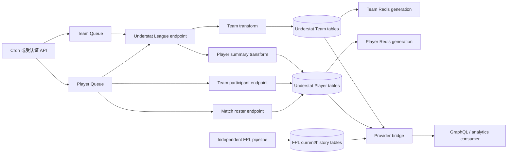
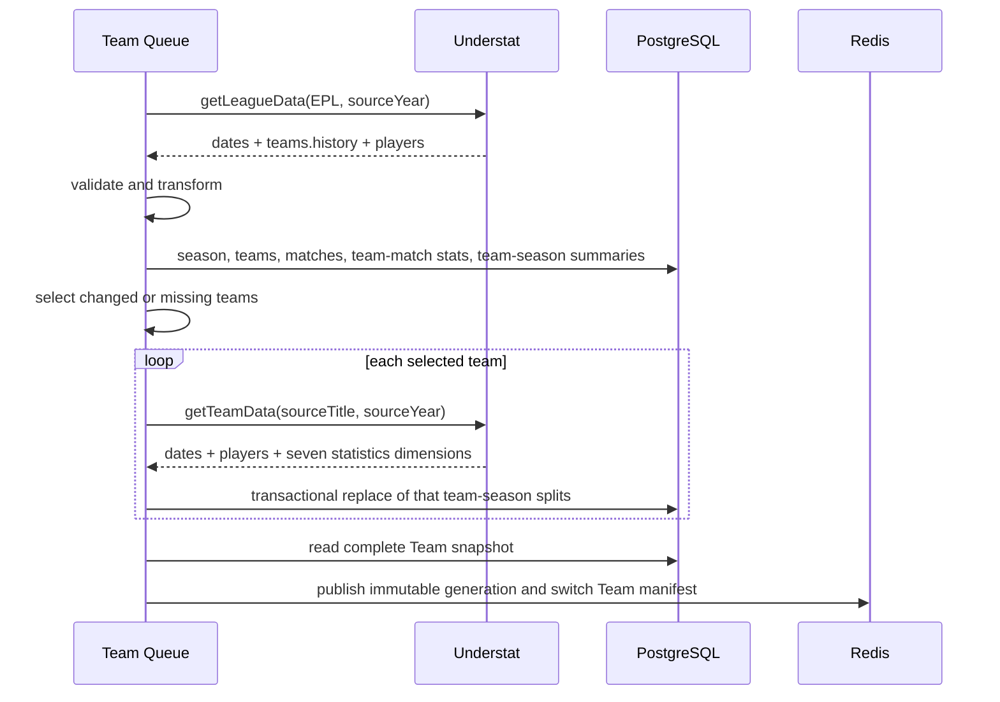
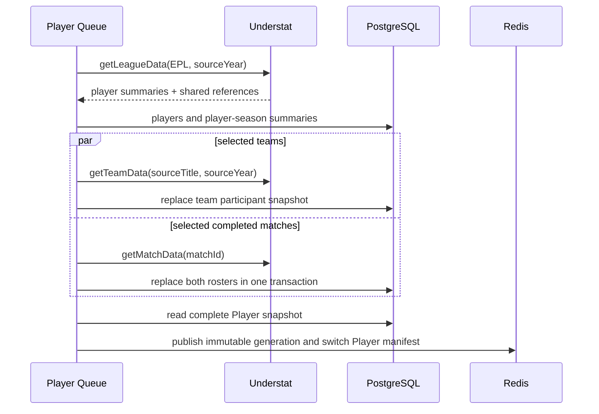
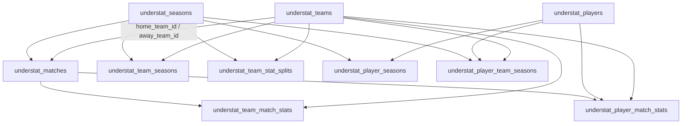
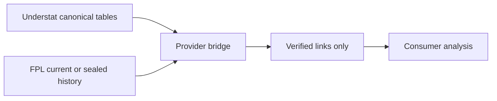

# Understat 同步、存储与消费架构

**状态：** Understat 2025/26 已完成真实数据回填；2026/27 pipeline 已实现，生产调度默认关闭。

**适用对象：** Data、GraphQL、分析服务开发者，以及执行回填、恢复和赛季切换的运维人员。

**最后更新：** 2026-08-08。

本文是 Understat 数据在 `letletme_data` 中的主文档，说明数据从哪里来、如何经过 Team
和 Player 两条同步线、如何落 PostgreSQL、如何发布 Redis，以及如何在不污染 FPL provider
数据的前提下进行关联分析。

## 1. 先理解边界

Understat 是独立的比赛分析 provider，不是英超或 FPL 的官方比赛真相。本系统遵守以下边界：

1. PostgreSQL 是持久化真相；Redis 只是可从 PostgreSQL 完整重建的 read model。
2. Team 和 Player 是两条独立 lane，分别有 queue、worker、lock、run、item 和 Redis manifest。
3. Team lane 失败不会阻塞 Player lane；任一 Understat lane 失败都不会影响 FPL 同步或 `/ready`。
4. FPL 同步不读取 Understat 表、Understat Redis 或 provider bridge。
5. Understat 同步不读取 FPL 表。只有同步完成后的 bridge/matcher 可以同时读取两个 provider。
6. `/getTeamData/{team}/{year}` 返回赛季参与者，不代表当前注册阵容。当前 FPL 阵容仍以 FPL
   bootstrap 为准，两边人数不同不是错误。
7. Understat 历史赛季永久保留，不因新赛季开始而清空。
8. V1 不保存 shot-level 数据，也不保存完整 raw payload。



## 2. Season 和 source identity

应用使用四位赛季键，Understat endpoint 使用起始年份：

| 应用 season | Understat source year | 含义 |
| --- | ---: | --- |
| `2526` | `2025` | 2025/26 |
| `2627` | `2026` | 2026/27 |

转换由 `sourceYearFromSeason()` 完成，并要求两个年份连续。`understat_seasons` 保存两种表示，
避免在调用点重复猜测年份。

Understat team ID、player ID 和 match ID 是 provider identity。Team 和 Player identity 表不带
current team；会随赛季变化的名称、球队关系和统计数据保存在 season 表中。历史回填只扩展
`first_seen_season` / `last_seen_season`，不会让旧赛季名称覆盖较新赛季 identity 名称。

Understat datetime 没有时区时按 UTC 解释，最终写入 PostgreSQL `timestamptz`。

## 3. Source endpoints 和契约边界

日常 pipeline 使用 Understat 的 JSON/XHR endpoints，而不是解析网页 DOM：

| Client 方法 | Endpoint | 日常用途 |
| --- | --- | --- |
| `getLeagueData(league, sourceYear)` | `/getLeagueData/EPL/{year}` | 两条 lane 的独立 discovery |
| `getTeamData(title, sourceYear)` | `/getTeamData/{title}/{year}` | Team splits 或 Player participants |
| `getMatchData(matchId)` | `/getMatchData/{matchId}` | Player match roster |
| `getPlayerData(playerId)` | `/getPlayerData/{playerId}` | 诊断、新 ID 调查、补 favorite position；不参与全量同步 |

Team URL 直接对 source title 使用 `encodeURIComponent`，不维护或猜测 slug。请求发送明确的
User-Agent、`X-Requested-With: XMLHttpRequest` 和 JSON/text JavaScript Accept header。

Client 的责任仅限一次 HTTP 尝试和边界验证：

- timeout 为 10 秒；网络错误、timeout、429 和 5xx 标记为可重试；普通 4xx 不重试。
- `Retry-After` 会传给 BullMQ backoff。
- 每个 BullMQ job 最多三次总尝试，不会形成 client 三次乘 queue 三次。
- 响应用 `response.text()` 后 `JSON.parse()`；空响应和非 JSON 立即失败。
- Zod 要求关键字段存在。数字字符串必须是合法有限数字，空字符串不会被转换成 `0`。
- 新增未知顶层字段告警但不阻断；已知字段缺失或类型变化会阻断该 resource。
- Match response 的 `shots` 会完整通过契约验证，但不会持久化。

每个 lane worker concurrency 为 2。`Understat:RateLimit:leases` 是跨 worker replica 的 Redis
lease semaphore，把 Team 与 Player 的 provider 总并发限制在 4。

## 4. 同步入口、模式和调度

### 4.1 Feature flags

```dotenv
UNDERSTAT_ENABLED=false
UNDERSTAT_SCHEDULES_ENABLED=false
UNDERSTAT_BASE_URL=https://understat.com
UNDERSTAT_LEAGUE=EPL
UNDERSTAT_MIN_SEASON=2526
UNDERSTAT_SEASON=2627
UNDERSTAT_TIMEOUT_MS=10000
UNDERSTAT_MAX_CONCURRENCY=4
```

- `UNDERSTAT_ENABLED=false`：worker 不处理请求，API sync 校验失败，不发送网络请求。
- `UNDERSTAT_ENABLED=true` 且 schedules 为 false：允许受认证的历史回填和人工恢复，但不注册 cron。
- 两个 flag 都为 true：只为 `UNDERSTAT_SEASON` 注册生产 schedule。

### 4.2 API

受全局 API key 保护的主要入口：

- `POST /understat/team/sync`
- `POST /understat/player/sync`
- `GET /understat/status/:season`
- `POST /understat/mappings/team`
- `POST /understat/mappings/reconcile`
- `GET /understat/mappings/:season`
- `PATCH /understat/mappings/entity/:id`
- `PATCH /understat/mappings/match/:id`

同步 body：

```json
{
  "season": "2627",
  "mode": "incremental",
  "teamIds": [83],
  "matchIds": [28786]
}
```

`matchIds` 只对 Player lane 有效。`teamIds` 和 `matchIds` 各自只缩小对应 resource 类型；例如
Player `full` 只传 `teamIds` 时，match 仍会选择全部已完成比赛。Smoke test 应同时明确传入两类
ID，或分别触发。

### 4.3 模式选择

| Lane / mode | Team page 选择 | Match page 选择 |
| --- | --- | --- |
| Team incremental | 缺少 splits，或 team-match hash 变化的球队 | 不适用 |
| Team full | 全部 20 队 | 不适用 |
| Team reconcile | 全部 20 队 | 不适用 |
| Player incremental | 缺少 participant snapshot、球员汇总变化涉及的球队、新比赛双方 | 未同步比赛和 kickoff 后 72 小时内比赛 |
| Player full | 全部 20 队 | 全部已完成比赛 |
| Player reconcile | 缺少 participant snapshot 的球队 | 未同步、72 小时内比赛，再加每日轮换 10 场历史比赛 |
| Player participants full | 全部 20 队 | 不抓 match；内部 cron 使用 `participantsOnly` |

默认 AWST/UTC+8 schedule：

| Job | 时间 |
| --- | --- |
| Team incremental | 每日 10:15 |
| Player incremental | 每日 10:30 |
| Team reconcile | 每周二 11:00 |
| Player participants full | 每周二 11:15 |
| Player reconcile | 每日 11:30 |
| Active season staleness monitor | 每日 12:00；36 小时无两条 lane 成功 publication 时通知 |

## 5. 所有 lane 共用的 run/item 状态机

一次 API 或 cron trigger 先进入 lane 自己的 BullMQ queue：

- Team queue：`understat-team-sync`
- Player queue：`understat-player-sync`

每次 trigger 使用 UUID `runId`。Run 是一次同步的总账，item 是可独立重试的最小 resource：

| Lane | Resource type | Resource ID |
| --- | --- | --- |
| Team | `league` | `EPL` |
| Team | `team-detail` | Understat team ID |
| Player | `league` | `EPL` |
| Player | `team-participants` | Understat team ID |
| Player | `match-roster` | Understat match ID |

Run 状态含义：

| Status | 含义 |
| --- | --- |
| `pending` | 保留的初始状态；正常 worker 启动 discovery 时直接进入 running |
| `running` | 至少一个 item 尚未完成 |
| `failed` | 所有 item 已 settle，至少一个最终失败；本 lane 不发布 |
| `ready_to_publish` | 所有 item completed/skipped，等待完整性检查和 Redis publish |
| `completed` | Run 正常结束，但全局 DB snapshot 不完整，因此有意不发布 |
| `published` | 新 generation 已发布，或确认无变化后复用了旧 revision |

Item 状态为 `pending | running | failed | completed | skipped`。业务内容变化记为 `completed`，
hash 完全相同记为 `skipped`。一个 item 最终失败不会把仍在运行的其他 item 提前 terminalize；
只有全部 item settle 后 run 才会进入 failed 或 ready-to-publish。

同一 season、同一 lane 同时只允许一个 active run。Team 和 Player run 互不排斥。

## 6. Team lane：从 league 到 Team snapshot



### 6.1 Discovery transform

League `dates` 生成 `understat_matches`。每个 `teams[].history` 项本身没有 match ID，因此必须用：

1. team ID 位于 match 对应主/客队；
2. `h_a` 与主客方向一致；
3. datetime 完全一致；
4. scored/missed 与比赛比分一致；

得到唯一 match。零个或多个候选都会让整个 discovery 失败，绝不按数组位置猜测。

每场已完成比赛必须恰好得到主、客两个 `understat_team_match_stats` row。随后从这些 match rows
重新聚合 `understat_team_seasons`；系统不自行发明 Understat 没提供的排名字段。

### 6.2 Team detail

只有被选中的球队才抓 team endpoint：

- `dates` 必须覆盖 league snapshot 中该球队的全部比赛。
- team ID、match ID、主客队、kickoff、result、比分和 xG 必须与 league snapshot 一致。
- team page 与 league page 的 forecast 口径可能不同，因此不比较 forecast。
- `players` 只做结构验证，Team lane 不持久化 participant。
- `statistics` 的七个维度展平成统一的 `dimension + splitKey + for/against metrics` rows。

该 team-season 的 split rows 在单个事务中 scoped replace。已有数据遇到空 replacement 会被拒绝；
事务提交后再比较 persisted hashes，防止连接或事务异常被误记为成功。

### 6.3 Team publication gate

EPL Team snapshot 只有满足以下条件才可发布：

- 20 个 team-season summaries；
- 380 场 matches；
- 每场已完成比赛有正确的 home/away 两条 team-match row；
- 每支球队都有 `situation | formation | gameState | timing | shotZone | attackSpeed | result`
  七个非空维度。

Smoke run 可以成功落局部数据，但会以 `completed + publicationSkipReason` 结束，不会覆盖已有完整
manifest。

## 7. Player lane：summary、participant 和 roster



### 7.1 League player summary

League `players` 写入两层：

- `understat_players`：provider identity 和最新名称，不保存 current team。
- `understat_player_seasons`：该赛季 league aggregate，包括出场、时间、进球、助攻、射门、
  cards、xG/xA/npxG/xGChain/xGBuildup、position 和审计用 `source_team_title`。

`source_team_title` 只用于追查 source，不拆字符串建立球队关系。

### 7.2 Team participant snapshot

Player lane 使用 team page 的明确 team context，完整替换
`(season, team_id)` 范围内的 `understat_player_team_seasons`：

- 同一球员同赛季转会时，可以有多个 team membership rows。
- Team page 后续移除某个 participant 时，新的完整 snapshot 可以删除该 team-season 的旧 membership。
- 空 snapshot 不允许清除已存在的非空 participant 数据。
- participant 数量不与 FPL current roster 比较。

### 7.3 Match roster

一个 `getMatchData(matchId)` 同时处理双方 roster：

- rosters 中 home/away team ID 必须与 `understat_matches` 一致。
- roster map key 必须等于 row 中的 roster ID。
- 全场 roster ID 唯一；每侧 player ID 唯一。
- `position !== 'Sub'` 推导为 starter，每侧必须恰好 11 名 starter。
- 保留 source position、position order、minutes、事件统计和 `roster_in/out` ID。
- 该 match 的全部 player-match rows 在一个事务中替换。
- roster 汇总进球或 xG 与 league aggregate 有差异时告警，但不因 provider 内部口径差异删除数据。

### 7.4 Player publication gate

首次 Player publish 要求：

- player-season summaries 非空；
- 20 支球队都已有 participant snapshot；
- 每个 player-season identity 都至少出现在一个 membership，且没有 orphan membership；
- 每场已完成比赛都有双方 roster，且双方各 11 名 starter。

日常同步不会批量调用 player detail endpoint。

## 8. PostgreSQL 数据模型和关联方式

### 8.1 Understat provider tables

| Table | Grain / key | 来源与用途 |
| --- | --- | --- |
| `understat_seasons` | PK `season` | league、source year、planned/active/complete 生命周期 |
| `understat_teams` | PK Understat `id` | 跨赛季 team identity、最新名称和 first/last seen |
| `understat_matches` | PK Understat match `id` | 赛季、主客队、kickoff、比分、xG、forecast；两条 lane 的共享 reference |
| `understat_team_match_stats` | PK `(match_id, team_id)` | 一支球队在一场比赛的 xG/xGA、npxG、PPDA、deep、xPoints、结果和积分 |
| `understat_team_seasons` | PK `(season, team_id)` | 从 team-match rows 重建的赛季 aggregate 和当季 source title |
| `understat_team_stat_splits` | PK `(season, team_id, dimension, split_key)` | team page 七类 for/against splits |
| `understat_players` | PK Understat `id` | 跨赛季 player identity；不保存 current team |
| `understat_player_seasons` | PK `(season, player_id)` | league player aggregate 和当季审计名称/position/team title |
| `understat_player_team_seasons` | PK `(season, player_id, team_id)` | 明确的赛季球队 membership；支持同季转会 |
| `understat_player_match_stats` | PK `roster_id`；unique `(match_id, player_id, team_id)` | match roster 级别证据 |

所有统计小数使用 PostgreSQL `numeric(14,8)`，forecast 概率使用 `numeric(10,8)`。

### 8.2 Sync control tables

| Table | Key | 用途 |
| --- | --- | --- |
| `understat_sync_runs` | UUID `run_id` | lane/season/mode/trigger、item 计数、dataChanged、publication revision 和错误摘要 |
| `understat_sync_items` | `(run_id, resource_type, resource_id)` | resource 尝试次数、状态、source hash、最终错误和恢复位置 |

### 8.3 High-level relations



常见查询关系：

| 想要的数据 | 关联路径 |
| --- | --- |
| 某队赛季总览 | `understat_team_seasons -> understat_teams` by `team_id` |
| 某队逐场数据 | `understat_team_match_stats -> understat_matches` by `match_id` |
| 某队赛季参与者 | `understat_player_team_seasons -> understat_players` by `player_id` |
| 某球员赛季汇总 | `understat_player_seasons -> understat_players` by `player_id` |
| 某球员同季转会 | 按 `(season, player_id)` 查询多个 `understat_player_team_seasons` |
| 某场双方 roster | `understat_player_match_stats` filter `match_id`，再按 `side/team_id` 分组 |
| 某球员逐场表现 | `understat_player_match_stats -> understat_matches` by `match_id` |

不要通过 name、`source_team_title` 或数组位置关联。Provider 内关系只能使用明确的 Understat ID。

## 9. Persist、hash 和并发语义

### 9.1 写入顺序

Fresh season discovery 必须按 foreign-key 顺序写入：

1. season；
2. teams；
3. matches；
4. team/player identities；
5. match/season facts。

事务不会自动推断并行 statement 的 FK 依赖，因此 discovery 不使用无序 `Promise.all` 写入。

### 9.2 source hash 和 no-op

每个 domain resource 对稳定排序、camelCase 的业务字段计算 SHA-256 `sourceHash`：

- object key canonical sort；
- Date 转 ISO；
- 抓取时间、`last_seen_at` 等观察字段不进入业务 hash；
- PostgreSQL upsert 使用 hash distinct 条件，内容相同不会抖动 `updated_at`；
- scoped replace 先比较整组 identity + hash，相同直接 no-op。

同一 payload 连续执行两次，第二次可以抓取并验证，但不应更新业务 rows，也不应创建新 Redis
revision。

### 9.3 两条 lane 共享 reference 的规则

Team 和 Player 都独立抓 league endpoint，并都会写 `understat_seasons`、`understat_teams` 和
`understat_matches`。这不是 lane 依赖，而是相同 source reference 的幂等 upsert。

`understat_matches.source_checked_at` 只允许较新的抓取覆盖较旧抓取，避免慢 lane 回写旧比分。
Team/player identity 只有来自同样或更新 season 的名称才能覆盖当前名称；旧赛季 backfill 仍可更新
first-seen，但不能倒退最新 identity。

## 10. Redis read model 和 consumer contract

### 10.1 Manifest 和 generation keys

Team 和 Player 各自发布不可变 generation：

| Key | Type | Field | JSON value |
| --- | --- | --- | --- |
| `Understat:Season:active` | string | - | configured active Understat season |
| `Understat:Snapshot:{season}:team` | string | - | Team manifest |
| `Understat:Snapshot:{season}:player` | string | - | Player manifest |
| `Understat:Team:{season}:{revision}` | hash | `teamId` | `{ team, season }` summary |
| `Understat:Match:{season}:{revision}` | hash | `matchId` | normalized match |
| `Understat:TeamMatches:{season}:{revision}` | hash | `teamId` | ordered `{ stat, match }[]` |
| `Understat:TeamSplits:{season}:{revision}` | hash | `teamId` | ordered split rows |
| `Understat:Player:{season}:{revision}` | hash | `playerId` | `{ player, season, memberships }` |
| `Understat:TeamParticipants:{season}:{revision}` | hash | `teamId` | membership rows with embedded player identity |
| `Understat:PlayerMatches:{season}:{revision}` | hash | `playerId` | ordered `{ stat, match }[]` |

Manifest JSON：

```json
{
  "schemaVersion": 1,
  "season": "2627",
  "lane": "team",
  "revision": "<runId>",
  "publishedAt": "2026-08-08T00:00:00.000Z",
  "counts": {
    "teams": 20,
    "matches": 380,
    "teamMatches": 760,
    "splits": 738
  }
}
```

Player manifest 的 counts 是 `players`、`memberships`、`playerMatches`。

### 10.2 发布协议

1. revision 使用 run ID。
2. 先写所有 generation hashes，并赋 1 小时 staging TTL。
3. 对每个 hash 执行 `HLEN`，必须等于 PostgreSQL snapshot 生成的 field 数。
4. Redis transaction 同时更新该 lane manifest、移除新 generation TTL，并给旧 generation 24 小时
   TTL。
5. transaction 失败时旧 manifest 保持可读；PostgreSQL 已提交数据可通过后续 run 重发。
6. 无业务变化且已有有效 manifest 时复用旧 revision，不创建 generation。
7. 只有 season 等于 `UNDERSTAT_SEASON` 时才更新 `Understat:Season:active`；2526 backfill 不会
   改 active pointer。

### 10.3 Consumer 正确读法

一个 lane 内的读取步骤：

1. 读取并验证 `Understat:Snapshot:{season}:{lane}`。
2. 从 manifest 取得 revision，构造该 revision 的所有 generation key。
3. 只读取这些 immutable keys；不要自行选择“最新 UUID”。
4. 用 manifest counts 做合理性检查；缺 key 或损坏时回退 PostgreSQL，而不是混用另一 revision。

Team 与 Player manifest 可以是不同 revision，这是正常状态。跨 lane 分析应同时记录两个 revision，
不能假定原子同步。Generation key 包含 revision，所以 manifest 切换后，已开始的旧 revision 读取仍可
在 24 小时内完成。

`Understat:Season:active` 只用于“当前 Understat season”的便利解析，不是历史数据存在性的判断。
按指定 season 读取时应直接读对应 manifest。

### 10.4 Internal Redis namespaces

以下 key 不属于 consumer read model：

- `Understat:RateLimit:leases`：短期 ZSET request permits。
- `mutation-lock:understat:team:control:{season}`。
- `mutation-lock:understat:player:control:{season}`。
- `mutation-lock:understat:{lane}:{season}:{jobName}:{resourceId}`。
- `bull:understat-team-sync:*`。
- `bull:understat-player-sync:*`。

BullMQ key 数量取决于 retained jobs，不能作为数据完整性指标。Understat 不写 FPL 的
`Season:active`、`Team:*`、`Player:*`，也绝不能使用 `FLUSHDB` 或 `FLUSHALL`。

## 11. FPL 关联为什么放在 bridge

Understat 没有公开可可靠连接到 FPL `player.code` 的直接 ID。Name normalization、重音符、昵称和
fuzzy score 只能生成候选，不能确认 identity。因此 bridge 是独立的下游过程：



Bridge tables：

| Table | 用途 |
| --- | --- |
| `provider_entity_links` | team/player 的 provider pair、状态、规则版本、证据和人工审核 |
| `provider_match_links` | season-scoped Understat match 到 FPL fixture code |
| `provider_entity_aliases` | 保存 source names 供审计和候选展示；alias 本身不能确认映射 |

这些表不对当前 FPL `teams/players` 建 FK，避免 FPL current tables rollover 时破坏历史 link。

### 11.1 Team mapping

每个赛季人工确认 20 支球队。确认使用 durable FPL `team.code`，并在 link evidence 的
`confirmedSeasons` 中明确记录该 season。first/last seen 范围不能代替逐赛季确认。

### 11.2 Match mapping

只有两队已确认后才自动匹配。要求：

- FPL fixture 已完成；
- home/away team code 一致；
- kickoff 误差不超过 10 分钟；
- 最终比分一致；
- 候选唯一。

### 11.3 Player mapping

FPL event-live 在聚合前写入 `fpl_player_fixture_stats`，保留 fixture code、durable player/team
code、position type、minutes、starter evidence 和硬事件。DGW 按 fixture 分行；source 没有
`starts` 时保存 `null`，不伪造成 0。

Player matcher 只在 verified match/team context 中比较整队 roster：

- position compatible；
- FPL starts 非 null 时必须与 Understat starter 一致；
- minutes 差不超过 2；
- goals、own goals、yellow/red cards 完全一致；
- assists 只用于进一步缩小多个候选；
- 同一 pair 至少有两个独立 verified match observations；
- 最终全局一对一候选唯一。

Link 状态为
`pending | auto_verified | manual_verified | ambiguous | quarantined | rejected`。Consumer 只读
`auto_verified` 和 `manual_verified`。已验证 link 出现硬冲突时转 `quarantined`，禁止静默重绑。

FPL `1617`–`2526` 已逐赛季回填到 history partitions，并通过 row count、checksum、FK 和最终
points 校验后 seal。`2526` 使用保留的 raw `event live`、`element-summary`、fixture stats 和
core snapshots；`1617`–`2425` 使用 Vaastav 保留的逐 GW transformed CSV fallback，因为这些赛季
没有可用的 raw `element-summary` JSON。历史 market status/news/chance、旧赛季 ownership、旧源
fixture 标识等缺失字段仍按明确的 unknown/NULL 或 deterministic proxy 语义处理，不得被当成
live 当前状态。审计后已用保留的 FPL team code 修复 `1617`/`1718` 的球队名称；`2627` 的
`teams_2627` 已从当前 `teams` 表写入 20 支球队，但其他 `2627` history partitions 仍未完成，
因此 archive status 保持 `building`，没有提前 seal。

## 12. FPL history tables 与 season resolver

FPL archive 不是 Understat lane 的前置条件，但 bridge 读取历史 FPL 时依赖它。

当前赛季继续写原有无后缀表；归档后复制到以下 LIST-partitioned history parents：

- `events_history`
- `teams_history`
- `players_history`
- `phases_history`
- `event_fixtures_history`
- `player_stats_history`
- `event_lives_history`
- `event_live_explains_history`
- `event_live_summaries_history`
- `player_values_history`
- `player_market_snapshots_history`

`event_live_summaries` is the current-event derived read model at
`(event_id, element_id)` grain and carries the current player `team_id`.
`event_live_summaries_history` is the sealed season/player aggregate at
`(season, element_id)` grain produced by migration 0069 from the historical
event-live facts; the current and historical tables intentionally have
different contracts.
- `fpl_player_fixture_stats_history`

`fpl_season_archives` 保存 `unavailable | pending | building | sealed | failed`；
`fpl_season_archive_items` 保存每张 source table 的 row count、canonical checksum 和 verified time。

Raw current-season archive eligibility 要求 38 个 events、ID 正好 1..38、380 场 fixtures、所有
fixture finished、fixture event ID 全部在 1..38，并且 38 个 event 都完成 durable live
consolidation。历史源回填还允许 blank gameweek：event 仍必须存在，但该 event 可以有 0 个 fixture
和 0 个 player-event/live rows；例如 `2223` 的 GW7 是 blank，后续 double/multiple gameweeks
仍使赛季 fixture 总数保持 380。复制在一致性 transaction 中完成，并校验 row counts、checksums
和历史 FK 后才 seal。

Season resolver 规则：

- 请求 season 等于 `core_snapshot_authority.season`：读当前无后缀 FPL tables。
- 请求 season 已 sealed：读 history parents，由 PostgreSQL partition pruning 选择物理分区。
- unavailable、failed 或未归档：明确返回 unavailable，绝不回退到另一赛季的当前表。

## 13. 故障隔离和恢复

### 13.1 不会破坏旧数据的失败

- HTTP 空响应、JSON/Zod 错误发生在 persistence 前。
- Team/player scoped replace 在一个事务中；中途失败完整回滚。
- 提交后 hash verification 失败时 item 不会被记为成功。
- 任一 required item 最终失败只阻止该 lane manifest。
- Redis publication 失败保留旧 manifest。
- 局部 smoke run 不会发布残缺 generation。
- Understat 状态永远不让现有 `/ready` 失败。

### 13.2 恢复步骤

1. 调用 `GET /understat/status/{season}`，查看 Team/Player latest run、failed items、resource counts
   和 manifest revision。
2. 先修复 provider access、schema drift 或具体数据问题。
3. 对单个 team/match 使用 explicit ID incremental；范围不明确时使用 reconcile。
4. 上一次 failed run 的未完成 resource 会被后续未指定 ID 的 run 重新纳入。
5. 如果只是 Redis publish 失败，PostgreSQL 不需要重抓或清空；后续 run 可重新构建 generation。
6. 正常恢复绝不删除 Understat 表、manifest、FPL key 或 BullMQ database。

Status 返回的 resource counts 包括：`teams`、`matches`、`teamMatchStats`、`teamSplits`、`players`、
`teamParticipants` 和 `playerMatchStats`，并附各自最近数据库更新时间。

## 14. 2025/26 已落地基线

2526 真实 source 已永久落库，用于验证 pipeline，不是临时 fixture：

| Resource | 已验收数量 |
| --- | ---: |
| Teams | 20 |
| Matches | 380，全部完成 |
| Team-match rows | 760 |
| Team-season rows | 20 |
| Team split rows | 738；每队七个 dimensions |
| Player-season rows | 537 |
| Player-team memberships | 551 |
| 同赛季多球队球员 | 14 |
| 有完整 roster 的 matches | 380 |
| Player-match rows | 11,490 |

额外验收：

- Arsenal team page 有 25 名赛季参与者，不与 FPL current roster 人数比较。
- Match `28786` 有 31 条 roster rows，主队 15、客队 16，双方各 11 starters。
- Team full 约 1 个 league + 20 个 team requests。
- Player full 最大约 1 个 league + 20 个 team + 380 个 match requests。
- 第二次 full/reconcile 为 hash no-op，并复用旧 Redis revision。
- 2526 Team/Player manifests 已保留，但没有修改 `Understat:Season:active`。
- FPL 2526 archive 已 sealed；FPL 2526 provider mappings 仍需独立运行 matcher 后再验收，不能
  因为 archive sealed 就自动宣称 mapping 完成。

## 15. 2026/27 启用顺序

1. 保持 `UNDERSTAT_SCHEDULES_ENABLED=false`。
2. 确认 `/getLeagueData/EPL/2026` 返回有效 20-team、380-match 结构。
3. 首场完成比赛后执行 Team full 和 Player full。
4. 人工核对首轮 teams、matches、participants 和 rosters。
5. 人工确认 20 个 team mappings。
6. 运行 mapping reconcile，并人工审查首轮所有 player auto-verification。
7. 连续七天无 schema drift、active lane stale 或错误 mapping 后再启用 consumer。
8. 最后打开 schedules flag。
9. 赛季末满足 38/380/finalized 条件后 seal FPL 2627 archive；Understat 历史无需搬迁。

## 16. Schema 和 key inventory

本功能新增 30 张逻辑 PostgreSQL tables；FPL `1617`–`2526` 的 10 个 sealed seasons 加上
`2627` current season，共 11 套、132 张物理 partitions，合计 162 个 table relations。

### 16.1 30 张逻辑 tables

```text
Understat provider (10)
understat_seasons
understat_teams
understat_matches
understat_team_match_stats
understat_team_seasons
understat_team_stat_splits
understat_players
understat_player_seasons
understat_player_team_seasons
understat_player_match_stats

Understat sync (2)
understat_sync_runs
understat_sync_items

Provider bridge (3)
provider_entity_links
provider_match_links
provider_entity_aliases

FPL fixture evidence (1)
fpl_player_fixture_stats

FPL archive control (2)
fpl_season_archives
fpl_season_archive_items

FPL history parents (12)
events_history
teams_history
players_history
phases_history
event_fixtures_history
player_stats_history
event_lives_history
event_live_explains_history
event_live_summaries_history
player_values_history
player_market_snapshots_history
fpl_player_fixture_stats_history
```

### 16.2 1617–2526 physical partitions

`1617`, `1718`, `1819`, `1920`, `2021`, `2122`, `2223`, `2324`, `2425`, and
`2526` each have the following twelve physical partitions. The importer writes
only the history parents/partitions and archive-control tables; it does not
write Redis or the current unsuffixed FPL tables.

```text
event_{season}
team_{season}
player_{season}
phase_{season}
event_fixture_{season}
player_stat_{season}
event_live_{season}
event_live_explain_{season}
event_live_summary_{season}
player_value_{season}
player_market_snapshot_{season}
fpl_player_fixture_stat_{season}
```

`2526` is the only season in this set with preserved raw `element-summary`
JSON. For `1617`–`2425`, the archive reason records the transformed-source
fallback and its missing-field caveats; it does not claim raw endpoint parity.

### 16.3 2627 physical partitions

```text
events_2627
teams_2627
players_2627
phases_2627
event_fixtures_2627
player_stats_2627
event_lives_2627
event_live_explains_2627
event_live_summaries_2627
player_values_2627
player_market_snapshots_2627
fpl_player_fixture_stats_2627
```

`teams_2627` 已有当前赛季的 20 支球队维度；其余 `2627` partitions 等待完整赛季回填，不能把
当前球队维度的存在误认为完整历史 archive。

### 16.4 Stable Redis business keys

一个已发布 season 有两个 manifests 和七个 generation hashes，共九个持久 business keys；当它是
active season 时另有全局 `Understat:Season:active`。

```text
Understat:Season:active
Understat:Snapshot:{season}:team
Understat:Snapshot:{season}:player
Understat:Team:{season}:{revision}
Understat:Match:{season}:{revision}
Understat:TeamMatches:{season}:{revision}
Understat:TeamSplits:{season}:{revision}
Understat:Player:{season}:{revision}
Understat:TeamParticipants:{season}:{revision}
Understat:PlayerMatches:{season}:{revision}
```

## 17. Consumer checklist

- [ ] 按 provider ID 和 season join，不按名字 join。
- [ ] 读取 Redis 前先读对应 lane manifest，并固定 revision。
- [ ] 接受 Team 和 Player revision 不同。
- [ ] Redis 缺失时从 PostgreSQL 重建/回退，不把 Redis 当真相。
- [ ] 只消费 verified provider links。
- [ ] 把 `ambiguous`、`pending` 和 `quarantined` 当作不可 join。
- [ ] 不把 team participants 当 current roster。
- [ ] 不把 FPL/Understat 数量差异当同步失败。
- [ ] 不读取 BullMQ、rate-limit 或 mutation-lock keys 做产品分析。
- [ ] 不清空共享 Redis DB，不跨 provider 删除 keys。
