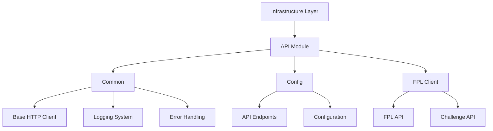
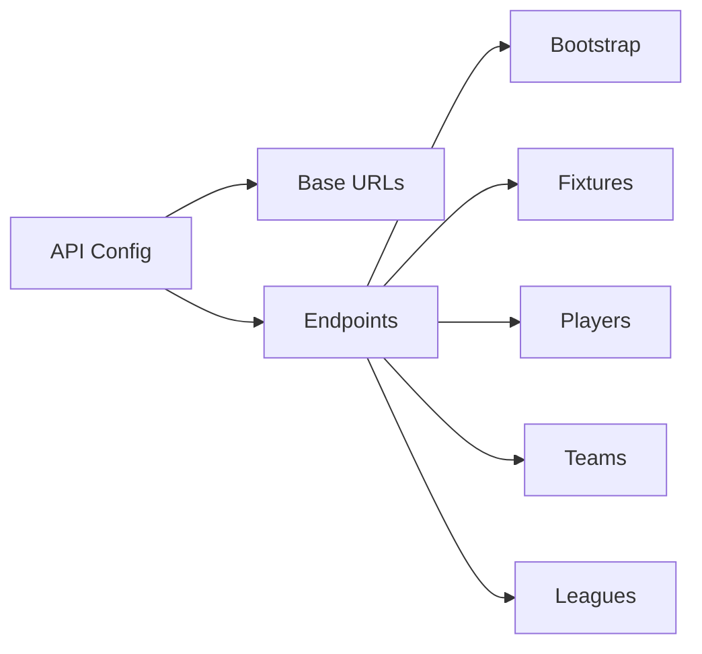

# Infrastructure Layer

## Overview

The infrastructure layer handles external concerns and provides foundational services for the application. It implements technical capabilities and interfaces with external systems.

## API Module Architecture



### Common Module

#### HTTP Client

- Built on Axios with enhanced features:
  - Type-safe request/response handling
  - Configurable retry mechanism with exponential backoff
  - Request/response interceptors
  - Comprehensive error handling
  - Performance monitoring

**Supported HTTP Methods**:

- Currently Implemented:
  - `GET`: Read operations
  - `POST`: Create operations
  - `PUT`: Full update operations
  - `PATCH`: Partial update operations
  - `DELETE`: Delete operations
  - `HEAD`: Metadata operations
  - `OPTIONS`: API capabilities check

#### API Usage Examples

1. **Basic GET Request**:

```typescript
const client = new HTTPClient({ baseURL: 'https://api.example.com' });
const result = await client.get<UserData>('/users/123');

pipe(
  result,
  E.fold(
    (error) => console.error('Failed:', error.message),
    (data) => console.log('Success:', data),
  ),
);
```

2. **POST with Data**:

```typescript
const createUser = async (userData: NewUser) => {
  const result = await client.post<UserResponse>('/users', userData, {
    headers: { 'Content-Type': 'application/json' },
  });

  return pipe(
    result,
    E.map((response) => response.id),
    E.mapLeft((error) => `Failed: ${error.message}`),
  );
};
```

3. **GET with Query Parameters**:

```typescript
const searchUsers = async (filters: UserFilters) => {
  const options: RequestOptions = {
    params: {
      role: filters.role,
      status: filters.status,
      page: filters.page,
    },
    timeout: HTTP_CONFIG.TIMEOUT.LONG,
  };

  return await client.get<UserSearchResult>('/users/search', options);
};
```

4. **Error Handling Example**:

```typescript
const deleteUser = async (userId: string) => {
  const result = await client.delete<void>(`/users/${userId}`);

  if (E.isLeft(result)) {
    switch (result.left.code) {
      case HTTP_CONFIG.ERROR.INVALID_REQUEST:
        throw new Error('Invalid user ID');
      case HTTP_CONFIG.ERROR.INTERNAL_ERROR:
        throw new Error('Server error, try again later');
      default:
        throw new Error(result.left.message);
    }
  }

  return true;
};
```

5. **Complex Request with Configuration**:

```typescript
const generateReport = async (params: ReportParams) => {
  const client = new HTTPClient({
    baseURL: 'https://api.example.com',
    timeout: HTTP_CONFIG.TIMEOUT.LONG,
    retry: {
      attempts: HTTP_CONFIG.RETRY.MAX_ATTEMPTS,
      baseDelay: HTTP_CONFIG.RETRY.BASE_DELAY,
      maxDelay: HTTP_CONFIG.RETRY.MAX_DELAY,
      shouldRetry: (error) =>
        error instanceof APIError && error.statusCode === HTTP_CONFIG.STATUS.SERVER_ERROR_MIN,
    },
  });

  return await client.post<ReportResult>('/reports/generate', params, {
    headers: {
      'X-Report-Type': params.type,
      'X-Priority': 'high',
    },
  });
};
```

#### Key Features in Examples

- Type-safe requests and responses
- Functional error handling with Either
- Custom configurations per request
- Query parameter handling
- Custom header management
- Timeout settings
- Retry strategies
- Status code handling

#### Logging System

- Built on Pino logger:
  - Structured logging with context
  - Configurable log levels
  - File rotation and compression
  - Parameter sanitization
  - Performance tracking

#### Error Handling

- Standardized error types
- Domain-specific error mapping
- Retry policies
- Validation errors

### Configuration Management



#### Features

- Type-safe endpoint definitions
- URL parameter validation
- Environment-based configuration
- API versioning support

### FPL Client Implementation

#### Architecture

- Functional programming approach using fp-ts
- Response validation using Zod schemas
- Comprehensive logging and monitoring
- Performance optimization

#### API Methods

1. **Bootstrap Operations**

   - Static data retrieval
   - Gameweek information

2. **Fixture Management**

   - Gameweek fixtures
   - Live updates

3. **Player Operations**

   - Player summaries
   - Statistics

4. **Team Operations**

   - Entry details
   - History
   - Transfers
   - Event picks

5. **League Operations**
   - Classic league standings
   - Head-to-head leagues

## Best Practices

### Type Safety

- Strict TypeScript configuration
- No implicit any types
- Comprehensive type definitions
- Generic type constraints

### Error Handling

- Error categorization
- Retry mechanisms
- Logging and monitoring
- User-friendly error messages

### Performance

- Request caching (when appropriate)
- Connection pooling
- Response compression
- Timeout handling

### Security

- Parameter sanitization
- Rate limiting
- Request validation
- Secure headers

## Testing Strategy

### Unit Tests

- HTTP client behavior
- Error handling
- Parameter validation
- Response parsing

### Integration Tests

- API endpoint connectivity
- Error scenarios
- Rate limiting
- Retry mechanism

### Performance Tests

- Response times
- Concurrent requests
- Resource usage
- Error rates
