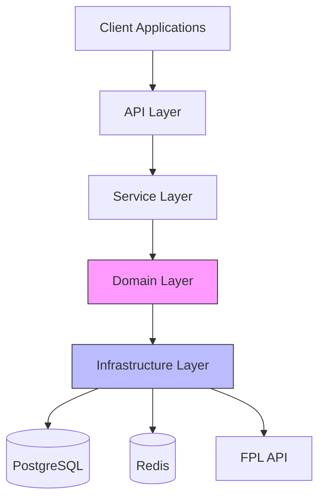
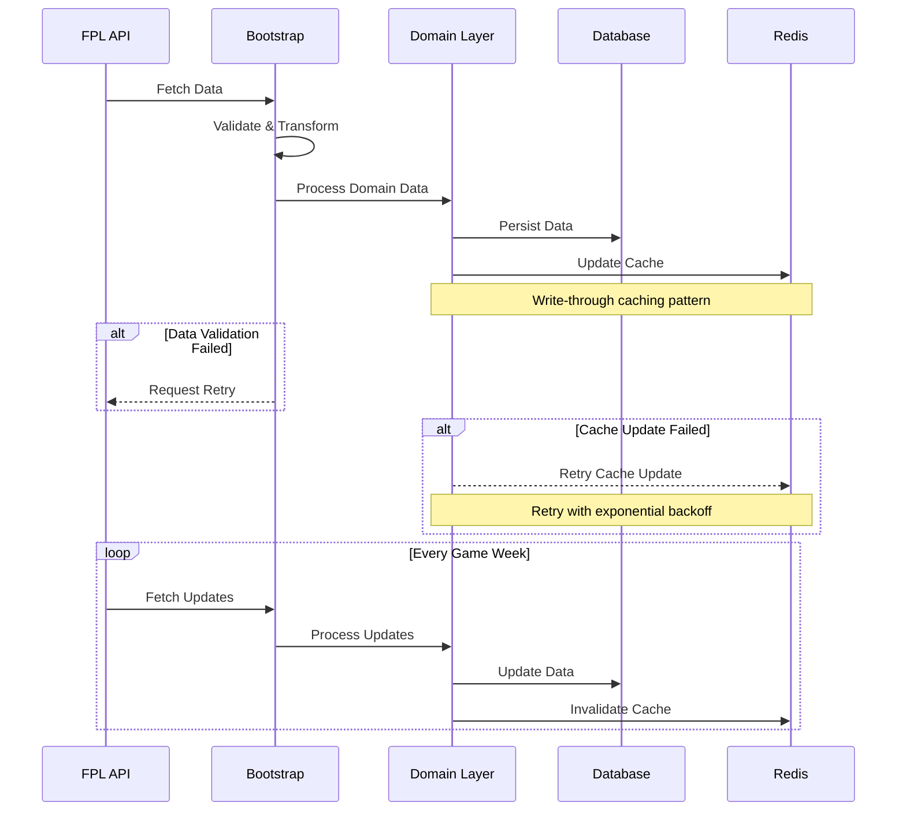
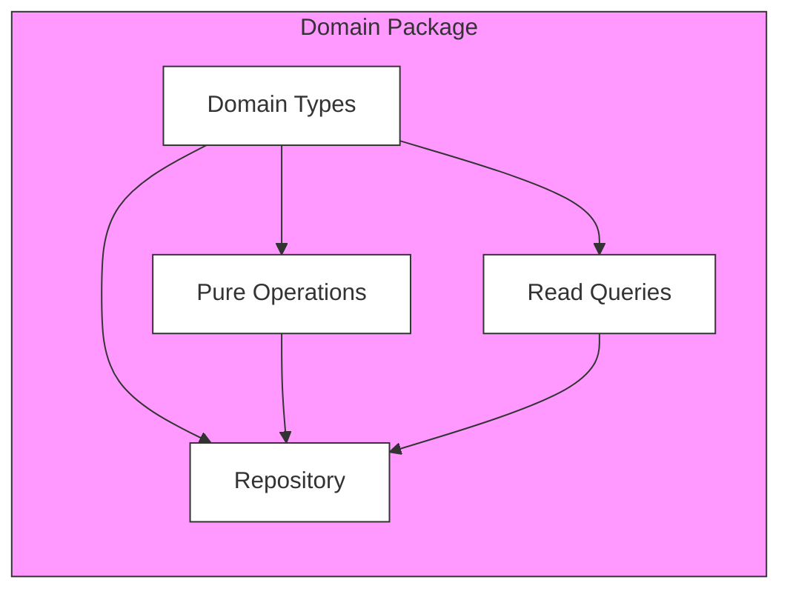
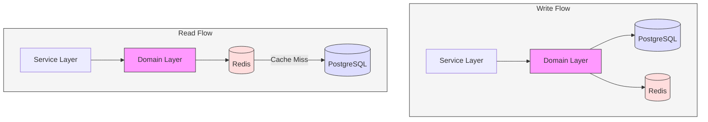
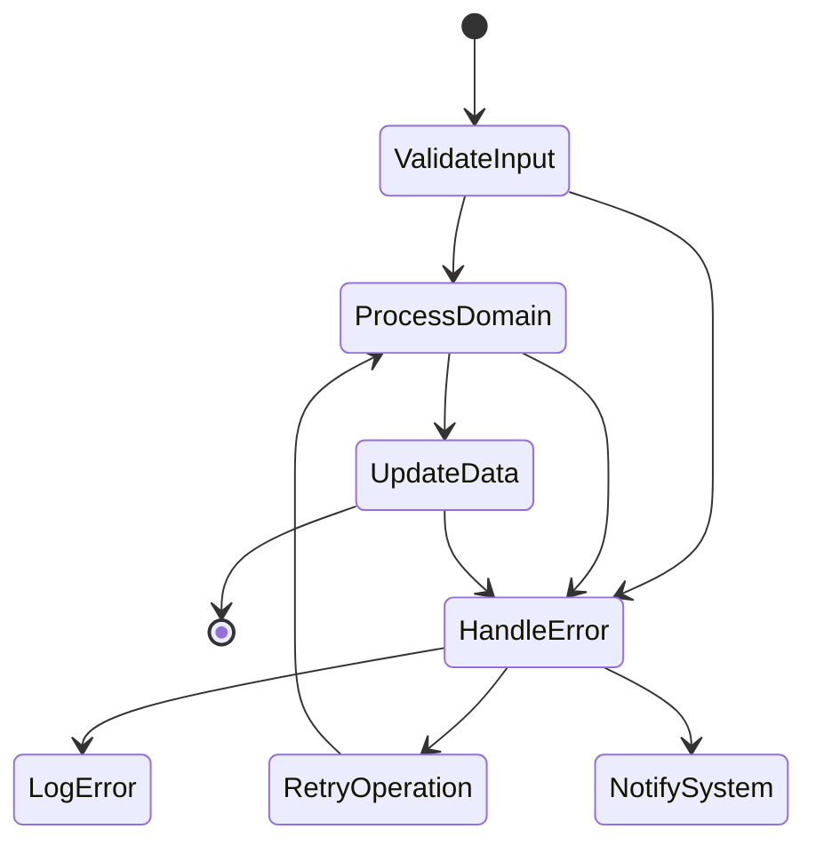

## Table of Contents

- [Table of Contents](#table-of-contents)
- [Introduction](#introduction)
- [Core Design Philosophy](#core-design-philosophy)
  - [Domain-Driven Design Choice](#domain-driven-design-choice)
  - [Functional Programming Integration](#functional-programming-integration)
- [Architecture Overview](#architecture-overview)
  - [System Architecture](#system-architecture)
  - [Data Flow Patterns](#data-flow-patterns)
- [Domain Implementation](#domain-implementation)
  - [Domain Structure](#domain-structure)
- [Data Reliability and Verification](#data-reliability-and-verification)
  - [Data Accuracy Strategy](#data-accuracy-strategy)
- [Data Synchronization](#data-synchronization)
  - [Multi-Database Strategy](#multi-database-strategy)
- [Scheduled Operations](#scheduled-operations)
  - [Update Management](#update-management)
- [API Design](#api-design)
  - [RESTful Interface](#restful-interface)
- [Performance Optimization](#performance-optimization)
  - [Caching Strategy](#caching-strategy)
- [Error Handling](#error-handling)
  - [Comprehensive Strategy](#comprehensive-strategy)
  - [Error Handling Flow](#error-handling-flow)
- [Monitoring and Observability](#monitoring-and-observability)
  - [System Health](#system-health)
- [Future Considerations](#future-considerations)
- [Project Structure](#project-structure)
  - [Directory Organization](#directory-organization)
  - [Key Directory Responsibilities](#key-directory-responsibilities)
  - [Implementation Guidelines](#implementation-guidelines)

## Introduction

This document outlines the architectural design of Letletme Data Service, built using Domain-Driven Design (DDD) and Functional Programming (FP) principles. The service manages complex data flows from the FPL API, transforms and validates data, and provides reliable data access through multiple interfaces.

## Core Design Philosophy

### Domain-Driven Design Choice

The choice of DDD stems from the inherent complexity of FPL data management:

1. **Complex Domain Logic**
   The FPL system contains intricate business rules around game weeks, player values, and team management. DDD helps model these complexities explicitly, making the system more maintainable and adaptable to changes in FPL rules.

2. **Natural Domain Boundaries**
   FPL naturally divides into distinct domains (events, teams, players, entries), each with its own lifecycle and rules. DDD's bounded contexts concept perfectly maps to these natural divisions.

3. **Data Evolution Management**
   FPL data constantly evolves throughout the season. DDD's focus on domain models helps manage this evolution while maintaining data consistency and historical tracking.

### Functional Programming Integration

FP principles complement the DDD approach by providing:

1. **Immutability**
   All domain models are immutable, preventing unexpected state changes and making the system more predictable.

2. **Pure Functions**
   Business logic is implemented as pure functions, making it easier to test, reason about, and maintain.

3. **Type Safety**
   Strong typing combined with FP concepts like Option and Either provides compile-time safety and explicit error handling.

## Architecture Overview

### System Architecture



The system follows a layered architecture with clear responsibilities:

1. **API Layer**

   - RESTful endpoints
   - Request validation
   - Response formatting
   - Rate limiting
   - Authentication/Authorization

2. **Service Layer**

   - Use case orchestration
   - Cross-domain coordination
   - Transaction management
   - Error handling and recovery

3. **Domain Layer**

   - Pure business logic
   - Domain models and types
   - Validation rules
   - Domain-specific operations

4. **Infrastructure Layer**
   - Database operations (PostgreSQL)
   - Cache management (Redis)
   - External API integration (FPL)
   - Cross-cutting concerns

This architecture ensures:

- Clear separation of concerns
- Domain isolation
- Testable components
- Scalable structure

### Data Flow Patterns



The system implements several key data flow patterns:

1. **Bootstrap Pattern**

   - Centralizes data fetching from FPL API
   - Validates incoming data
   - Distributes data to appropriate domains
   - Manages data synchronization

2. **Repository Pattern**

   - Abstracts data persistence
   - Provides domain-specific data access
   - Handles data mapping
   - Manages transactions

3. **Verification Pattern**
   - Ensures data accuracy
   - Implements cross-validation
   - Manages discrepancy resolution
   - Provides audit trails

## Domain Implementation

### Domain Structure



Each domain follows a consistent structure:

1. **Types**

   - Domain models
   - Value objects
   - Operation types
   - Result types

2. **Operations**

   - Pure business logic
   - Validation rules
   - Transformation functions
   - Domain-specific calculations

3. **Queries**

   - Read operations
   - Data filtering
   - Aggregation logic
   - Search functionality

4. **Repository**
   - Data access patterns
   - Persistence logic
   - Data mapping
   - Transaction management

## Data Reliability and Verification

### Data Accuracy Strategy

The system implements a multi-layered approach to ensure data reliability:

1. **Source Data Verification**
   Data from the FPL API undergoes strict validation before entering our system. This includes type checking, range validation, and business rule verification. Each domain implements specific validation rules relevant to its context.

2. **Calculation Verification**
   All calculated values (e.g., player statistics, team performance metrics) are cross-validated against the source data. The system maintains audit trails of calculations and flags discrepancies for review.

3. **Historical Consistency**
   The system tracks data evolution over time, enabling historical consistency checks and anomaly detection. This is particularly important for player values and performance metrics.

## Data Synchronization

### Multi-Database Strategy



The system employs a sophisticated approach to managing data across PostgreSQL and Redis:

1. **PostgreSQL as Source of Truth**

   - Stores all permanent data
   - Maintains historical records
   - Handles complex relationships
   - Ensures ACID compliance

2. **Redis as Performance Layer**

   - Caches frequently accessed data
   - Stores temporary calculations
   - Manages session data
   - Improves response times

3. **Synchronization Patterns**
   - Write-through caching
   - Invalidation based on domain events
   - Atomic updates across stores
   - Consistency verification

## Scheduled Operations

### Update Management

The system handles periodic data updates through:

1. **Domain-Specific Schedules**

   - Each domain defines its update requirements
   - Configurable update frequencies
   - Dependency management between updates
   - Failure recovery mechanisms

2. **Coordination Strategy**
   - Transaction coordination across domains
   - Update order management
   - Conflict resolution
   - Rollback procedures

## API Design

### RESTful Interface

The system exposes domain functionality through a well-structured API:

1. **Resource Organization**

   - Domain-aligned endpoints
   - Clear resource hierarchies
   - Consistent naming conventions
   - Versioning strategy

2. **Response Patterns**
   - Standardized response formats
   - Error handling conventions
   - Pagination support
   - Caching headers

## Performance Optimization

### Caching Strategy

1. **Multi-Level Caching**

   - Application-level caching
   - Database query caching
   - HTTP response caching
   - Cache invalidation patterns

2. **Query Optimization**
   - Efficient database queries
   - Materialized views
   - Index optimization
   - Query result caching

## Error Handling

### Comprehensive Strategy

1. **Domain-Level Errors**

   - Business rule violations
   - Validation failures
   - State transition errors
   - Domain-specific exceptions

2. **Infrastructure Errors**

   - Database connection issues
   - Cache synchronization failures
   - API communication errors
   - Network timeouts

3. **Error Recovery**
   - Automatic retry mechanisms
   - Fallback strategies
   - Circuit breakers
   - Error logging and monitoring

### Error Handling Flow



## Monitoring and Observability

### System Health

1. **Metrics Collection**

   - Performance metrics
   - Error rates
   - Data consistency metrics
   - Cache hit rates

2. **Alerting System**
   - Critical error alerts
   - Performance degradation warnings
   - Data inconsistency notifications
   - System health status

## Future Considerations

1. **Scalability**

   - Horizontal scaling strategies
   - Load balancing approaches
   - Database partitioning
   - Cache distribution

2. **Extensibility**
   - New domain integration
   - Additional data sources
   - Feature expansion
   - API evolution

## Project Structure

### Directory Organization

```plaintext
src/
├── domains/ # Core domain logic
│ ├── events/ # Game weeks & fixtures
│ │ ├── types.ts # Domain types & interfaces
│ │ ├── operations.ts # Pure business logic
│ │ ├── queries.ts # Read operations
│ │ └── repository.ts # Data access
│ ├── players/ # Player management
│ │ ├── types.ts # Player domain types
│ │ ├── operations.ts # Player operations
│ │ ├── queries.ts # Player queries
│ │ └── repository.ts # Player persistence
│ └── teams/ # Team management
│ ├── types.ts # Team domain types
│ ├── operations.ts # Team operations
│ └── repository.ts # Team persistence
├── infrastructure/ # Technical concerns
│ ├── db/ # Database management
│ │ ├── prisma/ # Prisma configuration
│ │ └── redis/ # Redis configuration
│ ├── api/ # External API integration
│ │ ├── fpl/ # FPL API client
│ │ └── types/ # API response types
│ └── validation/ # Data validation
│ ├── schemas/ # Validation schemas
│ └── utils/ # Validation utilities
├── services/ # Application services
│ ├── bootstrap/ # System initialization
│ ├── scheduler/ # Update scheduling
│ └── verification/ # Data verification
└── shared/ # Shared utilities
├── fp/ # FP utilities
│ ├── either.ts # Either monad
│ └── option.ts # Option monad
└── utils/ # Common utilities
├── time.ts # Time operations
└── logger.ts # Logging utilities
```

### Key Directory Responsibilities

1. **Domains Directory**

   - Core business logic
   - Domain models and types
   - Pure operations
   - Repository implementations

2. **Infrastructure Directory**

   - Technical implementations
   - Database connections
   - External API clients
   - Cross-cutting concerns

3. **Services Directory**

   - Use case implementations
   - Domain orchestration
   - Process coordination
   - External integrations

4. **Shared Directory**
   - Common utilities
   - FP patterns
   - Shared types
   - Helper functions

### Implementation Guidelines

1. **Domain Organization**

   - Each domain is self-contained
   - Clear separation of concerns
   - Consistent file naming
   - Type-first approach

2. **Infrastructure Patterns**

   - Clear abstraction layers
   - Dependency injection
   - Configuration management
   - Error handling

3. **Service Implementation**

   - Use case focused
   - Domain coordination
   - Transaction management
   - Error recovery

4. **Shared Utilities**
   - Pure functions
   - Reusable patterns
   - Type safety
   - Documentation
