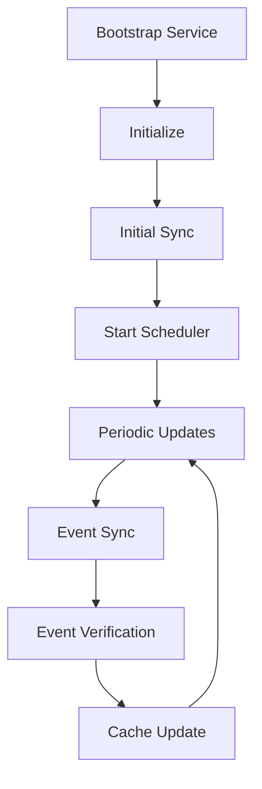

# Event Services Documentation

## Overview
The event services system provides a robust framework for managing FPL (Fantasy Premier League) events, including synchronization, scheduling, and bootstrapping capabilities. This document outlines the architecture, workflows, and implementation details of the event services.

## Architecture

### Core Services

#### 1. EventBootstrapService
Responsible for system initialization and setup.

**Key Operations:**
- Service initialization
- Initial event synchronization
- Scheduler setup

**Error Handling:**
- Transaction-based rollback on failures
- Detailed error propagation
- Graceful shutdown on critical failures

#### 2. EventSyncService
Handles event data synchronization and caching.

**Features:**
- Event bulk synchronization
- Individual event detail retrieval
- Caching mechanism with TTL
- Transaction support

**Cache Configuration:**
- Prefix: `event:`
- TTL: 3600 seconds (1 hour)
- Automatic cache invalidation

#### 3. EventSchedulerService
Manages periodic event updates and scheduling.

**Configuration:**
- Update Interval: 300000ms (5 minutes)
- Immediate initial update
- Background processing

**Features:**
- Automatic event verification
- Continuous update cycle
- Graceful shutdown support

### Data Flow



## Implementation Details

### Error Handling
The system uses functional programming concepts for robust error handling:

```typescript
// Example of Either-based error handling
async syncEvents(): Promise<Either<Error, FPLEvent[]>> {
  try {
    // Operation logic
    return right(events);
  } catch (error) {
    return left(error);
  }
}
```

### Transaction Management
All critical operations are wrapped in transactions:

```typescript
try {
  await transactionContext.start();
  // Operation logic
  await transactionContext.commit();
} catch (error) {
  await transactionContext.rollback();
  // Error handling
}
```

### Caching Strategy
Implements a TTL-based caching mechanism:

```typescript
interface CacheStrategy {
  get: <T>(key: string) => Promise<Option<T>>;
  set: <T>(key: string, value: T, ttl?: number) => Promise<void>;
  invalidate: (pattern: string) => Promise<void>;
  clear: () => Promise<void>;
}
```

## Event Types and Interfaces

### FPLEvent
```typescript
interface FPLEvent {
  readonly id: number;
  readonly name: string;
  readonly startTime: Date;
  readonly endTime: Date;
  readonly status: EventStatus;
  readonly details: EventDetails;
}
```

### EventStatus
```typescript
enum EventStatus {
  PENDING = 'PENDING',
  ACTIVE = 'ACTIVE',
  COMPLETED = 'COMPLETED',
  CANCELLED = 'CANCELLED',
}
```

## Testing

The services are comprehensively tested with Jest:

1. **Unit Tests:**
   - Success scenarios
   - Failure handling
   - Edge cases
   - Cache behavior
   - Scheduling operations

2. **Mock Implementation:**
   - Service dependencies
   - External APIs
   - Cache operations
   - Transaction context

## Best Practices

1. **Error Handling:**
   - Use functional programming constructs (`Either`, `Option`)
   - Proper error propagation
   - Detailed error messages
   - Transaction rollback on failures

2. **Performance:**
   - Efficient caching
   - Optimized sync operations
   - Background processing
   - Resource cleanup

3. **Maintainability:**
   - Clear separation of concerns
   - Type safety
   - Comprehensive documentation
   - Test coverage

## Usage Examples

### Bootstrap Service
```typescript
const bootstrapService = new EventBootstrapService(eventService, transactionContext);
const result = await bootstrapService.initialize();

if (result._tag === 'Left') {
  console.error('Bootstrap failed:', result.left);
} else {
  console.log('System initialized successfully');
}
```

### Scheduler Service
```typescript
const schedulerService = new EventSchedulerService(eventService, transactionContext);
await schedulerService.scheduleEventUpdates();

// Later, when shutting down
schedulerService.stopScheduler();
```

### Sync Service
```typescript
const syncService = new EventSyncService(cacheStrategy, transactionContext);

// Sync all events
const events = await syncService.syncEvents();

// Get specific event details
const eventDetails = await syncService.syncEventDetails(eventId);
```

## Troubleshooting

Common issues and solutions:

1. **Failed Synchronization:**
   - Check external API availability
   - Verify network connectivity
   - Review transaction logs

2. **Cache Issues:**
   - Verify TTL settings
   - Check cache storage capacity
   - Monitor cache hit/miss rates

3. **Scheduler Problems:**
   - Confirm update interval settings
   - Check system resources
   - Monitor background processes

## Future Improvements

Potential enhancements:

1. **Scalability:**
   - Distributed caching
   - Load balancing
   - Horizontal scaling

2. **Monitoring:**
   - Performance metrics
   - Health checks
   - Alert system

3. **Features:**
   - Real-time updates
   - Event webhooks
   - Custom scheduling
