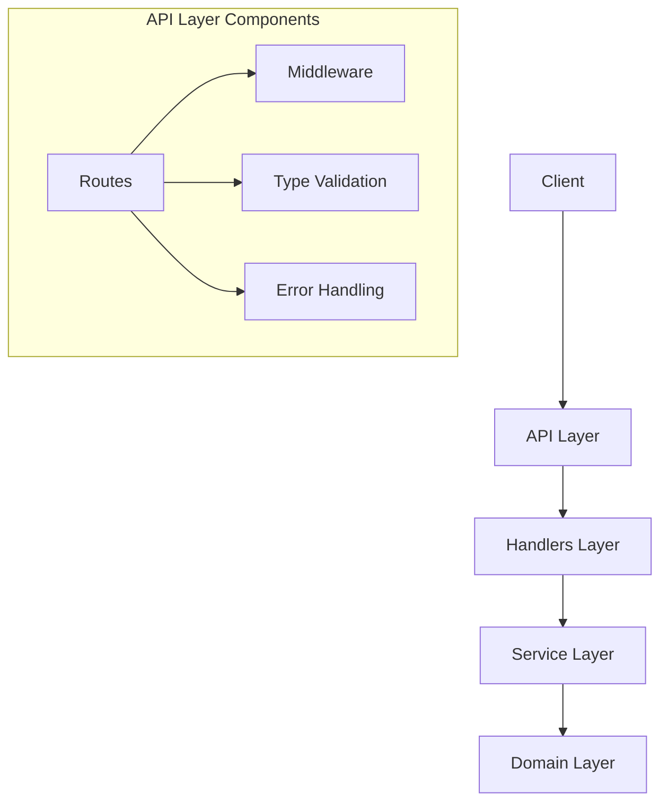
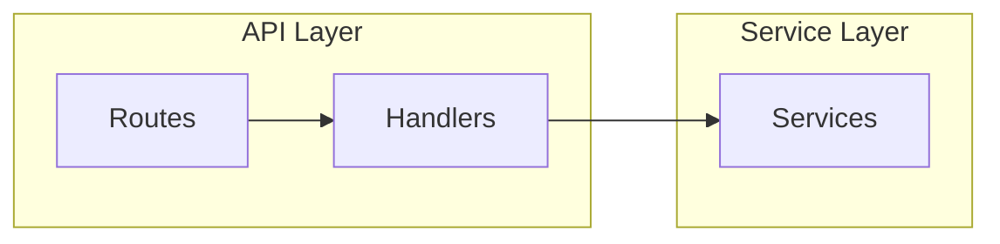
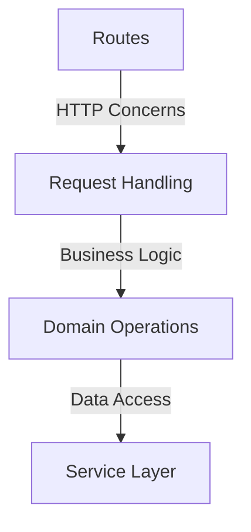
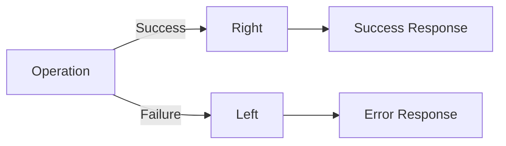
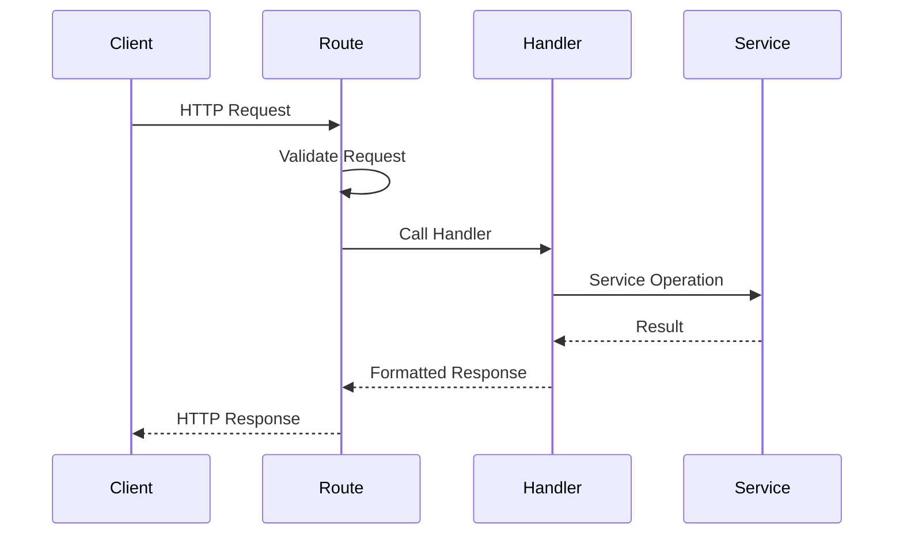
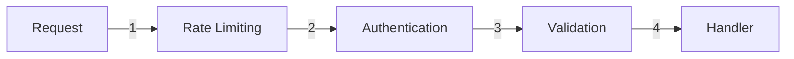
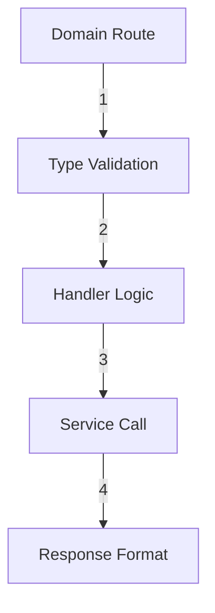

# API Layer Design

## Overview

The API layer serves as the interface between external clients and our application's domain logic. It follows a functional programming approach using fp-ts, ensuring type safety and consistent error handling across all endpoints.

## Architecture



## Layer Structure



## Core Design Principles

### 1. Functional Programming First

- Pure functions for predictable behavior
- Immutable data structures
- Effect handling through TaskEither
- Composition using fp-ts operators

### 2. Type Safety

- Runtime type validation with io-ts
- Compile-time type checking
- No implicit any types
- Strict null checks

### 3. Separation of Concerns



### 4. Error Handling Strategy



## Domain API Organization

### Structure

```
src/api/
├── handlers/       # Business logic handlers
├── middleware/     # Shared middleware
├── routes/         # Route definitions
├── types.ts        # API-specific type definitions
├── utils.ts        # API utility functions
└── index.ts        # API router configuration
```

### Flow



## Response Format

### Success

```typescript
{
  status: 'success',
  data: T  // Generic type parameter
}
```

### Error

```typescript
{
  status: 'error',
  error: string
}
```

## Security Design

### Middleware Chain



## Domain API Integration

### Steps

1. Define domain types
2. Create handlers
3. Configure routes
4. Register with main router

### Pattern



## Cross-Cutting Concerns

### 1. Logging

- Request/Response logging
- Error tracking
- Performance monitoring

### 2. Validation

- Request validation
- Response validation
- Runtime type checking

### 3. Error Management

- Consistent error format
- Error categorization
- Error recovery strategies

## API Evolution Strategy

### 1. Versioning

- URL-based versioning
- Header-based versioning
- Content negotiation

### 2. Backwards Compatibility

- Deprecation strategy
- Migration support
- Documentation updates

## Performance Considerations

### 1. Response Time

- Async operations
- Parallel processing
- Caching strategy

### 2. Scalability

- Stateless design
- Resource optimization
- Load balancing ready

## Monitoring and Metrics

### Key Metrics

- Response times
- Error rates
- Request volume
- Resource usage

## Future Considerations

### 1. API Gateway Integration

- Rate limiting
- Authentication
- Request routing

### 2. Documentation

- OpenAPI/Swagger
- API documentation
- Integration guides
