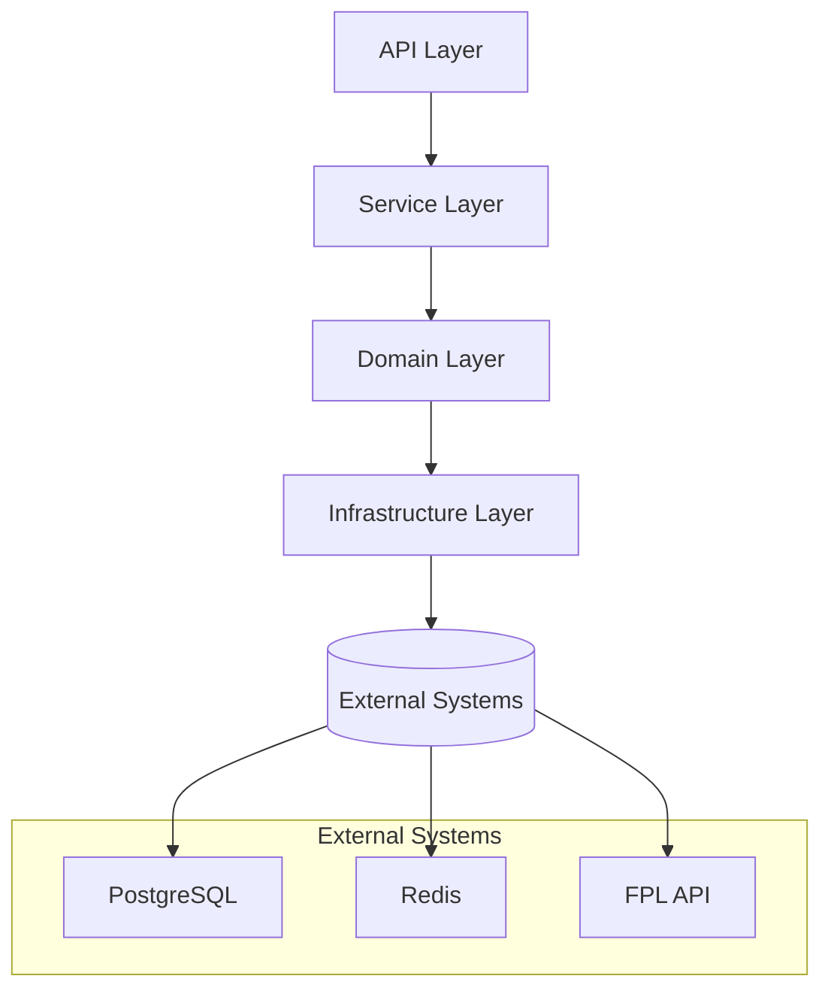
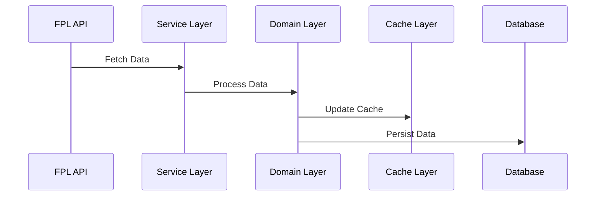
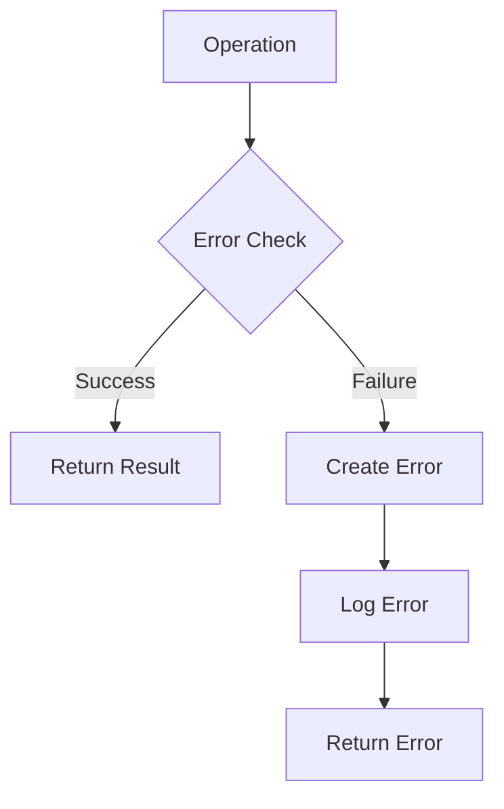

# Design Guide

## Table of Contents

- [Table of Contents](#table-of-contents)
- [Introduction](#introduction)
- [Core Design Philosophy](#core-design-philosophy)
- [Architecture Overview](#architecture-overview)
- [Layer Design](#layer-design)
- [Domain Implementation](#domain-implementation)
- [Infrastructure Design](#infrastructure-design)
- [Data Management](#data-management)
- [Error Handling](#error-handling)
- [Testing Strategy](#testing-strategy)
- [Project Structure](#project-structure)

## Introduction

This document outlines the architectural design of the FPL data system, built using Domain-Driven Design (DDD) and Functional Programming (FP) principles with fp-ts. The system manages complex data flows from the FPL API, transforms and validates data, and provides reliable data access through multiple interfaces.

## Core Design Philosophy

### 1. Domain-Driven Design

- **Bounded Contexts**: Clear domain boundaries (event, team, player)
- **Ubiquitous Language**: Consistent terminology across codebase
- **Value Objects**: Immutable domain models
- **Domain Events**: State changes as events

### 2. Functional Programming

```typescript
// Example of functional approach
const processEvent = (event: Event): TaskEither<DomainError, ProcessedEvent> =>
  pipe(
    validateEvent(event),
    TE.chain(transformEvent),
    TE.chain(saveEvent),
    TE.chain(notifySubscribers),
  );
```

### 3. Type Safety

- Branded types for domain identifiers
- Runtime validation with zod
- Comprehensive error types
- Generic type constraints

## Architecture Overview

### System Layers



### Layer Responsibilities

1. **API Layer**

   - Request handling
   - Response formatting
   - Input validation
   - Rate limiting

2. **Service Layer**

   - Use case orchestration
   - Transaction management
   - Cross-domain coordination
   - Error handling

3. **Domain Layer**

   - Business logic
   - Domain models
   - Validation rules
   - State management

4. **Infrastructure Layer**
   - Data persistence
   - Caching
   - External communication
   - Cross-cutting concerns

## Layer Design

### 1. API Layer Design

```typescript
// Route handler example
const getEvent =
  (eventService: EventService) =>
  (req: Request): TaskEither<APIError, APIResponse<Event>> =>
    pipe(
      validateEventId(req.params.id),
      TE.chain(eventService.getEvent),
      TE.map(formatResponse),
      TE.mapLeft(handleAPIError),
    );
```

### 2. Service Layer Design

```typescript
// Service implementation example
interface EventService {
  getEvent: (id: EventId) => TaskEither<ServiceError, Event>;
  updateEvent: (event: Event) => TaskEither<ServiceError, Event>;
  syncEvents: () => TaskEither<ServiceError, readonly Event[]>;
}
```

### 3. Domain Layer Design

```typescript
// Domain model example
interface Event {
  readonly id: EventId;
  readonly name: string;
  readonly deadlineTime: string;
  readonly finished: boolean;
  readonly data: EventData;
}

// Domain operation example
const validateEvent = (event: Event): Either<ValidationError, Event> =>
  pipe(event, validateEventId, E.chain(validateDeadlineTime), E.chain(validateEventData));
```

### 4. Infrastructure Layer Design

```typescript
// Infrastructure service example
interface CacheService<T> {
  get: (key: string) => TaskEither<CacheError, T | null>;
  set: (key: string, value: T) => TaskEither<CacheError, void>;
  del: (key: string) => TaskEither<CacheError, void>;
}
```

## Domain Implementation

### 1. Domain Structure

```plaintext
src/domain/{domain-name}/
├── types.ts       # Domain types and interfaces
├── operation.ts  # Pure domain operations
├── repository.ts  # Data access layer
└── cache.ts      # Caching layer
```

### 2. Domain Operations

```typescript
// Pure domain operation example
const calculatePoints = (event: Event, picks: PlayerPicks): Either<CalculationError, Points> =>
  pipe(
    validateInputs(event, picks),
    E.chain(calculateBasePoints),
    E.chain(applyBonuses),
    E.chain(applyPenalties),
  );
```

## Infrastructure Design

### 1. HTTP Client

```typescript
interface HTTPClient {
  get: <T>(url: string) => TaskEither<HTTPError, T>;
  post: <T>(url: string, data: unknown) => TaskEither<HTTPError, T>;
  put: <T>(url: string, data: unknown) => TaskEither<HTTPError, T>;
}
```

### 2. Queue System

```typescript
interface QueueService<T> {
  addJob: (data: T) => TaskEither<QueueError, void>;
  processJob: (handler: JobHandler<T>) => TaskEither<QueueError, void>;
  removeJob: (jobId: string) => TaskEither<QueueError, void>;
}
```

### 3. Cache System

```typescript
interface CacheConfig {
  prefix: string;
  ttl: number;
  connection: RedisConnection;
}

interface CacheOperations<T> {
  get: (key: string) => TaskEither<CacheError, T | null>;
  set: (key: string, value: T) => TaskEither<CacheError, void>;
  del: (key: string) => TaskEither<CacheError, void>;
}
```

## Data Management

### 1. Data Flow



### 2. Caching Strategy

```typescript
// Cache implementation example
const cacheEvent = (event: Event, cache: CacheService): TaskEither<CacheError, void> =>
  pipe(
    validateEvent(event),
    TE.fromEither,
    TE.chain((event) => cache.set(`event:${event.id}`, event)),
  );
```

## Error Handling

### 1. Error Types

```typescript
type DomainErrorCode = 'VALIDATION_ERROR' | 'PROCESSING_ERROR' | 'NOT_FOUND';

interface DomainError {
  code: DomainErrorCode;
  message: string;
  details?: unknown;
}
```

### 2. Error Flow



## Testing Strategy

### 1. Test Types

```typescript
// Unit test example
describe('Event Domain', () => {
  describe('validateEvent', () => {
    it('should validate valid event', () => {
      const event = mockEvent();
      const result = validateEvent(event);
      expect(E.isRight(result)).toBe(true);
    });
  });
});
```

### 2. Integration Tests

```typescript
// Integration test example
describe('Event Service Integration', () => {
  beforeEach(async () => {
    await clearDatabase();
    await clearCache();
  });

  it('should sync events from API', async () => {
    const result = await eventService.syncEvents()();
    expect(E.isRight(result)).toBe(true);
  });
});
```

## Project Structure

### Directory Organization

```plaintext
src/
├── api/                  # API layer
│   ├── routes/           # Route handlers
│   └── middleware/       # Express middleware
├── service/              # Service layer
│   ├── event/            # Event services
│   ├── team/             # Team services
│   └── player/           # Player services
├── domain/               # Domain layer
│   ├── event/            # Event domain
│   ├── team/             # Team domain
│   └── player/           # Player domain
└── infrastructure/       # Infrastructure layer
    ├── http/             # HTTP clients
    ├── queue/            # Queue system
    ├── cache/            # Cache system
    └── db/               # Database access
```

### Implementation Guidelines

1. **Type Safety**

   - Use branded types for IDs
   - Implement proper error types
   - Maintain type safety across boundaries
   - Use generics for operations

2. **Error Handling**

   - Use TaskEither for operations
   - Implement proper error types
   - Provide error context
   - Log errors appropriately

3. **Performance**

   - Implement connection pooling
   - Use appropriate caching
   - Monitor resource usage
   - Handle timeouts properly

4. **Testing**
   - Unit test core functionality
   - Integration test with dependencies
   - Test error scenarios
   - Verify retry behavior
