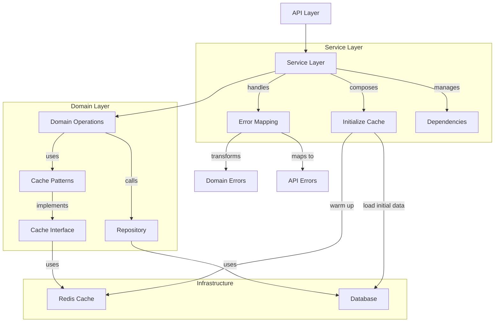

# Domain Cache Design

## Table of Contents

- [Domain Cache Design](#domain-cache-design)
  - [Table of Contents](#table-of-contents)
  - [Overview](#overview)
  - [Core Principles](#core-principles)
  - [Architecture](#architecture)
    - [Structure](#structure)
    - [Flow](#flow)
    - [Layer Responsibilities](#layer-responsibilities)
      - [1. Service Layer](#1-service-layer)
    - [Implementation](#implementation)
      - [1. Cache Patterns](#1-cache-patterns)
      - [2. Domain Cache Interface](#2-domain-cache-interface)
      - [3. Domain Operations](#3-domain-operations)
    - [Common Domain Utilities](#common-domain-utilities)
      - [1. Cache Utilities](#1-cache-utilities)
      - [2. Operation Utilities](#2-operation-utilities)
    - [Domain Implementation Using Utilities](#domain-implementation-using-utilities)
  - [Best Practices](#best-practices)
  - [Example Usage](#example-usage)
    - [Service Layer Structure](#service-layer-structure)
    - [Type Organization](#type-organization)
    - [1. Base Service Types](#1-base-service-types)
    - [2. Error Type Hierarchy](#2-error-type-hierarchy)
    - [3. Service Implementation Pattern](#3-service-implementation-pattern)
    - [4. Service Utilities](#4-service-utilities)
    - [Benefits](#benefits)
  - [Testing](#testing)
    - [1. Unit Testing](#1-unit-testing)
    - [2. Integration Testing](#2-integration-testing)
    - [3. Performance Testing](#3-performance-testing)
  - [Error Handling](#error-handling)
    - [1. Error Types](#1-error-types)
    - [2. Error Handling Patterns](#2-error-handling-patterns)
  - [Performance Optimization](#performance-optimization)
    - [1. Cache Strategies](#1-cache-strategies)
    - [2. Batch Operations](#2-batch-operations)
  - [Monitoring and Logging](#monitoring-and-logging)
    - [1. Cache Monitoring](#1-cache-monitoring)
    - [2. Service Monitoring](#2-service-monitoring)
  - [Deployment and Configuration](#deployment-and-configuration)
    - [1. Cache Configuration](#1-cache-configuration)
    - [2. Service Configuration](#2-service-configuration)
  - [Appendix](#appendix)
    - [A. Type Utilities](#a-type-utilities)
    - [B. Common Patterns](#b-common-patterns)

## Overview

This document outlines our domain-centric caching strategy, which follows DDD principles while maintaining simplicity and reusability across domains.

## Core Principles

1. **Domain-Driven**

   - Cache operations reflect domain concepts
   - Cache interfaces defined by domain needs
   - Cache invalidation follows domain rules

2. **Type Safety**

   - Full type safety across operations
   - Proper handling of domain types
   - Validation on deserialization

3. **Functional Programming**

   - Pure functions
   - Composable operations
   - Error handling with TaskEither

4. **Reusability**
   - Common cache patterns
   - Shared utilities
   - Consistent error handling

## Architecture

### Structure

```
src/
├── types/                  // Centralized type definitions
│   ├── base.type.ts       // Common types, brands, validation
│   └── [domain].type.ts   // Domain-specific types & validation
│
├── infrastructure/         // Infrastructure layer
│   ├── cache/
│   │   ├── types.ts       // Cache core types & errors
│   │   ├── patterns.ts    // Reusable cache patterns
│   │   └── redis.ts       // Redis implementation
│   └── service/           // Service infrastructure
│       ├── types.ts       // Common service types
│       ├── errors.ts      // Service error handling
│       └── lifecycle.ts   // Service lifecycle management
│
├── utils/
│   ├── domain/           // Domain utilities
│   │   ├── cache.ts      // Common domain cache utilities
│   │   ├── operations.ts // Common domain operation utilities
│   │   └── validation.ts // Common domain validation utilities
│   └── service/          // Service utilities
│       ├── cache.ts      // Common service cache patterns
│       ├── error.ts      // Error mapping & handling
│       └── workflow.ts   // Common workflow patterns
│
├── domains/[domain]/       // Domain layer
│   ├── repository.ts      // Repository interface & implementation
│   ├── operations.ts      // Domain operations with cache
│   └── cache.ts          // Domain cache interface & implementation
│
└── services/[domain]/      // Service layer
    ├── types.ts          // Service types & interfaces
    ├── service.ts        // Core service implementation
    ├── cache.ts          // Service-level cache operations
    ├── workflow.ts       // Complex workflows & processes
    └── index.ts         // Public API & composition
```

### Flow



### Layer Responsibilities

#### 1. Service Layer

```typescript
// services/events/service.ts
export const createEventService = (redis: Redis, prisma: PrismaClient, logger: Logger) => {
  // Initialize dependencies
  const cache = createEventCache(redis);
  const repository = createEventRepository(prisma);
  const operations = createEventOperations(cache, repository);

  // Warm up cache
  const initialize = () =>
    pipe(
      logger.info('Initializing event service'),
      () => repository.findAll(),
      TE.chain(cache.warmUp),
      TE.mapLeft((error) => {
        logger.error({ error }, 'Failed to initialize event service');
        return error;
      }),
    );

  // Error mapping
  const withErrorMapping = <T>(
    operation: TE.TaskEither<DomainError, T>,
  ): TE.TaskEither<APIError, T> =>
    pipe(
      operation,
      TE.mapLeft((error) => {
        logger.error({ error }, 'Operation failed');
        return toAPIError(error);
      }),
    );

  return {
    // Public API with error mapping
    getCurrentEvent: () => withErrorMapping(operations.getCurrentEvent()),
    saveEvent: (event: Event) => withErrorMapping(operations.saveEvent(event)),

    // Lifecycle management
    initialize,
    shutdown: () => cache.disconnect(),
  };
};
```

### Implementation

#### 1. Cache Patterns

```typescript
// infrastructure/cache/patterns.ts
export const createCachePattern = <T, E extends APIError>(cache: CacheOperations<T>) => {
  const withCache =
    <P extends unknown[]>(
      key: string,
      query: (...args: P) => TE.TaskEither<E, T | null>,
      options: {
        ttl?: keyof typeof CacheTTL;
        onHit?: (value: T) => TE.TaskEither<E, void>;
        onMiss?: (value: T) => TE.TaskEither<E, void>;
      } = {},
    ) =>
    (...args: P): TE.TaskEither<E, T | null> =>
      pipe(
        cache.get(key),
        TE.chain((cached) =>
          cached
            ? pipe(
                TE.of(cached),
                TE.chainFirst(() => options.onHit?.(cached) ?? TE.right(undefined)),
              )
            : pipe(
                query(...args),
                TE.chain((result) =>
                  result
                    ? pipe(
                        cache.set(key, result, options.ttl),
                        TE.chainFirst(() => options.onMiss?.(result) ?? TE.right(undefined)),
                        TE.map(() => result),
                      )
                    : TE.of(null),
                ),
              ),
        ),
      );

  return { withCache };
};
```

#### 2. Domain Cache Interface

```typescript
// domains/events/cache.ts
export interface EventCache {
  // Core operations
  get: <T>(key: string) => TE.TaskEither<CacheError, T | null>;
  set: <T>(key: string, value: T, ttl?: keyof typeof CacheTTL) => TE.TaskEither<CacheError, void>;
  delete: (key: string) => TE.TaskEither<CacheError, void>;

  // Domain-specific operations
  getCurrentEvent: () => TE.TaskEither<CacheError, Event | null>;
  getEventById: (id: EventId) => TE.TaskEither<CacheError, Event | null>;

  // Batch operations
  warmUp: (events: readonly Event[]) => TE.TaskEither<CacheError, void>;
  invalidateAll: () => TE.TaskEither<CacheError, void>;
}

export const createEventCache = (redis: RedisCache): EventCache => {
  const baseCache = createBaseCache(redis, 'EVENT');

  return {
    ...baseCache,

    getCurrentEvent: () => pipe(baseCache.get('current'), TE.chain(validateEvent)),

    getEventById: (id) => pipe(baseCache.get(`event:${id}`), TE.chain(validateEvent)),

    warmUp: (events) =>
      pipe(
        events,
        TE.traverseArray((event) => baseCache.set(`event:${event.id}`, event)),
      ),
  };
};
```

#### 3. Domain Operations

```typescript
// domains/events/operations.ts
export const createEventOperations = (cache: EventCache, repository: EventRepository) => {
  const { withCache } = createCachePattern(cache);
  const { single, array } = createDomainOperations<Event, PrismaEvent>({
    toDomain: toDomainEvent,
    toPrisma: toPrismaEvent,
  });

  // Read operations
  const getCurrentEvent = withCache(
    'current',
    () => pipe(repository.findCurrent(), TE.map(single.toDomain)),
    {
      ttl: 'TEMPORARY',
      onMiss: (event) => cache.warmUp([event]),
    },
  );

  // Write operations
  const saveEvent = (event: Event) =>
    pipe(
      single.fromDomain(event),
      repository.save,
      TE.map(single.toDomain),
      TE.chainFirst(() => cache.invalidateAll()),
    );

  return {
    getCurrentEvent,
    saveEvent,
    // ... other operations
  };
};
```

### Common Domain Utilities

#### 1. Cache Utilities

```typescript
// utils/domain/cache.ts
export const createDomainCache = <T, Id extends Brand<string>>(
  redis: RedisCache,
  prefix: keyof typeof CachePrefix,
  validate: (v: unknown) => E.Either<string, T>,
) => {
  // Common cache operations
  const baseOperations = {
    get: <R>(key: string) =>
      pipe(
        redis.get(`${prefix}:${key}`),
        TE.chain((value) => (value ? pipe(validate(value), TE.fromEither) : TE.of(null))),
      ),

    set: (key: string, value: T, ttl?: keyof typeof CacheTTL) =>
      redis.set(`${prefix}:${key}`, value, ttl),

    delete: (key: string) => redis.delete(`${prefix}:${key}`),

    warmUp: (items: readonly T[], keyFn: (item: T) => string) =>
      pipe(
        items,
        TE.traverseArray((item) => redis.set(`${prefix}:${keyFn(item)}`, item)),
      ),
  };

  // Common cache patterns
  const patterns = {
    withCache: <P extends unknown[]>(
      key: string,
      query: (...args: P) => TE.TaskEither<APIError, T | null>,
      options?: CacheOptions<T>,
    ) => createCachePattern(baseOperations)(key, query, options),

    withListCache: <P extends unknown[]>(
      key: string,
      query: (...args: P) => TE.TaskEither<APIError, readonly T[]>,
      options?: CacheOptions<readonly T[]>,
    ) => createListCachePattern(baseOperations)(key, query, options),
  };

  return {
    baseOperations,
    patterns,
  };
};

// Common cache options type
export interface CacheOptions<T> {
  ttl?: keyof typeof CacheTTL;
  onHit?: (value: T) => TE.TaskEither<APIError, void>;
  onMiss?: (value: T) => TE.TaskEither<APIError, void>;
}
```

#### 2. Operation Utilities

```typescript
// utils/domain/operations.ts
export const createDomainOperations = <T, P, Id extends Brand<string>>(
  cache: ReturnType<typeof createDomainCache<T, Id>>,
  repository: BaseRepository<P, Id>,
  transform: {
    toDomain: (p: P) => T;
    toPrisma: (t: T) => Omit<P, 'id'>;
  },
) => {
  const { patterns } = cache;

  // Common read operations
  const reads = {
    getById: (id: Id) =>
      patterns.withCache(`item:${id}`, () =>
        pipe(repository.findById(id), TE.map(transform.toDomain)),
      ),

    getAll: () =>
      patterns.withListCache('all', () =>
        pipe(
          repository.findAll(),
          TE.map((items) => items.map(transform.toDomain)),
        ),
      ),
  };

  // Common write operations
  const writes = {
    create: (item: T) =>
      pipe(
        transform.toPrisma(item),
        repository.save,
        TE.map(transform.toDomain),
        TE.chainFirst(() => cache.baseOperations.invalidateAll()),
      ),

    update: (id: Id, item: Partial<T>) =>
      pipe(
        transform.toPrisma(item as T),
        (data) => repository.update(id, data),
        TE.map(transform.toDomain),
        TE.chainFirst(() => cache.baseOperations.invalidateAll()),
      ),
  };

  return {
    reads,
    writes,
  };
};
```

### Domain Implementation Using Utilities

```typescript
// domains/events/cache.ts
export const createEventCache = (redis: RedisCache) => {
  const domainCache = createDomainCache<Event, EventId>(redis, 'EVENT', validateEvent);

  return {
    ...domainCache.baseOperations,

    // Domain-specific operations
    getCurrentEvent: () =>
      domainCache.patterns.withCache('current', () => repository.findCurrent()),

    getNextEvent: () => domainCache.patterns.withCache('next', () => repository.findNext()),
  };
};

// domains/events/operations.ts
export const createEventOperations = (
  cache: ReturnType<typeof createEventCache>,
  repository: EventRepository,
) => {
  const domainOps = createDomainOperations<Event, PrismaEvent, EventId>(cache, repository, {
    toDomain: toDomainEvent,
    toPrisma: toPrismaEvent,
  });

  return {
    // Common operations
    ...domainOps.reads,
    ...domainOps.writes,

    // Domain-specific operations
    getCurrentEvent: cache.getCurrentEvent,
    getNextEvent: cache.getNextEvent,
  };
};
```

## Best Practices

1. **Cache Key Management**

   - Use domain-specific prefixes
   - Keep key structure consistent
   - Document key patterns

2. **Error Handling**

   - Use TaskEither for all operations
   - Provide specific error types
   - Handle cache failures gracefully

3. **Type Safety**

   - Use branded types for IDs
   - Validate data on deserialization
   - Keep domain types separate from persistence types

4. **Performance**

   - Use batch operations where possible
   - Implement proper TTL strategies
   - Consider cache warm-up on startup

5. **Testing**
   - Mock cache for unit tests
   - Test cache failures
   - Verify invalidation patterns

## Example Usage

```typescript
// services/events/service.ts
export const createEventService = (redis: Redis) => {
  const cache = createEventCache(redis);
  const repository = createEventRepository(prisma);
  const operations = createEventOperations(cache, repository);

  return {
    getCurrentEvent: operations.getCurrentEvent,
    saveEvent: operations.saveEvent,

    initialize: () => pipe(repository.findAll(), TE.chain(cache.warmUp)),
  };
};
```

### Service Layer Structure

The service layer follows a hierarchical type structure to promote reusability and maintainability:

### Type Organization

```
src/
├── types/                     // Core type definitions
│   ├── service.type.ts       // Base service types
│   ├── errors.type.ts        // Error type hierarchy
│   └── repository.type.ts    // Repository interfaces
│
└── services/[domain]/        // Domain-specific services
    └── service.ts           // Service implementation
```

### 1. Base Service Types

```typescript
// types/service.type.ts
export interface BaseService<T> {
  // Common lifecycle methods
  readonly initialize: () => TE.TaskEither<APIError, void>;
  readonly shutdown: () => Promise<void>;
}

export interface CacheableService<T> extends BaseService<T> {
  // Common cache operations
  readonly sync: () => TE.TaskEither<APIError, readonly T[]>;
}

// Common dependency types
export type ServiceDependencies = {
  readonly logger: Logger;
};

export type CacheableDependencies<T, C> = ServiceDependencies & {
  readonly cache?: C;
  readonly repository: BaseRepository<T>;
};
```

### 2. Error Type Hierarchy

```typescript
// types/errors.type.ts
export type ServiceErrorCode = 'CACHE_ERROR' | 'VALIDATION_ERROR' | 'NOT_FOUND' | 'SYNC_ERROR';

export type ServiceError = APIError & {
  code: ServiceErrorCode;
  details?: Record<string, unknown>;
};

// Domain-specific error codes
export type EventServiceErrorCode = ServiceErrorCode | 'EVENT_SPECIFIC_ERROR';
export type UserServiceErrorCode = ServiceErrorCode | 'USER_SPECIFIC_ERROR';
```

### 3. Service Implementation Pattern

```typescript
// services/events/service.ts
export interface EventService extends CacheableService<Event> {
  // Domain-specific operations
  readonly getCurrentEvent: () => TE.TaskEither<ServiceError, Event | null>;
  readonly getEvents: () => TE.TaskEither<ServiceError, readonly Event[]>;
}

export type EventServiceDependencies = CacheableDependencies<Event, EventCache> & {
  readonly bootstrapApi: BootstrapApi;
};

export const createEventService = (dependencies: EventServiceDependencies): EventService => {
  const { logger, cache, repository, bootstrapApi } = dependencies;

  // Initialize base patterns
  const baseService = createBaseService({ logger });
  const cacheableService = createCacheableService({ cache, repository });

  // Domain-specific operations
  const getCurrentEvent = () =>
    pipe(
      cacheableService.withCache('current', () => repository.findCurrent(), {
        onMiss: (event) => cache?.warmUp([event]),
      }),
      TE.mapLeft((error) => ({
        ...error,
        code: 'EVENT_SPECIFIC_ERROR' as const,
      })),
    );

  return {
    ...baseService,
    ...cacheableService,
    getCurrentEvent,
  };
};
```

### 4. Service Utilities

```typescript
// utils/service/base.ts
export const createBaseService = ({ logger }: ServiceDependencies) => {
  const initialize = () => pipe(logger.info('Initializing service'), () => TE.right(undefined));

  const shutdown = async () => {
    logger.info('Shutting down service');
  };

  return {
    initialize,
    shutdown,
  };
};

// utils/service/cacheable.ts
export const createCacheableService = <T, C extends DomainCache<T>>({
  cache,
  repository,
}: CacheableDependencies<T, C>) => {
  const withCache = <R>(
    key: string,
    query: () => TE.TaskEither<APIError, R>,
    options: {
      onHit?: (value: R) => TE.TaskEither<APIError, void>;
      onMiss?: (value: R) => TE.TaskEither<APIError, void>;
    } = {},
  ) =>
    pipe(
      cache?.get(key) ?? TE.right(null),
      TE.orElse(() =>
        pipe(
          query(),
          TE.chainFirst((result) =>
            result ? options.onMiss?.(result) ?? TE.right(undefined) : TE.right(undefined),
          ),
        ),
      ),
      TE.chainFirst((result) =>
        result ? options.onHit?.(result) ?? TE.right(undefined) : TE.right(undefined),
      ),
    );

  const sync = () =>
    pipe(
      repository.findAll(),
      TE.chainFirst((entities) => (cache ? cache.warmUp(entities) : TE.right(undefined))),
    );

  return {
    withCache,
    sync,
  };
};
```

### Benefits

1. **Type Safety**

   - Clear type hierarchy
   - Consistent error handling
   - Type-safe dependencies

2. **Reusability**

   - Common service patterns
   - Shared utilities
   - Consistent implementation

3. **Maintainability**

   - Clear separation of concerns
   - Centralized type definitions
   - Easy to extend

4. **Consistency**
   - Standard error handling
   - Common lifecycle management
   - Uniform caching patterns

## Testing

### 1. Unit Testing

```typescript
// tests/domains/events/operations.test.ts
describe('Event Operations', () => {
  const mockCache = createMockEventCache();
  const mockRepository = createMockEventRepository();
  const operations = createEventOperations(mockCache, mockRepository);

  describe('getCurrentEvent', () => {
    it('should return cached event when available', async () => {
      const cachedEvent = createTestEvent({ isCurrent: true });
      mockCache.getCurrentEvent.mockResolvedValue(E.right(cachedEvent));

      const result = await operations.getCurrentEvent()();
      expect(E.isRight(result)).toBe(true);
      expect(result).toEqual(E.right(cachedEvent));
      expect(mockRepository.findCurrent).not.toHaveBeenCalled();
    });

    it('should fetch from repository on cache miss', async () => {
      const dbEvent = createTestEvent({ isCurrent: true });
      mockCache.getCurrentEvent.mockResolvedValue(E.right(null));
      mockRepository.findCurrent.mockResolvedValue(E.right(dbEvent));

      const result = await operations.getCurrentEvent()();
      expect(E.isRight(result)).toBe(true);
      expect(result).toEqual(E.right(dbEvent));
      expect(mockCache.warmUp).toHaveBeenCalledWith([dbEvent]);
    });
  });
});
```

### 2. Integration Testing

```typescript
// tests/services/events/service.test.ts
describe('Event Service', () => {
  const redis = createTestRedis();
  const prisma = createTestPrisma();
  const service = createEventService(redis, prisma);

  beforeEach(async () => {
    await redis.flushAll();
    await prisma.event.deleteMany();
  });

  describe('initialization', () => {
    it('should warm up cache on startup', async () => {
      const events = [createTestEvent(), createTestEvent()];
      await prisma.event.createMany({ data: events });

      const result = await service.initialize()();
      expect(E.isRight(result)).toBe(true);

      const cachedEvents = await redis.keys('EVENT:*');
      expect(cachedEvents).toHaveLength(events.length);
    });
  });
});
```

### 3. Performance Testing

```typescript
// tests/performance/events.test.ts
describe('Event Performance', () => {
  it('should handle concurrent requests efficiently', async () => {
    const service = createEventService(redis, prisma);
    const requests = Array(100).fill(service.getCurrentEvent());

    const start = performance.now();
    const results = await Promise.all(requests.map((req) => req()));
    const end = performance.now();

    expect(end - start).toBeLessThan(1000); // Should complete within 1s
    results.forEach((result) => expect(E.isRight(result)).toBe(true));
  });
});
```

## Error Handling

### 1. Error Types

```typescript
// types/errors.type.ts
export type CacheErrorCode = 'CONNECTION_ERROR' | 'SERIALIZATION_ERROR' | 'DESERIALIZATION_ERROR';

export type DomainErrorCode = 'VALIDATION_ERROR' | 'NOT_FOUND' | 'CONFLICT';

export type ServiceErrorCode = CacheErrorCode | DomainErrorCode | 'INITIALIZATION_ERROR';

export interface ServiceError {
  code: ServiceErrorCode;
  message: string;
  details?: unknown;
  cause?: Error;
}
```

### 2. Error Handling Patterns

```typescript
// utils/error.ts
export const createErrorHandler = (logger: Logger) => {
  const handleCacheError = (error: CacheError): ServiceError => ({
    code: 'CACHE_ERROR',
    message: 'Cache operation failed',
    details: error,
  });

  const handleDomainError = (error: DomainError): ServiceError => ({
    code: 'DOMAIN_ERROR',
    message: 'Domain operation failed',
    details: error,
  });

  const withErrorHandling = <T>(operation: () => Promise<T>, context: string): Promise<T> =>
    operation().catch((error) => {
      logger.error({ error, context }, 'Operation failed');
      throw toServiceError(error);
    });

  return {
    handleCacheError,
    handleDomainError,
    withErrorHandling,
  };
};
```

## Performance Optimization

### 1. Cache Strategies

```typescript
// utils/cache/strategies.ts
export const createCacheStrategy = <T>(
  cache: CacheOperations<T>,
  options: {
    ttl?: number;
    staleWhileRevalidate?: boolean;
  },
) => {
  const withStaleWhileRevalidate = <R>(key: string, fetch: () => Promise<R>): Promise<R> => {
    const getCached = () => cache.get(key);
    const updateCache = (value: R) => cache.set(key, value);

    return getCached().then((cached) => {
      if (cached) {
        // Return stale data immediately
        fetch().then(updateCache);
        return cached;
      }
      // No cache, fetch and cache
      return fetch().then((value) => {
        updateCache(value);
        return value;
      });
    });
  };

  return {
    withStaleWhileRevalidate,
  };
};
```

### 2. Batch Operations

```typescript
// utils/batch.ts
export const createBatchOperations = <T, K>(
  options: {
    maxBatchSize?: number;
    maxWaitTime?: number;
  } = {},
) => {
  const batchMap = new Map<K, Promise<T>>();
  const maxBatchSize = options.maxBatchSize ?? 100;
  const maxWaitTime = options.maxWaitTime ?? 50;

  const withBatching = (key: K, operation: () => Promise<T>): Promise<T> => {
    if (batchMap.has(key)) {
      return batchMap.get(key)!;
    }

    const promise = operation();
    batchMap.set(key, promise);

    // Clear after resolution
    promise.finally(() => {
      batchMap.delete(key);
    });

    return promise;
  };

  return {
    withBatching,
  };
};
```

## Monitoring and Logging

### 1. Cache Monitoring

```typescript
// utils/monitoring/cache.ts
export const createCacheMonitoring = (metrics: MetricsClient, logger: Logger) => {
  const trackCacheOperation = <T>(operation: string, fn: () => Promise<T>): Promise<T> => {
    const start = performance.now();
    const timer = metrics.startTimer('cache_operation');

    return fn()
      .then((result) => {
        const duration = performance.now() - start;
        metrics.recordMetric('cache_hit', 1);
        metrics.recordMetric('cache_duration', duration);
        logger.debug({ operation, duration }, 'Cache operation completed');
        return result;
      })
      .catch((error) => {
        metrics.recordMetric('cache_error', 1);
        logger.error({ error, operation }, 'Cache operation failed');
        throw error;
      })
      .finally(() => {
        timer.end();
      });
  };

  return {
    trackCacheOperation,
  };
};
```

### 2. Service Monitoring

```typescript
// utils/monitoring/service.ts
export const createServiceMonitoring = (metrics: MetricsClient, logger: Logger) => {
  const trackServiceOperation = <T>(operation: string, fn: () => Promise<T>): Promise<T> => {
    const start = performance.now();
    const timer = metrics.startTimer('service_operation');

    return fn()
      .then((result) => {
        const duration = performance.now() - start;
        metrics.recordMetric('service_success', 1);
        metrics.recordMetric('service_duration', duration);
        logger.info({ operation, duration }, 'Service operation completed');
        return result;
      })
      .catch((error) => {
        metrics.recordMetric('service_error', 1);
        logger.error({ error, operation }, 'Service operation failed');
        throw error;
      })
      .finally(() => {
        timer.end();
      });
  };

  return {
    trackServiceOperation,
  };
};
```

## Deployment and Configuration

### 1. Cache Configuration

```typescript
// config/cache.ts
export interface CacheConfig {
  redis: {
    host: string;
    port: number;
    password?: string;
    tls?: boolean;
  };
  prefix: string;
  defaultTTL: number;
  maxRetries: number;
  retryDelay: number;
}

export const createCacheConfig = (env: NodeJS.ProcessEnv): CacheConfig => ({
  redis: {
    host: env.REDIS_HOST ?? 'localhost',
    port: parseInt(env.REDIS_PORT ?? '6379', 10),
    password: env.REDIS_PASSWORD,
    tls: env.REDIS_TLS === 'true',
  },
  prefix: env.CACHE_PREFIX ?? 'app',
  defaultTTL: parseInt(env.CACHE_TTL ?? '3600', 10),
  maxRetries: parseInt(env.CACHE_MAX_RETRIES ?? '3', 10),
  retryDelay: parseInt(env.CACHE_RETRY_DELAY ?? '1000', 10),
});
```

### 2. Service Configuration

```typescript
// config/service.ts
export interface ServiceConfig {
  environment: 'development' | 'staging' | 'production';
  logLevel: 'debug' | 'info' | 'warn' | 'error';
  metrics: {
    enabled: boolean;
    host: string;
    port: number;
  };
}

export const createServiceConfig = (env: NodeJS.ProcessEnv): ServiceConfig => ({
  environment: (env.NODE_ENV ?? 'development') as ServiceConfig['environment'],
  logLevel: (env.LOG_LEVEL ?? 'info') as ServiceConfig['logLevel'],
  metrics: {
    enabled: env.METRICS_ENABLED === 'true',
    host: env.METRICS_HOST ?? 'localhost',
    port: parseInt(env.METRICS_PORT ?? '9090', 10),
  },
});
```

## Appendix

### A. Type Utilities

```typescript
// utils/types.ts
export type Branded<T, Brand> = T & { __brand: Brand };

export type AsyncResult<T, E = Error> = Promise<Result<T, E>>;

export type CacheKey<T extends string> = `${Uppercase<T>}:${string}`;

export type ValidationResult<T> = { success: true; value: T } | { success: false; error: string };
```

### B. Common Patterns

```typescript
// utils/patterns.ts
export const withRetry = async <T>(
  operation: () => Promise<T>,
  options: {
    maxAttempts: number;
    delay: number;
    shouldRetry?: (error: unknown) => boolean;
  },
): Promise<T> => {
  let lastError: unknown;

  for (let attempt = 1; attempt <= options.maxAttempts; attempt++) {
    try {
      return await operation();
    } catch (error) {
      lastError = error;
      if (attempt === options.maxAttempts || (options.shouldRetry && !options.shouldRetry(error))) {
        break;
      }
      await new Promise((resolve) => setTimeout(resolve, options.delay));
    }
  }

  throw lastError;
};
```

[End of Document]
