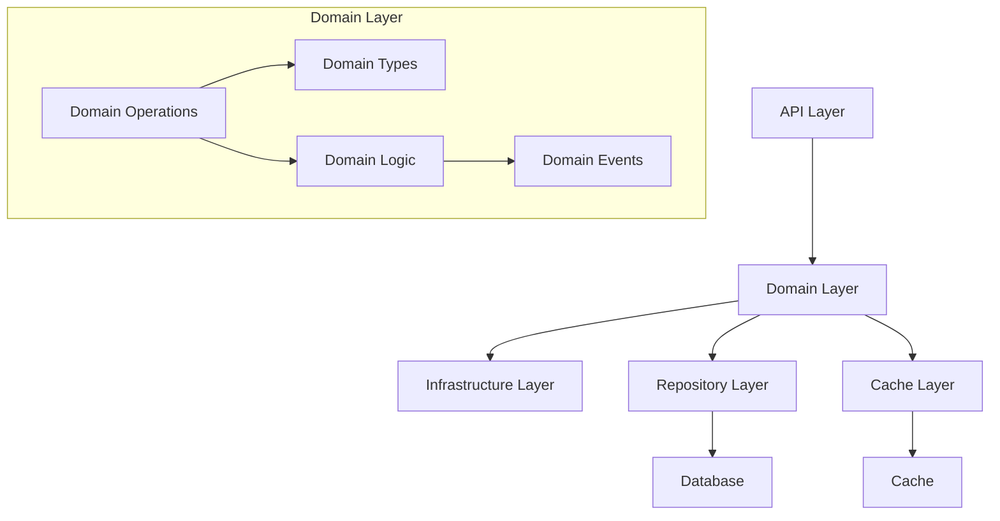
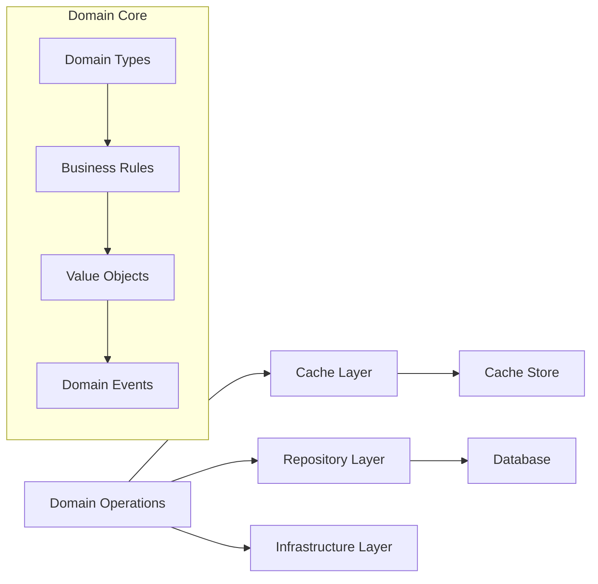
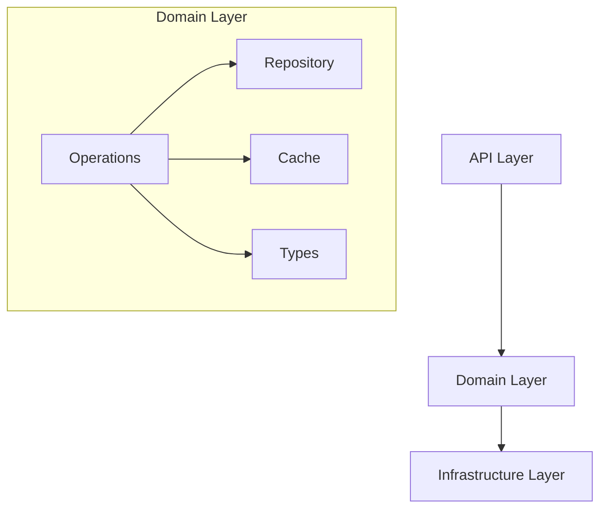
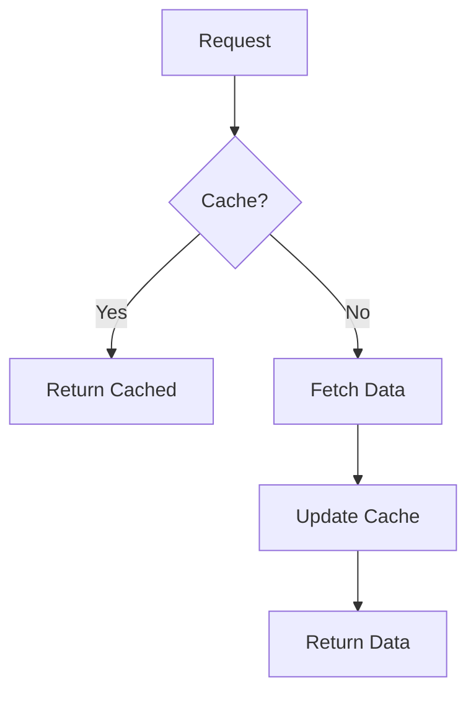
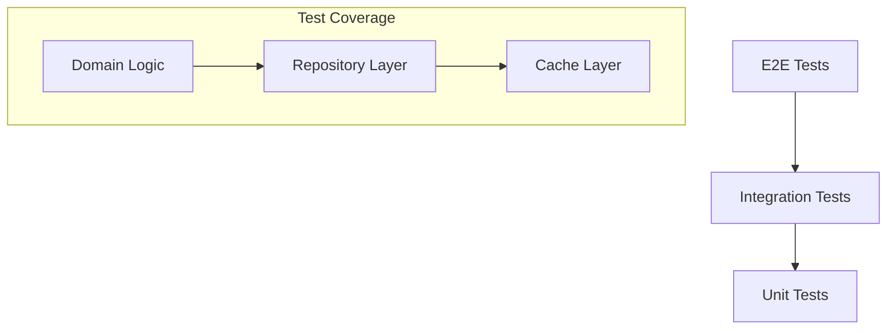

# Domain Layer Design

## Overview

The domain layer is the core of our application, implementing business logic using Domain-Driven Design (DDD) principles and Functional Programming (FP) patterns. This document outlines the high-level architecture and design decisions.

## Architecture

## Domain Layer Structure

## Design Principles

### 1. Domain-Driven Design

- **Bounded Contexts**: Each domain is self-contained with clear boundaries
- **Ubiquitous Language**: Consistent terminology throughout the codebase
- **Value Objects**: Immutable domain objects with identity
- **Domain Events**: State changes represented as events

### 2. Functional Programming

- **Pure Functions**: No side effects in core business logic
- **Immutability**: All state changes create new objects
- **Type Safety**: Strong typing with branded types
- **Error Handling**: Explicit error handling with TaskEither

### 3. Layered Architecture

## Data Flow

## Domain Organization

### 1. Core Components

- **Domain Types**: Core business models and types
- **Domain Operations**: Business logic implementation
- **Repository Layer**: Data access abstraction
- **Cache Layer**: Performance optimization

### 2. Cross-Cutting Concerns

- **Error Handling**: Consistent error types and handling
- **Validation**: Input validation and business rules
- **Type Safety**: Branded types and type guards
- **Performance**: Caching and optimization strategies

## Implementation Strategy

### 1. Domain Isolation

- Self-contained domains with explicit interfaces
- Clear dependencies through repository pattern
- No cross-domain knowledge leakage
- Pure functional core with side effects at edges

### 2. Type Safety

- Branded types for domain identifiers
- Explicit validation at boundaries
- No implicit type coercion
- Comprehensive type definitions

### 3. Error Handling

- TaskEither for all operations
- Explicit error types and messages
- Consistent error creation patterns
- Error transformation at boundaries

## Performance Considerations

### 1. Caching Strategy

### 2. Data Access Patterns

- Cache-first architecture
- Batch operations for bulk data
- Optimized database queries
- Connection pooling

## Testing Strategy

### 1. Test Pyramid

### 2. Test Types

- Unit tests for pure functions
- Integration tests for repositories
- E2E tests for domain operations
- Property-based tests for validation

## Maintenance and Evolution

### 1. Code Organization

- Consistent file structure
- Clear module boundaries
- Explicit dependencies
- Functional composition

### 2. Documentation

- API documentation
- Domain model documentation
- Implementation guides
- Architecture decision records

### 3. Monitoring

- Performance metrics
- Error tracking
- Cache hit rates
- Database performance
