# Domain Layer Design

## Overview

The domain layer is the core of our application, implementing business logic using Domain-Driven Design (DDD) principles and Functional Programming (FP) patterns with fp-ts. This document outlines the high-level architecture and design decisions.

## Architecture

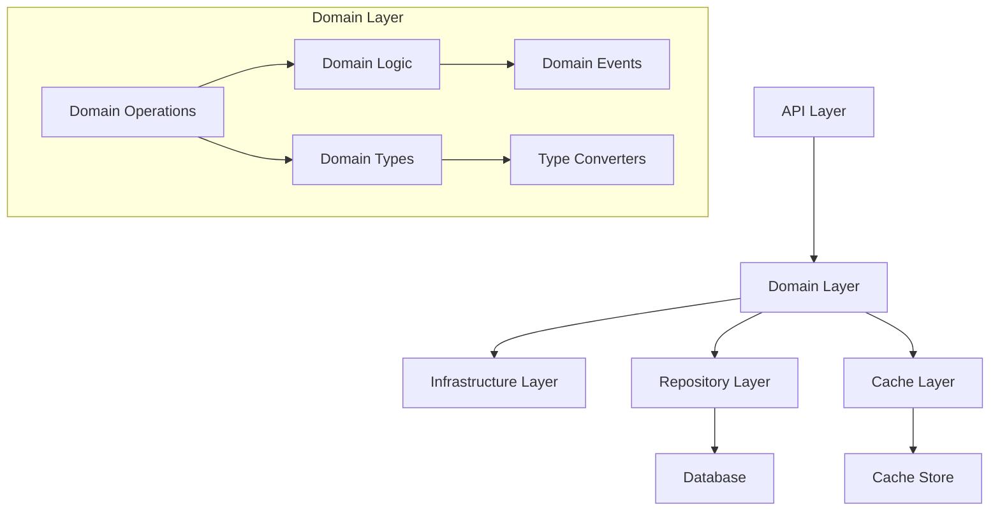

## Domain Layer Structure

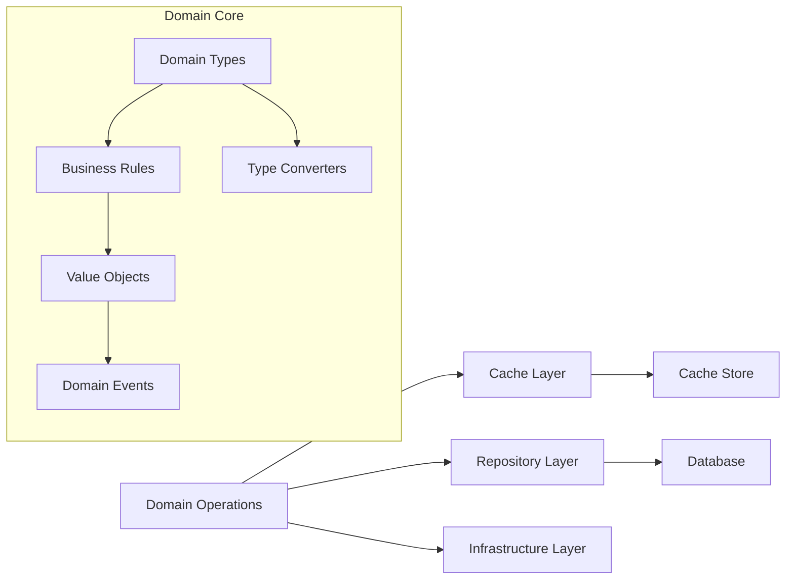

## Design Principles

### 1. Domain-Driven Design

- **Bounded Contexts**: Each domain is self-contained (e.g., Event domain)
- **Ubiquitous Language**: Consistent terminology (e.g., Event, GameWeek)
- **Value Objects**: Immutable domain objects (e.g., EventId)
- **Domain Events**: State changes as events

### 2. Functional Programming

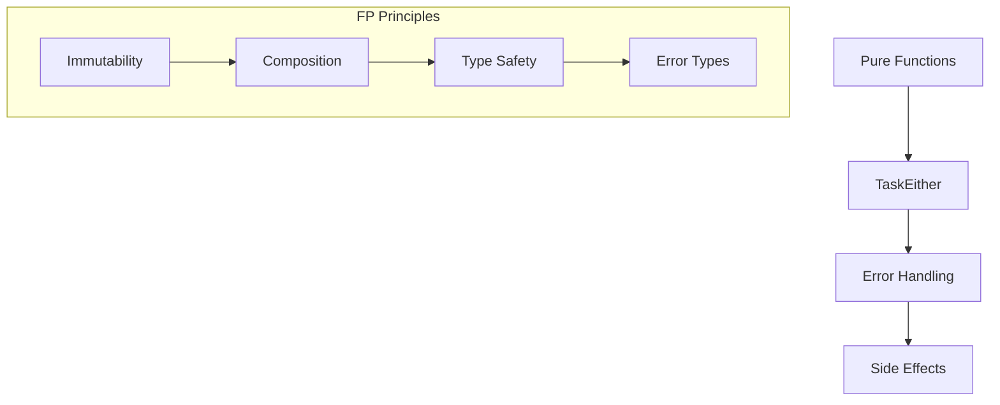

### 3. Layered Architecture

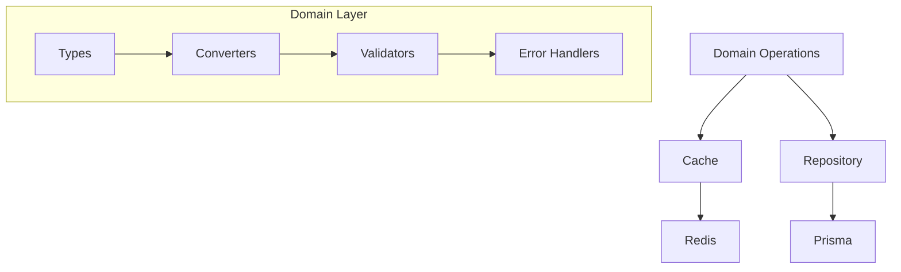

## Data Flow

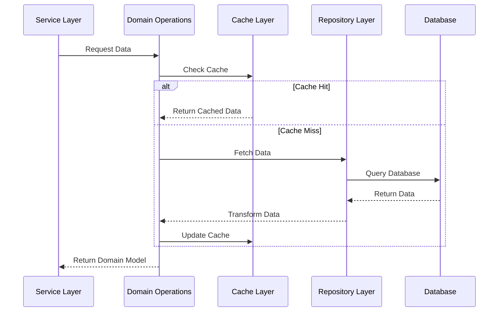

## Domain Organization

### 1. Core Components

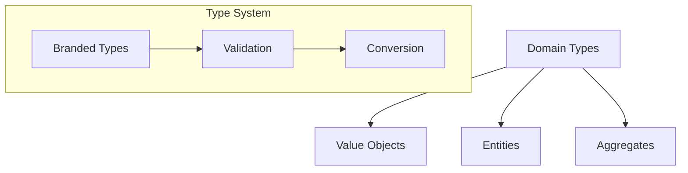

### 2. Cross-Cutting Concerns

- **Error Handling**: Domain-specific error types
- **Validation**: Input/output validation
- **Type Safety**: Branded types and guards
- **Performance**: Caching strategies

## Implementation Strategy

### 1. Domain Isolation

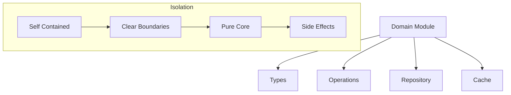

### 2. Type Safety

- Branded types for identifiers
- Explicit validation at boundaries
- No implicit type coercion
- Comprehensive type definitions

### 3. Error Handling

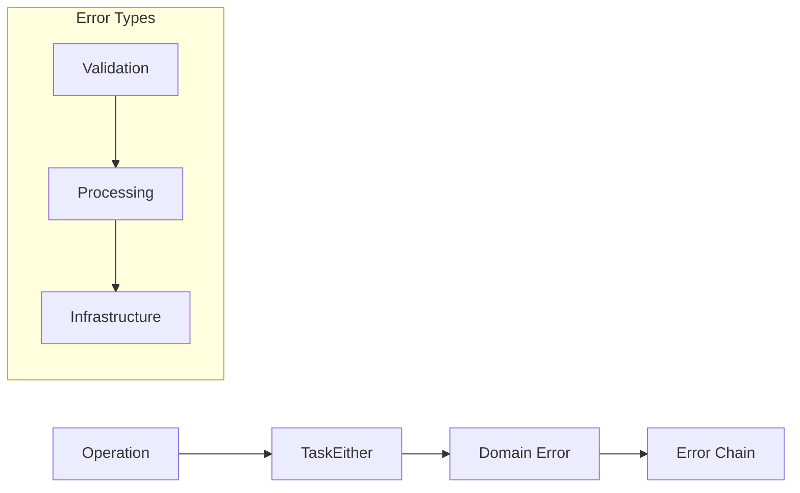

## Performance Considerations

### 1. Caching Strategy

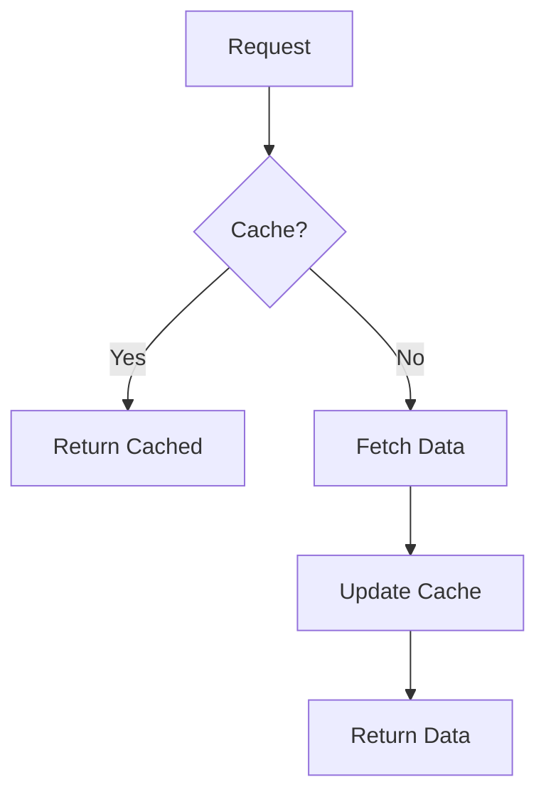

### 2. Data Access Patterns

- Cache-first architecture
- Batch operations for bulk data
- Optimized database queries
- Connection pooling

## Testing Strategy

### 1. Test Pyramid

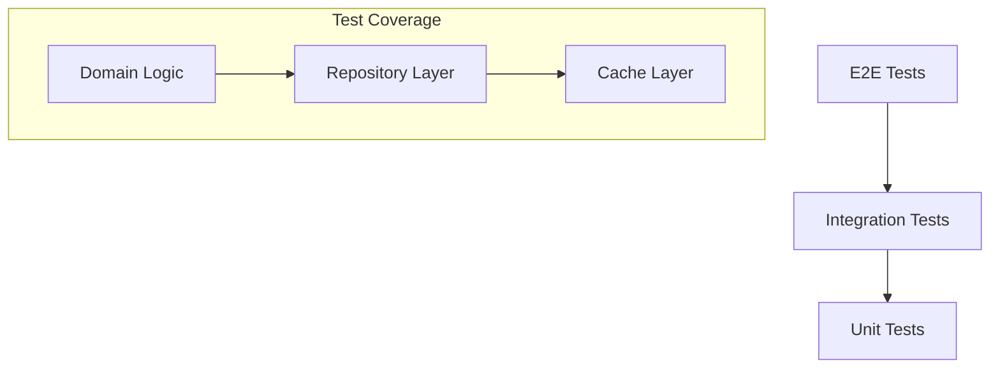

### 2. Test Types

- Unit tests for pure functions
- Integration tests for repositories
- E2E tests for domain operations
- Property-based tests for validation

## Maintenance and Evolution

### 1. Code Organization

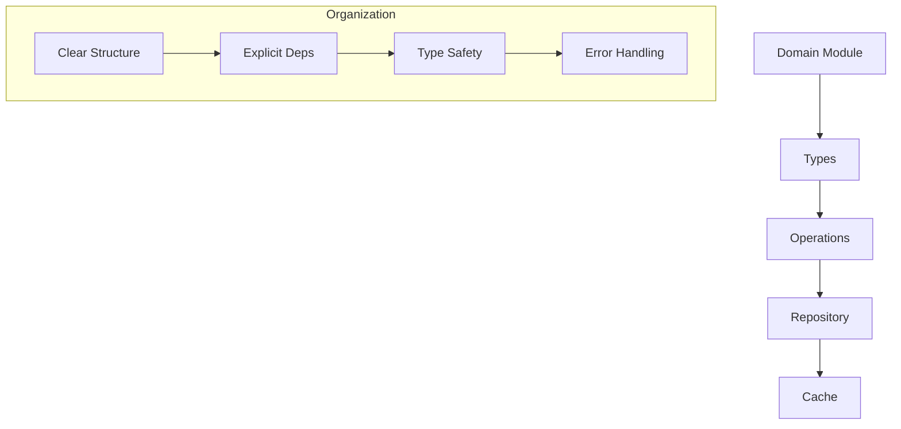

### 2. Documentation

- API documentation
- Domain model documentation
- Implementation guides
- Architecture decision records

### 3. Monitoring

- Performance metrics
- Error tracking
- Cache hit rates
- Database performance
