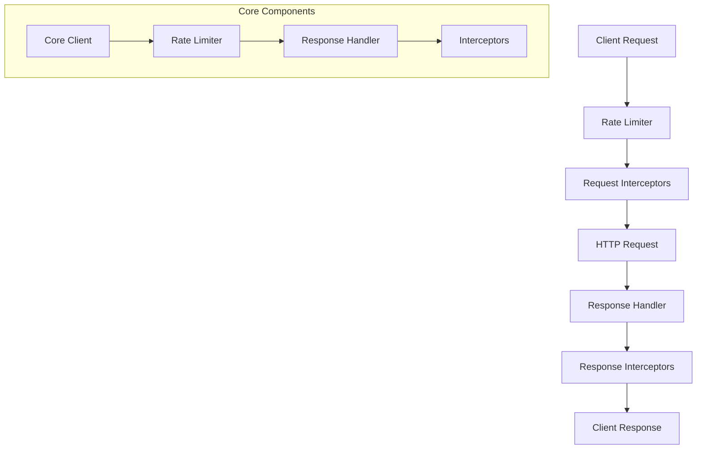
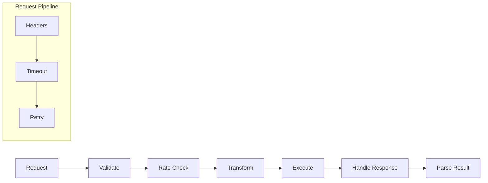
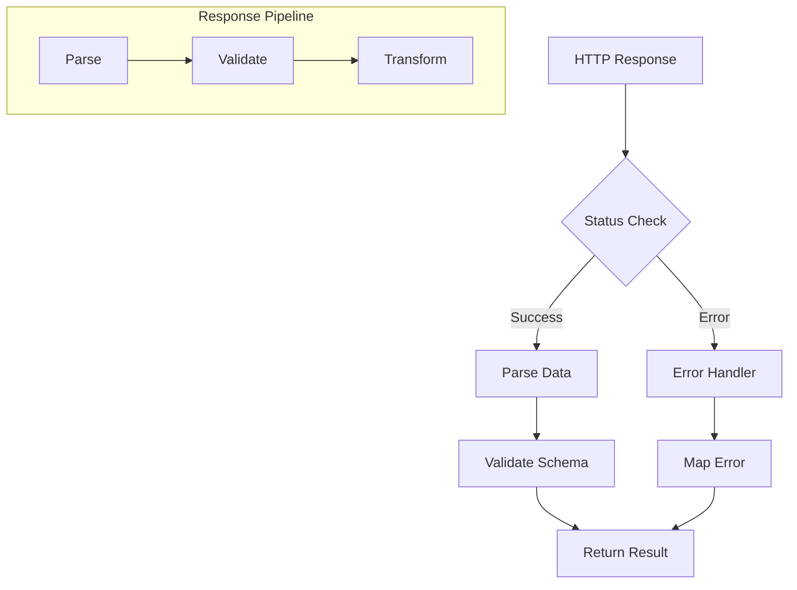
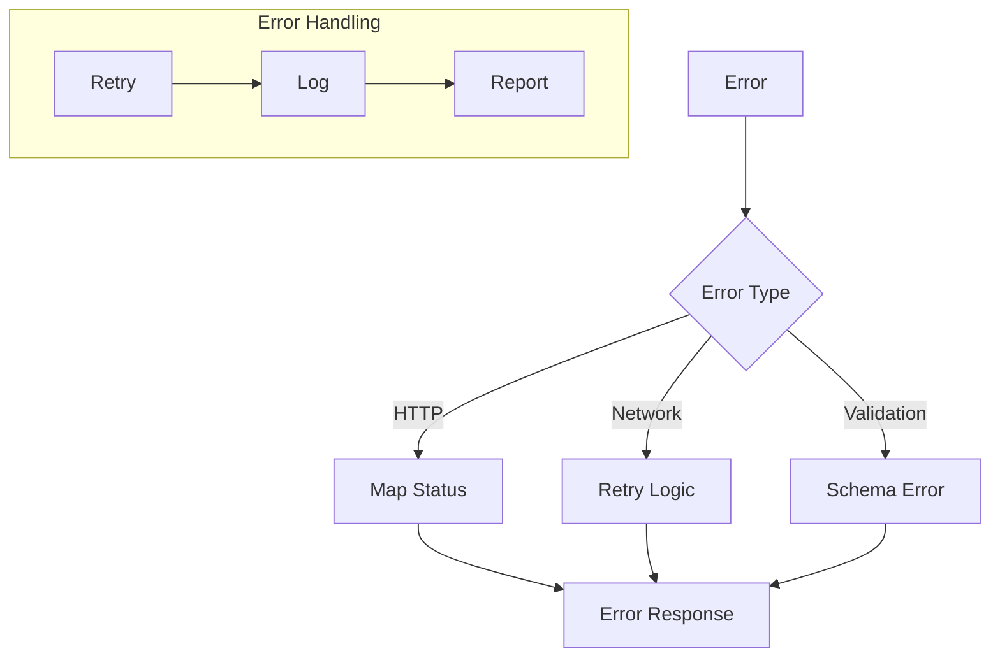
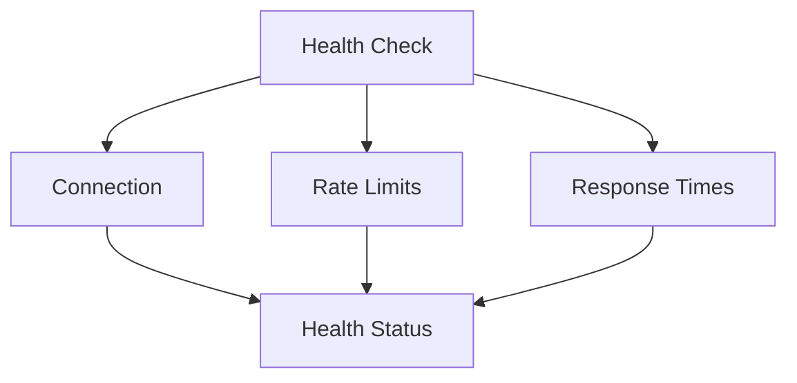

# HTTP Client Design

## Overview

The HTTP client is designed with functional programming principles using fp-ts, providing a type-safe, resilient, and maintainable way to handle HTTP communications. It features retry mechanisms, rate limiting, comprehensive error handling, and performance monitoring.

## Directory Structure

```plaintext
src/infrastructure/http/
├── client/                  # Core HTTP client implementation
│   ├── core.ts             # Core HTTP client functionality
│   ├── types.ts            # Client type definitions
│   ├── rate-limiter.ts     # Rate limiting implementation
│   ├── response.ts         # Response handling
│   ├── request-interceptors.ts # Request interceptors
│   ├── utils.ts            # Utility functions
│   └── index.ts            # Public exports
└── fpl/                    # FPL API client implementation
    ├── client.ts           # FPL client implementation
    ├── types.ts            # FPL-specific types
    ├── factories.ts        # Client factories
    └── endpoints/          # FPL API endpoints
```

## Core Architecture



## Request Flow



## Response Processing



## Type System

### 1. Core Types

```typescript
interface HTTPClientConfig {
  baseURL?: string;
  timeout?: number;
  headers?: Record<string, string>;
  retryConfig?: RetryConfig;
  rateLimitConfig?: RateLimitConfig;
}

interface RetryConfig {
  maxRetries: number;
  baseDelay: number;
  maxDelay: number;
  shouldRetry: (error: HTTPError) => boolean;
}

interface RateLimitConfig {
  maxRequests: number;
  interval: number;
  burst?: number;
}
```

### 2. Error Types

```typescript
type HTTPErrorCode =
  | 'REQUEST_ERROR'
  | 'RESPONSE_ERROR'
  | 'VALIDATION_ERROR'
  | 'RATE_LIMIT_ERROR'
  | 'TIMEOUT_ERROR';

interface HTTPError {
  code: HTTPErrorCode;
  message: string;
  status?: number;
  cause?: unknown;
}
```

## Rate Limiting Implementation

```typescript
interface RateLimiter {
  checkLimit: () => TaskEither<HTTPError, void>;
  resetLimit: () => void;
  getRemainingTokens: () => number;
}

const createRateLimiter = (config: RateLimitConfig): RateLimiter => ({
  checkLimit: () =>
    pipe(
      TE.tryCatch(
        () => checkRateLimit(config),
        (error) => createHTTPError('RATE_LIMIT_ERROR', error as Error),
      ),
    ),
  // ... other methods
});
```

## Response Handling

```typescript
interface ResponseHandler<T> {
  parse: (response: AxiosResponse) => TaskEither<HTTPError, T>;
  validate: (data: unknown) => TaskEither<HTTPError, T>;
}

const createResponseHandler = <T>(schema: z.Schema<T>): ResponseHandler<T> => ({
  parse: (response) =>
    pipe(
      TE.tryCatch(
        () => parseResponse(response),
        (error) => createHTTPError('RESPONSE_ERROR', error as Error),
      ),
      TE.chain((data) => validateResponse(data, schema)),
    ),
  // ... other methods
});
```

## Error Handling Strategy



## Performance Optimization

### 1. Connection Management

```typescript
interface ConnectionManager {
  getConnection: () => TaskEither<HTTPError, AxiosInstance>;
  releaseConnection: (instance: AxiosInstance) => void;
  closeAll: () => Promise<void>;
}
```

### 2. Request Batching

```typescript
interface BatchProcessor<T> {
  addToBatch: (request: HTTPRequest) => void;
  processBatch: () => TaskEither<HTTPError, T[]>;
  flush: () => TaskEither<HTTPError, void>;
}
```

## Monitoring and Metrics

### 1. Request Metrics

```typescript
interface RequestMetrics {
  duration: number;
  status: number;
  endpoint: string;
  timestamp: Date;
  success: boolean;
}
```

### 2. Health Checks



## Implementation Guidelines

### 1. Type Safety

- Use zod for runtime validation
- Implement proper error types
- Maintain type safety across boundaries
- Use generics for request/response types

### 2. Error Handling

- Implement retry mechanisms
- Handle rate limiting gracefully
- Provide detailed error context
- Log errors appropriately

### 3. Performance

- Implement connection pooling
- Use request batching where appropriate
- Monitor response times
- Handle timeouts properly

### 4. Testing

- Unit test core functionality
- Integration test with mock server
- Test error scenarios
- Verify retry behavior
