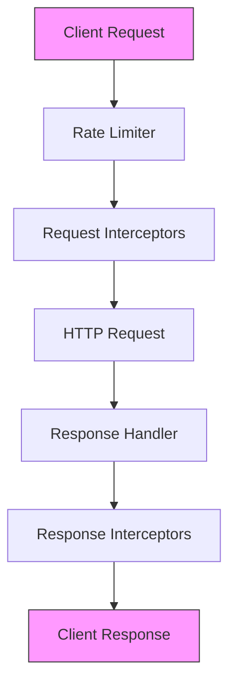
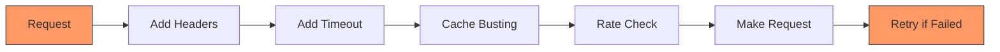
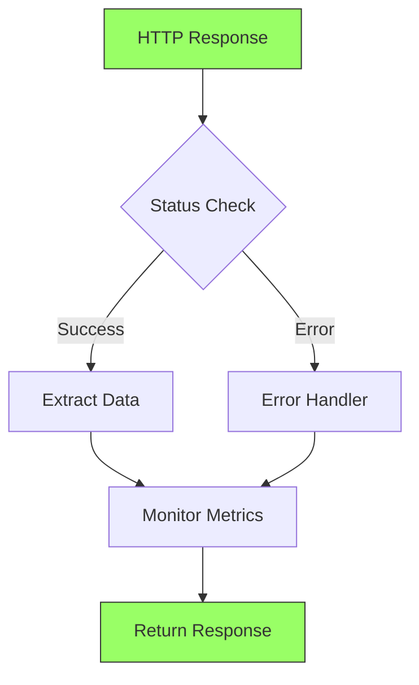
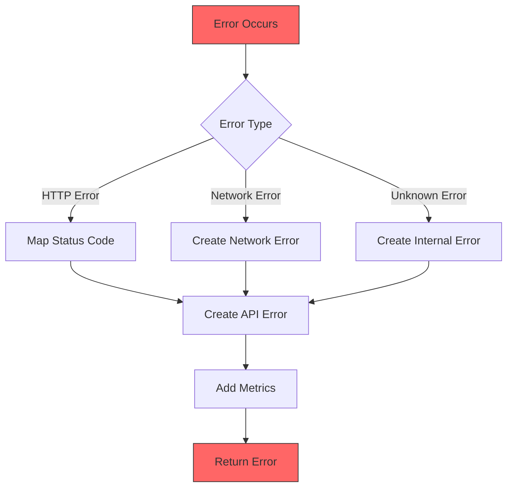
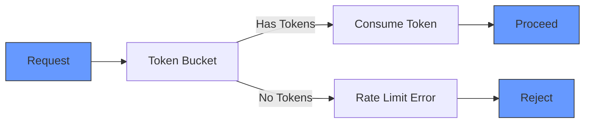

# HTTP Client Design

## Overview

The HTTP client is designed with functional programming principles, providing a type-safe, resilient, and maintainable way to handle HTTP communications. It features retry mechanisms, rate limiting, comprehensive error handling, and performance monitoring.

## Core Architecture

## Request Flow

## Response Processing

## Error Handling Strategy

## Rate Limiting Design

## Key Components

### Core Client

- Manages HTTP operations (GET, POST, PUT, etc.)
- Implements retry mechanism with exponential backoff
- Handles request configuration and execution

### Request Processing

- Adds default headers
- Sets timeouts
- Implements cache busting for GET requests
- Enforces rate limiting

### Response Handling

- Validates response status
- Extracts response data
- Tracks performance metrics
- Handles errors consistently

### Error Management

- Type-safe error creation
- Consistent error structure
- Detailed error information
- Error code mapping

### Monitoring

- Request duration tracking
- Success/failure metrics
- Performance thresholds
- Detailed logging

## Design Principles

### Functional Programming

- Pure functions where possible
- Immutable data structures
- Effect handling with TaskEither
- Function composition with pipe/flow

### Type Safety

- Comprehensive type definitions
- Runtime type validation
- Type-safe error handling
- Generic request/response types

### Resilience

- Automatic retries
- Rate limiting protection
- Circuit breaking capability
- Timeout management

### Maintainability

- Clear separation of concerns
- Centralized configuration
- Consistent error handling
- Comprehensive monitoring

## Configuration Management

### HTTP Configuration

- Status codes
- Error codes
- Default headers
- Timeout settings

### Retry Configuration

- Attempt limits
- Base delay
- Maximum delay
- Retry conditions

### Rate Limiting

- Token bucket algorithm
- Configurable limits
- Burst handling
- Recovery periods

## Performance Considerations

### Monitoring

- Request duration tracking
- Error rate monitoring
- Performance thresholds
- Detailed metrics

### Optimization

- Cache busting for GET requests
- Connection pooling
- Request queuing
- Response streaming

### Resource Management

- Connection timeouts
- Request timeouts
- Rate limiting
- Memory usage control
