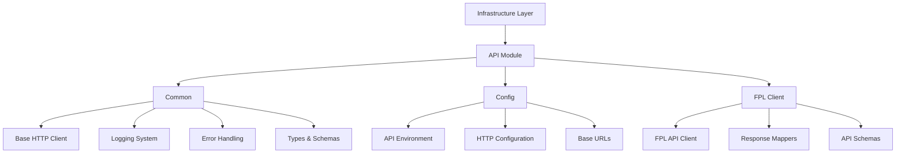

## Overview

The infrastructure layer handles external concerns and provides foundational services for the application. It implements technical capabilities and interfaces with external systems.

## API Module Architecture



### Common Module

#### HTTP Client

- Built on Axios with enhanced features:
  - Type-safe request/response handling using fp-ts/Either
  - Configurable retry mechanism with exponential backoff and jitter
  - Request/response interceptors
  - Comprehensive error handling with custom error types
  - Structured logging with context

**Configuration Options**:

```typescript
interface HTTPClientConfig {
  baseURL?: string;
  timeout?: number;
  headers?: Record<string, string>;
  retry?: {
    attempts: number;
    baseDelay: number;
    maxDelay: number;
    shouldRetry: (error: Error) => boolean;
  };
}
```

### Configuration Management

#### API Environment

```typescript
const API_ENV = {
  development: 'development',
  production: 'production',
  test: 'test',
} as const;
```

#### HTTP Configuration

```typescript
const HTTP_CONFIG = {
  TIMEOUT: {
    DEFAULT: 30000,
    LONG: 60000,
    SHORT: 5000,
  },
  RETRY: {
    DEFAULT_ATTEMPTS: 3,
    MAX_ATTEMPTS: 5,
    BASE_DELAY: 1000,
    MAX_DELAY: 10000,
    JITTER_MAX: 100,
  },
};
```

### FPL Client Implementation

#### Features

- Extends base HTTP client with FPL-specific functionality
- Custom user agent management
- Response validation using Zod schemas
- Comprehensive error handling
- Structured logging with context

#### Available Methods

```typescript
class FPLClient {
  // Bootstrap data
  getBootstrapStatic(): Promise<APIResponse<Bootstrap>>;

  // Fixtures
  getFixtures(event: number): Promise<APIResponse<Fixture[]>>;
  getEventLive(event: number): Promise<APIResponse<EventLive>>;

  // Entry/Team operations
  getEntry(entry: number): Promise<APIResponse<Entry>>;
  getEntryHistory(entry: number): Promise<APIResponse<EntryHistory>>;
  getEntryEventPicks(entry: number, event: number): Promise<APIResponse<EventPicks>>;
  getEntryTransfers(entry: number): Promise<APIResponse<Transfer[]>>;

  // Player operations
  getElementSummary(element: number): Promise<APIResponse<ElementSummary>>;

  // League operations
  getLeagueClassic(leagueId: number, page: number): Promise<APIResponse<ClassicLeague>>;
  getLeagueH2H(leagueId: number, page: number): Promise<APIResponse<H2HLeague>>;
}
```

## Best Practices

### Type Safety

- Strict TypeScript configuration with no implicit any
- Zod schemas for runtime type validation
- fp-ts/Either for type-safe error handling
- Generic type constraints for API responses

### Error Handling

- Custom error types for different failure scenarios
- Validation errors with detailed schema information
- Configurable retry policies with exponential backoff
- Structured logging with error context

### Performance

- Configurable timeouts (DEFAULT: 30s, LONG: 60s, SHORT: 5s)
- Retry mechanism with jitter to prevent thundering herd
- Custom user agent management
- Cache control headers

## File Structure and Purposes

### Common Module (`/api/common/`)

- `client.ts` (347 lines)

  - Base HTTP client implementation using Axios
  - Implements retry logic, error handling, and request/response interceptors
  - Type-safe request methods with fp-ts/Either support

- `errors.ts` (100 lines)

  - Custom error classes for different failure scenarios
  - Error categorization and mapping utilities
  - Type-safe error handling patterns

- `monitoring.ts` (142 lines)

  - Performance monitoring utilities
  - Request/response timing measurements
  - Resource usage tracking

- `logs.ts` (168 lines)

  - Structured logging implementation
  - Context-aware logging utilities
  - Log formatting and sanitization

- `types.ts` (63 lines)

  - Shared type definitions
  - Generic API response types
  - Utility types for HTTP operations

- `rate-limiter.ts` (124 lines)
  - Rate limiting implementation
  - Request throttling utilities
  - Configurable rate limit strategies

### FPL Module (`/api/fpl/`)

- `client.ts` (196 lines)

  - FPL-specific API client implementation
  - Extends base HTTP client with FPL endpoints
  - Type-safe FPL API methods

- `config.ts` (124 lines)

  - FPL API configuration
  - Endpoint definitions
  - API version management

- `schemas.ts` (221 lines)

  - Zod schemas for FPL API responses
  - Runtime validation definitions
  - Type inference helpers

- `mappers.ts` (207 lines)

  - Data transformation utilities
  - Response mapping functions
  - Type conversion helpers

- `types.ts` (670 lines)
  - FPL-specific type definitions
  - Complete type coverage for FPL API
  - Shared interfaces and types

### Configuration Module (`/api/config/`)

- `error-codes.ts` (13 lines)

  - Error code definitions
  - HTTP status mappings
  - Error categorization constants

- `api.config.ts` (75 lines)

  - API environment configuration
  - Base URL definitions
  - API version management

- `http.config.ts` (91 lines)
  - HTTP client configuration
  - Timeout settings
  - Retry policy definitions
  - Default headers and options

## Directory Structure

```
src/infrastructure/api/
├── common/                 # Shared utilities and base implementations
│   ├── client.ts          # Base HTTP client
│   ├── errors.ts          # Error handling
│   ├── monitoring.ts      # Performance monitoring
│   ├── logs.ts           # Logging utilities
│   ├── types.ts          # Common types
│   └── rate-limiter.ts   # Rate limiting
├── fpl/                   # FPL-specific implementations
│   ├── client.ts         # FPL API client
│   ├── config.ts         # FPL configuration
│   ├── schemas.ts        # Response schemas
│   ├── mappers.ts        # Data transformers
│   └── types.ts          # FPL types
└── config/                # Global configuration
    ├── error-codes.ts    # Error definitions
    ├── api.config.ts     # API settings
    └── http.config.ts    # HTTP settings
```

## Database Infrastructure Design

### Directory Structure

```
src/infrastructure/db/
├── common/                 # Shared database utilities
│   ├── client.ts          # Base database client
│   ├── errors.ts          # Database error handling
│   ├── types.ts           # Common database types
│   ├── monitoring.ts      # Performance monitoring
│   └── logs.ts            # Database logging utilities
├── prisma/                # Prisma ORM specific implementations
│   ├── client.ts          # Prisma client configuration
│   ├── middleware.ts      # Prisma middleware
│   ├── migrations/        # Database migrations
│   └── seeds/            # Seed data scripts
├── repositories/          # Data access layer
│   ├── base.repository.ts # Base repository interface
│   ├── user.repository.ts # User data operations
│   ├── team.repository.ts # Team data operations
│   └── league.repository.ts # League data operations
└── config/               # Database configuration
    ├── db.config.ts      # Database settings
    └── pool.config.ts    # Connection pool settings
```

### File Purposes

#### Common Module (`/db/common/`)

- `client.ts`

  - Base database client implementation
  - Connection management
  - Transaction handling
  - Query execution utilities

- `errors.ts`

  - Database-specific error classes
  - Error mapping utilities
  - Type-safe error handling

- `types.ts`

  - Common database types
  - Query result types
  - Database operation interfaces

- `monitoring.ts`

  - Query performance monitoring
  - Connection pool metrics
  - Resource usage tracking

- `logs.ts`
  - Query logging
  - Performance logging
  - Error logging with context

#### Prisma Module (`/db/prisma/`)

- `client.ts`

  - Prisma client configuration
  - Connection management
  - Type-safe query builders

- `middleware.ts`

  - Query logging middleware
  - Performance monitoring
  - Error handling middleware

- `migrations/`

  - Database schema migrations
  - Version control for schema
  - Migration scripts

- `seeds/`
  - Initial data seeding
  - Test data generation
  - Environment-specific seeds

#### Repositories Module (`/db/repositories/`)

- `base.repository.ts`

  - Generic CRUD operations
  - Common query patterns
  - Transaction handling

- `user.repository.ts`

  - User-specific queries
  - User data operations
  - User-related transactions

- `team.repository.ts`

  - Team data management
  - Team-specific queries
  - Team statistics operations

- `league.repository.ts`
  - League data operations
  - League standings
  - League-specific queries

#### Configuration Module (`/db/config/`)

- `db.config.ts`

  - Database connection settings
  - Environment-specific configs
  - Database credentials management

- `pool.config.ts`
  - Connection pool settings
  - Pool size configuration
  - Timeout settings

### Best Practices

#### Type Safety

- Use Prisma's generated types
- Define explicit return types for all queries
- Avoid raw SQL queries without type checking
- Implement proper error types

#### Performance

- Implement connection pooling
- Use appropriate indexes
- Monitor query performance
- Implement caching where appropriate

#### Security

- Use parameterized queries
- Implement proper access control
- Secure credential management
- Input validation

#### Error Handling

- Custom error classes
- Proper error mapping
- Transaction rollback handling
- Retry mechanisms for transient failures

#### Monitoring

- Query performance metrics
- Connection pool monitoring
- Error rate tracking
- Resource usage monitoring

#### Testing

- Repository unit tests
- Integration tests
- Migration tests
- Seed data tests

```

```
