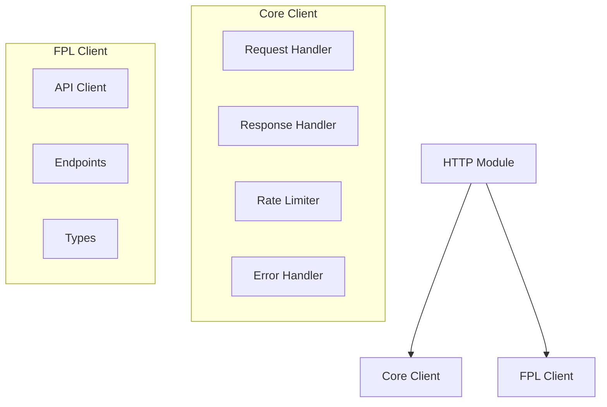
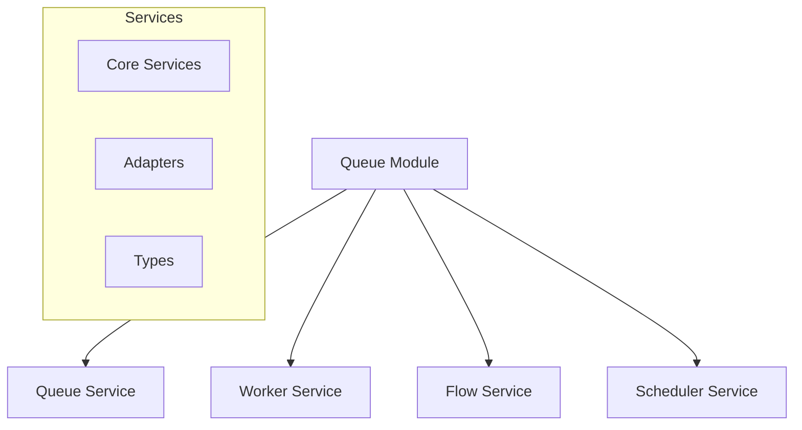
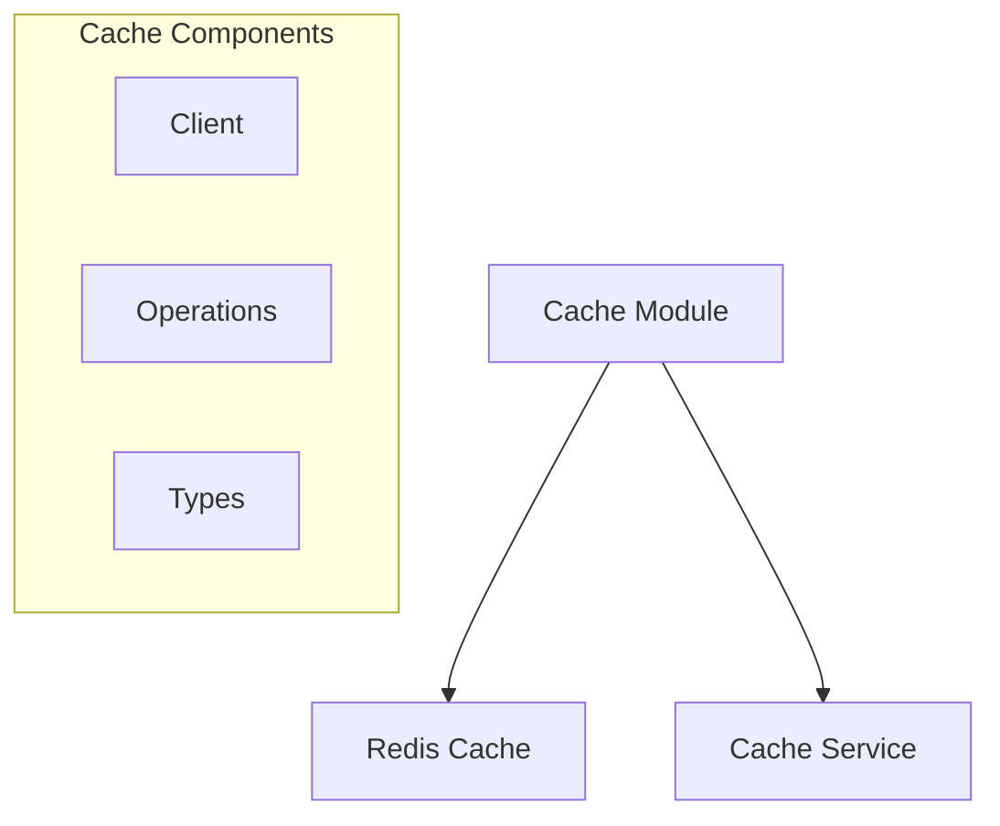
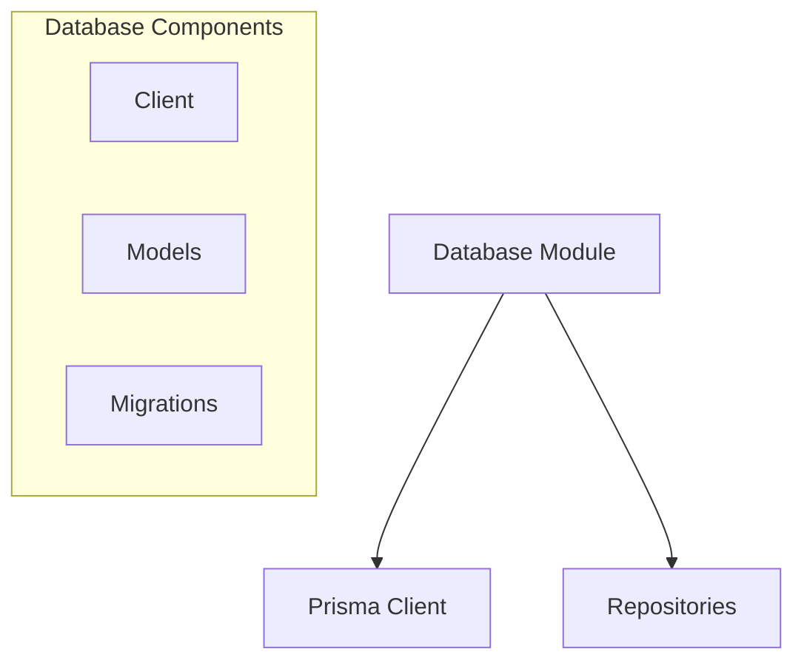
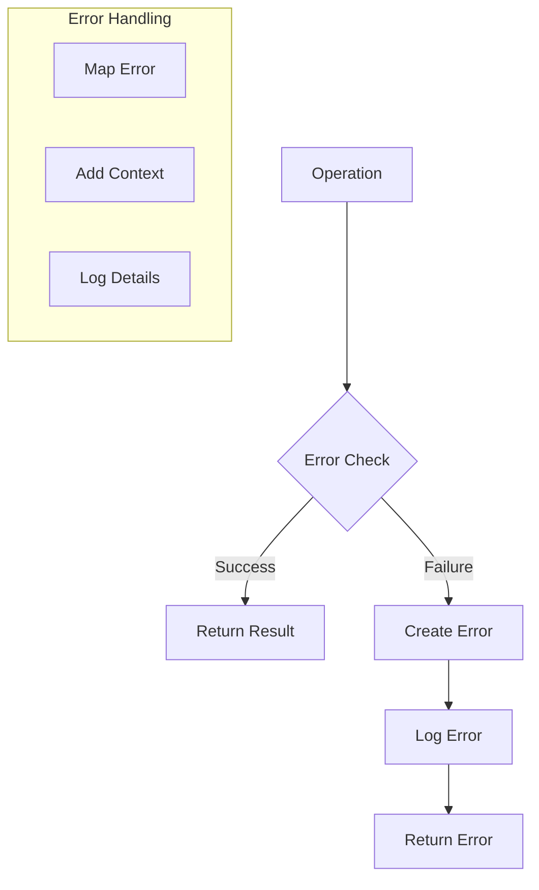
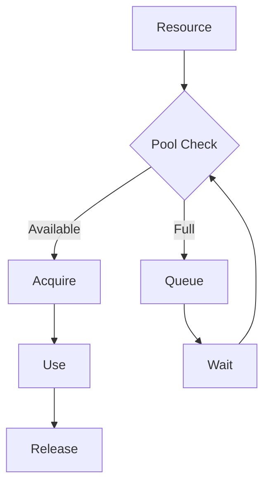
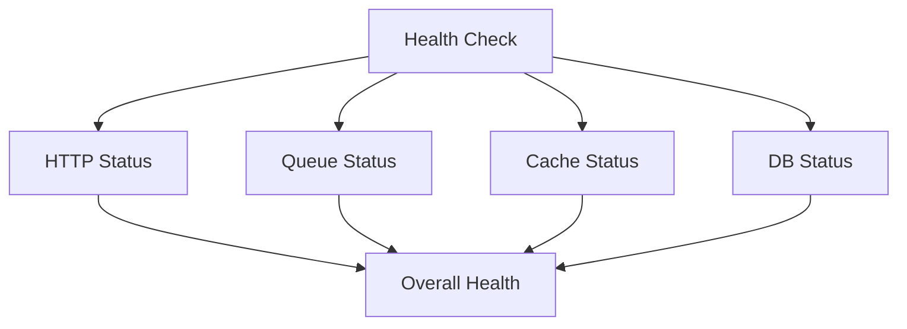

# Infrastructure Layer Design

## Overview

The infrastructure layer handles external concerns and provides foundational services for the application. It implements technical capabilities and interfaces with external systems while maintaining functional programming principles using fp-ts.

## Directory Structure

```plaintext
src/infrastructure/
├── http/                    # HTTP client implementations
│   ├── client/             # Core HTTP client
│   └── fpl/                # FPL API client
├── queue/                  # Queue infrastructure
│   ├── core/              # Core queue services
│   └── types.ts           # Queue types
├── cache/                 # Cache infrastructure
│   ├── redis/            # Redis implementation
│   └── types.ts          # Cache types
├── db/                    # Database infrastructure
│   ├── prisma/           # Prisma implementation
│   └── types.ts          # Database types
├── redis/                # Redis infrastructure
│   ├── client/           # Redis client
│   └── types.ts          # Redis types
└── logger/               # Logging infrastructure
```

## Core Components

### 1. HTTP Module



### 2. Queue Module



### 3. Cache Module



### 4. Database Module



## Type System

### 1. HTTP Types

```typescript
interface HTTPClientConfig {
  baseURL?: string;
  timeout?: number;
  headers?: Record<string, string>;
  retryConfig?: RetryConfig;
  rateLimitConfig?: RateLimitConfig;
}

interface HTTPError {
  code: HTTPErrorCode;
  message: string;
  status?: number;
  cause?: unknown;
}
```

### 2. Queue Types

```typescript
interface QueueConfig {
  name: string;
  connection: QueueConnection;
  options?: QueueOptions;
}

interface WorkerOptions {
  concurrency?: number;
  maxStalledCount?: number;
  stalledInterval?: number;
}
```

### 3. Cache Types

```typescript
interface CacheConfig {
  prefix: string;
  ttl: number;
  connection: RedisConnection;
}

interface CacheOperations<T> {
  get: (key: string) => TaskEither<CacheError, T | null>;
  set: (key: string, value: T) => TaskEither<CacheError, void>;
  del: (key: string) => TaskEither<CacheError, void>;
}
```

## Error Handling

### 1. Error Types

```typescript
type InfrastructureErrorCode = HTTPErrorCode | QueueErrorCode | CacheErrorCode | DBErrorCode;

interface InfrastructureError {
  code: InfrastructureErrorCode;
  message: string;
  cause?: unknown;
}
```

### 2. Error Flow



## Performance Optimization

### 1. Connection Management

```typescript
interface ConnectionManager<T> {
  getConnection: () => TaskEither<InfrastructureError, T>;
  releaseConnection: (conn: T) => void;
  closeAll: () => Promise<void>;
}
```

### 2. Resource Management



## Monitoring and Metrics

### 1. Key Metrics

```typescript
interface InfrastructureMetrics {
  http: {
    requestCount: number;
    errorRate: number;
    responseTime: number;
  };
  queue: {
    jobCount: number;
    processingTime: number;
    errorRate: number;
  };
  cache: {
    hitRate: number;
    missRate: number;
    latency: number;
  };
  db: {
    queryCount: number;
    responseTime: number;
    errorRate: number;
  };
}
```

### 2. Health Checks



## Implementation Guidelines

### 1. Type Safety

- Use branded types for IDs
- Implement proper error types
- Maintain type safety across boundaries
- Use generics for operations

### 2. Error Handling

- Implement retry mechanisms
- Handle rate limiting
- Provide error context
- Log errors appropriately

### 3. Performance

- Implement connection pooling
- Use appropriate caching
- Monitor resource usage
- Handle timeouts properly

### 4. Testing

- Unit test core functionality
- Integration test with dependencies
- Test error scenarios
- Verify retry behavior

## Best Practices

### 1. Functional Programming

- Use TaskEither for operations
- Maintain immutability
- Implement pure functions
- Use fp-ts operators

### 2. Resource Management

- Implement proper cleanup
- Handle connection pooling
- Monitor resource usage
- Implement graceful shutdown

### 3. Configuration

- Use environment variables
- Implement proper validation
- Maintain type safety
- Document all options

### 4. Monitoring

- Track key metrics
- Implement health checks
- Monitor resource usage
- Set up alerts

```

```
