## Overview

This document outlines the job architecture for the Letletme Data Service, focusing on a hybrid approach combining database triggers, views, and job queues for optimal data processing and event handling.

## Job Categories

### 1. Meta Jobs (Source of Truth)

These jobs maintain the fundamental data that rarely changes and serves as the source of truth for the system.

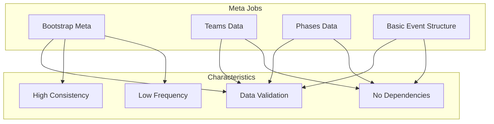
```mermaid
flowchart TD
    subgraph Meta Jobs
        M1[Bootstrap Meta]
        M2[Teams Data]
        M3[Phases Data]
        M4[Basic Event Structure]
    end

    subgraph Characteristics
        C1[Low Frequency]
        C2[High Consistency]
        C3[No Dependencies]
        C4[Data Validation]
    end

    M1 --> C1
    M1 --> C2
    M2 & M3 & M4 --> C3
    M1 & M2 & M3 & M4 --> C4
```

#### A. Job Definitions

```typescript
interface MetaJobs {
  BOOTSTRAP_META: {
    type: 'SCHEDULED';
    schedule: '@daily';
    data: ['teams', 'phases', 'events'];
    priority: 'high';
    sequence: ['phases', 'teams', 'events'];
    validation: true;
  };
  TEAMS_UPDATE: {
    type: 'SCHEDULED';
    schedule: '@daily';
    priority: 'medium';
    validation: true;
  };
  PHASES_UPDATE: {
    type: 'SCHEDULED';
    schedule: '@daily';
    priority: 'medium';
    validation: true;
  };
}
```

#### B. Characteristics

- Daily scheduled check for changes
- Strong data validation
- No external dependencies
- Cache invalidation on changes

### 2. Time-Based Jobs

Jobs that are tied to specific time windows and require precise timing execution.

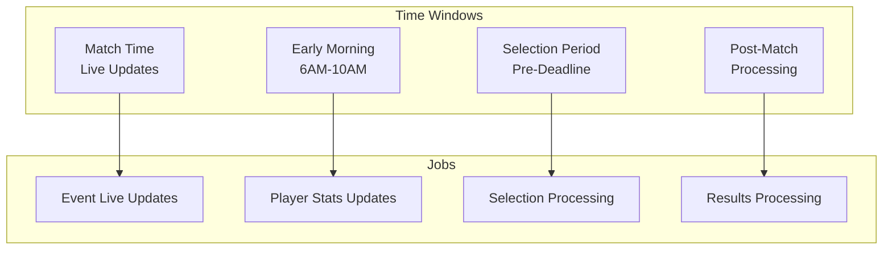
```mermaid
flowchart TD
    subgraph Time Windows
        T1[Early Morning<br/>6AM-10AM]
        T2[Match Time<br/>Live Updates]
        T3[Selection Period<br/>Pre-Deadline]
        T4[Post-Match<br/>Processing]
    end

    subgraph Jobs
        J1[Event Live Updates]
        J2[Player Stats Updates]
        J3[Selection Processing]
        J4[Results Processing]
    end

    T1 --> J2
    T2 --> J1
    T3 --> J3
    T4 --> J4
```

#### A. Live Update Jobs

```typescript
interface LiveUpdateJobs {
  EVENT_LIVE_UPDATE: {
    type: 'TIME_WINDOW';
    schedule: '*/1 0-7,19-23 * * *'; // Every minute during match hours
    condition: 'isMatchDayTime';
    priority: 'critical';
    cache: {
      strategy: 'write-through';
      ttl: 60; // 1 minute
    };
  };
  LIVE_SCORES_UPDATE: {
    type: 'TIME_WINDOW';
    schedule: '*/1 * * * *'; // Every minute during live matches
    condition: 'hasLiveMatches';
    priority: 'critical';
  };
}
```

#### B. Selection Period Jobs

```typescript
interface SelectionJobs {
  PICKS_PROCESSING: {
    type: 'TIME_WINDOW';
    schedule: '*/5 0-4,18-23 * * *';
    condition: 'isSelectTime';
    priority: 'high';
    batch: {
      size: 100;
      maxConcurrent: 3;
    };
  };
}
```

### 3. Tournament Jobs

Jobs specifically handling tournament logic and competition processing.

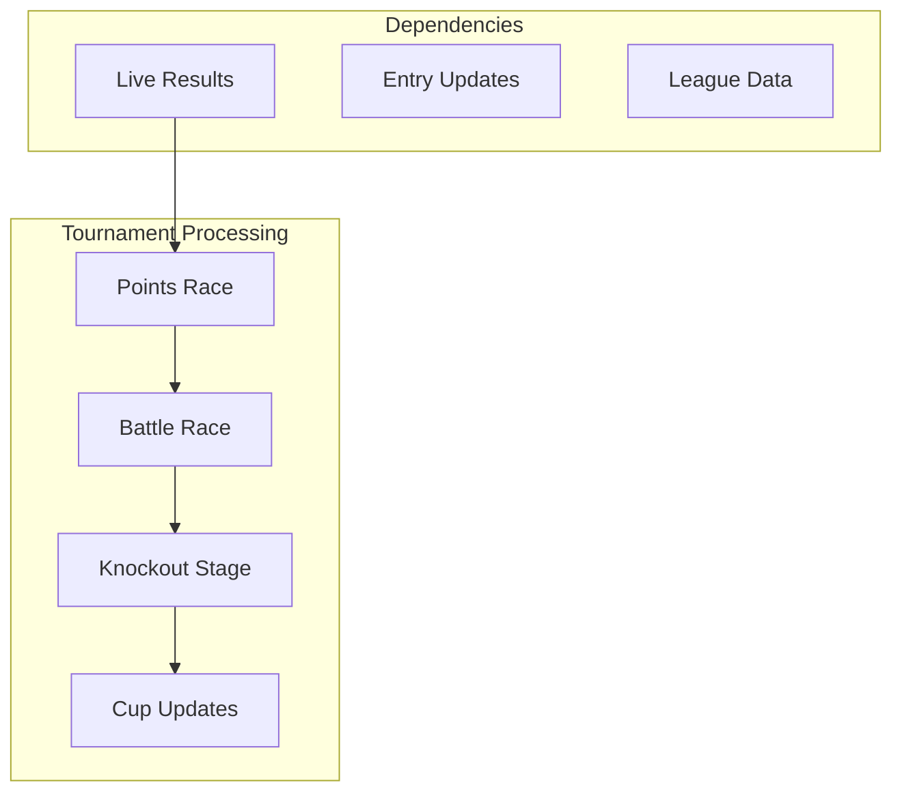
```mermaid
flowchart TD
    subgraph Tournament Processing
        T1[Points Race]
        T2[Battle Race]
        T3[Knockout Stage]
        T4[Cup Updates]
    end

    subgraph Dependencies
        D1[Live Results]
        D2[Entry Updates]
        D3[League Data]
    end

    D1 --> T1
    T1 --> T2
    T2 --> T3
    T3 --> T4
```

#### A. Tournament Update Jobs

```typescript
interface TournamentJobs {
  POINTS_RACE_UPDATE: {
    type: 'TOURNAMENT';
    schedule: '20 6,8,10 * * *';
    condition: 'isAfterMatchDay';
    dependencies: ['LIVE_RESULTS'];
    validation: true;
  };
  KNOCKOUT_UPDATE: {
    type: 'TOURNAMENT';
    schedule: '40 6,8,10 * * *';
    dependencies: ['POINTS_RACE_UPDATE'];
    validation: true;
  };
}
```

### 4. Hybrid Jobs

Complex jobs that combine multiple data sources and require extensive processing.

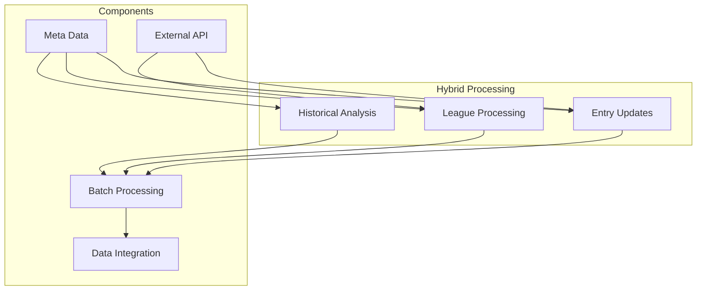
```mermaid
flowchart TD
    subgraph Hybrid Processing
        H1[Entry Updates]
        H2[League Processing]
        H3[Historical Analysis]
    end

    subgraph Components
        C1[Meta Data]
        C2[External API]
        C3[Batch Processing]
        C4[Data Integration]
    end

    C1 --> H1 & H2 & H3
    C2 --> H1 & H2
    H1 & H2 & H3 --> C3
    C3 --> C4
```

#### A. Hybrid Job Structure

```typescript
interface HybridJobs {
  ENTRY_UPDATES: {
    type: 'HYBRID';
    phases: {
      meta: {
        dependencies: ['events', 'teams'];
        priority: 'high';
      };
      external: {
        type: 'BATCH';
        batchSize: 50;
        rateLimit: {
          requests: 10;
          period: '1m';
        };
      };
      integration: {
        validation: true;
        consistency: true;
      };
    };
  };
}
```

## Processing Flow

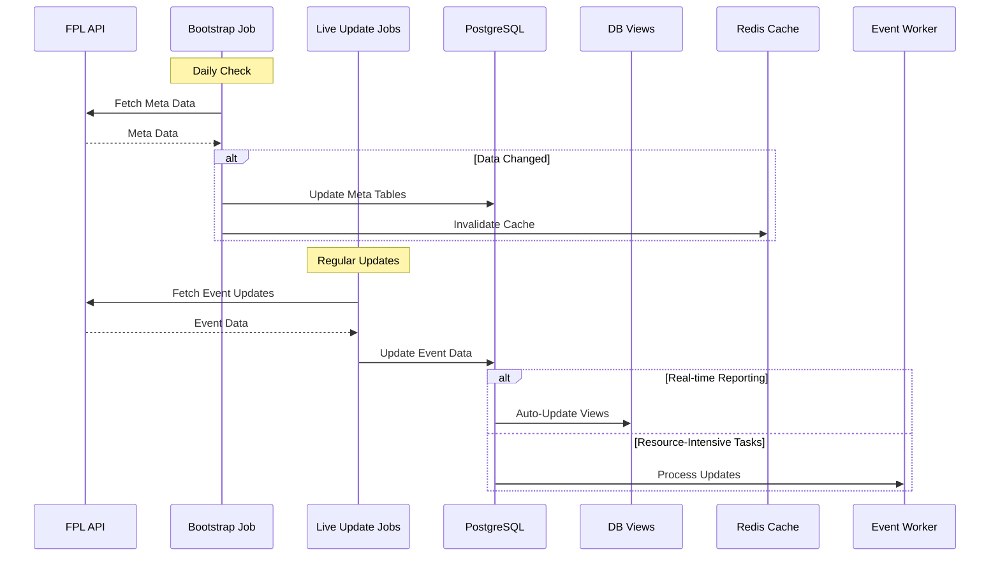
```mermaid
sequenceDiagram
    participant FPL as FPL API
    participant Boot as Bootstrap Job
    participant Live as Live Update Jobs
    participant PG as PostgreSQL
    participant View as DB Views
    participant Cache as Redis Cache
    participant Worker as Event Worker

    Note over Boot: Daily Check
    Boot->>FPL: Fetch Meta Data
    FPL-->>Boot: Meta Data

    alt Data Changed
        Boot->>PG: Update Meta Tables
        Boot->>Cache: Invalidate Cache
    end

    Note over Live: Regular Updates
    Live->>FPL: Fetch Event Updates
    FPL-->>Live: Event Data
    Live->>PG: Update Event Data

    alt Real-time Reporting
        PG->>View: Auto-Update Views
    else Resource-Intensive Tasks
        PG->>Worker: Process Updates
    end
```

## Implementation Strategy

#### Meta Data Management

- **Bootstrap Process**

  - Daily verification of base data
  - Sequential updates for consistency
  - Validation of data relationships
  - Cache invalidation management

- **Live Updates**
  - High-frequency event updates
  - Real-time data validation
  - Dependency management
  - Cache optimization

#### Database Views

- **Real-time Views**

  - Simple aggregations
  - Current state reporting
  - Cross-table joins
  - Performance metrics

- **Materialized Views**
  - Complex calculations
  - Historical analysis
  - Trend computation
  - Heavy aggregations

#### Database Triggers

- **Immediate Processing**

  - Status changes
  - Live updates
  - Simple notifications
  - State transitions

- **Characteristics**
  - Low latency
  - Transactional safety
  - Simple processing logic
  - Minimal resource usage

### 2. BullMQ Jobs

- **Batch Processing**

  - Score calculations
  - Statistics aggregation
  - Complex analytics
  - Resource-intensive operations

- **Characteristics**
  - Controlled resource usage
  - Batch optimization
  - Retry mechanisms
  - Progress tracking

## Configuration Management

#### Job Configurations

```typescript
const ProcessingConfig = {
  metaData: {
    bootstrap: {
      schedule: '@daily',
      sequence: ['phases', 'teams', 'events'],
      validation: {
        enabled: true,
        consistency: true,
        relationships: true,
      },
      retries: {
        attempts: 3,
        backoff: 'exponential',
      },
    },
    liveUpdates: {
      event: {
        schedule: '*/5 * * * *',
        validation: true,
        priority: 'high',
      },
      eventLive: {
        schedule: '*/2 * * * *',
        validation: true,
        priority: 'high',
      },
    },
  },
  views: {
    realTime: {
      league_event_stats: true,
      tournament_standings: true,
    },
    materialized: {
      historical_stats: {
        refreshSchedule: '0 */1 * * *', // Every hour
        refreshMethod: 'CONCURRENT',
      },
    },
  },
  triggers: {
    eventUpdates: {
      immediate: ['status', 'is_live', 'deadline'],
      batched: ['statistics', 'rankings'],
    },
    liveScores: {
      immediate: ['score_changes', 'status_changes'],
      batched: ['performance_calculations', 'tournament_updates'],
    },
  },
  queues: {
    batchProcessor: {
      name: 'batch-processor',
      concurrency: 3,
      rateLimit: { max: 5, duration: 1000 },
    },
    analyticsProcessor: {
      name: 'analytics-processor',
      concurrency: 2,
      rateLimit: { max: 2, duration: 1000 },
    },
  },
  timing: {
    daily: {
      defaultPriority: 'low',
      retryStrategy: 'exponential',
      maxRetries: 3,
    },
    matchDay: {
      defaultPriority: 'high',
      retryStrategy: 'immediate',
      maxRetries: 5,
      activeWindow: {
        pre: { hours: 3 },
        post: { hours: 3 },
      },
    },
    deadline: {
      defaultPriority: 'critical',
      retryStrategy: 'none', // Must succeed first time
      notifications: true,
      lockTimeout: 30000, // 30 seconds
    },
  },
  hybrid: {
    jobs: {
      tournamentEventData: {
        phases: ['meta', 'external', 'integration'],
        priority: 'high',
        schedule: '@hourly',
        timeout: 3600000, // 1 hour total timeout
        monitoring: {
          progress: true,
          metrics: true,
          alerts: true,
        },
      },
    },
    batching: {
      defaultSize: 20,
      maxConcurrency: 3,
      rateLimits: {
        default: { max: 10, period: '1m' },
        critical: { max: 20, period: '1m' },
      },
    },
    error: {
      retryStrategies: {
        meta: { attempts: 3, backoff: 'exponential' },
        api: { attempts: 5, backoff: 'exponential' },
        integration: { attempts: 2, backoff: 'fixed' },
      },
      thresholds: {
        partialSuccess: 0.8,
        errorRate: 0.2,
      },
    },
  },
  realWorld: {
    timeWindows: {
      matchDay: {
        morning: ['06:00', '10:00'],
        evening: ['19:00', '23:59'],
      },
      selection: {
        windows: ['00:00-04:00', '18:00-23:59'],
      },
    },
    batchProcessing: {
      league: {
        batchSize: 100,
        maxConcurrent: 3,
        timeout: 30000,
      },
      tournament: {
        batchSize: 50,
        maxConcurrent: 5,
        timeout: 45000,
      },
    },
    validation: {
      required: ['POINTS_RACE', 'BATTLE_RACE', 'KNOCKOUT'],
      optional: ['TOURNAMENT_CUP'],
    },
  },
} as const;
```

#### Processing Rules

- **DB Triggers**

  - Must complete under 100ms
  - No external API calls
  - No complex calculations
  - Simple data validations

- **BullMQ Jobs**
  - Batch size limits
  - Resource monitoring
  - Progress tracking
  - Error recovery

## Monitoring and Observability

### 1. DB Trigger Metrics

- Trigger execution times
- Notification success rates
- Error rates
- Transaction impacts

### 2. Job Queue Metrics

- Job completion rates
- Processing times
- Resource usage
- Queue health

### 3. Combined Monitoring

- System-wide latency
- Resource utilization
- Error patterns
- Performance bottlenecks

### Additional Monitoring Metrics

```typescript
interface TimingMetrics {
  matchDay: {
    activeJobs: number;
    windowStatus: 'pre' | 'live' | 'post';
    nextFixture: Date;
    activeFixtures: number[];
  };
  deadline: {
    nextDeadline: Date;
    timeToDeadline: number;
    pendingActions: string[];
    lastProcessed: Date;
  };
  daily: {
    lastRunTime: Date;
    successRate: number;
    averageDuration: number;
  };
}
```

### Additional Monitoring Metrics

```typescript
interface HybridJobMetrics {
  phases: {
    meta: {
      duration: number;
      successRate: number;
      lastUpdate: Date;
    };
    external: {
      batchesProcessed: number;
      successRate: number;
      apiLatency: number;
      rateLimit: {
        remaining: number;
        reset: Date;
      };
    };
    integration: {
      recordsProcessed: number;
      successRate: number;
      rollbacks: number;
    };
  };
  overall: {
    status: 'running' | 'completed' | 'failed';
    progress: number;
    startTime: Date;
    endTime?: Date;
    errors: Array<{
      phase: string;
      error: string;
      timestamp: Date;
    }>;
  };
}
```

## Maintenance Tasks

### 1. Database Maintenance

- Trigger performance review
- Notification queue cleanup
- Transaction log management
- Index optimization

### 2. Queue Maintenance

- Dead letter processing
- Queue cleanup
- Worker health checks
- Performance tuning

### 3. Health Checks

- Trigger responsiveness
- Queue processing rates
- Resource utilization
- Error rate monitoring

## Redis Caching Strategy

### 1. Multi-Level Cache Architecture

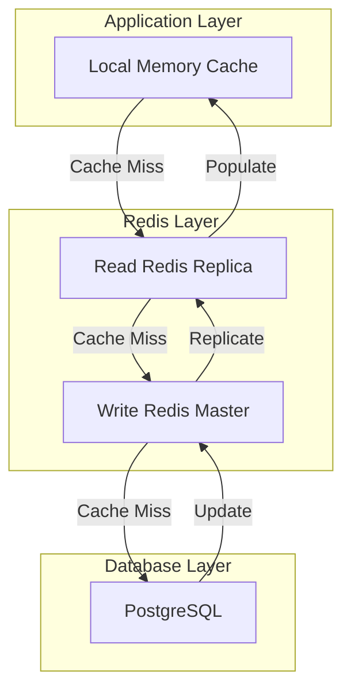
```mermaid
flowchart TD
    subgraph Application Layer
        L1[Local Memory Cache]
    end

    subgraph Redis Layer
        R1[Write Redis Master]
        R2[Read Redis Replica]
    end

    subgraph Database Layer
        DB[PostgreSQL]
    end

    L1 -->|Cache Miss| R2
    R2 -->|Cache Miss| R1
    R1 -->|Cache Miss| DB
    DB -->|Update| R1
    R1 -->|Replicate| R2
    R2 -->|Populate| L1
```

### 2. Data Access Patterns

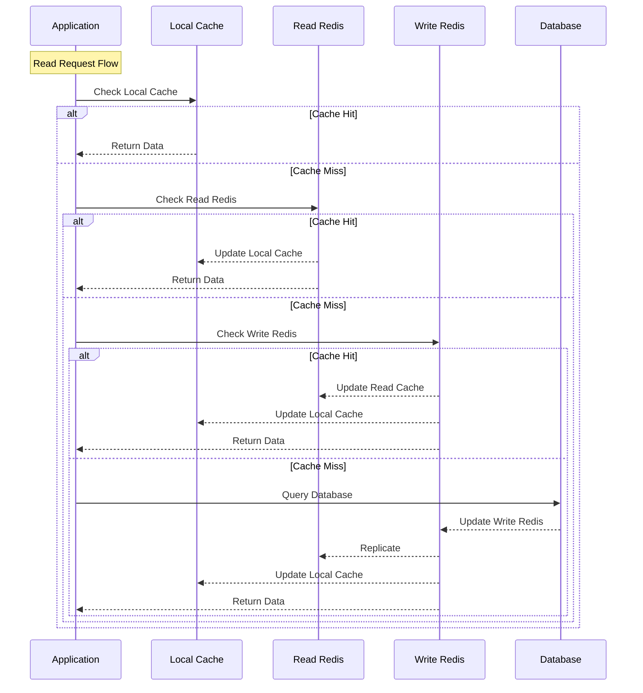
```mermaid
sequenceDiagram
    participant App as Application
    participant Local as Local Cache
    participant Read as Read Redis
    participant Write as Write Redis
    participant DB as Database

    Note over App: Read Request Flow
    App->>Local: Check Local Cache
    alt Cache Hit
        Local-->>App: Return Data
    else Cache Miss
        App->>Read: Check Read Redis
        alt Cache Hit
            Read-->>Local: Update Local Cache
            Read-->>App: Return Data
        else Cache Miss
            App->>Write: Check Write Redis
            alt Cache Hit
                Write-->>Read: Update Read Cache
                Write-->>Local: Update Local Cache
                Write-->>App: Return Data
            else Cache Miss
                App->>DB: Query Database
                DB-->>Write: Update Write Redis
                Write-->>Read: Replicate
                Write-->>Local: Update Local Cache
                Write-->>App: Return Data
            end
        end
    end
```

### 3. TTL Strategy by Data Type

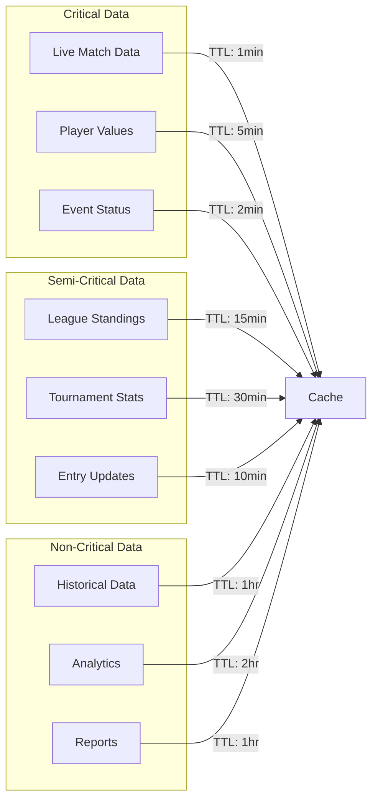
```mermaid
flowchart LR
    subgraph Critical Data
        C1[Live Match Data]
        C2[Player Values]
        C3[Event Status]
    end

    subgraph Semi-Critical Data
        S1[League Standings]
        S2[Tournament Stats]
        S3[Entry Updates]
    end

    subgraph Non-Critical Data
        N1[Historical Data]
        N2[Analytics]
        N3[Reports]
    end

    C1 -->|TTL: 1min| Cache
    C2 -->|TTL: 5min| Cache
    C3 -->|TTL: 2min| Cache

    S1 -->|TTL: 15min| Cache
    S2 -->|TTL: 30min| Cache
    S3 -->|TTL: 10min| Cache

    N1 -->|TTL: 1hr| Cache
    N2 -->|TTL: 2hr| Cache
    N3 -->|TTL: 1hr| Cache
```

### 4. Write Strategies

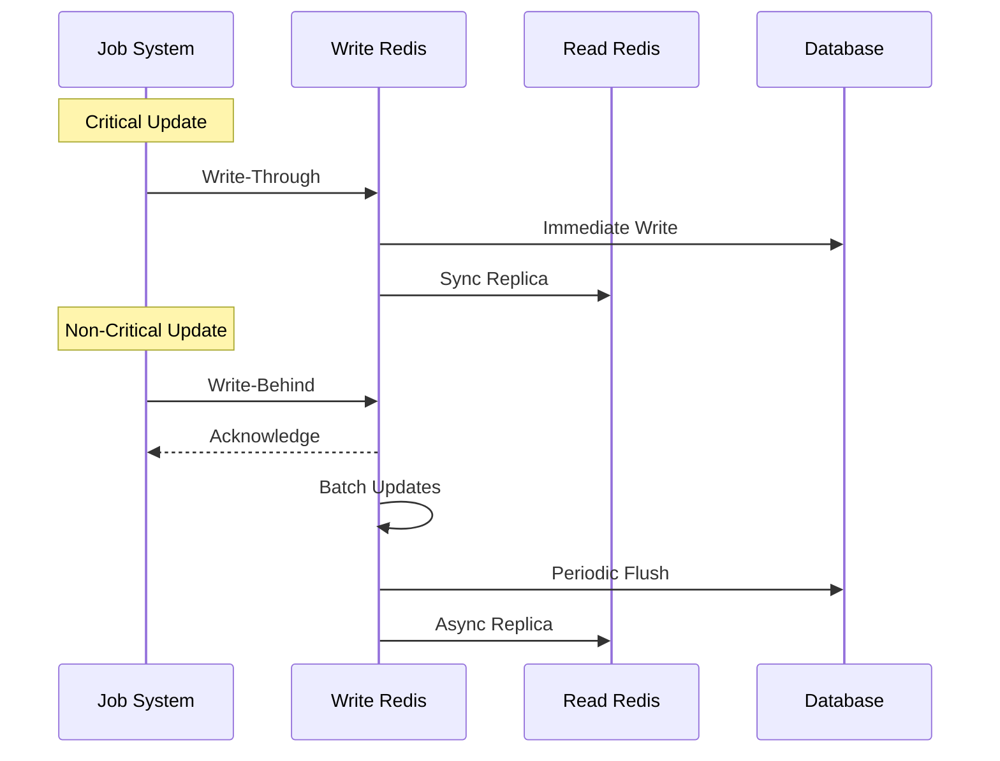
```mermaid
sequenceDiagram
    participant Job as Job System
    participant Write as Write Redis
    participant Read as Read Redis
    participant DB as Database

    Note over Job: Critical Update
    Job->>Write: Write-Through
    Write->>DB: Immediate Write
    Write->>Read: Sync Replica

    Note over Job: Non-Critical Update
    Job->>Write: Write-Behind
    Write-->>Job: Acknowledge
    Write->>Write: Batch Updates
    Write->>DB: Periodic Flush
    Write->>Read: Async Replica
```

### 5. Cache Invalidation Flow

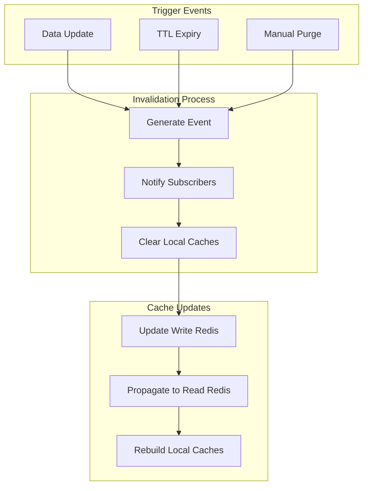
```mermaid
flowchart TD
    subgraph Trigger Events
        T1[Data Update]
        T2[TTL Expiry]
        T3[Manual Purge]
    end

    subgraph Invalidation Process
        I1[Generate Event]
        I2[Notify Subscribers]
        I3[Clear Local Caches]
    end

    subgraph Cache Updates
        U1[Update Write Redis]
        U2[Propagate to Read Redis]
        U3[Rebuild Local Caches]
    end

    T1 & T2 & T3 --> I1
    I1 --> I2
    I2 --> I3
    I3 --> U1
    U1 --> U2
    U2 --> U3
```

### 6. Key Design Patterns

#### A. Meta Data Keys

```
meta:team:{teamId}           # Team information
meta:player:{playerId}       # Player details
meta:event:{eventId}         # Event data
```

#### B. Live Data Keys

```
live:match:{matchId}         # Live match data
live:scores:{eventId}        # Live scores
live:stats:{playerId}        # Player statistics
```

#### C. Tournament Data Keys

```
tournament:{id}:standings    # Tournament standings
tournament:{id}:entries      # Tournament entries
tournament:{id}:results      # Tournament results
```

### 7. Cache Warming Strategy

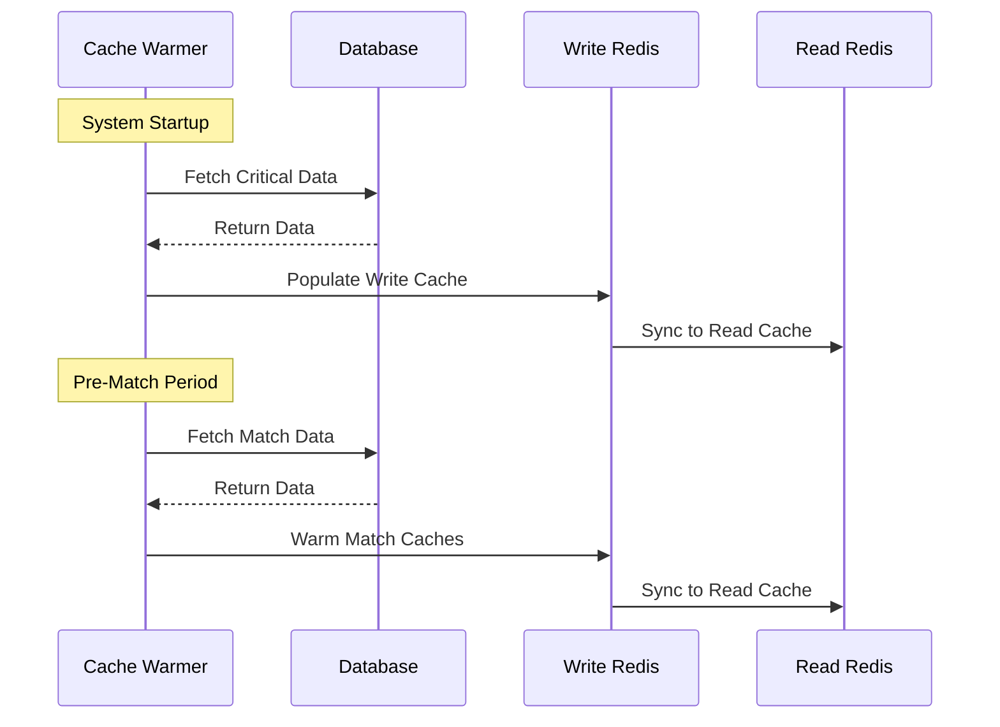
```mermaid
sequenceDiagram
    participant Job as Cache Warmer
    participant DB as Database
    participant Write as Write Redis
    participant Read as Read Redis

    Note over Job: System Startup
    Job->>DB: Fetch Critical Data
    DB-->>Job: Return Data
    Job->>Write: Populate Write Cache
    Write->>Read: Sync to Read Cache

    Note over Job: Pre-Match Period
    Job->>DB: Fetch Match Data
    DB-->>Job: Return Data
    Job->>Write: Warm Match Caches
    Write->>Read: Sync to Read Cache
```

### 8. Implementation Guidelines

#### A. Cache Access Patterns

- Use local cache for highest frequency reads
- Implement read-through caching for Redis misses
- Apply write-behind for non-critical updates
- Ensure atomic operations for critical updates

#### B. Data Consistency

- Maintain TTL based on data criticality
- Implement versioning for cached objects
- Use cache invalidation events
- Handle partial cache updates

#### C. Performance Optimization

- Batch similar cache operations
- Use pipelining for multiple operations
- Implement compression for large objects
- Monitor cache hit rates

#### D. Error Handling

- Define fallback strategies
- Implement circuit breakers
- Handle cache unavailability
- Monitor error rates

## Concurrency Strategy for External API Calls

### 1. Batch Processing with Worker Pools

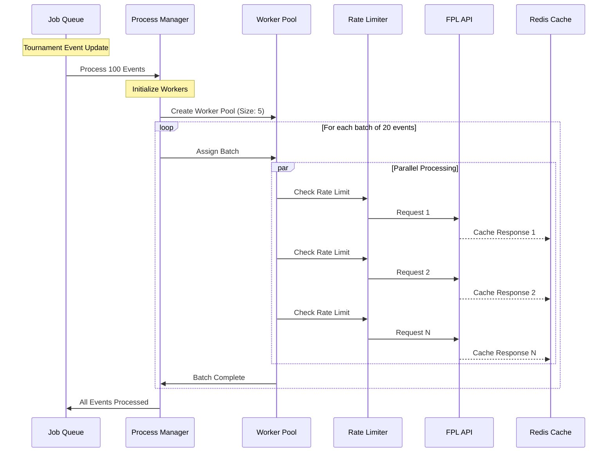
```mermaid
sequenceDiagram
    participant Q as Job Queue
    participant P as Process Manager
    participant W as Worker Pool
    participant C as Rate Limiter
    participant A as FPL API
    participant R as Redis Cache

    Note over Q: Tournament Event Update
    Q->>P: Process 100 Events

    Note over P: Initialize Workers
    P->>W: Create Worker Pool (Size: 5)

    loop For each batch of 20 events
        P->>W: Assign Batch

        par Parallel Processing
            W->>C: Check Rate Limit
            C->>A: Request 1
            A-->>R: Cache Response 1

            W->>C: Check Rate Limit
            C->>A: Request 2
            A-->>R: Cache Response 2

            W->>C: Check Rate Limit
            C->>A: Request N
            A-->>R: Cache Response N
        end

        W->>P: Batch Complete
    end

    P->>Q: All Events Processed
```

### 2. Concurrency Configuration

```typescript
interface ConcurrencyConfig {
  externalApi: {
    // Worker pool configuration
    workerPool: {
      size: 5;                    // Number of concurrent workers
      queueSize: 100;            // Maximum queue size
      idleTimeout: 60000;        // Worker idle timeout (ms)
    };
    // Batch processing settings
    batchProcessing: {
      size: 20;                  // Events per batch
      timeout: 30000;            // Batch timeout (ms)
      retries: 3;                // Retry attempts per batch
    };
    // Rate limiting
    rateLimit: {
      windowMs: 60000;           // 1 minute window
      maxRequests: 100;          // Max requests per window
      workerQuota: 20;           // Requests per worker
    };
    // Circuit breaker
    circuitBreaker: {
      failureThreshold: 0.3;     // 30% failure rate
      resetTimeout: 30000;       // Reset after 30s
      halfOpenRequests: 3;       // Test requests in half-open state
    };
  };
  // Redis caching for responses
  caching: {
    enabled: true;
    ttl: 300;                    // 5 minutes cache
    strategy: 'write-through';    // Immediate cache update
  };
} as const;
```

### 3. Implementation Strategy

#### A. Worker Pool Management

```typescript
interface WorkerPoolStrategy {
  // Worker lifecycle
  initialization: {
    mode: 'EAGER' | 'LAZY';
    warmup: boolean; // Pre-warm workers
    scaling: {
      enabled: true;
      min: 3;
      max: 5;
      scaleUpThreshold: 0.8; // 80% utilization
      scaleDownThreshold: 0.2; // 20% utilization
    };
  };
  // Task distribution
  taskAllocation: {
    strategy: 'ROUND_ROBIN' | 'LEAST_BUSY';
    prioritization: true; // Enable task priority
    affinityEnabled: true; // Worker-task affinity
  };
  // Health management
  health: {
    checkInterval: 5000; // 5s health check
    maxErrors: 3; // Max errors before restart
    restartDelay: 1000; // Delay before restart
  };
}
```

#### B. Rate Limiting Strategy

```typescript
interface RateLimitStrategy {
  global: {
    enabled: true;
    rate: 100; // Requests per window
    window: 60000; // Window size in ms
  };
  perWorker: {
    enabled: true;
    rate: 20; // Requests per worker
    window: 60000; // Window size in ms
  };
  adaptive: {
    enabled: true;
    factors: {
      errorRate: 0.3; // Reduce rate by 30% on errors
      latency: 1000; // Target latency in ms
    };
    recovery: {
      interval: 30000; // Recovery check interval
      step: 0.1; // 10% rate increase per step
    };
  };
}
```

#### C. Error Handling and Recovery

```typescript
interface ErrorHandlingStrategy {
  retry: {
    enabled: true;
    maxAttempts: 3;
    backoff: {
      type: 'EXPONENTIAL';
      initialDelay: 1000;
      maxDelay: 10000;
    };
  };
  fallback: {
    enabled: true;
    strategies: ['CACHED_DATA', 'PARTIAL_UPDATE', 'SKIP_OPTIONAL'];
  };
  circuit: {
    enabled: true;
    thresholds: {
      failure: 0.3; // 30% error rate
      latency: 2000; // 2s latency threshold
    };
    states: {
      halfOpen: {
        duration: 30000; // 30s in half-open
        maxTests: 3; // Test requests
      };
    };
  };
}
```

### 4. Processing Flow Example

```typescript
interface ProcessingFlow {
  initialization: {
    // Pre-processing checks
    checks: ['RATE_LIMIT_STATUS', 'WORKER_HEALTH', 'CACHE_STATUS'];
    // Resource preparation
    preparation: {
      cacheWarming: boolean;
      workerPreparation: boolean;
      rateLimitReset: boolean;
    };
  };
  execution: {
    // Batch processing
    batching: {
      strategy: 'DYNAMIC' | 'FIXED';
      size: number;
      overlap: boolean;
    };
    // Monitoring
    monitoring: {
      metrics: ['latency', 'errors', 'throughput'];
      alerts: {
        errorSpike: number;
        latencyThreshold: number;
      };
    };
  };
  completion: {
    // Cleanup and reporting
    cleanup: {
      invalidateCache: boolean;
      resetWorkers: boolean;
    };
    reporting: {
      metrics: boolean;
      errors: boolean;
      performance: boolean;
    };
  };
}
```

This concurrency strategy provides:

1. Efficient parallel processing with controlled worker pools
2. Smart rate limiting to prevent API throttling
3. Robust error handling and recovery mechanisms
4. Cache integration for optimal performance
5. Monitoring and scaling capabilities

The worker pool handles the concurrent API calls while ensuring:

- Resource efficiency through worker reuse
- Rate limit compliance
- Error resilience
- Optimal throughput

Key benefits of this approach:

- Controlled parallelism with 5 workers handling 20 events each
- Adaptive rate limiting to prevent API throttling
- Robust error handling with circuit breaker pattern
- Efficient caching of API responses
- Comprehensive monitoring and scaling capabilities

## Manual Job Triggers

### 1. Overview

Manual job triggers allow administrators and operators to initiate specific jobs on-demand, outside of their scheduled execution times. This is particularly useful for:

- Force updating meta data
- Recalculating tournament standings
- Refreshing cached data
- Handling exceptional scenarios

### 2. Trigger Flow

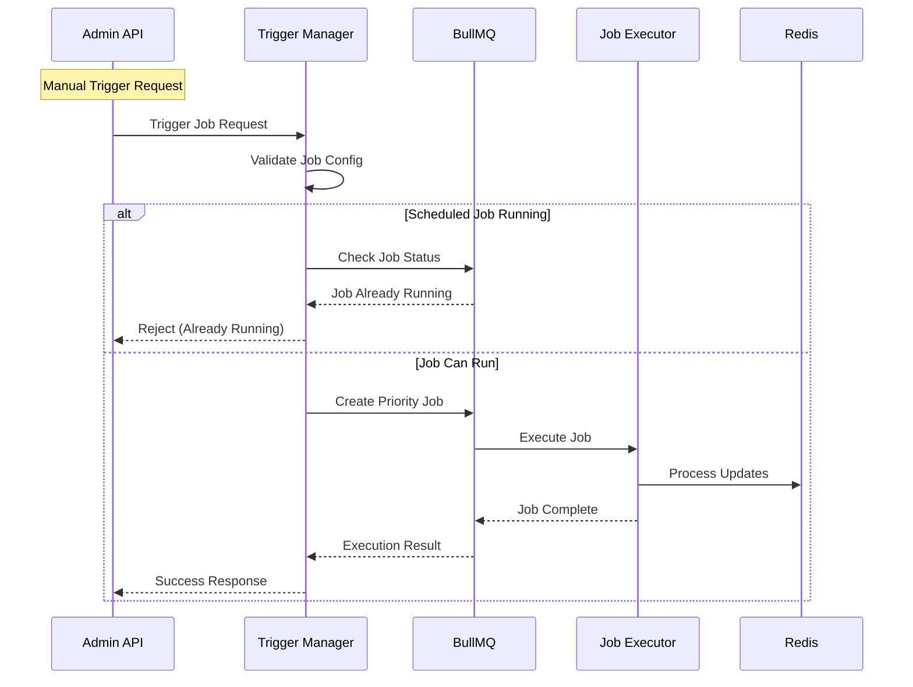
```mermaid
sequenceDiagram
    participant Admin as Admin API
    participant TM as Trigger Manager
    participant BQ as BullMQ
    participant JE as Job Executor
    participant Redis as Redis

    Note over Admin: Manual Trigger Request

    Admin->>TM: Trigger Job Request
    TM->>TM: Validate Job Config

    alt Scheduled Job Running
        TM->>BQ: Check Job Status
        BQ-->>TM: Job Already Running
        TM-->>Admin: Reject (Already Running)
    else Job Can Run
        TM->>BQ: Create Priority Job
        BQ->>JE: Execute Job
        JE->>Redis: Process Updates
        JE-->>BQ: Job Complete
        BQ-->>TM: Execution Result
        TM-->>Admin: Success Response
    end
```

### 3. Job Categories

#### A. Manually Triggerable Meta Jobs

1. **Bootstrap Update**

   - Full system meta data refresh
   - Cannot run in parallel with scheduled updates
   - High priority execution
   - 5-minute lock duration

2. **Player Value Force Update**

   - Immediate player value refresh
   - Can run in parallel
   - Critical priority
   - 1-minute lock duration

3. **Event Data Refresh**
   - Current event data update
   - Cannot run in parallel
   - High priority
   - 2-minute lock duration

#### B. Tournament Processing Jobs

1. **Points Recalculation**

   - Tournament points refresh
   - Exclusive execution (no parallel)
   - High priority
   - 10-minute lock duration

2. **Standings Refresh**
   - Tournament standings update
   - Parallel execution allowed
   - Medium priority
   - 5-minute lock duration

### 4. Access Control

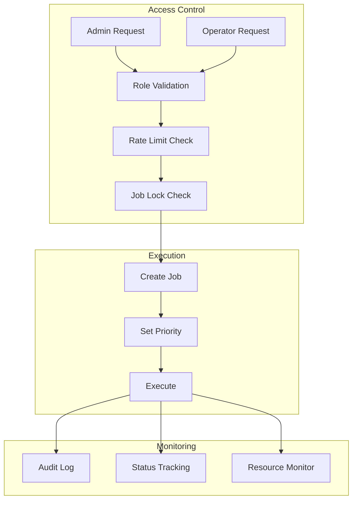
```mermaid
flowchart TD
    subgraph Access Control
        A1[Admin Request] --> V1[Role Validation]
        A2[Operator Request] --> V1
        V1 --> V2[Rate Limit Check]
        V2 --> V3[Job Lock Check]
    end

    subgraph Execution
        V3 --> E1[Create Job]
        E1 --> E2[Set Priority]
        E2 --> E3[Execute]
    end

    subgraph Monitoring
        E3 --> M1[Audit Log]
        E3 --> M2[Status Tracking]
        E3 --> M3[Resource Monitor]
    end
```

#### A. Role-Based Access

- ADMIN: Full access to all manual triggers
- OPERATOR: Limited access to specific jobs
- Audit logging for all manual triggers

#### B. Rate Limiting

- Maximum 10 triggers per hour
- Cooldown period between similar job triggers
- Priority override capabilities for admins

### 5. Status Management

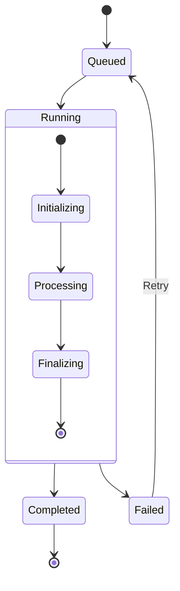
```mermaid
stateDiagram-v2
    [*] --> Queued
    Queued --> Running
    Running --> Completed
    Running --> Failed
    Failed --> Queued: Retry
    Completed --> [*]

    state Running {
        [*] --> Initializing
        Initializing --> Processing
        Processing --> Finalizing
        Finalizing --> [*]
    }
```

#### A. Status Tracking

- Current status (queued, running, completed, failed)
- Progress percentage
- Estimated completion time
- Error details if failed

#### B. Progress Monitoring

- Step-by-step progress updates
- Resource usage metrics
- Performance statistics
- Error logging

### 6. Integration with Scheduled Jobs

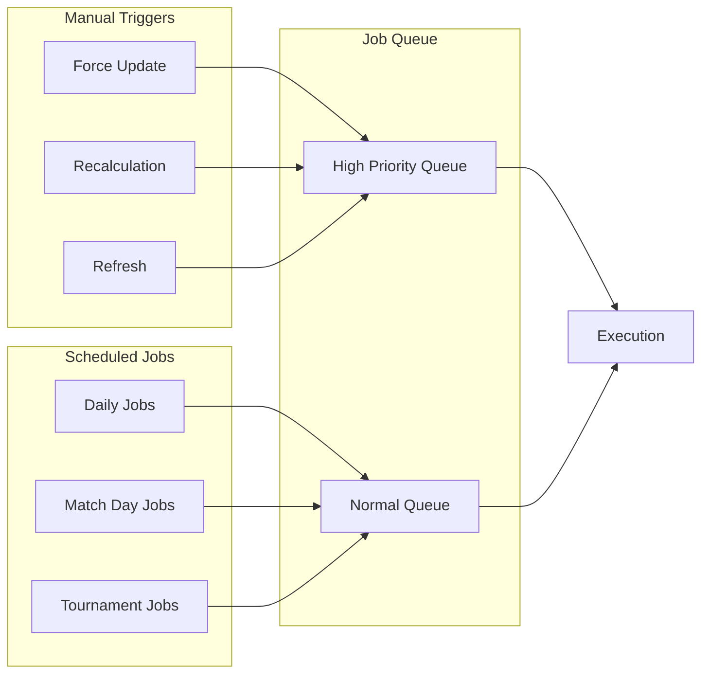
```mermaid
flowchart LR
    subgraph Scheduled Jobs
        S1[Daily Jobs]
        S2[Match Day Jobs]
        S3[Tournament Jobs]
    end

    subgraph Manual Triggers
        M1[Force Update]
        M2[Recalculation]
        M3[Refresh]
    end

    subgraph Job Queue
        Q1[High Priority Queue]
        Q2[Normal Queue]
    end

    M1 & M2 & M3 --> Q1
    S1 & S2 & S3 --> Q2
    Q1 --> E[Execution]
    Q2 --> E
```

#### A. Priority Management

- Manual triggers get higher priority
- Can preempt scheduled jobs
- Resource allocation preference

#### B. Conflict Resolution

- Lock management for parallel execution
- Job dependencies preservation
- Data consistency checks

### 7. Best Practices

#### A. When to Use Manual Triggers

- Data inconsistency resolution
- Emergency updates
- Testing and validation
- Special event handling

#### B. Execution Guidelines

- Validate data before triggering
- Monitor resource impact
- Maintain audit trail
- Handle errors gracefully

#### C. Operational Considerations

- Communication with team members
- Impact assessment
- Rollback planning
- Performance monitoring

## Job Monitoring and Alerting System

### 1. Monitoring Architecture

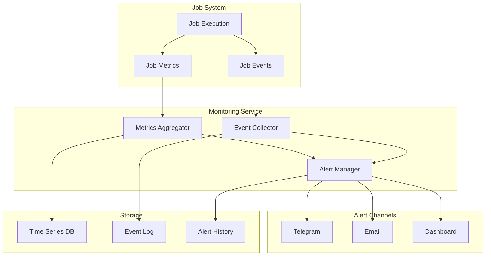
```mermaid
flowchart TD
    subgraph Job System
        J1[Job Execution]
        J2[Job Events]
        J3[Job Metrics]
    end

    subgraph Monitoring Service
        M1[Event Collector]
        M2[Metrics Aggregator]
        M3[Alert Manager]
    end

    subgraph Storage
        S1[Time Series DB]
        S2[Event Log]
        S3[Alert History]
    end

    subgraph Alert Channels
        A1[Telegram]
        A2[Email]
        A3[Dashboard]
    end

    J1 --> J2
    J2 --> M1
    J1 --> J3
    J3 --> M2

    M1 --> S2
    M2 --> S1
    M3 --> S3

    M1 --> M3
    M2 --> M3

    M3 --> A1
    M3 --> A2
    M3 --> A3
```

### 2. Job Event Tracking

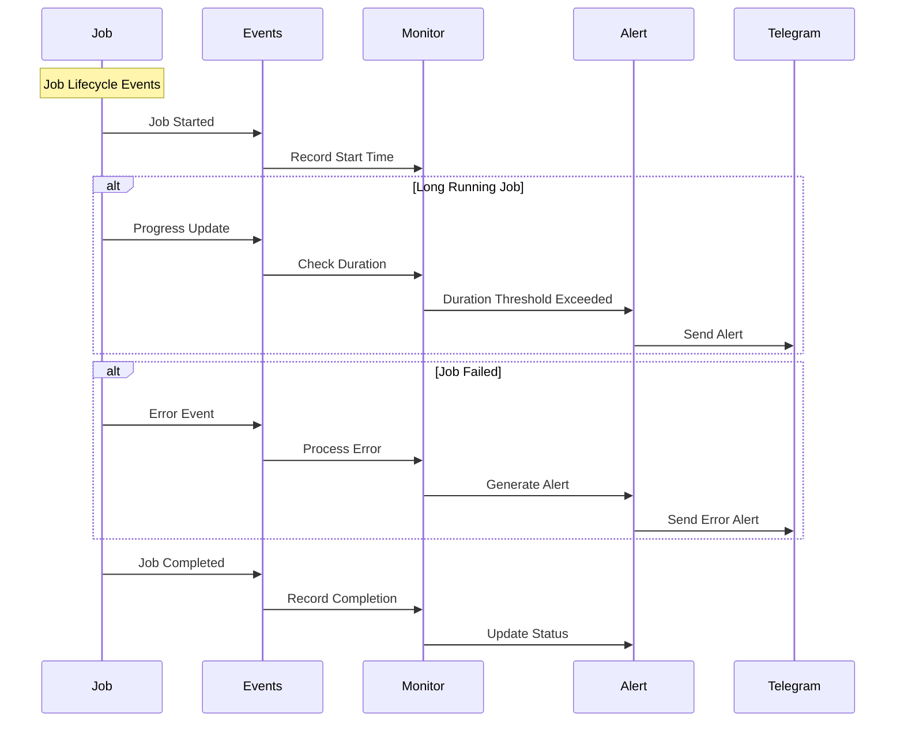
```mermaid
sequenceDiagram
    participant Job
    participant Events
    participant Monitor
    participant Alert
    participant Telegram

    Note over Job: Job Lifecycle Events

    Job->>Events: Job Started
    Events->>Monitor: Record Start Time

    alt Long Running Job
        Job->>Events: Progress Update
        Events->>Monitor: Check Duration
        Monitor->>Alert: Duration Threshold Exceeded
        Alert->>Telegram: Send Alert
    end

    alt Job Failed
        Job->>Events: Error Event
        Events->>Monitor: Process Error
        Monitor->>Alert: Generate Alert
        Alert->>Telegram: Send Error Alert
    end

    Job->>Events: Job Completed
    Events->>Monitor: Record Completion
    Monitor->>Alert: Update Status
```

### 3. Metrics Collection

#### A. Job Performance Metrics

```typescript
interface JobMetrics {
  execution: {
    startTime: Date;
    endTime: Date;
    duration: number;
    status: 'success' | 'failed' | 'running';
    retryCount: number;
  };
  resources: {
    memoryUsage: number;
    cpuUsage: number;
    redisOperations: number;
    apiCalls: number;
  };
  data: {
    recordsProcessed: number;
    batchesCompleted: number;
    errorCount: number;
    warningCount: number;
  };
}
```

#### B. System Health Metrics

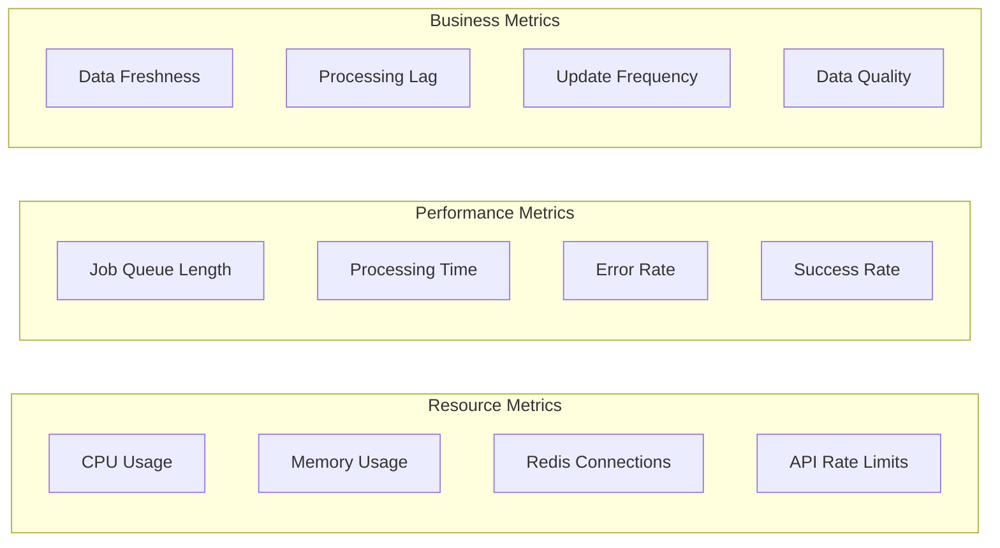
```mermaid
flowchart LR
    subgraph Resource Metrics
        R1[CPU Usage]
        R2[Memory Usage]
        R3[Redis Connections]
        R4[API Rate Limits]
    end

    subgraph Performance Metrics
        P1[Job Queue Length]
        P2[Processing Time]
        P3[Error Rate]
        P4[Success Rate]
    end

    subgraph Business Metrics
        B1[Data Freshness]
        B2[Processing Lag]
        B3[Update Frequency]
        B4[Data Quality]
    end
```

### 4. Alert Configuration

#### A. Alert Levels

```typescript
interface AlertConfig {
  critical: {
    conditions: {
      jobFailure: boolean;
      executionTime: number; // ms
      errorRate: number;
      resourceExhaustion: boolean;
    };
    notification: {
      channels: ['telegram', 'email'];
      immediate: true;
      retryInterval: 300; // 5 minutes
    };
  };
  warning: {
    conditions: {
      longRunning: number; // ms
      highResourceUsage: number;
      dataQualityIssues: boolean;
    };
    notification: {
      channels: ['telegram'];
      immediate: false;
      batchInterval: 3600; // 1 hour
    };
  };
  info: {
    conditions: {
      jobStart: boolean;
      jobCompletion: boolean;
      milestones: boolean;
    };
    notification: {
      channels: ['dashboard'];
      logOnly: true;
    };
  };
}
```

### 5. Telegram Integration

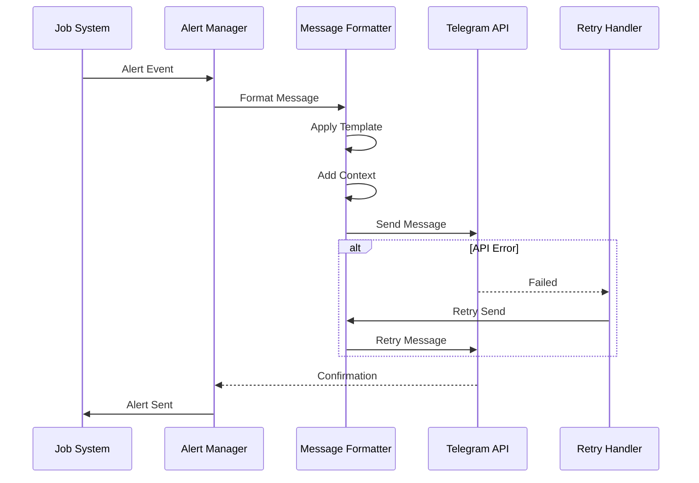
```mermaid
sequenceDiagram
    participant Job as Job System
    participant Alert as Alert Manager
    participant Format as Message Formatter
    participant Telegram as Telegram API
    participant Retry as Retry Handler

    Job->>Alert: Alert Event
    Alert->>Format: Format Message

    Format->>Format: Apply Template
    Format->>Format: Add Context

    Format->>Telegram: Send Message

    alt API Error
        Telegram-->>Retry: Failed
        Retry->>Format: Retry Send
        Format->>Telegram: Retry Message
    end

    Telegram-->>Alert: Confirmation
    Alert->>Job: Alert Sent
```

#### A. Message Templates

```typescript
interface AlertTemplate {
  jobFailure: {
    title: 'Job Failure Alert';
    content: `
🔴 Job Failed: {jobName}
Time: {timestamp}
Duration: {duration}
Error: {errorMessage}
Stack: {errorStack}
Retry Count: {retryCount}
`;
  };
  longRunning: {
    title: 'Long Running Job Alert';
    content: `
⚠️ Long Running Job: {jobName}
Started: {startTime}
Current Duration: {duration}
Status: {status}
Progress: {progress}%
`;
  };
  resourceWarning: {
    title: 'Resource Warning';
    content: `
⚠️ Resource Warning
Job: {jobName}
Resource: {resourceType}
Usage: {currentUsage}
Threshold: {threshold}
`;
  };
  jobSuccess: {
    title: 'Job Completed';
    content: `
✅ Job Completed: {jobName}
Duration: {duration}
Records Processed: {recordCount}
Status: Success
`;
  };
}
```

### 6. Monitoring Dashboard

```mermaid
flowchart TD
    subgraph Real-time Monitoring
        RT1[Active Jobs]
        RT2[Queue Status]
        RT3[Resource Usage]
        RT4[Error Rate]
    end

    subgraph Historical Analysis
        H1[Job History]
        H2[Performance Trends]
        H3[Error Patterns]
        H4[Resource Trends]
    end

    subgraph Alert Management
        A1[Active Alerts]
        A2[Alert History]
        A3[Alert Configuration]
        A4[Channel Status]
    end
```

### 7. Implementation Strategy

#### A. Event Collection

- Use BullMQ events for job lifecycle
- Implement custom event emitters for detailed tracking
- Store events in time-series database
- Maintain event correlation

#### B. Metric Processing

- Collect metrics at regular intervals
- Aggregate data for trending analysis
- Calculate moving averages
- Set dynamic thresholds

#### C. Alert Handling

- Implement alert debouncing
- Support alert acknowledgment
- Maintain alert escalation rules
- Track alert resolution

### 8. Best Practices

#### A. Monitoring Guidelines

- Set appropriate thresholds based on historical data
- Implement gradual alert escalation
- Maintain alert context and correlation
- Regular review of alert patterns

#### B. Alert Management

- Define clear severity levels
- Implement alert aggregation
- Maintain on-call schedules
- Document response procedures

#### C. Performance Optimization

- Regular metric cleanup
- Efficient data aggregation
- Optimize alert processing
- Monitor monitoring system impact

Would you like me to:

1. Add more details about specific monitoring metrics?
2. Elaborate on the alert handling mechanisms?
3. Add more examples of Telegram alert templates?
4. Include additional dashboard components?

## Implementation Guidelines

### 1. Project Structure

```mermaid
flowchart TD
    subgraph Core Components
        C1[Job Definitions]
        C2[Queue Management]
        C3[Worker Management]
        C4[Cache Management]
    end

    subgraph Service Layer
        S1[Job Service]
        S2[Cache Service]
        S3[Monitor Service]
        S4[Alert Service]
    end

    subgraph Infrastructure
        I1[Redis Master/Replica]
        I2[PostgreSQL]
        I3[BullMQ]
        I4[Time Series DB]
    end

    C1 --> S1
    C2 --> S1
    C3 --> S1
    C4 --> S2

    S1 --> I1 & I2 & I3
    S2 --> I1
    S3 --> I4
    S4 --> External[External Services]
```

### 2. Implementation Phases

```mermaid
gantt
    title Implementation Roadmap
    dateFormat  YYYY-MM-DD
    section Phase 1
    Core Infrastructure Setup :2024-01-01, 14d
    Basic Job System       :10d
    Redis Configuration   :7d
    section Phase 2
    Job Categories Implementation :2024-01-15, 21d
    Meta Jobs            :7d
    Event Jobs          :7d
    Tournament Jobs     :7d
    section Phase 3
    Monitoring System    :2024-02-05, 14d
    Alert Integration   :7d
    Dashboard Setup     :7d
    section Phase 4
    Testing & Optimization :2024-02-19, 14d
    Load Testing       :7d
    Performance Tuning :7d
```

### 3. Development Checklist

#### A. Infrastructure Setup

- [ ] Configure Redis Master-Replica
- [ ] Set up PostgreSQL with proper indexes
- [ ] Configure BullMQ queues
- [ ] Set up monitoring infrastructure

#### B. Core Components

- [ ] Implement job definitions
- [ ] Set up queue management
- [ ] Configure worker pools
- [ ] Implement cache management

#### C. Service Layer

- [ ] Develop job service
- [ ] Implement cache service
- [ ] Create monitoring service
- [ ] Set up alert service

#### D. Testing & Validation

- [ ] Unit tests for core components
- [ ] Integration tests for services
- [ ] Load testing for job system
- [ ] End-to-end system testing

### 4. Key Considerations

```mermaid
mindmap
    root((Implementation))
        Scalability
            Worker Pool Sizing
            Queue Management
            Cache Distribution
        Reliability
            Error Handling
            Retry Strategies
            Data Consistency
        Monitoring
            Metrics Collection
            Alert Management
            Performance Tracking
        Maintenance
            Backup Strategy
            Update Procedures
            Health Checks
```

### 5. Technical Requirements

#### A. Infrastructure

```typescript
interface InfrastructureRequirements {
  redis: {
    version: '>=6.2.0';
    replication: true;
    persistence: 'RDB and AOF';
    memory: '>=8GB';
  };
  postgresql: {
    version: '>=14.0';
    extensions: ['pg_notify', 'timescaledb'];
    replication: 'optional';
  };
  nodejs: {
    version: '>=18.0.0';
    memory: '>=4GB';
    clustering: true;
  };
}
```

#### B. Dependencies

```typescript
interface CoreDependencies {
  bullmq: '^3.x.x';
  ioredis: '^5.x.x';
  pg: '^8.x.x';
  typescript: '^4.x.x';
  monitoring: {
    prometheus: '^1.x.x';
    grafana: 'latest';
  };
}
```

### 6. Deployment Strategy

```mermaid
flowchart LR
    subgraph Development
        D1[Local Dev]
        D2[Testing]
        D3[Staging]
    end

    subgraph Production
        P1[Blue Deploy]
        P2[Green Deploy]
        P3[Monitoring]
    end

    D1 --> D2
    D2 --> D3
    D3 --> P1
    D3 --> P2
    P1 & P2 --> P3
```

### 7. Performance Benchmarks

#### A. Job Processing

- Meta Jobs: < 5s processing time
- Live Updates: < 2s latency
- Batch Jobs: Process 1000 records/minute

#### B. Cache Performance

- Read Operations: < 10ms
- Write Operations: < 50ms
- Cache Hit Rate: > 90%

#### C. System Metrics

- CPU Usage: < 70%
- Memory Usage: < 80%
- Error Rate: < 1%

### 8. Maintenance Procedures

#### A. Regular Maintenance

- Daily health checks
- Weekly performance review
- Monthly system optimization

#### B. Emergency Procedures

- System recovery steps
- Data consistency checks
- Alert escalation paths

### 9. Documentation Requirements

#### A. Technical Documentation

- System architecture
- API documentation
- Configuration guide
- Troubleshooting guide

#### B. Operational Documentation

- Monitoring guide
- Alert handling procedures
- Maintenance procedures
- Emergency response plan
