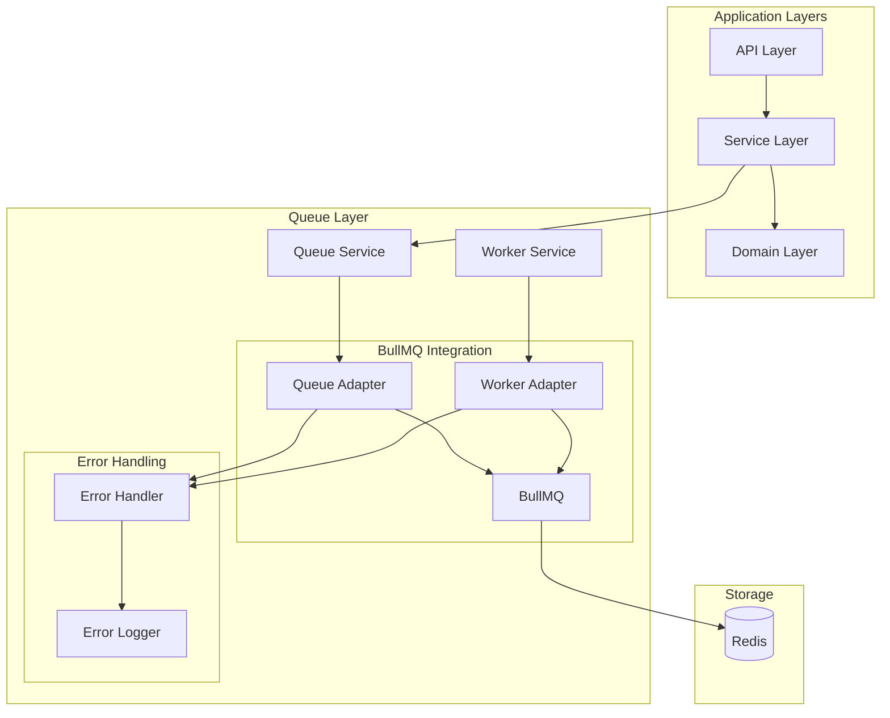
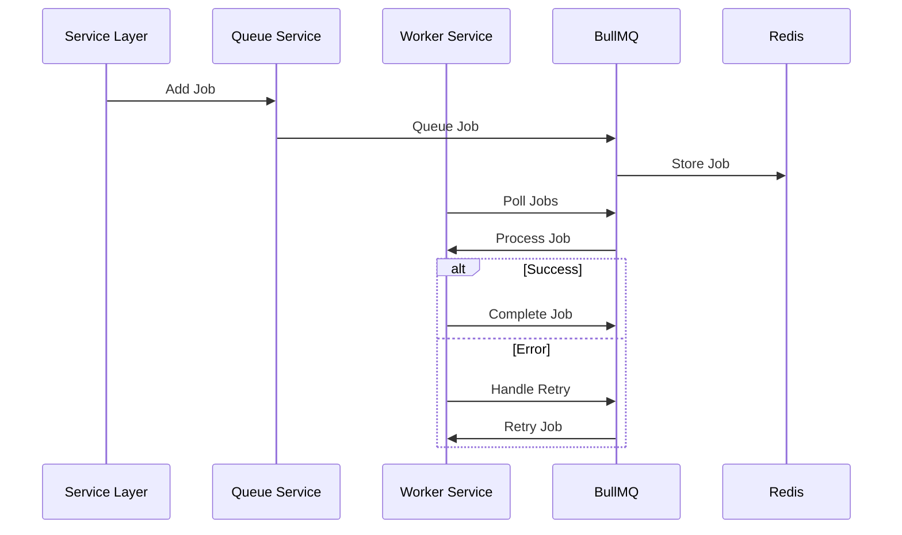
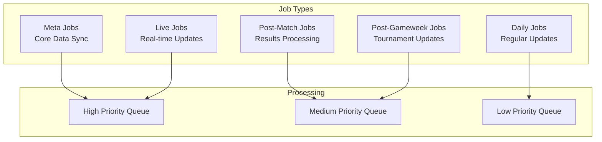
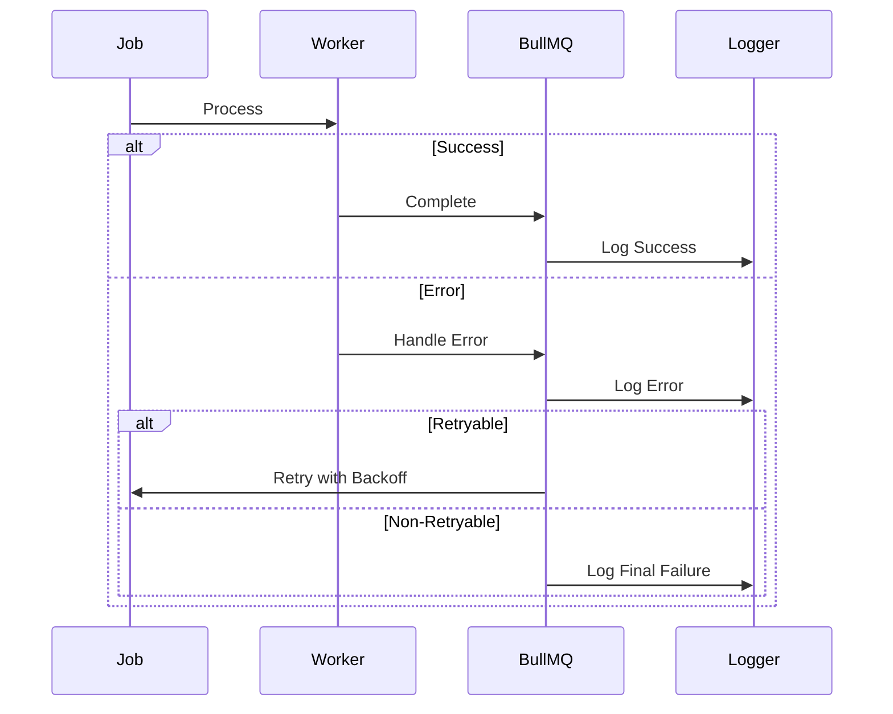

# Queue Layer Design

## Overview

The Queue Layer provides job scheduling and processing capabilities for the FPL data system, leveraging BullMQ's robust features while maintaining type safety and functional programming principles.

## System Integration Overview

## Core Components

### 1. Queue Layer Components

- **Queue Service**: Simplified job management using BullMQ's native features
- **Worker Service**: Streamlined job processing with built-in error handling
- **Error Handler**: Essential error management with functional approach
- **Job Processors**: Type-safe job processing implementations

### 2. BullMQ Integration

- Leverages BullMQ's built-in features for:
  - Queue management
  - Job scheduling
  - Worker processing
  - Error handling and retries
  - Event management

## Job Processing Flow

## Job Categories

## Error Handling Strategy

## Implementation Guidelines

### 1. Functional Programming

- Use TaskEither for operations
- Maintain immutability
- Leverage BullMQ's promise-based API with fp-ts

### 2. Type Safety

- Strong typing for job data
- Type-safe queue operations
- Comprehensive error types

### 3. Error Handling

- Utilize BullMQ's built-in retry mechanisms
- Functional error handling with TaskEither
- Structured logging

### 4. Performance

- Efficient queue configuration
- Optimal concurrency settings
- Resource-aware job processing

## Monitoring

### Key Metrics

1. **Queue Metrics**

   - Queue length
   - Processing time
   - Success/failure rates

2. **Worker Metrics**

   - Active workers
   - Job completion rate
   - Error distribution

3. **System Health**
   - Redis connection status
   - Memory usage
   - Job backlog
