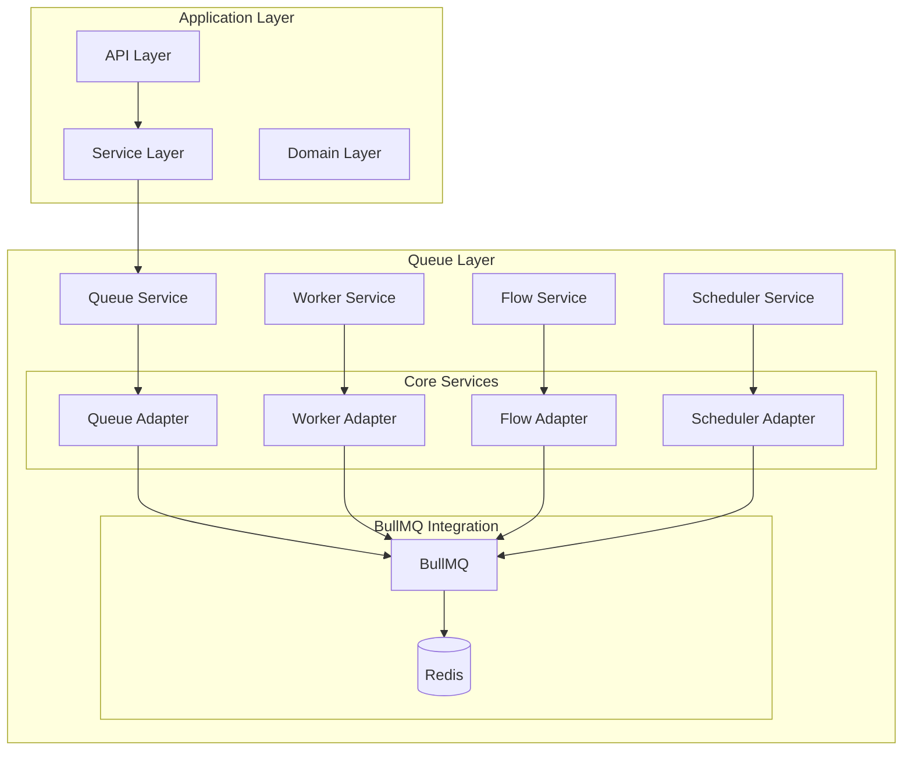
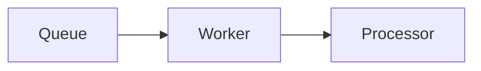
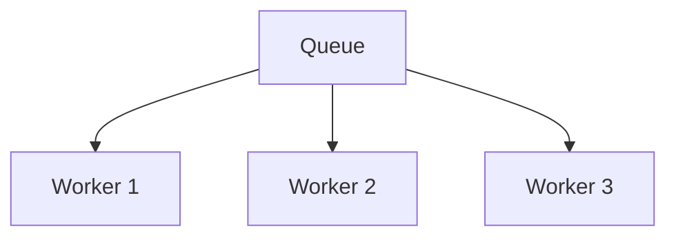
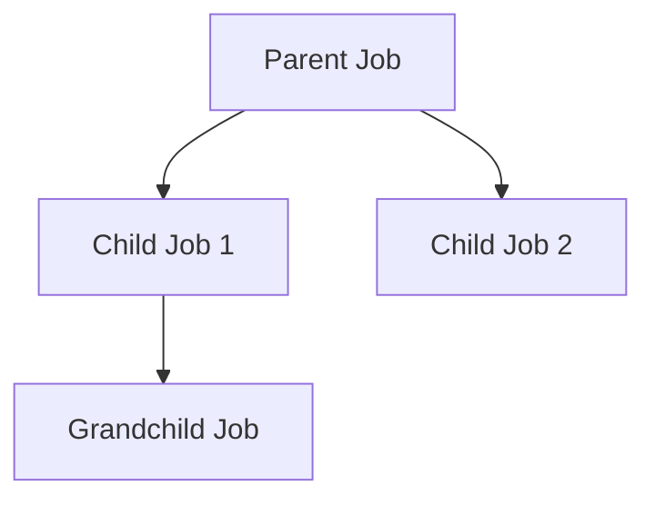
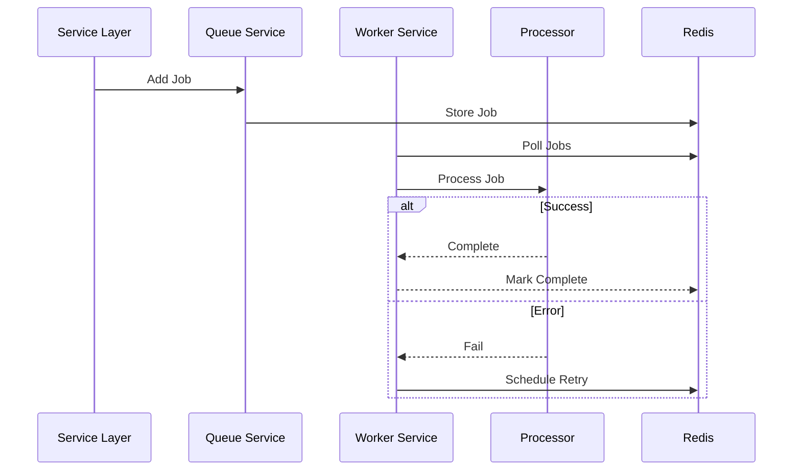
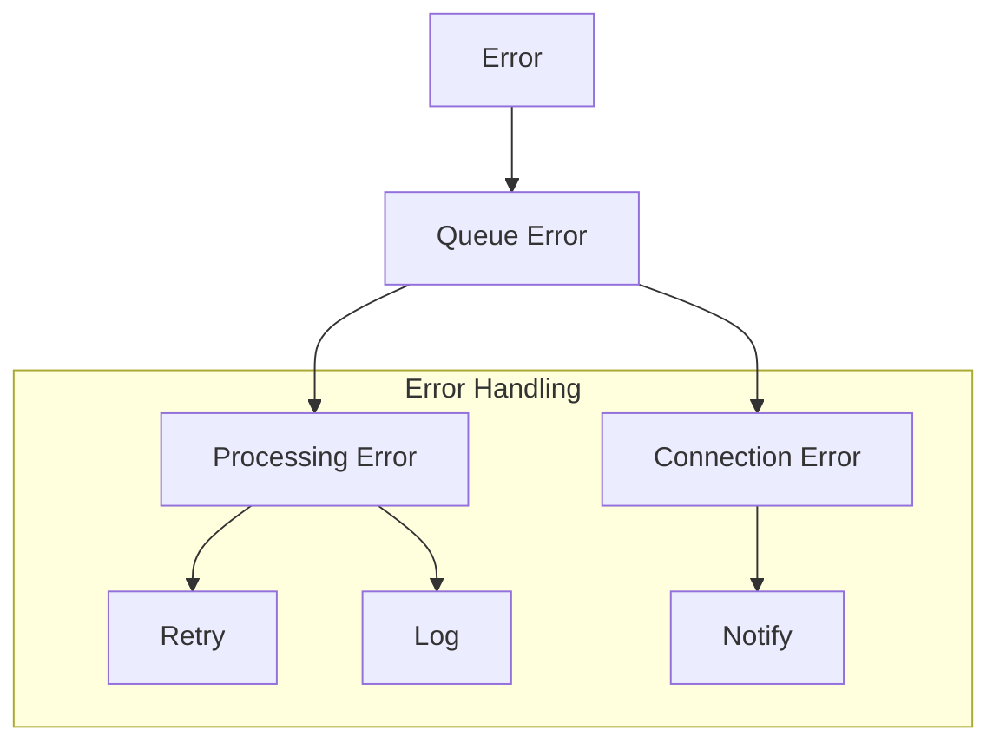
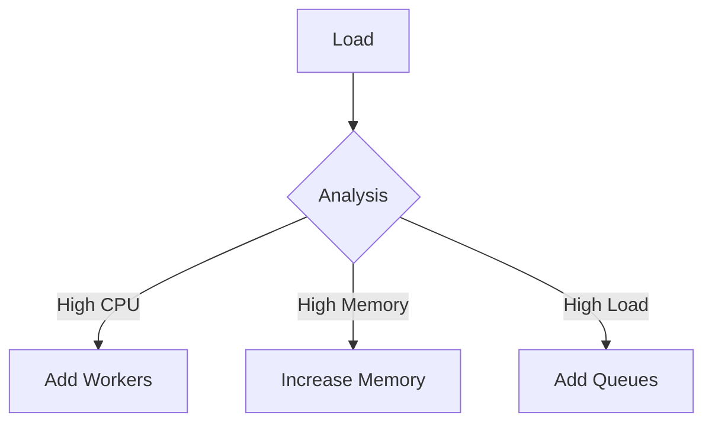
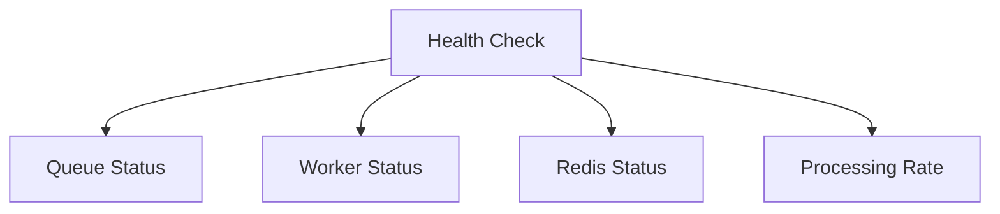

# Queue Layer Design

## Overview

The Queue Layer provides job scheduling and processing capabilities for the FPL data system, leveraging BullMQ's robust features while maintaining type safety and functional programming principles using fp-ts.

## System Architecture



## Core Components

### 1. Queue Layer Services

- **Queue Service**: Job management and scheduling
- **Worker Service**: Job processing and concurrency control
- **Flow Service**: Job flow and dependency management
- **Scheduler Service**: Recurring job scheduling

### 2. Job Types

```typescript
type JobType = 'META' | 'LIVE' | 'DAILY';
type JobOperation = 'SYNC' | 'UPDATE' | 'CLEANUP';
type MetaJobType = 'EVENTS' | 'PHASES' | 'TEAMS';

interface BaseJobData {
  readonly type: string;
  readonly timestamp: Date;
  readonly data: unknown;
}
```

## Queue Processing Patterns

### 1. Single Queue-Single Worker (1:1)



### 2. Single Queue-Multiple Workers (1:N)



### 3. Job Flow Pattern



## Service Interfaces

### 1. Queue Service

```typescript
interface QueueService<T> {
  addJob: (data: T, options?: JobOptions) => TaskEither<QueueError, void>;
  addBulk: (jobs: Array<{ data: T; options?: JobOptions }>) => TaskEither<QueueError, void>;
  removeJob: (jobId: string) => TaskEither<QueueError, void>;
  drain: () => TaskEither<QueueError, void>;
  pause: () => TaskEither<QueueError, void>;
  resume: () => TaskEither<QueueError, void>;
}
```

### 2. Worker Service

```typescript
interface WorkerService<T> {
  start: () => TaskEither<QueueError, void>;
  stop: () => TaskEither<QueueError, void>;
  pause: (force?: boolean) => TaskEither<QueueError, void>;
  resume: () => TaskEither<QueueError, void>;
  setConcurrency: (concurrency: number) => void;
}
```

### 3. Flow Service

```typescript
interface FlowService<T> {
  getFlowDependencies: (jobId: string) => TaskEither<QueueError, FlowJob<T>[]>;
  getChildrenValues: (jobId: string) => TaskEither<QueueError, Record<string, unknown>>;
  addJob: (data: T, opts?: FlowOpts<T>) => TaskEither<QueueError, FlowJob<T>>;
}
```

### 4. Scheduler Service

```typescript
interface SchedulerService<T> {
  upsertJobScheduler: (
    schedulerId: string,
    scheduleOptions: JobSchedulerOptions,
    template?: JobTemplate<T>,
  ) => TaskEither<QueueError, void>;
  getJobSchedulers: (options?: {
    page?: number;
    pageSize?: number;
  }) => TaskEither<QueueError, JobScheduler[]>;
}
```

## Job Processing Flow



## Error Handling Strategy

### 1. Error Types

```typescript
type QueueErrorCode =
  | 'QUEUE_CONNECTION_ERROR'
  | 'JOB_PROCESSING_ERROR'
  | 'QUEUE_OPERATION_ERROR'
  | 'WORKER_ERROR';
```

### 2. Error Flow



## Performance Considerations

### 1. Resource Management

- Connection pooling
- Worker concurrency
- Memory limits
- Rate limiting

### 2. Scaling Strategy



## Monitoring and Metrics

### 1. Key Metrics

- Queue length
- Processing time
- Error rates
- Worker status

### 2. Health Checks



## Implementation Guidelines

### 1. Type Safety

- Use branded types
- Validate job data
- Type-safe processors
- Error type checking

### 2. Functional Programming

- Use TaskEither for operations
- Pure job processors
- Immutable job data
- Composition with fp-ts

### 3. Testing Strategy

- Unit test processors
- Integration test flows
- Mock Redis for tests
- Test error scenarios
