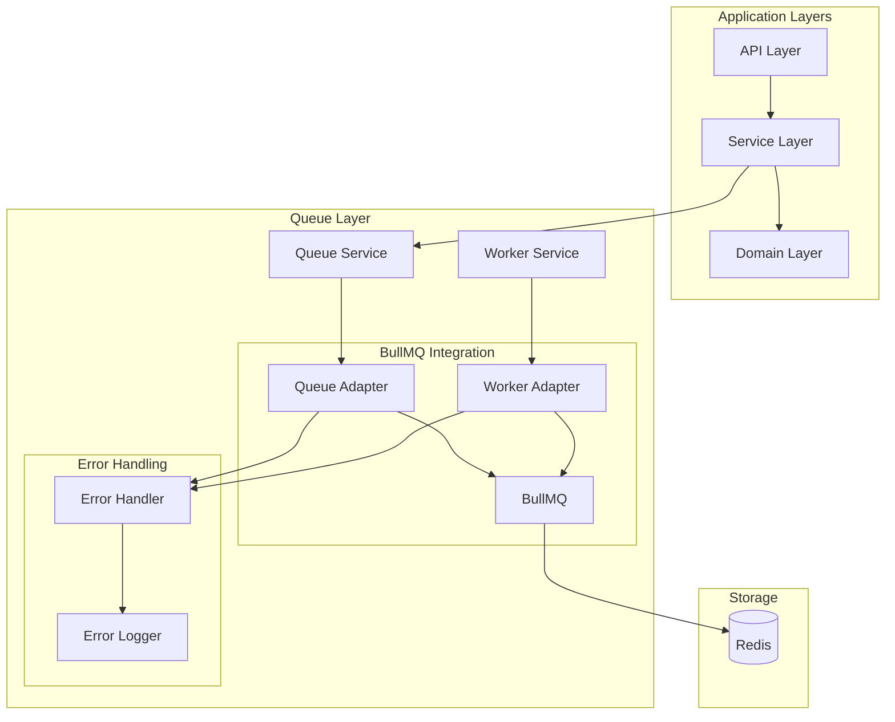
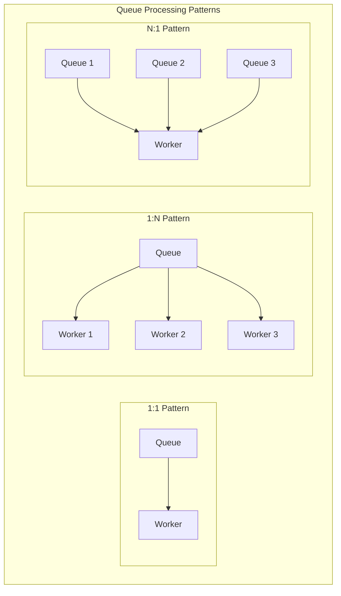
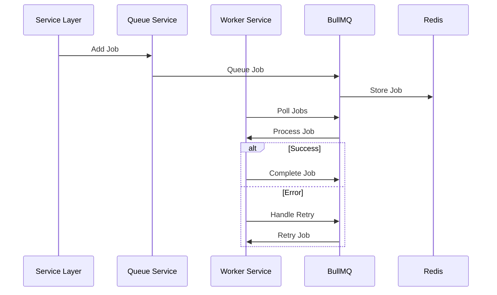
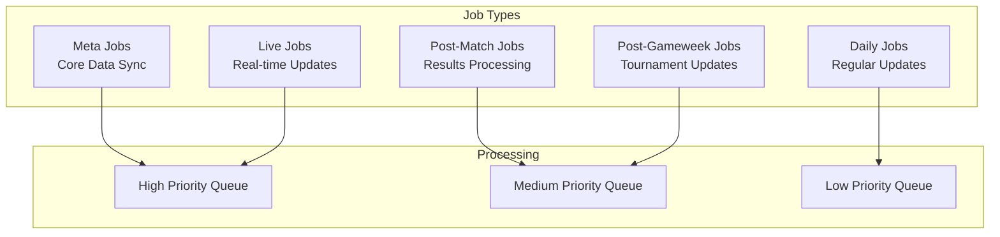

# Queue Layer Design

## Overview

The Queue Layer provides job scheduling and processing capabilities for the FPL data system, leveraging BullMQ's robust features while maintaining type safety and functional programming principles.

## System Integration Overview

## Core Components

### 1. Queue Layer Components

- **Queue Service**: Simplified job management using BullMQ's native features
- **Worker Service**: Streamlined job processing with built-in error handling
- **Error Handler**: Essential error management with functional approach
- **Job Processors**: Type-safe job processing implementations

### 2. BullMQ Integration

- Leverages BullMQ's built-in features for:
  - Queue management
  - Job scheduling
  - Worker processing
  - Error handling and retries
  - Event management

## Queue Processing Patterns

### 1. Single Queue-Single Worker (1:1)

- Basic pattern for independent job types
- Each queue has its dedicated worker
- Used for simple, isolated job processing
- Best for jobs that need dedicated resources

### 2. Single Queue-Multiple Workers (1:N)

- For I/O intensive operations
- Multiple workers process jobs from one queue
- Enables parallel processing and better resource utilization
- Example use cases:
  - Heavy data processing
  - Batch operations
  - Network-intensive tasks
  - Large-scale data synchronization

### 3. Multiple Queues-Single Worker (N:1)

- For sequential processing requirements
- One worker handles multiple queues
- Ensures ordered processing across related operations
- Example use cases:
  - Data validation → transformation → persistence
  - Sequential workflow steps
  - Dependencies between jobs

## Job Processing Flow

## Job Categories

## Implementation Considerations

### 1. Resource Management

- CPU/Memory allocation per worker
- I/O capacity planning
- Redis connection pooling
- Worker concurrency settings

### 2. Job Priority Management

- Queue priority levels
- Job priority within queues
- Resource allocation based on priority
- Handling priority conflicts

### 3. Scaling Strategies

- When to use each pattern
- Monitoring and metrics
- Dynamic scaling based on load
- Resource limits and constraints

### 4. Error Handling Strategy

- Retry mechanisms
- Error logging and monitoring
- Circuit breakers
- Fallback strategies

### 5. Performance Optimization

- Queue configuration tuning
- Worker pool management
- Job batching strategies
- Memory management

## Monitoring

### Key Metrics

1. **Queue Metrics**

   - Queue length
   - Processing time
   - Success/failure rates
   - Job distribution

2. **Worker Metrics**

   - Active workers
   - Job completion rate
   - Error distribution
   - Resource utilization

3. **System Health**
   - Redis connection status
   - Memory usage
   - Job backlog
   - System load

## Implementation Guidelines

### 1. Functional Programming

- Use TaskEither for operations
- Maintain immutability
- Leverage BullMQ's promise-based API with fp-ts

### 2. Type Safety

- Strong typing for job data
- Type-safe queue operations
- Comprehensive error types

### 3. Error Handling

- Utilize BullMQ's built-in retry mechanisms
- Functional error handling with TaskEither
- Structured logging

### 4. Performance

- Efficient queue configuration
- Optimal concurrency settings
- Resource-aware job processing
