# Queue Layer Design

## Overview

The Queue Layer provides job scheduling and processing capabilities for the FPL data system, handling various types of jobs from real-time updates to scheduled tasks.

## System Integration Overview

## Core Components

### 1. Infrastructure Layer

- **Queue Adapter**: BullMQ integration and queue operations
- **Worker Adapter**: Job processing and worker management
- **Scheduler Adapter**: Cron-based job scheduling
- **Error Handler**: Comprehensive error management
- **Redis Manager**: Key and TTL management
- **Cleanup Manager**: Automated cleanup operations and state management
- **Recovery Manager**: System resilience and recovery procedures

### 2. Queue Services

- **Queue Service**: Job lifecycle and scheduling
- **Worker Service**: Job execution and monitoring
- **Scheduler Service**: Job timing and recurrence
- **Maintenance Service**: Cleanup and recovery orchestration

## System Resilience

### Cleanup Integration

1. **Automated Cleanup**

   - Job state monitoring and cleanup triggers
   - TTL-based key expiration
   - Stale worker detection and cleanup
   - Memory optimization routines

2. **State Management**
   - Job state transitions with cleanup hooks
   - Worker state tracking with auto-recovery
   - Redis key lifecycle management

### Recovery Integration

1. **Health Monitoring**

   - Continuous system health checks
   - Worker heartbeat monitoring
   - Redis connection state tracking
   - Job progress verification

2. **Automatic Recovery**
   - Worker failure detection and restart
   - Job state recovery and reprocessing
   - Redis connection management
   - System state reconciliation

## Job Categories

### Job Scheduling Patterns

1. **Meta Jobs**

   - Daily core data synchronization
   - Early morning execution (6:35 AM UTC)
   - High priority, max retries: 5

2. **Live Jobs**

   - Real-time match updates
   - 1-minute intervals during matches
   - High priority, quick retries

3. **Post-Match Jobs**

   - Result processing after matches
   - Dependent on match completion
   - Medium priority

4. **Post-Gameweek Jobs**

   - Tournament and league updates
   - After gameweek completion
   - Medium priority

5. **Daily Jobs**
   - Regular maintenance tasks
   - Fixed daily schedule
   - Lower priority

## Error Handling Strategy

```mermaid
sequenceDiagram
    participant Job
    participant Handler
    participant Logger
    participant Retry

    Job->>Handler: Execute
    alt Success
        Handler->>Logger: Log Success
    else Error
        Handler->>Logger: Log Error
        alt Retryable
            Handler->>Retry: Apply Strategy
            Retry->>Job: Retry
        else Non-Retryable
            Handler->>Logger: Log Final Failure
        end
    end
```

### Error Categories

1. **Transient Errors**

   - Network issues
   - Redis timeouts
   - Strategy: Exponential backoff

2. **Validation Errors**

   - Invalid job data
   - Configuration issues
   - Strategy: No retry

3. **System Errors**
   - Resource exhaustion
   - Worker crashes
   - Strategy: Retry with delay

## Redis Management

### Key Structure

- Environment-based prefixing
- Category-based organization
- Job-specific identifiers

### TTL Strategy

1. **Short-lived Keys**

   - Live match data: 1 hour
   - Temporary states: 30 minutes

2. **Medium-lived Keys**

   - Match results: 12 hours
   - Daily updates: 24 hours

3. **Long-lived Keys**
   - Historical data: 7 days
   - Error logs: 30 days

## Monitoring and Metrics

### Key Metrics

1. **Performance Metrics**

   - Job processing time
   - Queue length
   - Worker utilization

2. **Error Metrics**

   - Failure rates
   - Retry counts
   - Error types distribution

3. **System Metrics**
   - Redis memory usage
   - Connection status
   - Worker health

## Implementation Guidelines

### 1. Functional Programming

- Use TaskEither for operations
- Maintain immutability
- Pure function composition

### 2. Error Handling

- Comprehensive error types
- Structured logging
- Retry strategies

### 3. Performance

- Efficient Redis usage
- Worker pool management
- Resource optimization
