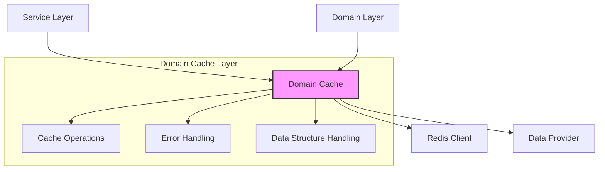
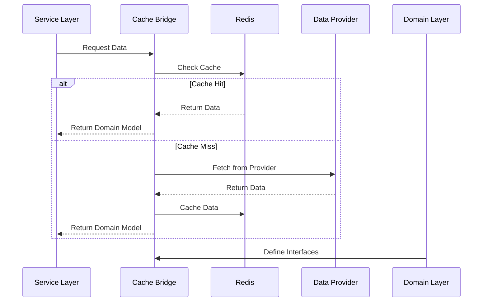

# Redis Cache Design

## 1. Overview

### 1.1 Purpose

This document outlines the Redis caching strategy for the LetLetMe Data project, focusing on domain-driven caching with support for multiple Redis data structures while following functional programming principles.

### 1.2 Design Goals

- Domain-driven cache design
- Support for multiple Redis data structures (Hash, Sorted Set, String)
- Direct domain model storage without persistence type transformations
- Type-safe operations with fp-ts
- Graceful fallback to data providers
- Clear error handling with TaskEither
- Bridge between service and domain layers

### 1.3 Integration Philosophy

- Domain-specific cache implementations
- Flexible data structure choice per domain
- Zero transformation between cache and domain models
- Type-safe operations
- Explicit error handling
- Cache as a bridge between service and domain layers

## 2. Architecture

### 2.1 High-Level Structure



### 2.2 Design Patterns

#### Bridge Pattern Implementation

The cache layer implements the Bridge Pattern to decouple the abstraction (domain interfaces) from implementation (service layer):

```typescript
// Abstraction (Domain Layer)
interface DomainCache<T> {
  readonly getItem: (id: string) => TE.TaskEither<CacheError, T | null>;
  // ... other methods
}

// Implementation (Service Layer)
interface DataProvider<T> {
  readonly getOne: (id: string) => Promise<T | null>;
  // ... other methods
}

// Bridge (Cache Layer)
const createDomainCache = <T>(
  redis: RedisCache<T>,
  dataProvider: DataProvider<T>,
  config: CacheConfig,
): DomainCache<T> => {
  // Implementation connecting domain and service layers
};
```

Benefits:

- Decouples domain abstractions from service implementations
- Allows both sides to vary independently
- Maintains clean architecture principles
- Provides type-safe operations

#### Mediator Pattern Aspects

The cache layer also acts as a mediator:

- Centralizes data flow between service and domain layers
- Manages caching logic and data provider fallback
- Handles transformations and error mapping
- Reduces direct dependencies between components

### 2.3 Cache Flow



### 2.2 Cache Configuration

```typescript
interface CacheConfig {
  dataStructure: RedisDataStructure;
  keyPrefix: string;
}

enum RedisDataStructure {
  STRING = 'string',
  HASH = 'hash',
  SORTED_SET = 'sorted_set',
}

// Domain-specific cache configuration
const config: CacheConfig = {
  dataStructure: RedisDataStructure.HASH,
  keyPrefix: 'domain-prefix',
};
```

## 3. Core Components

### 3.1 Domain Cache Interface

```typescript
interface DomainCache<T> {
  readonly cacheItem: (item: T) => TE.TaskEither<CacheError, void>;
  readonly getItem: (id: string) => TE.TaskEither<CacheError, T | null>;
  readonly cacheItems: (items: readonly T[]) => TE.TaskEither<CacheError, void>;
  readonly getAllItems: () => TE.TaskEither<CacheError, readonly T[]>;
  readonly warmUp: () => TE.TaskEither<CacheError, void>;
}
```

### 3.2 Data Provider Interface

```typescript
interface DataProvider<T> {
  readonly getOne: (id: string) => Promise<T | null>;
  readonly getAll: () => Promise<readonly T[]>;
}
```

### 3.3 Cache Operations

```typescript
const createDomainCache = <T>(
  redis: RedisCache<T>,
  dataProvider: DataProvider<T>,
  config: CacheConfig,
): DomainCache<T> => {
  const cacheItem = (item: T): TE.TaskEither<CacheError, void> => {
    switch (config.dataStructure) {
      case RedisDataStructure.HASH:
        return redis.hSet(makeKey(), item.id.toString(), item);
      case RedisDataStructure.SORTED_SET:
        return redis.zAdd(makeKey(), Number(item.id), item);
      case RedisDataStructure.STRING:
        return redis.set(makeKey(item.id), item);
    }
  };

  // ... other operations
};
```

## 4. Implementation Guidelines

### 4.1 Data Structure Selection

- **Hash**: For collections with frequent individual item access
- **Sorted Set**: For ordered collections with range queries
- **String**: For simple key-value storage

### 4.2 Key Patterns

- Hash: `{domain}` for key, `{id}` for field
- Sorted Set: `{domain}` for key, score based on id
- String: `{domain}:{id}` for each item

### 4.3 Error Handling

```typescript
type CacheError = {
  readonly type: CacheErrorType;
  readonly message: string;
};

enum CacheErrorType {
  CONNECTION = 'CONNECTION',
  OPERATION = 'OPERATION',
}
```

## 5. Best Practices

### 5.1 Domain Model Storage

- Store domain models directly
- Avoid persistence type transformations
- Use consistent serialization/deserialization

### 5.2 Cache Operations

- Implement write-through caching
- Provide bulk operations
- Support cache warming
- Handle cache misses gracefully

### 5.3 Type Safety

- Use generic types for domain models
- Leverage fp-ts for functional operations
- Ensure type-safe data structure operations

## 6. Testing Strategy

### 6.1 Unit Tests

- Test each data structure operation
- Verify cache miss handling
- Test bulk operations
- Validate error scenarios

### 6.2 Integration Tests

- Test with actual Redis instance
- Verify data provider fallback
- Test concurrent operations
- Measure performance

## 7. Monitoring

### 7.1 Key Metrics

- Cache hit/miss rates per data structure
- Operation latency
- Memory usage
- Error rates

### 7.2 Health Checks

- Redis connection status
- Data structure integrity
- Memory thresholds
- Error patterns

## 8. Security

- Redis authentication
- Network isolation
- Resource limits
- Error exposure control

## 9. Future Considerations

- Additional data structures support
- Performance optimizations
- Monitoring enhancements
- Scaling strategies
- TTL policies per domain
