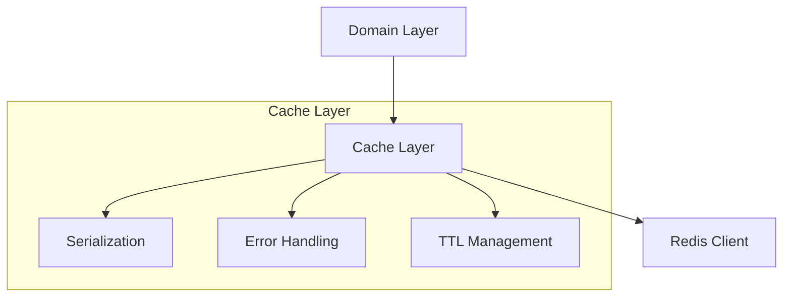
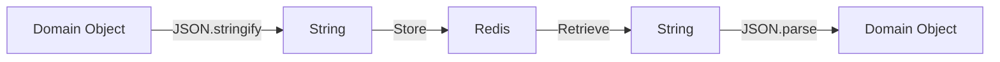

## 1. Overview

### 1.1 Purpose

This document outlines the Redis caching strategy for the LetLetMe Data project, focusing on simple key-value storage while following functional programming principles.

### 1.2 Design Goals

- Maximize Redis's key-value nature
- Minimize transformations and complexity
- Ensure type safety
- Optimize performance
- Handle failures gracefully

### 1.3 Integration Philosophy

- Direct domain model storage
- Minimal transformations
- Type-safe operations
- Clear error handling

## 2. Architecture

### 2.1 High-Level Structure



### 2.2 Data Storage Strategy

```typescript
// Simple cache wrapper
interface CacheWrapper<T> {
  readonly value: T;
  readonly timestamp: number;
}

// Generic cache operations
interface RedisCache<T> {
  set(key: string, value: T): TE.TaskEither<CacheError, void>;
  get(key: string): TE.TaskEither<CacheError, T | null>;
  del(key: string): TE.TaskEither<CacheError, void>;
}

// Example usage with domain model
const phaseCache: RedisCache<Phase> = {
  set: (key, phase) =>
    pipe({ value: phase, timestamp: Date.now() }, JSON.stringify, (data) =>
      redis.set(`phase:${key}`, data),
    ),
  get: (key) =>
    pipe(
      redis.get(`phase:${key}`),
      TE.chain((data) =>
        data
          ? TE.tryCatch(
              () => JSON.parse(data).value,
              (e) => new CacheError('Failed to parse data'),
            )
          : TE.of(null),
      ),
    ),
  del: (key) => redis.del(`phase:${key}`),
};
```

### 2.3 Cache Flow



## 3. Core Components

### 3.1 Cache Configuration

- TTL Strategy
  - Simple time-based expiration
  - No complex invalidation patterns
  - Clear key prefixes per domain

### 3.2 Basic Cache Operations

```typescript
// Simple, direct operations
const createCache = <T>(prefix: string): RedisCache<T> => ({
  set: (key, value) =>
    pipe({ value, timestamp: Date.now() }, JSON.stringify, (data) =>
      redis.set(`${prefix}:${key}`, data),
    ),
  get: (key) =>
    pipe(
      redis.get(`${prefix}:${key}`),
      TE.chain((data) =>
        data
          ? TE.tryCatch(
              () => JSON.parse(data).value,
              (e) => new CacheError('Parse error'),
            )
          : TE.of(null),
      ),
    ),
  del: (key) => redis.del(`${prefix}:${key}`),
});
```

### 3.3 Error Handling

```typescript
type CacheError = {
  readonly message: string;
  readonly cause?: unknown;
};

const handleCacheError = (error: CacheError): TE.TaskEither<CacheError, never> =>
  pipe(
    TE.left(error),
    TE.tap(() => TE.fromIO(logger.error({ message: error.message, error: error.cause }))),
  );
```

## 4. Implementation Guidelines

### 4.1 Best Practices

- Store domain models directly
- Use simple key patterns
- Minimize transformations
- Handle errors gracefully
- Clear TTL strategy

### 4.2 Key Patterns

- Simple domain prefixes: `{domain}:{id}`
- No complex related keys
- Clear naming conventions

### 4.3 Testing Strategy

- Unit test cache operations
- Test error handling
- Verify serialization/deserialization
- Monitor performance

## 5. Monitoring

### 5.1 Key Metrics

- Hit/miss rates
- Error rates
- Response times
- Memory usage

### 5.2 Health Checks

- Connection status
- Memory usage
- Error rates
- Response times

## 6. Security

- Redis authentication
- Network security
- Resource limits
- Error handling

## 7. Future Considerations

- Performance optimization
- Monitoring improvements
- Scaling strategies
- Additional domain support
