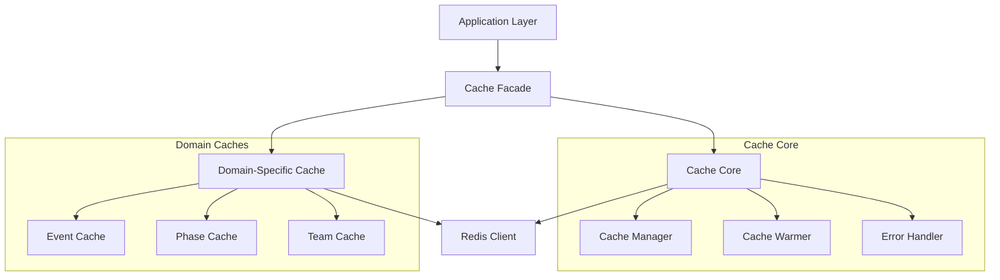
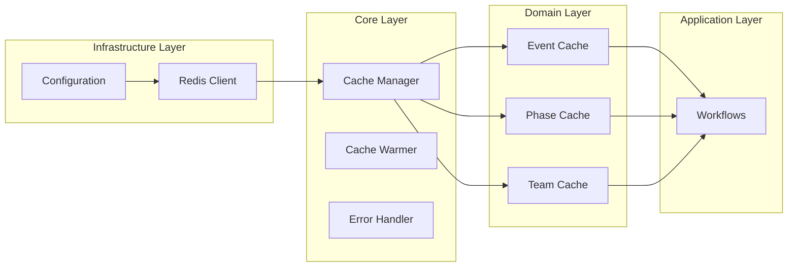
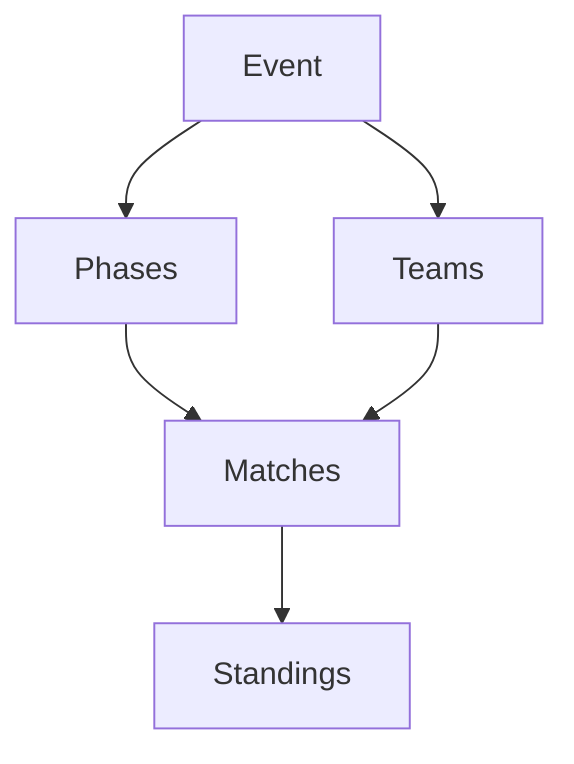
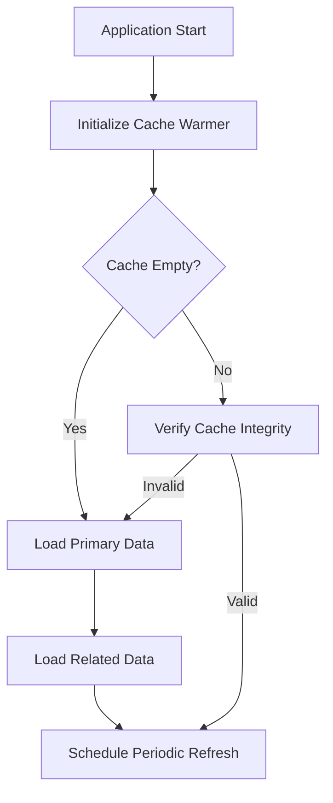
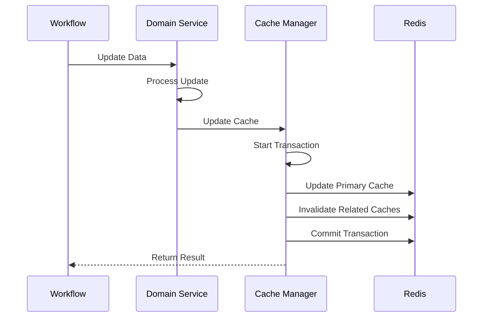
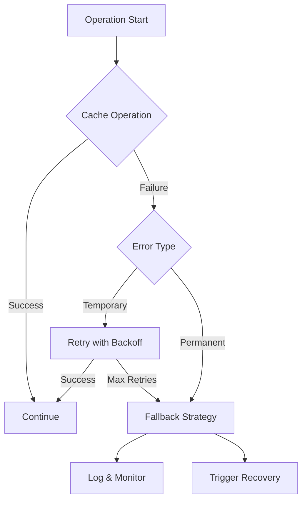
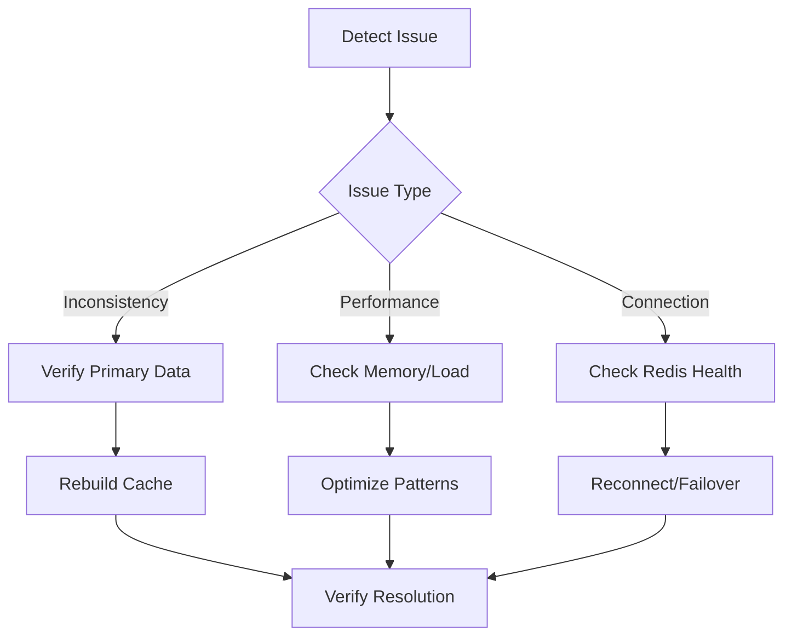

## 1. Overview

### 1.1 Purpose

This document outlines the Redis caching strategy for the LetLetMe Data project, following Domain-Driven Design (DDD) and Functional Programming (FP) principles.

### 1.2 Design Goals

- Ensure data consistency across cache and database
- Optimize performance for frequently accessed data
- Handle failures gracefully
- Support cache warming and recovery
- Maintain separation of concerns
- Follow functional programming paradigms

### 1.3 Integration Philosophy

- Seamless integration with existing workflows
- Functional programming approach using TaskEither
- Error handling with proper type safety
- Domain-driven design principles
- Clear separation of infrastructure and domain logic

## 2. Architecture

### 2.1 High-Level Structure



### 2.2 Logical Architecture



## 3. Core Components

### 3.1 Cache Configuration

- TTL Strategies

  - Metadata (events, phases, teams): 30 days
  - Derived data: 24 hours
  - Temporary data: Configurable short-term

- Key Patterns

  - Primary keys: `{domain}:{id}`
  - Related keys: `{domain}:{relatedDomain}:{id}:*`
  - Pattern-based invalidation support

- Redis Connection Configuration
  ```typescript
  interface RedisConfig {
    host: string;
    port: number;
    password?: string;
    tls?: boolean;
    maxRetriesPerRequest?: number;
    retryStrategy?: (times: number) => number | null;
  }
  ```

### 3.2 Cache Dependencies



### 3.3 Cache Warming Strategy



### 3.4 Cache Invalidation Strategy

- Cascade Invalidation Rules

  - Event update → Invalidate phases, teams, matches
  - Phase update → Invalidate matches, standings
  - Team update → Invalidate matches, standings

- Batch Invalidation
  ```typescript
  type InvalidationPattern = {
    primary: string;
    related: string[];
    cascade: boolean;
  };
  ```

## 4. Workflows

### 4.1 Cache Update Flow



### 4.2 Error Handling Flow



### 4.3 Integration with Domain Workflows

- Event Workflow Integration

  - Cache updates after successful event modifications
  - Cascade invalidation of related caches
  - Error handling with proper recovery

- Phase Workflow Integration

  - Cache updates synchronized with phase state changes
  - Automatic invalidation of dependent caches
  - Integration with phase validation logic

- Team Workflow Integration
  - Cache updates during team data modifications
  - Related cache invalidation handling
  - Error recovery procedures

## 5. Implementation Guidelines

### 5.1 Directory Structure

```
src/
├── infrastructure/
│   └── cache/
│       ├── config/
│       │   ├── redis.config.ts
│       │   └── cache.config.ts
│       ├── core/
│       │   ├── manager.ts
│       │   ├── warmer.ts
│       │   └── error.ts
│       └── client/
│           └── redis.client.ts
├── domain/
│   ├── event/
│   │   └── cache/
│   │       ├── event.cache.ts
│   │       └── invalidation.ts
│   ├── phase/
│   │   └── cache/
│   │       ├── phase.cache.ts
│   │       └── invalidation.ts
│   └── team/
│       └── cache/
│           ├── team.cache.ts
│           └── invalidation.ts
└── application/
    └── workflows/
        ├── event.workflow.ts
        ├── phase.workflow.ts
        └── team.workflow.ts
```

### 5.2 Best Practices

- Follow functional programming principles
  - Use TaskEither for error handling
  - Maintain immutability
  - Compose functions with pipe
- Implement domain-specific cache logic
- Keep cache operations atomic
- Monitor cache health and performance
- Implement graceful degradation

### 5.3 Testing Strategy

- Unit Testing

  - Mock Redis client for isolated tests
  - Test cache operations independently
  - Verify error handling paths

- Integration Testing

  - Test cache with actual Redis instance
  - Verify cascade invalidation
  - Test recovery procedures

- Performance Testing
  - Measure cache hit/miss rates
  - Test under load
  - Verify memory usage

## 6. Monitoring and Maintenance

### 6.1 Health Metrics

- Cache hit/miss rates
- Memory usage
- Error rates
- Invalidation patterns
- Warming performance

### 6.2 Recovery Procedures



### 6.3 Operational Procedures

- Startup Procedures

  1. Initialize Redis connection
  2. Verify configuration
  3. Start cache warmer
  4. Begin monitoring

- Shutdown Procedures

  1. Stop accepting new requests
  2. Flush volatile data
  3. Close connections
  4. Backup if needed

- Maintenance Windows
  - Scheduled cache cleanup
  - Performance optimization
  - Configuration updates

## 7. Security Considerations

- Access Control

  - Redis authentication
  - Network security
  - Access patterns

- Data Protection

  - Encryption at rest
  - Encryption in transit
  - Key rotation

- Resource Management
  - Memory limits
  - Connection limits
  - Operation timeouts

## 8. Future Considerations

- Cluster Support

  - Redis cluster configuration
  - Sharding strategies
  - Replication policies

- Advanced Features

  - Cache eviction strategies
  - Advanced monitoring
  - Performance optimizations
  - Scaling strategies

- Integration Enhancements
  - Additional domain support
  - Extended workflow integration
  - Enhanced monitoring capabilities
