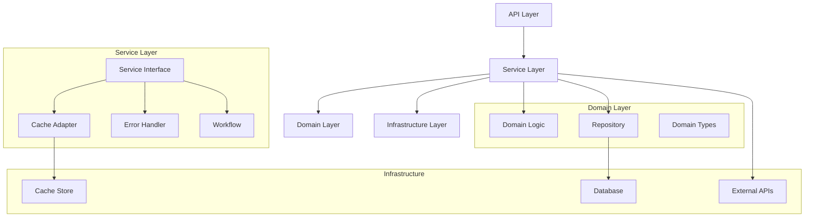
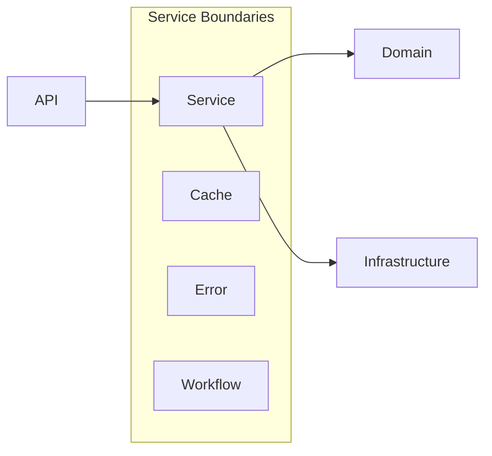
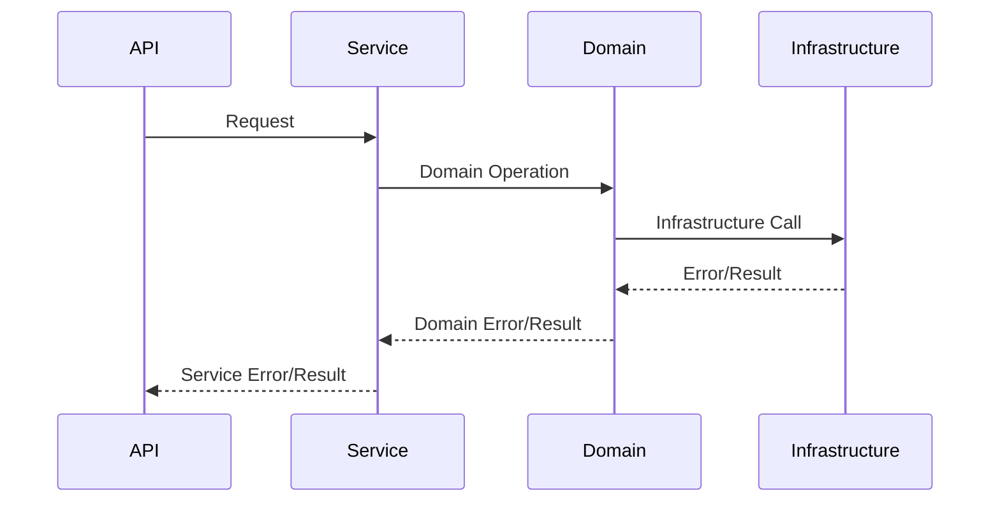
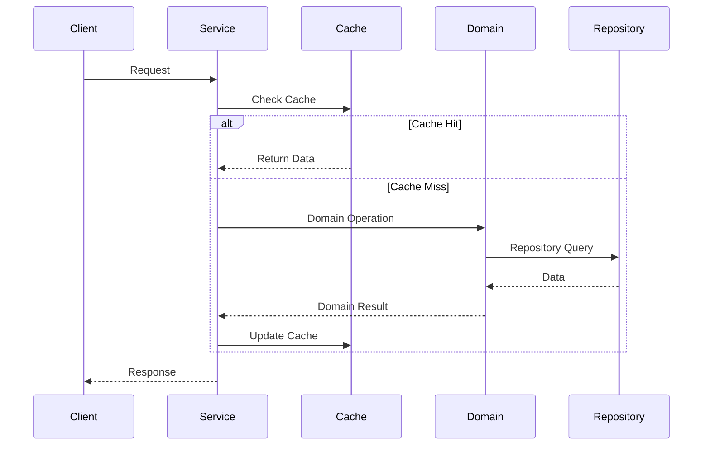
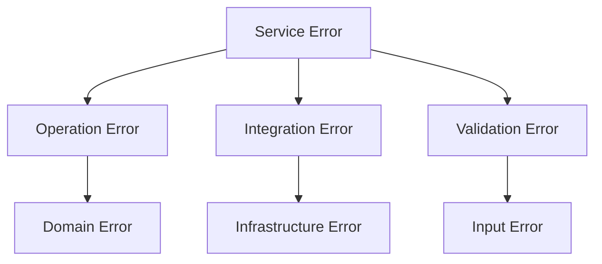
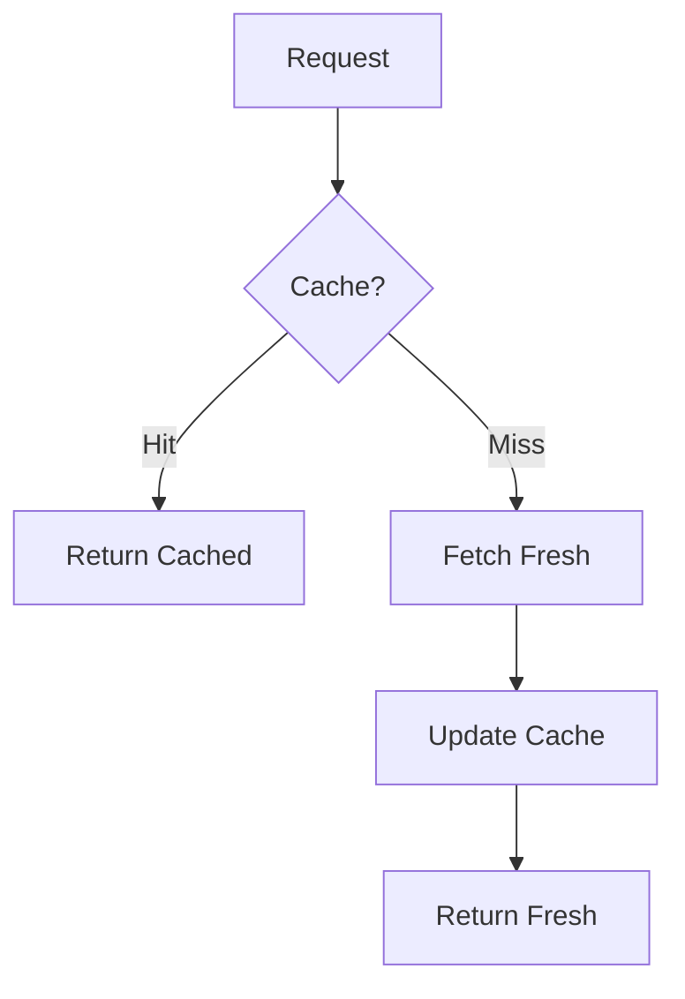
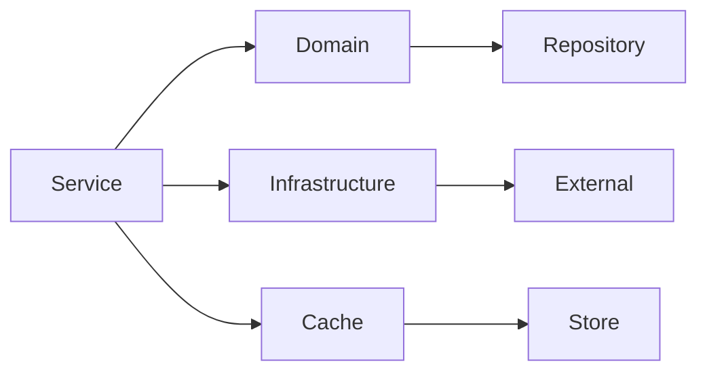

# Service Layer Design

## Overview

The service layer is designed as a thin orchestration layer that coordinates between the API layer and domain layer, implementing business use cases while maintaining functional programming principles. It provides a clean separation of concerns and ensures type safety through fp-ts integration.

## Architecture



## Core Design Principles

### 1. Functional Core

- Pure functions for business logic
- Immutable data structures
- Effect handling with TaskEither
- Type-safe operations

### 2. Clean Architecture



### 3. Error Management



## Service Layer Components

### 1. Service Interface

- Defines public API contract
- Handles type transformations
- Manages error boundaries
- Coordinates operations

### 2. Cache Adapter

- Implements caching strategy
- Handles cache invalidation
- Provides data consistency
- Manages TTL policies

### 3. Workflow Management

- Orchestrates complex operations
- Manages transaction boundaries
- Handles cross-domain coordination
- Implements retry policies

## Data Flow Patterns



## Error Handling Strategy

### 1. Error Categories



### 2. Error Flow

- Capture at boundaries
- Transform to service errors
- Provide context
- Maintain type safety

## Performance Considerations

### 1. Caching Strategy



### 2. Resource Management

- Connection pooling
- Batch operations
- Lazy evaluation
- Resource cleanup

## Service Organization

### 1. Module Structure

```plaintext
services/
├── domain1/
│   ├── index.ts
│   ├── types.ts
│   ├── service.ts
│   ├── cache.ts
│   └── workflow.ts
└── domain2/
    ├── index.ts
    └── ...
```

### 2. Dependency Flow



## Monitoring and Metrics

### 1. Key Metrics

- Operation latency
- Cache effectiveness
- Error rates
- Resource utilization

### 2. Health Checks

- Service availability
- Dependency status
- Resource status
- Cache health

## Future Considerations

### 1. Scalability

- Horizontal scaling
- Load balancing
- Service discovery
- Distributed caching

### 2. Extensibility

- Plugin architecture
- Service composition
- Feature toggles
- API versioning
