# Service Layer Design

## Overview

The service layer acts as an orchestration layer between the API and domain layers, implementing business workflows while maintaining functional programming principles using fp-ts. It provides error handling, workflow management, and integration with external services.

## Architecture

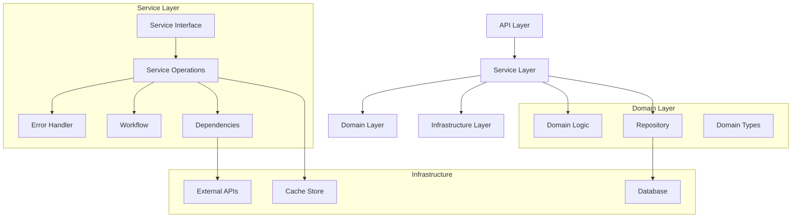

## Core Design Principles

### 1. Functional Core

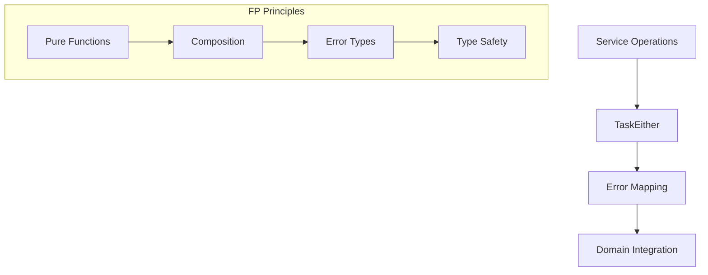

### 2. Clean Architecture

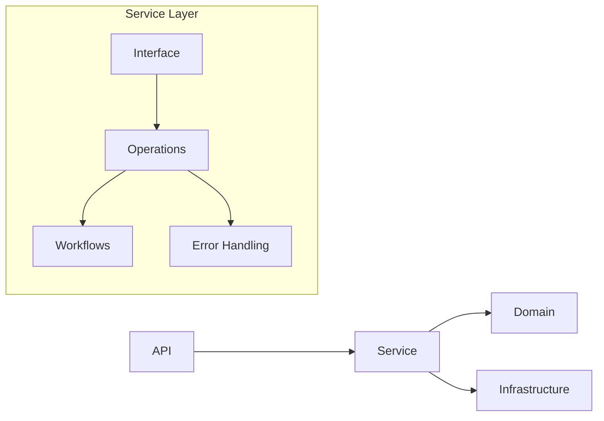

### 3. Error Management

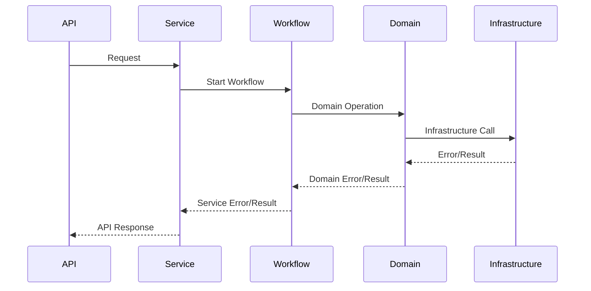

## Service Layer Components

### 1. Service Interface

```typescript
interface Service<T, ID> {
  readonly getAll: () => TaskEither<ServiceError, readonly T[]>;
  readonly getById: (id: ID) => TaskEither<ServiceError, T | null>;
  readonly save: (entity: T) => TaskEither<ServiceError, T>;
  readonly saveMany: (entities: readonly T[]) => TaskEither<ServiceError, readonly T[]>;
}
```

### 2. Service Operations

```typescript
interface ServiceOperations<T, ID> {
  readonly findAll: () => TaskEither<ServiceError, readonly T[]>;
  readonly findById: (id: ID) => TaskEither<ServiceError, T | null>;
  readonly create: (entity: T) => TaskEither<ServiceError, T>;
  readonly createMany: (entities: readonly T[]) => TaskEither<ServiceError, readonly T[]>;
}
```

### 3. Workflow Management

```typescript
interface WorkflowResult<T> {
  readonly context: WorkflowContext;
  readonly result: T;
  readonly duration: number;
}

interface WorkflowContext {
  readonly workflowId: string;
  readonly startTime: Date;
}
```

## Data Flow Patterns

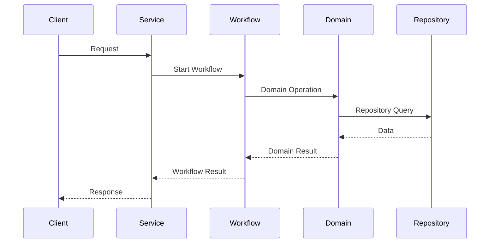

## Error Handling Strategy

### 1. Error Categories

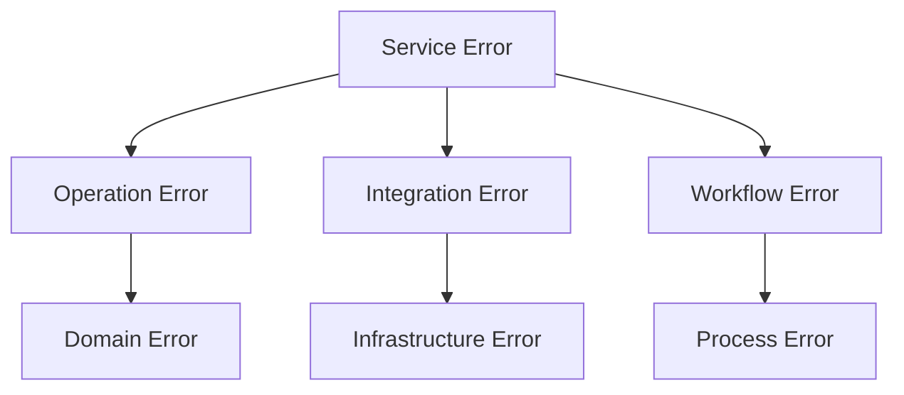

### 2. Error Flow

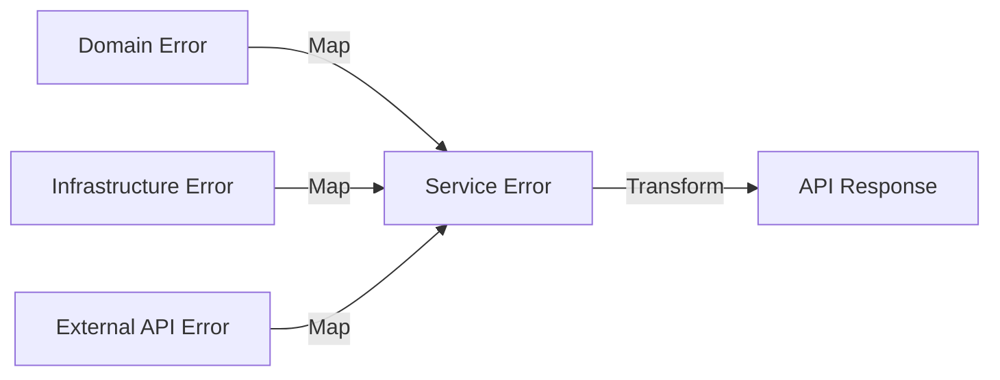

## Performance Considerations

### 1. Workflow Optimization

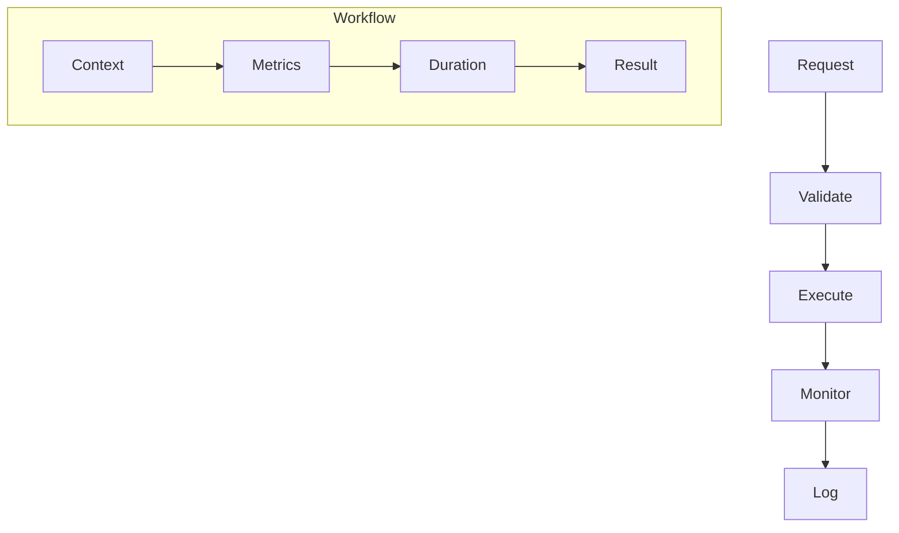

### 2. Resource Management

- Connection pooling
- Batch operations
- Lazy evaluation
- Resource cleanup

## Service Organization

### 1. Module Structure

```plaintext
services/
├── domain1/
│   ├── index.ts
│   ├── types.ts
│   ├── service.ts
│   ├── operations.ts
│   └── workflow.ts
└── domain2/
    ├── index.ts
    └── ...
```

### 2. Dependency Flow

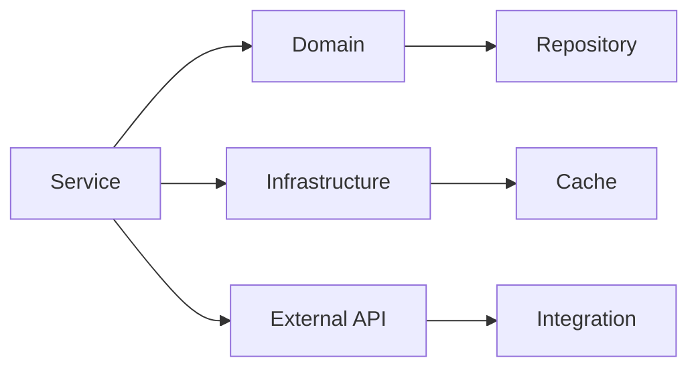

## Monitoring and Metrics

### 1. Key Metrics

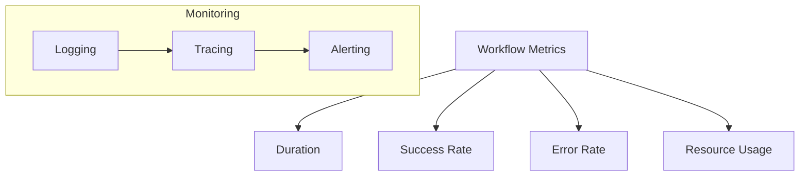

### 2. Health Checks

- Service availability
- Dependency status
- Resource status
- Workflow health

## Future Considerations

### 1. Scalability

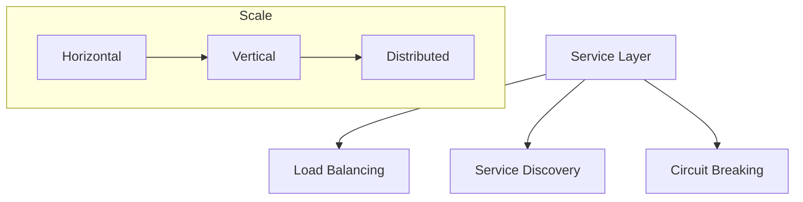

### 2. Extensibility

- Plugin architecture
- Service composition
- Feature toggles
- API versioning
