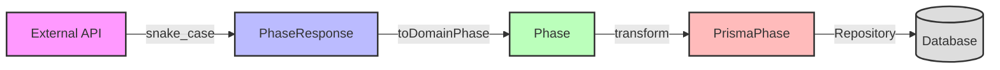
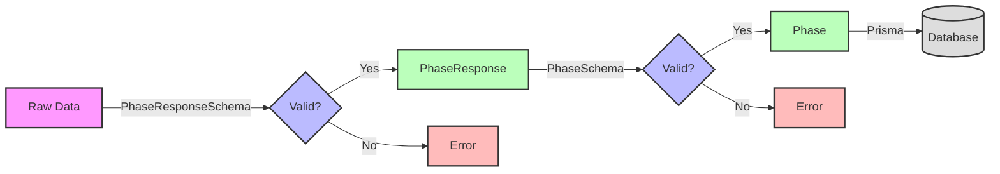
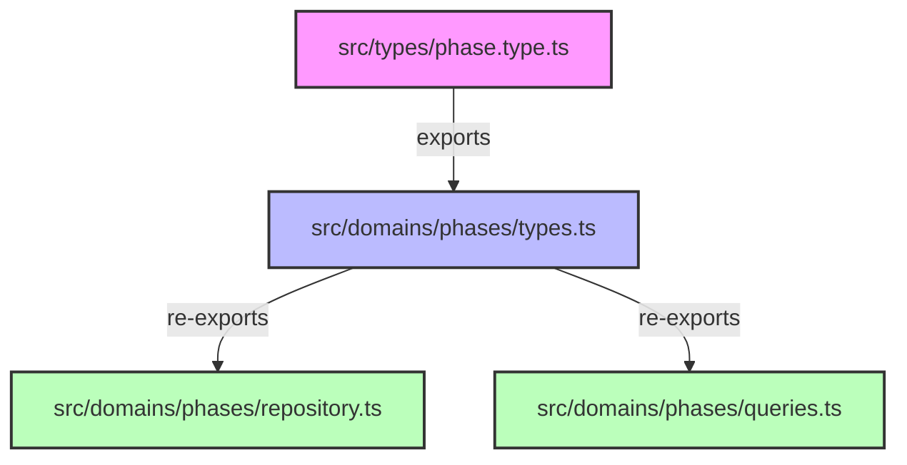

This document outlines our approach to managing types in the application, ensuring type safety, validation, and clean architecture.

## File Locations

1. **Type Definitions** (`src/types/{entity}.type.ts`)

   - Contains all type definitions for an entity
   - Single source of truth for types
   - Example: `src/types/phase.type.ts`

2. **Domain Types** (`src/domains/{entity}/types.ts`)
   - Re-exports needed types from type definitions
   - No type definitions, only imports
   - Example: `src/domains/phases/types.ts`

## Structure

Types are managed in four distinct layers:

1. **API Response Types** (External Data)

   - Validates raw data from external APIs
   - Uses snake_case to match API conventions
   - Example: `PhaseResponseSchema`, `PhaseResponse`

2. **Domain Types** (Business Logic)

   - Represents our internal domain model
   - Uses camelCase for consistency
   - Example: `PhaseSchema`, `Phase`

3. **Database Types** (Persistence)

   - Represents Prisma model structure
   - Matches database schema
   - Example: `PrismaPhase`, `PrismaPhaseCreate`

4. **Repository Types** (Data Access)
   - Defines data access operations
   - Uses TaskEither for error handling
   - Example: `PhaseRepository`

## File Organization

```typescript
// ============ API Types ============
export const PhaseResponseSchema = z.object({
  id: z.number(),
  start_event: z.number(), // snake_case for API
});
export type PhaseResponse = z.infer<typeof PhaseResponseSchema>;

// ============ Domain Types ============
export const PhaseSchema = z.object({
  id: z.number(),
  startEvent: z.number(), // camelCase for domain
});
export type Phase = z.infer<typeof PhaseSchema>;

// ============ Database Types ============
export type PrismaPhase = {
  readonly id: number;
  readonly startEventId: number; // matches database columns
  readonly createdAt?: Date;
};
export type PrismaPhaseCreate = Omit<PrismaPhase, 'id' | 'createdAt'>;

// ============ Repository Types ============
export interface PhaseRepository {
  save(phase: PrismaPhaseCreate): TE.TaskEither<APIError, PrismaPhase>;
  findById(id: number): TE.TaskEither<APIError, PrismaPhase | null>;
}
```

## Data Flow

### Type Transformation Flow



### Validation Flow



### Type Flow Details

1. **API Response → Domain Model**

   ```typescript
   PhaseResponse (snake_case) → Phase (camelCase)
   ```

2. **Domain Model → Database Model**

   ```typescript
   Phase (business logic) → PrismaPhase (storage)
   ```

3. **Repository Operations**
   ```typescript
   TaskEither<APIError, PrismaPhase> (type-safe error handling)
   ```

## Best Practices

1. **Type Safety**

   - Use Zod for runtime validation
   - Leverage TypeScript for static type checking
   - No use of `any` type
   - Use TaskEither for error handling

2. **Separation of Concerns**

   - Keep all related types in one file (e.g., `phase.type.ts`)
   - Clear distinction between API, domain, and database types
   - Repository interfaces define data access patterns

3. **Validation Layers**

   - API response validation (Zod schemas)
   - Domain model validation (type transformers)
   - Database model validation (Prisma)

4. **Error Handling**

   - Use `TaskEither` for async operations
   - Use `Either` for synchronous transformations
   - Type-safe error responses with `APIError`

5. **Naming Conventions**
   - API types: `{Entity}Response`
   - Domain types: `{Entity}`
   - Database types: `Prisma{Entity}`
   - Repository: `{Entity}Repository`

## Example Implementation

See `src/types/phase.type.ts` for a complete example of this approach.

## Import Pattern

1. **Type Definition File** (`src/types/phase.type.ts`)

```typescript
// All type definitions here
export const PhaseResponseSchema = z.object({...});
export type PhaseResponse = z.infer<typeof PhaseResponseSchema>;
export type PrismaPhase = {...};
export interface PhaseRepository {...};
```

2. **Domain Type File** (`src/domains/phases/types.ts`)

```typescript
// Only re-exports, no definitions
export type {
  PhaseResponse,
  PrismaPhase,
  PrismaPhaseCreate,
  PhaseRepository,
} from '../../types/phase.type';
```

3. **Usage in Domain Files**

```typescript
// Import from domain types, not from type definition
import { PrismaPhase, PhaseRepository } from './types';
```

## File and Import Relationships



### Import Rules

1. **Type Definition File**

   - Contains all type definitions
   - No imports from domain files
   - Single source of truth

2. **Domain Types File**

   - Only re-exports from type definition
   - No local type definitions
   - Central import point for domain

3. **Domain Files**
   - Import only from domain types
   - Never import directly from type definition
   - Keeps imports maintainable
