# Type Management Design

## Overview

This document outlines our approach to managing types in the application, ensuring type safety, validation, and clean architecture through functional programming principles and branded types.

## Type System Architecture

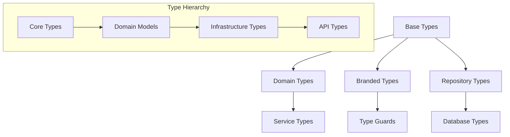

## Type Categories

### 1. Base Types (`src/types/base.type.ts`)

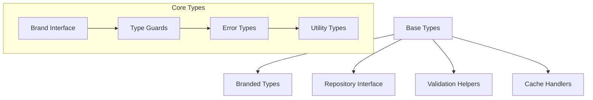

### 2. Domain Types (`src/types/{domain}.type.ts`)

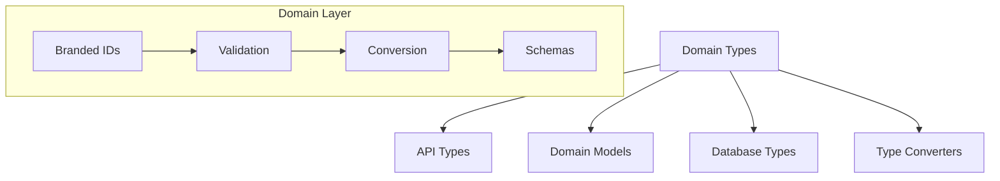

## Type Flow

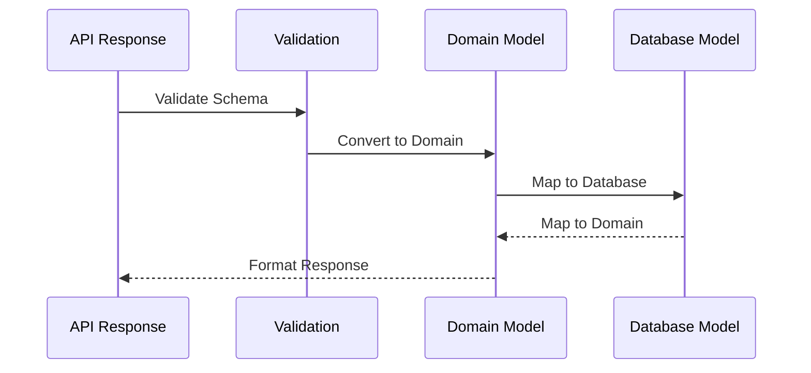

## Type Definitions

### 1. Branded Types

```typescript
interface Brand<K extends string> {
  readonly __brand: K;
}

type Branded<T, K extends string> = T & Brand<K>;

const createBrandedType = <T, K extends string>(
  brand: K,
  validator: (value: unknown) => value is T,
) => ({
  validate: (value: unknown): Either<string, Branded<T, K>>,
  is: (value: unknown): value is Branded<T, K>,
});
```

### 2. Repository Types

```typescript
interface BaseRepository<T, CreateT, IdT> {
  readonly findAll: () => TaskEither<DBError, T[]>;
  readonly findById: (id: IdT) => TaskEither<DBError, T | null>;
  readonly save: (data: CreateT) => TaskEither<DBError, T>;
  readonly saveBatch: (data: CreateT[]) => TaskEither<DBError, T[]>;
  readonly deleteAll: () => TaskEither<DBError, void>;
}
```

### 3. Validation Types

```typescript
interface ValidationSchema<T> {
  readonly validate: (data: unknown) => Either<string, T>;
  readonly schema: z.ZodSchema<T>;
}

type Validator<T> = (data: unknown) => Either<string, T>;
```

## Type Layers

### 1. API Layer

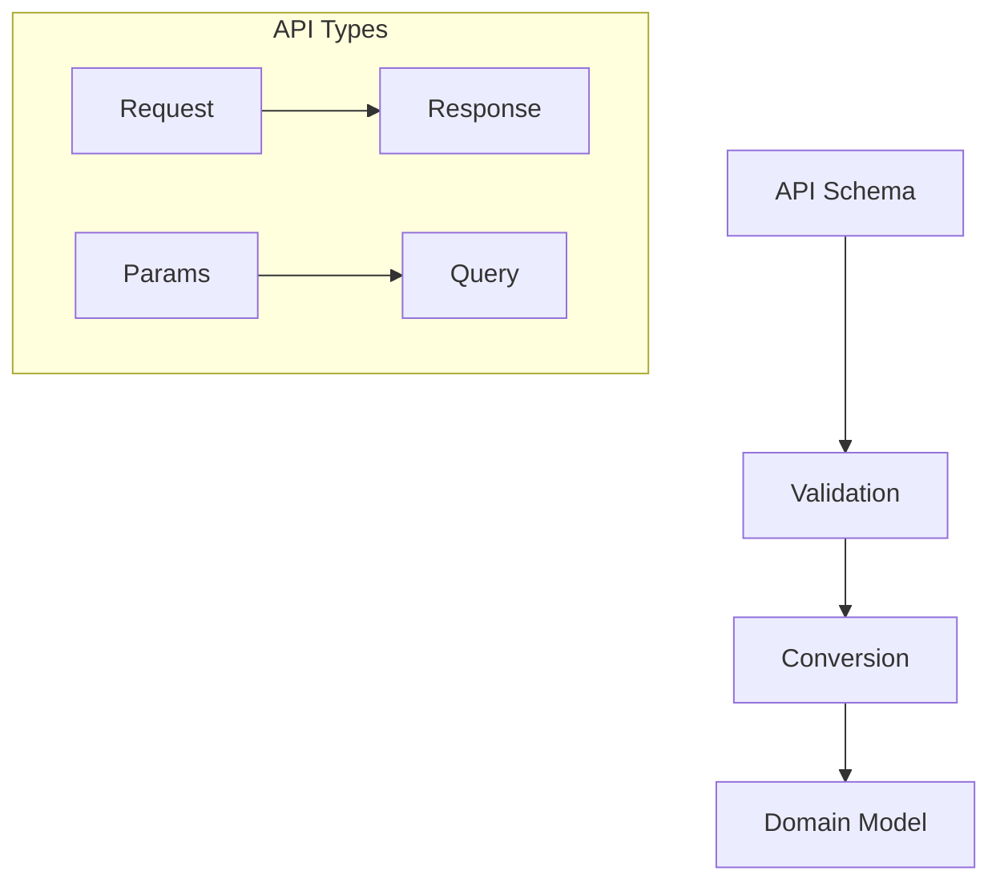

### 2. Domain Layer

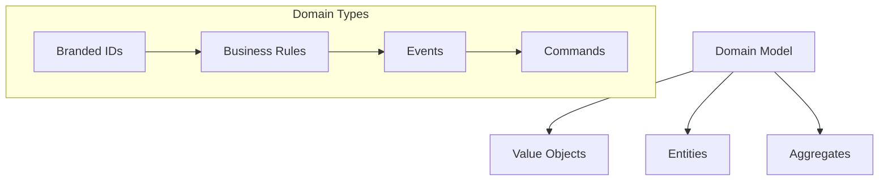

### 3. Infrastructure Layer

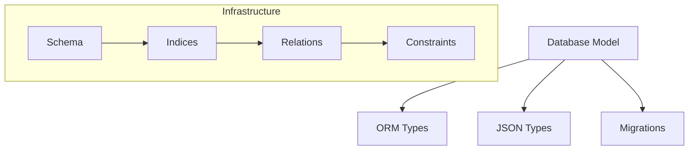

## Type Safety

### 1. Validation Chain

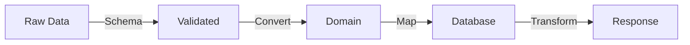

### 2. Error Handling

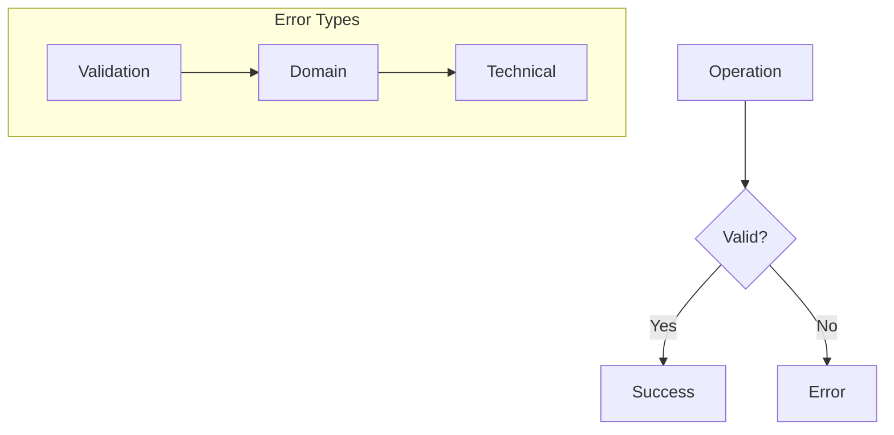

## Type Conversion

### 1. Data Flow

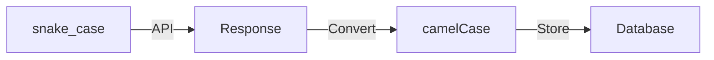

### 2. Type Guards

```typescript
interface TypeGuard<T> {
  (value: unknown): value is T;
}

interface TypeConverter<From, To> {
  (value: From): To;
}
```

## Best Practices

### 1. Type Definition

- Use branded types for identifiers
- Define explicit validation schemas
- Implement type converters
- Maintain immutability

### 2. Type Safety

- Runtime validation with zod
- Compile-time checks
- Type guards for narrowing
- Error type hierarchies

### 3. Type Organization

```plaintext
src/types/
├── base.type.ts         # Core type system
├── errors.type.ts       # Error hierarchy
├── {domain}.type.ts     # Domain types
└── validation.type.ts   # Validation utilities
```

## Future Considerations

### 1. Type Evolution

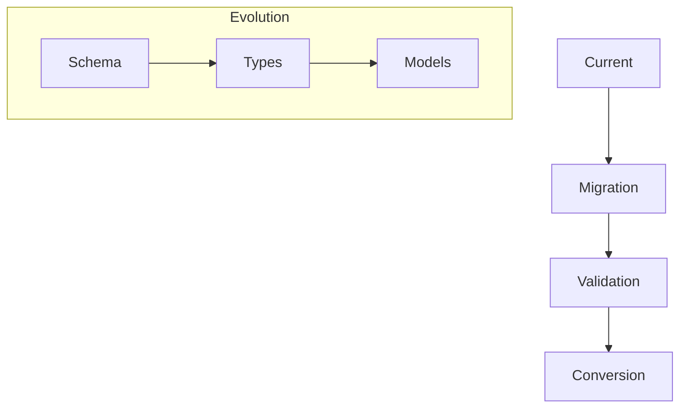

### 2. Type Extensions

- Generic type builders
- Type composition utilities
- Advanced type guards
- Custom type decorators
