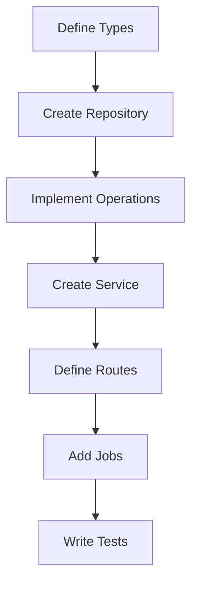

# Domain Development Guide

This guide provides a comprehensive overview of implementing new domains in the system, using the Events domain as a reference implementation. Follow these patterns and practices to ensure consistency across all domain implementations.

## Table of Contents

1. [Domain Structure](#domain-structure)
2. [Type System](#type-system)
3. [Domain Layer](#domain-layer)
4. [Service Layer](#service-layer)
5. [Job Processing](#job-processing)
6. [Cache Implementation](#cache-implementation)
7. [Testing Strategy](#testing-strategy)

## Domain Structure

### Directory Layout

```
src/
├── domains/[domain-name]/
│   ├── index.ts          # Public exports
│   ├── operations.ts     # Domain operations and business logic
│   ├── repository.ts     # Data access layer
│   ├── routes.ts         # API route handlers
│   ├── queries.ts        # Database queries
│   └── cache/           # Cache operations
│       ├── index.ts
│       ├── keys.ts
│       └── operations.ts
├── services/[domain-name]/
│   ├── index.ts         # Service exports
│   ├── service.ts       # Main service implementation
│   ├── workflow.ts      # Complex operation flows
│   ├── types.ts         # Service-specific types
│   └── cache.ts         # Service-level caching
└── types/
    └── [domain].type.ts # Domain-wide type definitions
```

### Implementation Flow



## Type System

### 1. Type Hierarchy

```typescript
// 1. Branded Types
declare const DomainIdBrand: unique symbol;
export type DomainId = number & { readonly _brand: typeof DomainIdBrand };

// 2. API Response Types (snake_case)
export type ApiResponse = z.infer<typeof ApiResponseSchema>;

// 3. Domain Types (camelCase)
export interface DomainEntity {
  readonly id: DomainId;
  // ... domain properties
}

// 4. Persistence Types
export interface PrismaEntity {
  // ... database properties
}
```

### 2. Schema Validation

```typescript
// 1. API Schema
const ApiResponseSchema = z.object({
  id: z.number(),
  field_name: z.string(),
  // ... external API fields
});

// 2. Domain Schema
const DomainSchema = z.object({
  id: z.number(),
  fieldName: z.string(),
  // ... domain fields
});

// 3. Transformers
export const toDomainEntity = (raw: ApiResponse): Either<string, DomainEntity> => {
  try {
    const parsed = DomainSchema.safeParse({
      id: raw.id,
      fieldName: raw.field_name,
      // ... transform fields
    });

    if (!parsed.success) {
      return left(`Invalid domain model: ${parsed.error.message}`);
    }

    return right({
      ...parsed.data,
      id: parsed.data.id as DomainId,
    });
  } catch (error) {
    return left(`Transform error: ${error instanceof Error ? error.message : String(error)}`);
  }
};
```

### 3. Type Guards

```typescript
export const isDomainId = (id: unknown): id is DomainId =>
  typeof id === 'number' && id > 0 && Number.isInteger(id);

export const validateDomainId = (id: number): Either<string, DomainId> =>
  isDomainId(id) ? right(id as DomainId) : left(`Invalid ID: ${id}`);

export const isValidEntity = (entity: DomainEntity): boolean =>
  isDomainId(entity.id) && typeof entity.fieldName === 'string' && entity.fieldName.length > 0;
```

## Domain Layer

### 1. Repository Implementation

```typescript
export const repository: DomainRepository = {
  prisma,

  findById: (id: DomainId): TE.TaskEither<APIError, PrismaEntity | null> =>
    pipe(
      TE.tryCatch(
        () => prisma.domain.findUnique({ where: { id: Number(id) } }),
        (error) => createRepositoryError(error),
      ),
    ),

  save: (data: PrismaEntityCreate): TE.TaskEither<APIError, PrismaEntity> =>
    pipe(
      TE.tryCatch(
        () => prisma.domain.create({ data }),
        (error) => createRepositoryError(error),
      ),
    ),

  // ... other repository methods
};
```

### 2. Domain Operations

```typescript
export const saveDomain = (domain: DomainEntity): TE.TaskEither<APIError, DomainEntity> =>
  pipe(
    toPrismaEntityWithError(domain),
    TE.fromEither,
    TE.chain((prismaEntity) =>
      pipe(
        repository.save({ ...prismaEntity, id: Number(domain.id) }),
        TE.chain((saved) => pipe(toDomainEntityWithError(saved), TE.fromEither)),
      ),
    ),
  );
```

### 3. Routes

```typescript
export const router = Router();

router.get('/', async (req, res) => {
  const result = await pipe(
    service.getAll(),
    TE.map((data) => ({ status: 'success', data })),
    TE.mapLeft((error) => ({ status: 'error', error: error.message })),
  )();

  if (E.isLeft(result)) {
    res.status(400).json(result.left);
    return;
  }

  res.json(result.right);
});
```

## Service Layer

### 1. Service Implementation

```typescript
export class DomainService {
  constructor(
    private readonly api: DomainApi,
    private readonly operations: DomainOperations,
  ) {}

  getAll = (): TE.TaskEither<APIError, DomainEntity[]> =>
    pipe(
      TE.tryCatch(
        () => this.api.fetchAll(),
        (error) => createApiError(error),
      ),
      TE.chain((response) =>
        pipe(
          response.map(toDomainEntity),
          TE.traverseArray((entity) => this.operations.save(entity)),
        ),
      ),
    );
}
```

### 2. Workflow Implementation

```typescript
export const complexWorkflow = (params: WorkflowParams): TE.TaskEither<APIError, WorkflowResult> =>
  pipe(
    validateParams(params),
    TE.fromEither,
    TE.chain(fetchDependencies),
    TE.chain(processData),
    TE.chain(saveResults),
  );
```

## Job Processing

### 1. Job Types

```typescript
export enum JobOperation {
  UPDATE = 'update',
  SYNC = 'sync',
  DELETE = 'delete',
}

export interface DomainJobData extends BaseJobData {
  operation: JobOperation;
  id?: number;
  options?: JobOptions;
}
```

### 2. Job Service

```typescript
export class DomainJobService {
  constructor(
    private readonly queue: QueueService,
    private readonly repository: DomainRepository,
  ) {}

  processDomainJob = (job: Job<DomainJobData>): TE.TaskEither<Error, void> => {
    const { operation, id, options } = job.data;

    switch (operation) {
      case JobOperation.UPDATE:
        return this.handleUpdate(id, options);
      case JobOperation.SYNC:
        return this.handleSync(options);
      case JobOperation.DELETE:
        return this.handleDelete(id);
      default:
        return TE.left(createQueueError(`Unknown operation: ${operation}`));
    }
  };

  scheduleDomainUpdate = (
    id: number,
    options?: JobOptions,
  ): TE.TaskEither<Error, Job<DomainJobData>> =>
    this.queue.addJob({
      data: {
        operation: JobOperation.UPDATE,
        id,
        options,
      },
    });
}
```

## Cache Implementation

### 1. Cache Keys

```typescript
// cache/keys.ts
export const CacheKeys = {
  entity: (id: string) => `domain:${id}`,
  list: () => 'domain:list',
  meta: (key: string) => `domain:meta:${key}`,
} as const;
```

### 2. Cache Operations

```typescript
// cache/operations.ts
export const cacheOperations = {
  get: <T>(key: string): TE.TaskEither<CacheError, T | null> =>
    pipe(
      TE.tryCatch(
        () => cache.get(key),
        (error) => createCacheError(error),
      ),
    ),

  set: <T>(key: string, value: T, ttl?: number): TE.TaskEither<CacheError, void> =>
    pipe(
      TE.tryCatch(
        () => cache.set(key, value, ttl),
        (error) => createCacheError(error),
      ),
    ),

  invalidate: (pattern: string): TE.TaskEither<CacheError, void> =>
    pipe(
      TE.tryCatch(
        () => cache.del(pattern),
        (error) => createCacheError(error),
      ),
    ),
};
```

### 3. Repository Cache Integration

```typescript
export const repository = {
  findById: (id: DomainId): TE.TaskEither<APIError, Entity | null> =>
    pipe(
      cacheOperations.get<Entity>(CacheKeys.entity(String(id))),
      TE.chain((cached) =>
        cached
          ? TE.right(cached)
          : pipe(
              findInDb(id),
              TE.chain((entity) =>
                entity
                  ? pipe(
                      cacheOperations.set(CacheKeys.entity(String(id)), entity, CACHE_TTL),
                      TE.map(() => entity),
                    )
                  : TE.right(null),
              ),
            ),
      ),
    ),
};
```

## Testing Strategy

### 1. Unit Tests

```typescript
describe('Domain Operations', () => {
  it('should transform API response to domain entity', () => {
    const apiResponse = { id: 1, field_name: 'test' };
    const result = toDomainEntity(apiResponse);

    expect(E.isRight(result)).toBe(true);
    if (E.isRight(result)) {
      expect(result.right).toEqual({
        id: 1 as DomainId,
        fieldName: 'test',
      });
    }
  });
});
```

### 2. Integration Tests

```typescript
describe('Domain Repository', () => {
  beforeEach(async () => {
    await prisma.domain.deleteMany();
  });

  it('should save and retrieve entity', async () => {
    const entity = createTestEntity();
    const saved = await pipe(
      repository.save(entity),
      TE.chain((saved) => repository.findById(saved.id)),
    )();

    expect(E.isRight(saved)).toBe(true);
    if (E.isRight(saved)) {
      expect(saved.right).toMatchObject(entity);
    }
  });
});
```

## Best Practices Summary

1. **Type Safety**

   - Use branded types for domain identifiers
   - Implement comprehensive validation
   - Maintain strict type boundaries

2. **Functional Programming**

   - Use `fp-ts` for error handling
   - Leverage `pipe` for composition
   - Implement pure functions
   - Use `[, value]` instead of `[_, value]` for unused destructuring parameters

3. **Error Handling**

   - Create domain-specific errors
   - Use `TaskEither` for async operations
   - Implement proper error boundaries

4. **Cache Strategy**

   - Implement TTL based on data volatility
   - Use atomic operations
   - Handle invalidation patterns

5. **Testing**
   - Write comprehensive unit tests
   - Implement integration tests
   - Use test factories and helpers

## Conclusion

This guide provides a template for implementing new domains while maintaining consistency with the system's architectural principles and best practices. Use the Events domain implementation as a reference when implementing new domains.
