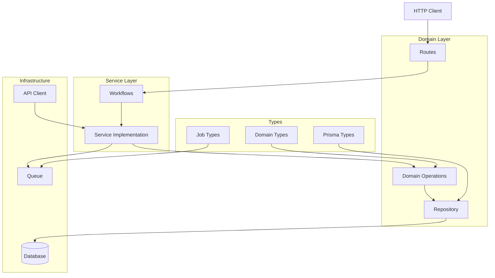
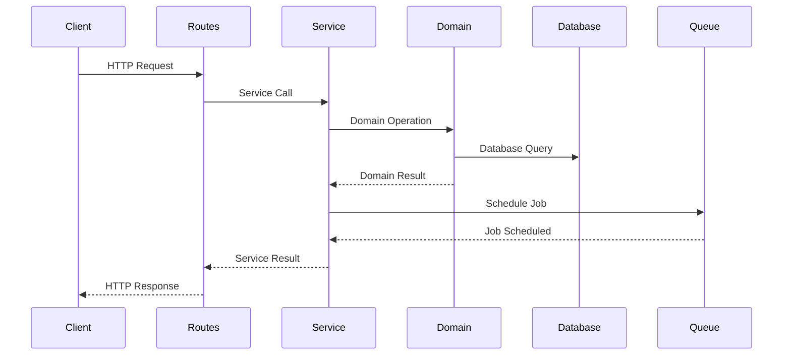
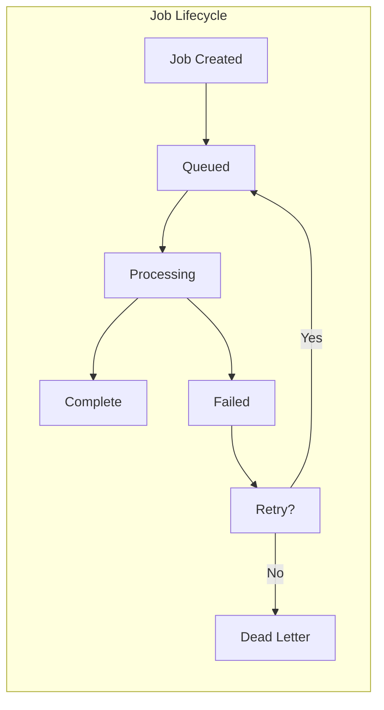
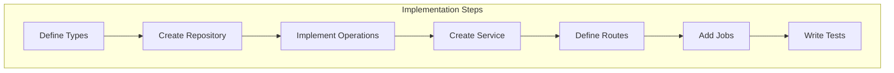
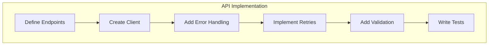
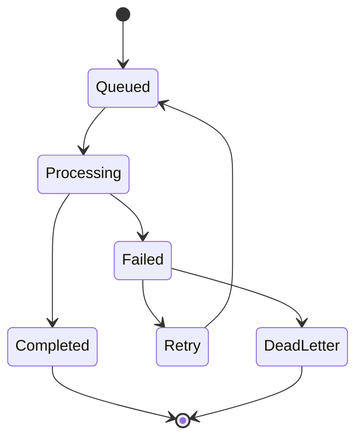

# Domain Development Guide

This guide provides a comprehensive overview of implementing new domains in the system, using the Phases domain as a reference implementation. Follow these patterns and practices to ensure consistency across all domain implementations.

## Table of Contents

1. [Architecture Overview](#architecture-overview)
2. [Domain Layer Structure](#domain-layer-structure)
3. [API Endpoint Implementation](#api-endpoint-implementation)
4. [Job Implementation](#job-implementation)
5. [Service Layer](#service-layer)
6. [Queue Jobs](#queue-jobs)
7. [Type Definitions](#type-definitions)
8. [Testing Strategy](#testing-strategy)

## Architecture Overview

### Domain-Driven Design Flow



### Request Flow



### Job Processing Flow



## Domain Layer Structure

The domain layer is the core of your business logic. Reference: `src/domains/phases`

### Directory Structure

```
src/domains/[domain-name]/
├── index.ts          # Public exports
├── operations.ts     # Domain operations and business logic
├── repository.ts     # Data access layer
└── routes.ts         # API route handlers
```

### Implementation Flow



### Implementation Steps

1. **Create Domain Operations** (`operations.ts`):

```typescript
// Example from phases/operations.ts
export const savePhase = (phase: DomainPhase): TE.TaskEither<APIError, DomainPhase> =>
  pipe(
    toPrismaPhaseWithError(phase),
    TE.fromEither,
    TE.chain((prismaPhase) =>
      pipe(
        phaseRepository.save({ ...prismaPhase, id: Number(phase.id) }),
        TE.chain((saved) => pipe(toDomainPhaseWithError(saved), TE.fromEither)),
      ),
    ),
  );
```

2. **Implement Repository** (`repository.ts`):

```typescript
export const repository = {
  save: (entity: Entity): TE.TaskEither<APIError, Entity> => // ...
  findById: (id: EntityId): TE.TaskEither<APIError, Entity | null> => // ...
  findAll: (): TE.TaskEither<APIError, Entity[]> => // ...
  // Additional repository methods
};
```

3. **Define Routes** (`routes.ts`):

```typescript
export const router = Router();

router.get('/', async (req, res) => {
  const result = await pipe(
    service.getAll(),
    TE.map((data) => ({ status: 'success', data })),
    TE.mapLeft((error) => ({ status: 'error', error: error.message })),
  )();

  if (result._tag === 'Left') {
    res.status(400).json(result.left);
  } else {
    res.json(result.right);
  }
});
```

## API Endpoint Implementation

Reference: `src/infrastructure/api/fpl/endpoint`

### API Implementation Flow



### Steps to Add New Endpoints

1. **Define Endpoint Configuration**:

```typescript
export const API_CONFIG = {
  newDomain: {
    list: '/new-domain',
    details: (id: string) => `/new-domain/${id}`,
    // Additional endpoints
  },
};
```

2. **Implement API Client**:

```typescript
export const createClient = (): DomainApi => ({
  getData: async () => {
    try {
      const response = await client.get<ApiResponse>(API_CONFIG.newDomain.list);
      return response.data;
    } catch (error) {
      return null;
    }
  },
});
```

## Job Implementation

Reference: `src/infrastructure/queue/meta`

### Job Processing Flow



### Steps for New Job Types

1. **Define Job Data Types**:

```typescript
export interface NewDomainJobData extends BaseJobData {
  operation: 'CREATE' | 'UPDATE' | 'DELETE';
  id?: number;
  options?: JobOptions;
}
```

2. **Create Job Service**:

```typescript
export class NewDomainJobService {
  constructor(
    private readonly queue: QueueService,
    private readonly repository: Repository,
  ) {}

  processJob = (job: Job<JobData>): TE.TaskEither<Error, void> => {
    const { operation, id, options } = job.data;
    switch (operation) {
      case 'CREATE':
        return this.handleCreate(id, options);
      // Additional cases
    }
  };
}
```

## Best Practices

1. **Functional Programming**

   ```mermaid
   graph LR
       A[Raw Data] --> B[Validate]
       B --> C[Transform]
       C --> D[Process]
       D --> E[Result]
   ```

   - Use `fp-ts` for error handling and composition
   - Leverage `pipe` for clean function composition
   - Use `TaskEither` for asynchronous operations

2. **Type Safety**

   ```mermaid
   graph LR
       A[Domain Types] --> B[Validation]
       B --> C[Type Guards]
       C --> D[Runtime Checks]
   ```

   - Define branded types for IDs and other critical values
   - Use strict TypeScript configurations
   - Implement comprehensive type guards

3. **Error Handling**

   ```mermaid
   graph TD
       A[Operation] --> B{Success?}
       B -->|Yes| C[Return Result]
       B -->|No| D[Error Handler]
       D --> E[Domain Error]
       D --> F[System Error]
       D --> G[Validation Error]
   ```

   - Use domain-specific error types
   - Implement proper error boundaries
   - Provide meaningful error messages

## Conclusion

Follow this guide to maintain consistency across domain implementations. Each section provides a template and reference implementation that can be adapted for new domains while maintaining the system's architectural principles and best practices.
