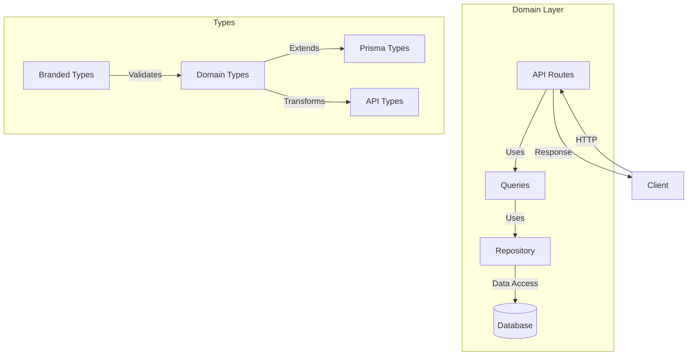
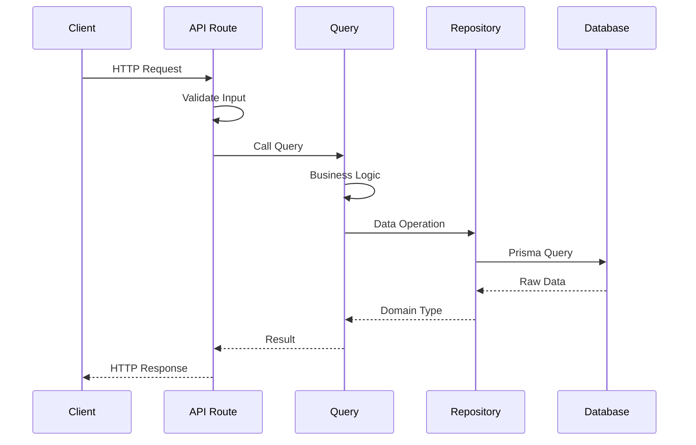
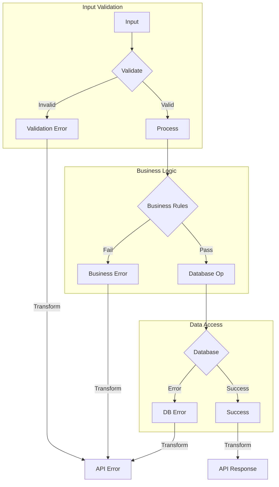
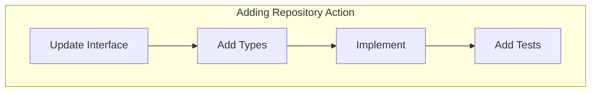
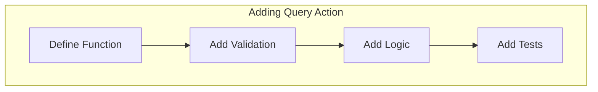
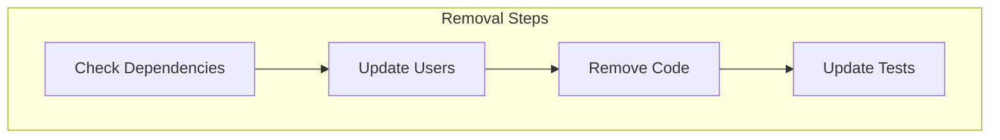

This guide explains how we implement domain layers in our application, using the `phases` domain as an example.

## Architecture Overview

Our domain-driven architecture follows these principles:

- Functional programming with fp-ts
- Type-safe boundaries
- Clear separation of concerns
- Immutable data structures
- Explicit error handling



## Domain Structure

```
src/domains/phases/
├── repository.ts    # Data access layer
├── queries.ts       # Business logic
└── routes.ts        # API endpoints

src/types/
└── phase.type.ts    # Type definitions
```

### Data Flow



## Type System

### Domain Types

```typescript
// Branded Types for type safety
export type PhaseId = number & { readonly _brand: unique symbol };
export type EventId = number & { readonly _brand: unique symbol };

// Domain Types
export type Phase = {
  readonly id: PhaseId;
  readonly name: string;
  readonly startEvent: EventId;
  readonly stopEvent: EventId;
  readonly highestScore: number | null;
};

// Database Types
export type PrismaPhase = {
  readonly id: number;
  readonly name: string;
  readonly startEvent: number;
  readonly stopEvent: number;
  readonly highestScore: number | null;
  readonly createdAt: Date;
};

// API Types
export type PhaseResponse = {
  id: number;
  name: string;
  start_event: number;
  stop_event: number;
  highest_score: number | null;
};
```

### Type Validation

```typescript
// Validation schemas using Zod
export const PhaseSchema = z.object({
  id: z.number().positive(),
  name: z.string().min(1),
  startEvent: z.number().positive(),
  stopEvent: z.number().positive(),
  highestScore: z.number().nullable(),
});

// Type guards
export const isPhaseId = (id: unknown): id is PhaseId => typeof id === 'number' && id > 0;

// Validation functions
export const validatePhaseId = (id: number): Either<string, PhaseId> =>
  id > 0 ? right(id as PhaseId) : left(`Invalid phase ID: ${id}`);

export const validateEventId = (id: number): Either<string, EventId> =>
  id > 0 ? right(id as EventId) : left(`Invalid event ID: ${id}`);
```

## Repository Layer

### Interface

```typescript
export interface PhaseRepository {
  save(phase: PrismaPhaseCreate): TE.TaskEither<APIError, PrismaPhase>;
  findById(id: PhaseId): TE.TaskEither<APIError, PrismaPhase | null>;
  findAll(): TE.TaskEither<APIError, PrismaPhase[]>;
  update(id: PhaseId, phase: Partial<PrismaPhaseCreate>): TE.TaskEither<APIError, PrismaPhase>;
}
```

### Implementation

```typescript
export const phaseRepository: PhaseRepository = {
  save: (phase: PrismaPhaseCreate): TE.TaskEither<APIError, PrismaPhase> =>
    pipe(
      TE.tryCatch(
        () => prisma.phase.create({ data: phase }),
        (error) => handleDatabaseError(error, 'save'),
      ),
    ),

  findById: (id: PhaseId): TE.TaskEither<APIError, PrismaPhase | null> =>
    pipe(
      TE.tryCatch(
        () => prisma.phase.findUnique({ where: { id: id as number } }),
        (error) => handleDatabaseError(error, 'findById'),
      ),
    ),

  // ... other implementations
};
```

## Query Layer

### Business Logic

```typescript
export const getCurrentPhase = (
  repository: PhaseRepository,
  currentEventId: number,
): TE.TaskEither<APIError, PrismaPhase | null> =>
  pipe(
    validateEventId(currentEventId),
    E.mapLeft((message) => createValidationError({ message })),
    TE.fromEither,
    TE.chain((validEventId) =>
      pipe(
        repository.findAll(),
        TE.map((phases) =>
          pipe(
            phases,
            A.findFirst(
              (phase) => phase.startEvent <= validEventId && phase.stopEvent >= validEventId,
            ),
            O.toNullable,
          ),
        ),
      ),
    ),
  );
```

## API Layer

### Route Handlers

```typescript
export const phaseRouter = Router();

phaseRouter.get('/current/:eventId', async (req, res) => {
  const result = await pipe(
    parseInt(req.params.eventId, 10),
    (eventId) => getCurrentPhase(phaseRepository, eventId),
    TE.map((phase) => ({
      status: 'success',
      data: phase,
    })),
    TE.mapLeft((error) => ({
      status: 'error',
      error: error.message,
    })),
  )();

  if (result._tag === 'Left') {
    res.status(400).json(result.left);
  } else {
    res.json(result.right);
  }
});
```

## Testing Strategy

### Unit Tests

```typescript
describe('Phase Domain', () => {
  describe('Validation', () => {
    it('should validate phase ID', () => {
      expect(validatePhaseId(-1)._tag).toBe('Left');
      expect(validatePhaseId(1)._tag).toBe('Right');
    });
  });

  describe('Repository', () => {
    const mockRepository: PhaseRepository = {
      findById: jest.fn(),
      // ... other methods
    };

    it('should find phase by ID', async () => {
      const phase = { id: 1, name: 'Test' };
      mockRepository.findById.mockResolvedValue(right(phase));

      const result = await getPhaseById(mockRepository, 1)();
      expect(result._tag).toBe('Right');
    });
  });
});
```

### Integration Tests

```typescript
describe('Phase Integration', () => {
  const repository = phaseRepository;

  beforeAll(async () => {
    await setupTestDatabase();
  });

  it('should create and retrieve phase', async () => {
    const phase = {
      name: 'Test Phase',
      startEvent: 1,
      stopEvent: 2,
    };

    const saved = await repository.save(phase)();
    expect(saved._tag).toBe('Right');

    const retrieved = await repository.findById(saved.right.id)();
    expect(retrieved.right).toEqual(saved.right);
  });
});
```

## Error Handling

### Error Types

```typescript
export type PhaseError =
  | { type: 'INVALID_PHASE_ID'; message: string }
  | { type: 'INVALID_EVENT_RANGE'; message: string }
  | { type: 'PHASE_NOT_FOUND'; message: string }
  | { type: 'PHASE_OVERLAP'; message: string };

export const createPhaseError = (error: PhaseError): APIError => ({
  code: `PHASE_${error.type}`,
  message: error.message,
  status: 400,
});
```

### Error Handling Flow



## Performance

### Caching

```typescript
export const phaseRepository: PhaseRepository = {
  findAll: (): TE.TaskEither<APIError, PrismaPhase[]> =>
    pipe(
      TE.tryCatch(
        async () => {
          const cached = await cache.get('phases:all');
          if (cached) return JSON.parse(cached);

          const phases = await prisma.phase.findMany({
            orderBy: { startEvent: 'asc' },
          });

          await cache.set('phases:all', JSON.stringify(phases), 60 * 5);
          return phases;
        },
        (error) => createDatabaseError({ message: 'Failed to find phases', details: { error } }),
      ),
    ),
};
```

### Query Optimization

```typescript
export const findByEventRange = (
  start: EventId,
  end: EventId,
): TE.TaskEither<APIError, PrismaPhase[]> =>
  TE.tryCatch(
    () =>
      prisma.phase.findMany({
        where: {
          AND: [{ startEvent: { gte: start as number } }, { stopEvent: { lte: end as number } }],
        },
        select: {
          id: true,
          name: true,
          startEvent: true,
          stopEvent: true,
          highestScore: true,
        },
      }),
    (error) => handleDatabaseError(error, 'findByEventRange'),
  );
```

## Maintenance

### Logging

```typescript
export const phaseRepository: PhaseRepository = {
  save: (phase: PrismaPhaseCreate): TE.TaskEither<APIError, PrismaPhase> =>
    pipe(
      TE.tryCatch(
        async () => {
          logger.info('Creating new phase', { phase });
          const result = await prisma.phase.create({ data: phase });
          logger.info('Phase created successfully', { id: result.id });
          return result;
        },
        (error) => {
          logger.error('Failed to create phase', { error, phase });
          return handleDatabaseError(error, 'save');
        },
      ),
    ),
};
```

### Health Checks

```typescript
export const checkPhaseHealth = (): TE.TaskEither<APIError, boolean> =>
  pipe(
    phaseRepository.findAll(),
    TE.map(() => true),
    TE.mapLeft((error) => {
      logger.error('Phase health check failed', { error });
      return error;
    }),
  );
```

## Common Patterns

### Validation Helper

```typescript
export const withValidation =
  <T, U>(schema: z.Schema<T>, transform: (valid: T) => U) =>
  (input: unknown): Either<string, U> =>
    pipe(
      E.tryCatch(
        () => schema.parse(input),
        (error) => `Validation failed: ${error}`,
      ),
      E.map(transform),
    );
```

### Type Guards

```typescript
export const asPhaseId = (id: number): PhaseId | undefined =>
  isPhaseId(id) ? (id as PhaseId) : undefined;

export const ensurePhaseId = (id: number): Either<string, PhaseId> =>
  pipe(
    id,
    validatePhaseId,
    E.mapLeft(() => `Invalid phase ID: ${id}`),
  );
```

### Error Transformation

```typescript
export const handleDatabaseError = (error: unknown, operation: string): APIError => {
  if (error instanceof Prisma.PrismaClientKnownRequestError) {
    switch (error.code) {
      case 'P2002':
        return createPhaseError({
          type: 'PHASE_OVERLAP',
          message: 'Phase dates overlap with existing phase',
        });
      default:
        return createDatabaseError({
          message: `Database error during ${operation}`,
          details: { error },
        });
    }
  }
  return createDatabaseError({
    message: `Unexpected error during ${operation}`,
    details: { error },
  });
};
```

## Modifying Domain Actions

### Adding Repository Actions



1. **Update Repository Interface**

```typescript
export interface PhaseRepository {
  // Existing actions...
  findByEventRange(start: EventId, end: EventId): TE.TaskEither<APIError, PrismaPhase[]>;
}
```

2. **Add Required Types**

```typescript
export type PhaseEventRange = {
  readonly start: EventId;
  readonly end: EventId;
};
```

3. **Implement in Repository**

```typescript
export const phaseRepository: PhaseRepository = {
  // Existing implementations...
  findByEventRange: (start: EventId, end: EventId): TE.TaskEither<APIError, PrismaPhase[]> =>
    pipe(
      TE.tryCatch(
        () =>
          prisma.phase.findMany({
            where: {
              AND: [
                { startEvent: { gte: start as number } },
                { stopEvent: { lte: end as number } },
              ],
            },
            orderBy: { startEvent: 'asc' },
          }),
        (error) => handleDatabaseError(error, 'findByEventRange'),
      ),
    ),
};
```

### Adding Query Actions



1. **Define Query Function**

```typescript
export const getPhasesInRange = (
  repository: PhaseRepository,
  start: number,
  end: number,
): TE.TaskEither<APIError, PrismaPhase[]> => // Implementation
```

2. **Add Input Validation**

```typescript
export const getPhasesInRange = (
  repository: PhaseRepository,
  start: number,
  end: number,
): TE.TaskEither<APIError, PrismaPhase[]> =>
  pipe(
    sequenceT(E.Apply)(validateEventId(start), validateEventId(end)),
    E.mapLeft((message) => createValidationError({ message })),
    TE.fromEither,
    TE.chain(([validStart, validEnd]) => repository.findByEventRange(validStart, validEnd)),
  );
```

### Removing Actions



#### Checklist for Removal

1. **Check Dependencies**

   - Search codebase for usage
   - Identify affected modules
   - Plan migration path

2. **Update Dependent Code**

   ```typescript
   // Before: Using deprecated action
   const phases = await repository.findByEventRange(start, end)();

   // After: Using alternative
   const phases = await pipe(
     repository.findAll(),
     TE.map((phases) =>
       phases.filter((phase) => phase.startEvent >= start && phase.stopEvent <= end),
     ),
   )();
   ```

3. **Remove Implementation**
   - Remove from repository implementation
   - Remove from interface
   - Remove unused types
   - Update tests

### Best Practices

1. **Adding Actions**

   - Update interface first
   - Add proper types
   - Include error handling
   - Add validation
   - Write tests
   - Update docs

2. **Removing Actions**

   - Check dependencies
   - Plan migration
   - Remove code
   - Clean up types
   - Update tests
   - Update docs

3. **Modifying Actions**
   - Consider compatibility
   - Update interface
   - Update implementation
   - Update tests
   - Document changes
