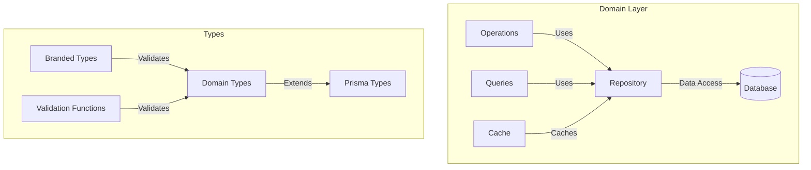
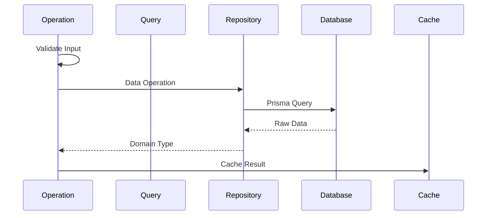

# Domain Implementation Guide

This guide explains how we implement domain layers in our application, using the `events` domain as an example.

## Architecture Overview

Our domain-driven architecture follows these principles:

- Functional programming with fp-ts
- Type-safe boundaries with branded types
- Clear separation of concerns
- Immutable data structures
- Explicit error handling with TaskEither



## Domain Structure

```
src/domains/events/
├── operations.ts    # Pure business logic
├── repository.ts    # Data access layer
├── queries.ts       # Business queries
└── cache.ts        # Cache operations

src/types/
└── events.type.ts   # Type definitions
```

### Data Flow



## Type System

### Domain Types

```typescript
// Branded types for type safety
export type EventId = number & { readonly _brand: unique symbol };

// Domain models
export type Event = {
  readonly id: EventId;
  readonly name: string;
  readonly isCurrent: boolean;
  readonly isNext: boolean;
  // ... other fields
};

// Prisma models
export type PrismaEvent = {
  readonly id: number;
  readonly name: string;
  readonly isCurrent: boolean;
  readonly isNext: boolean;
  readonly createdAt: Date;
};

// Validation functions
export const validateEventId = (id: number): E.Either<string, EventId> =>
  id > 0 ? E.right(id as EventId) : E.left(`Invalid event ID: ${id}`);
```

## Operations Layer

```typescript
// Pure business logic with explicit error handling
export const saveEvent = (event: DomainEvent): TE.TaskEither<APIError, DomainEvent> =>
  pipe(
    eventRepository.save(single.fromDomain(event)),
    TE.map(single.toDomain),
    TE.chain((result) =>
      result
        ? TE.right(result)
        : TE.left(createValidationError({ message: 'Failed to save event' })),
    ),
  );

export const findCurrentEvent = (): TE.TaskEither<APIError, DomainEvent | null> =>
  pipe(eventRepository.findCurrent(), TE.map(single.toDomain));
```

## Repository Layer

```typescript
// Repository interface
export interface EventRepository {
  save(event: PrismaEventCreate): TE.TaskEither<APIError, PrismaEvent>;
  findById(id: EventId): TE.TaskEither<APIError, PrismaEvent | null>;
  findAll(): TE.TaskEither<APIError, PrismaEvent[]>;
  findCurrent(): TE.TaskEither<APIError, PrismaEvent | null>;
  findNext(): TE.TaskEither<APIError, PrismaEvent | null>;
  update(id: EventId, event: PrismaEventUpdate): TE.TaskEither<APIError, PrismaEvent>;
}

// Repository implementation
export const eventRepository: EventRepository = {
  save: (event: PrismaEventCreate): TE.TaskEither<APIError, PrismaEvent> =>
    TE.tryCatch(
      () => prisma.event.create({ data: event }),
      (error) => createDatabaseError({ message: 'Failed to save event', details: { error } }),
    ),

  findById: (id: EventId): TE.TaskEither<APIError, PrismaEvent | null> =>
    TE.tryCatch(
      () => prisma.event.findUnique({ where: { id: Number(id) } }),
      (error) => createDatabaseError({ message: 'Failed to find event', details: { error } }),
    ),

  findCurrent: (): TE.TaskEither<APIError, PrismaEvent | null> =>
    TE.tryCatch(
      () => prisma.event.findFirst({ where: { isCurrent: true } }),
      (error) =>
        createDatabaseError({ message: 'Failed to find current event', details: { error } }),
    ),
};
```

## Query Layer

```typescript
// Business query operations with validation
export const getEventById = (
  repository: EventRepository,
  id: number,
): TE.TaskEither<APIError, PrismaEvent | null> =>
  pipe(
    validateEventId(id),
    E.mapLeft((message) => createValidationError({ message })),
    TE.fromEither,
    TE.chain(repository.findById),
  );

export const getAllEvents = (repository: EventRepository): TE.TaskEither<APIError, PrismaEvent[]> =>
  repository.findAll();
```

## Error Handling

### Error Types

```typescript
// API Error type
export type APIError = {
  code: string;
  message: string;
  details?: unknown;
};

// Error creators
export const createDatabaseError = (params: { message: string; details?: unknown }): APIError => ({
  code: 'DB_ERROR',
  message: params.message,
  details: params.details,
});

export const createValidationError = (params: { message: string }): APIError => ({
  code: 'VALIDATION_ERROR',
  message: params.message,
});
```

### Error Handling Flow

```typescript
// Repository error handling
const withErrorHandling = <T>(
  operation: () => Promise<T>,
  errorMessage: string,
): TE.TaskEither<APIError, T> =>
  TE.tryCatch(operation, (error) =>
    createDatabaseError({ message: errorMessage, details: { error } }),
  );

// Operation error handling
const withValidation =
  <T, U>(
    validate: (input: T) => E.Either<string, U>,
    operation: (valid: U) => TE.TaskEither<APIError, U>,
  ) =>
  (input: T): TE.TaskEither<APIError, U> =>
    pipe(
      validate(input),
      E.mapLeft((message) => createValidationError({ message })),
      TE.fromEither,
      TE.chain(operation),
    );
```

## Common Patterns

### Type Transformations

```typescript
// Domain operations helper
const { single, array } = createDomainOperations<DomainEvent, PrismaEvent>({
  toDomain: toDomainEvent,
  toPrisma: toPrismaEvent,
});

// Using transformations
export const findAllEvents = (): TE.TaskEither<APIError, readonly DomainEvent[]> =>
  pipe(eventRepository.findAll(), TE.map(array.toDomain));
```

### Validation Pattern

```typescript
// Validation helper
const validateEvent = (event: unknown): E.Either<string, Event> =>
  pipe(
    event,
    EventSchema.safeParse(),
    E.fromEither,
    E.mapLeft((error) => `Invalid event: ${error.message}`),
  );

// Using validation
const saveValidatedEvent = (event: unknown): TE.TaskEither<APIError, Event> =>
  pipe(
    validateEvent(event),
    E.mapLeft((message) => createValidationError({ message })),
    TE.fromEither,
    TE.chain(saveEvent),
  );
```

### Repository Pattern

```typescript
// Repository factory
const createEventRepository = (prisma: PrismaClient): EventRepository => ({
  save: (event) =>
    withErrorHandling(() => prisma.event.create({ data: event }), 'Failed to save event'),
  // ... other methods
});

// Using repository
const eventRepository = createEventRepository(prisma);
```

## Testing

### Unit Tests

```typescript
describe('Event Operations', () => {
  const mockRepository: EventRepository = {
    save: jest.fn(),
    findById: jest.fn(),
    // ... other methods
  };

  beforeEach(() => {
    jest.clearAllMocks();
  });

  it('should save valid event', async () => {
    const event = createTestEvent();
    mockRepository.save.mockResolvedValue(E.right(event));

    const result = await saveEvent(mockRepository)(event)();
    expect(E.isRight(result)).toBe(true);
  });
});
```

### Integration Tests

```typescript
describe('Event Repository', () => {
  beforeEach(async () => {
    await clearDatabase();
  });

  it('should create and retrieve event', async () => {
    const event = createTestEvent();
    const saved = await eventRepository.save(event)();
    expect(E.isRight(saved)).toBe(true);

    const retrieved = await eventRepository.findById(saved.right.id)();
    expect(retrieved.right).toEqual(saved.right);
  });
});
```
