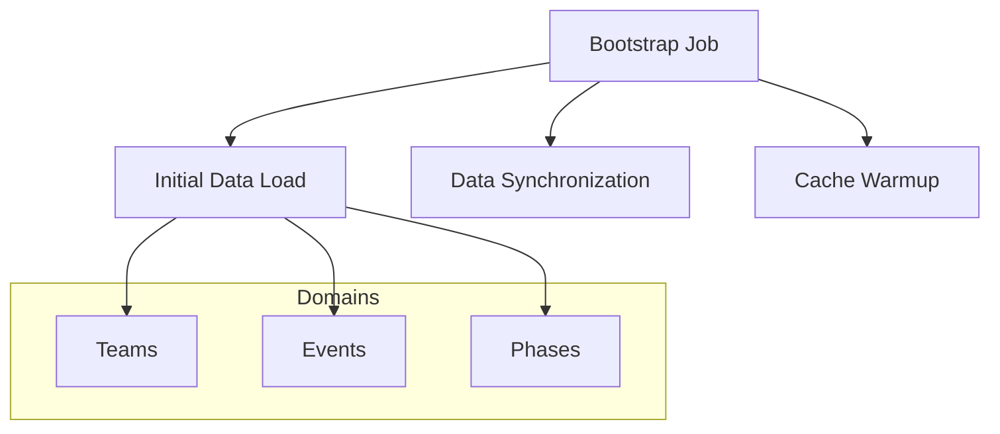
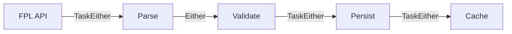
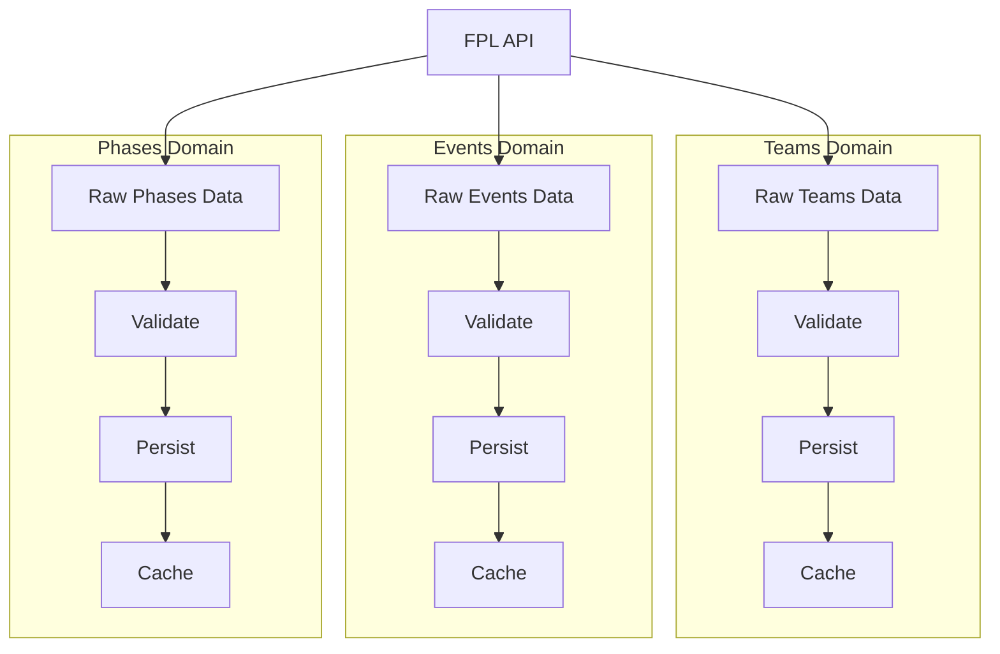
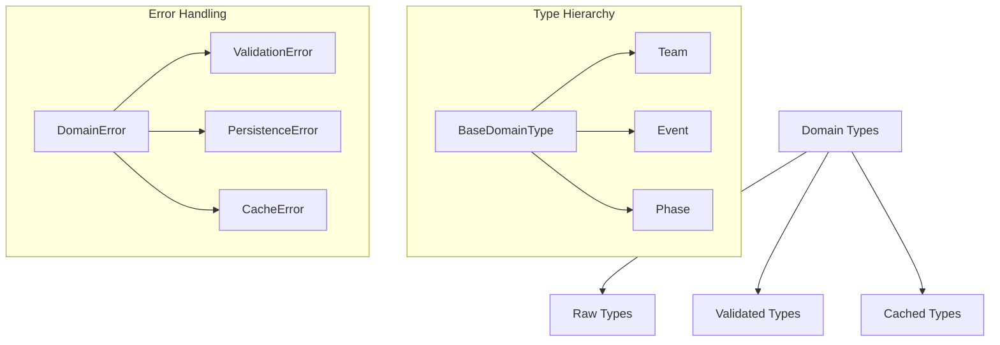
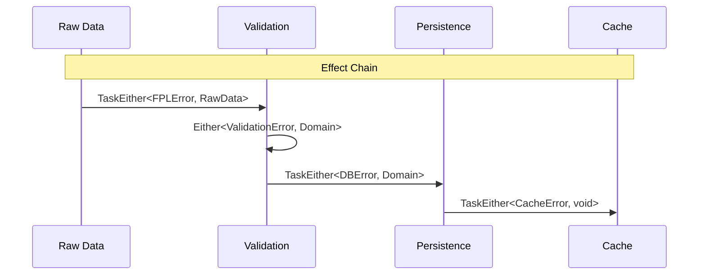
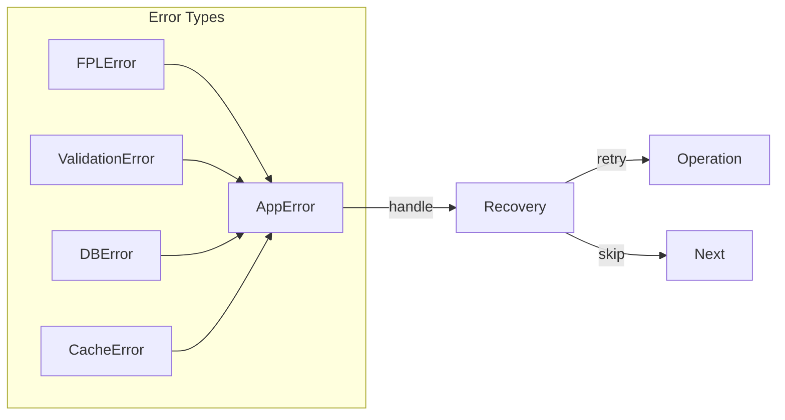
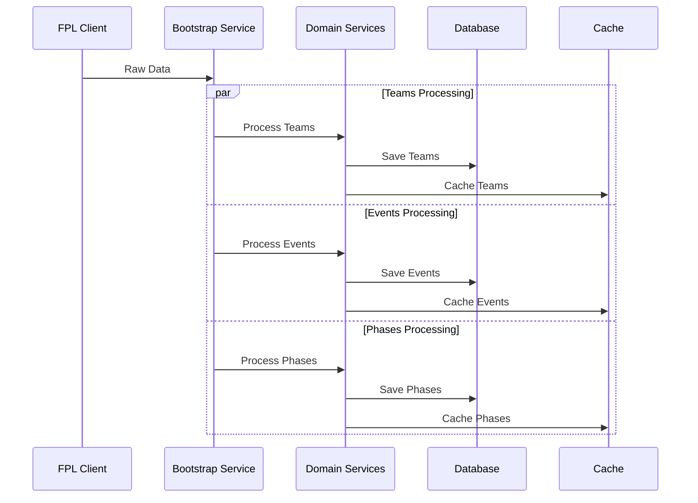
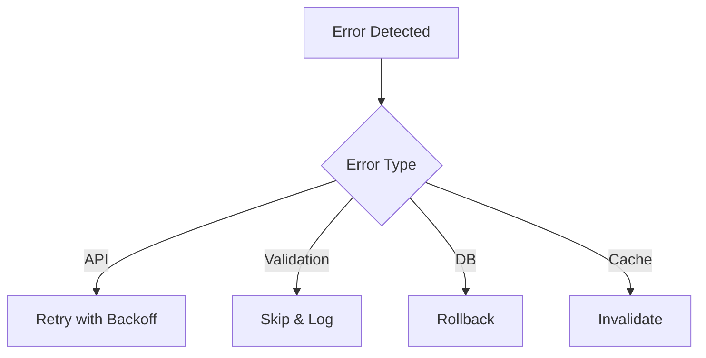
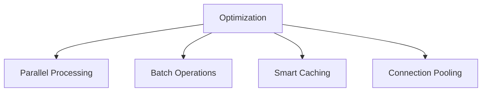

## 1. Bootstrap Job Overview

### A. Purpose and Scope



### B. Core Responsibilities

- Fetch initial data from FPL API
- Validate and transform raw data
- Maintain data consistency across domains
- Manage cache state
- Handle errors and retries

## 2. Functional Design

### A. Effect Chain



### B. Data Dependencies and Processing Order



#### Domain Processing

1. **Independent Domains**

   - Teams, Events, and Phases are separate bounded contexts
   - Each domain has its own data model and validation rules
   - No cross-domain dependencies in processing

2. **Parallel Processing**

   - All domains can be processed simultaneously
   - Each domain maintains its own state
   - Independent validation and persistence

3. **Shared Infrastructure**
   - Common FPL API client
   - Shared database connection pool
   - Unified cache strategy
   - Common error handling patterns

#### Implementation Example

```typescript
// Independent domain processing
interface DomainProcessor<T extends BaseDomainType> {
  readonly validate: (raw: unknown) => Either<ValidationError, T>;
  readonly persist: (data: T) => TaskEither<PersistenceError, T>;
  readonly cache: (data: T) => TaskEither<CacheError, void>;
}

// Parallel domain processing
const processAllDomains = (api: FPLClient): TaskEither<DomainError, void> =>
  pipe(
    sequenceT(TE.ApplicativePar)(
      // Parallel execution
      processTeamDomain(api),
      processEventDomain(api),
      processPhaseDomain(api),
    ),
    map(() => undefined),
  );

// Example team domain processor
const teamProcessor: DomainProcessor<Team> = {
  validate: flow(
    validateShape({
      id: validateNumber,
      name: validateString,
      shortName: validateString,
      strength: validateNumber,
    }),
    map(transformToTeam),
  ),
  persist: (team) => pipe(db.teams.create({ data: team }), mapLeft(toPersistenceError)),
  cache: (team) => pipe(cache.set(`team:${team.id}`, team), mapLeft(toCacheError)),
};

// Independent domain processing
const processTeamDomain = (api: FPLClient): TaskEither<DomainError, void> =>
  pipe(
    api.getTeams(),
    chain(validateTeams(teamProcessor.validate)),
    chain(persistTeams(teamProcessor.persist)),
    chain(cacheTeams(teamProcessor.cache)),
  );

// Similar independent processors for events and phases
```

#### Error Handling

```typescript
// Domain-specific error handling
const handleDomainError =
  <T>(domain: string) =>
  (error: DomainError): TaskEither<DomainError, T> =>
    pipe(
      TE.left(error),
      chainFirst((e) => logError(`${domain} processing failed: ${e.message}`)),
      chain((e) => retryStrategy(domain, e)),
    );

// Independent retry strategies
const retryStrategy = (domain: string, error: DomainError): TaskEither<DomainError, void> => {
  switch (error._tag) {
    case 'ValidationError':
      return pipe(
        logValidationError(domain, error),
        map(() => undefined),
      );
    case 'PersistenceError':
      return pipe(
        retryWithBackoff(3),
        chain(() => TE.right(undefined)),
      );
    case 'CacheError':
      return pipe(
        invalidateCache(domain),
        map(() => undefined),
      );
  }
};
```

## 3. Implementation Details

### A. Type Definitions

```typescript
// Domain Types
interface BaseDomainType {
  id: string;
  createdAt: Date;
  updatedAt: Date;
}

// Raw Types from API
interface RawTeam {
  readonly id: number;
  readonly name: string;
  readonly shortName: string;
  readonly strength: number;
}

interface RawEvent {
  readonly id: number;
  readonly name: string;
  readonly startTime: string;
  readonly teamIds: readonly number[];
}

interface RawPhase {
  readonly id: number;
  readonly name: string;
  readonly eventId: number;
  readonly rules: readonly string[];
}

// Validated Domain Types
interface Team extends BaseDomainType {
  readonly name: string;
  readonly shortName: string;
  readonly strength: number;
}

interface Event extends BaseDomainType {
  readonly name: string;
  readonly startTime: Date;
  readonly teams: readonly Team[];
}

interface Phase extends BaseDomainType {
  readonly name: string;
  readonly event: Event;
  readonly rules: readonly string[];
}

// Error Types
type DomainError =
  | { readonly _tag: 'ValidationError'; readonly message: string }
  | { readonly _tag: 'PersistenceError'; readonly cause: Error }
  | { readonly _tag: 'CacheError'; readonly key: string };

// Processing Types
interface ProcessingContext {
  readonly transaction: Transaction;
  readonly cache: CacheClient;
  readonly logger: Logger;
}

type ProcessFn<T> = (ctx: ProcessingContext) => TaskEither<DomainError, T>;

// Service Types
interface BootstrapService {
  readonly processTeams: ProcessFn<readonly Team[]>;
  readonly processEvents: (teams: readonly Team[]) => ProcessFn<readonly Event[]>;
  readonly processPhases: (events: readonly Event[]) => ProcessFn<readonly Phase[]>;
}

// Validation Types
type Validator<T> = (raw: unknown) => Either<ValidationError, T>;
type ValidationRule<T> = (value: T) => Either<ValidationError, T>;

const validateTeam: Validator<Team> = flow(
  validateRequired('name'),
  chain(validateString('shortName')),
  chain(validateNumber('strength')),
);

// Effect Types
type EffectResult<T> = TaskEither<DomainError, T>;
type CacheResult<T> = TaskEither<CacheError, T>;
type DBResult<T> = TaskEither<PersistenceError, T>;
```



### B. Effect Composition



### C. Error Channel



## 4. Processing Strategy

### A. Domain Processing Flow



### B. Error Recovery



## 5. Implementation Components

### A. Infrastructure Layer

- FPL Client: API interaction
- Database Client: Persistence
- Cache Client: Data caching
- Error Handler: Error management

### B. Domain Layer

- Team Domain: Team validation & rules
- Event Domain: Event validation & rules
- Phase Domain: Phase validation & rules

### C. Service Layer

- Bootstrap Service: Process orchestration
- Transaction Service: Data consistency
- Cache Service: Cache management

## 6. Error Handling Strategy

### A. Error Types

- API Errors: Connection, timeout, rate limits
- Validation Errors: Invalid data, missing fields
- Persistence Errors: DB failures, constraints
- Cache Errors: Cache misses, invalidation

### B. Recovery Strategies

- Retry with exponential backoff
- Partial success handling
- Transaction rollback
- Cache invalidation

## 7. Performance Optimization

### A. Processing Optimizations



### B. Caching Strategy

- Cache warmed after successful processing
- Hierarchical invalidation
- TTL policies per domain
- Cache dependencies management

## 8. Monitoring and Maintenance

### A. Key Metrics

- Job execution time
- Success/failure rates
- Data validation stats
- Cache hit ratios

### B. Health Checks

- API availability
- Database connectivity
- Cache status
- Domain validation status

## 9. Implementation Examples

### A. Type-Safe Job Implementation

```typescript
// Job Definition
interface BootstrapJob<T extends BaseDomainType> {
  readonly process: ProcessFn<readonly T[]>;
  readonly validate: Validator<T>;
  readonly persist: (data: readonly T[]) => DBResult<void>;
  readonly cache: (data: readonly T[]) => CacheResult<void>;
}

// Concrete Implementation
const createTeamBootstrapJob = (
  fplClient: FPLClient,
  db: Database,
  cache: CacheClient,
): BootstrapJob<Team> => ({
  process: (ctx: ProcessingContext) =>
    pipe(
      fplClient.getTeams(),
      chain(validateTeams(teamProcessor.validate)),
      chain(persistTeams(teamProcessor.persist)),
      chain(cacheTeams(teamProcessor.cache)),
    ),
  validate: flow(
    validateRequired('name'),
    chain(validateString('shortName')),
    chain(validateNumber('strength')),
  ),
  persist: (teams) =>
    db.transaction((tx) =>
      pipe(
        tx.teams.deleteMany({}),
        chain(() => tx.teams.createMany({ data: teams })),
      ),
    ),
  cache: (teams) =>
    pipe(
      cache.del('teams:*'),
      chain(() => cache.set('teams:all', teams)),
    ),
});

// Error Handling
const withErrorHandling = <T>(job: BootstrapJob<T>): BootstrapJob<T> => ({
  ...job,
  process: (ctx) =>
    pipe(
      job.process(ctx),
      orElse((error) =>
        pipe(
          logError(error),
          chain(retryStrategy),
          chain(() => job.process(ctx)),
        ),
      ),
    ),
});

// Composition
const createBootstrapPipeline = (
  teamJob: BootstrapJob<Team>,
  eventJob: BootstrapJob<Event>,
  phaseJob: BootstrapJob<Phase>,
) =>
  pipe(
    teamJob.process,
    chain((teams) => eventJob.process({ teams })),
    chain((events) => phaseJob.process({ events })),
  );
```

### B. Validation Implementation

```typescript
// Validation Rules
const validateTeam = (raw: unknown): Either<ValidationError, Team> =>
  pipe(
    raw,
    validateShape({
      id: validateNumber,
      name: validateString,
      shortName: validateString,
      strength: validateNumber,
    }),
    map(transformToTeam),
  );

// Smart Constructors
const createTeam = (raw: RawTeam): Either<ValidationError, Team> =>
  pipe(
    raw,
    validateTeam,
    map((validated) => ({
      ...validated,
      createdAt: new Date(),
      updatedAt: new Date(),
    })),
  );

// Validation Combinators
const validateAll =
  <T>(validators: readonly Validator<T>[]): Validator<T> =>
  (value: T) =>
    pipe(
      validators,
      A.sequence(E.Applicative),
      map(() => value),
    );
```

### C. Effect Management

```typescript
// Effect Composition
const processTeams = (ctx: ProcessingContext): TaskEither<DomainError, readonly Team[]> =>
  pipe(
    ctx.fplClient.getTeams(),
    mapLeft(toFPLError),
    chain(validateTeams),
    chainFirst(logProcessing('teams')),
    chain(persistTeams(ctx.db)),
    chain(cacheTeams(ctx.cache)),
  );

// Transaction Management
const withTransaction = <T>(
  db: Database,
  operation: (tx: Transaction) => TaskEither<DomainError, T>,
): TaskEither<DomainError, T> => pipe(db.transaction(operation), mapLeft(toPersistenceError));

// Cache Management
const withCache = <T>(
  cache: CacheClient,
  key: string,
  operation: () => TaskEither<DomainError, T>,
): TaskEither<DomainError, T> =>
  pipe(
    cache.get<T>(key),
    orElse(() =>
      pipe(
        operation(),
        chainFirst((result) => cache.set(key, result)),
      ),
    ),
  );
```

## 10. Folder Structure and File Organization

### A. Project Structure

```
src/
├── domain/
│   ├── teams/
│   │   ├── types.ts              # Team domain types
│   │   └── validation.ts         # Team-specific validation rules
│   ├── events/
│   │   ├── types.ts              # Event domain types
│   │   └── validation.ts         # Event-specific validation rules
│   └── phases/
│       ├── types.ts              # Phase domain types
│       └── validation.ts         # Phase-specific validation rules
├── infrastructure/
│   ├── api/
│   │   ├── common/
│   │   │   ├── client.ts         # Base HTTP client implementation
│   │   │   ├── errors.ts         # API error types
│   │   │   ├── logs.ts           # API logging utilities
│   │   │   └── types.ts          # Shared API types
│   │   └── fpl/
│   │       ├── client.ts         # FPL-specific client implementation
│   │       └── config.ts         # FPL API configuration
│   ├── cache/
│   │   └── CacheClient.ts
│   └── db/
│       └── Database.ts
├── jobs/
│   ├── common/
│   │   ├── types.ts              # Shared job types
│   │   └── utils.ts              # Common job utilities
│   └── bootstrap/
│       ├── TeamBootstrapJob.ts   # Team bootstrap implementation
│       ├── EventBootstrapJob.ts  # Event bootstrap implementation
│       └── PhaseBootstrapJob.ts  # Phase bootstrap implementation
└── services/
    └── job/
        └── JobService.ts         # Job orchestration service
```

### B. File Contents and Responsibilities

1. **Domain Layer** (`src/domain/`)

```typescript
// src/domain/teams/types.ts
export interface Team extends BaseDomainType {
  readonly name: string;
  readonly shortName: string;
  readonly strength: number;
}

// src/domain/teams/validation.ts
export const validateTeam = (raw: unknown): Either<ValidationError, Team> =>
  pipe(
    raw,
    validateShape({
      id: validateNumber,
      name: validateString,
      shortName: validateString,
      strength: validateNumber,
    }),
    map(transformToTeam),
  );
```

2. **Infrastructure Layer** (`src/infrastructure/`)

```typescript
// src/infrastructure/api/common/client.ts
export class HTTPClient {
  constructor(config: HTTPClientConfig) {
    super({
      baseURL: config?.baseURL,
      headers: config?.headers,
      timeout: config?.timeout,
      retry: {
        attempts: config?.retry?.attempts,
        baseDelay: config?.retry?.baseDelay,
        maxDelay: config?.retry?.maxDelay,
        shouldRetry: config?.retry?.shouldRetry,
      },
      validateStatus: config?.validateStatus,
    });
  }

  protected get<T>(url: string, options?: RequestOptions): TaskEither<APIError, T>;
  protected post<T>(url: string, data: unknown, options?: RequestOptions): TaskEither<APIError, T>;
}

// src/infrastructure/api/fpl/config.ts
export const BASE_URLS = {
  FPL: 'https://fantasy.premierleague.com/api',
} as const;

export const FPL_API_CONFIG = {
  bootstrap: {
    static: '/bootstrap-static/',
  },
  fixtures: {
    byGameweek: ({ event }: { event: number }) => `/fixtures/?event=${event}`,
    live: ({ event }: { event: number }) => `/event/${event}/live/`,
  },
  // ... other endpoints
} as const;

// src/infrastructure/api/fpl/client.ts
export class FPLClient extends HTTPClient {
  constructor(config?: FPLClientConfig) {
    super({
      baseURL: config?.baseURL ?? BASE_URLS.FPL,
      headers: {
        ...createDefaultHeaders(config?.userAgent ?? DEFAULT_USER_AGENT),
        ...config?.headers,
      },
      timeout: config?.timeout ?? DEFAULT_TIMEOUT,
      retry: {
        attempts: 5,
        baseDelay: 2000,
        maxDelay: 10000,
        shouldRetry: (error) => error instanceof Error && error.name !== 'ValidationError',
      },
    });
  }

  async getBootstrapStatic(options?: RequestOptions) {
    return pipe(
      await this.get<unknown>(FPL_API_CONFIG.bootstrap.static, options),
      E.chain(validateResponse(EventResponseSchema)),
      logFplCall(createApiCallContext('getBootstrapStatic')),
    );
  }

  async getFixtures(event: number, options?: RequestOptions) {
    return pipe(
      await this.get<unknown>(FPL_API_CONFIG.fixtures.byGameweek({ event }), options),
      logFplCall(createApiCallContext('getFixtures', { event })),
    );
  }

  // Other FPL-specific methods...
}

// src/infrastructure/api/common/logs.ts
export const createApiLogger = (config: LoggerConfig): Logger => ({
  name: config.name,
  level: config.level,
  filepath: config.filepath,
});

export const logApiCall =
  (logger: Logger) =>
  <T>(context: ApiCallContext) =>
  (result: Either<Error, T>): Either<Error, T> => {
    pipe(
      result,
      E.fold(
        (error) => logger.error(context, error),
        (data) => logger.info(context, { success: true }),
      ),
    );
    return result;
  };
```

3. **Jobs Layer** (`src/jobs/`)

```typescript
// src/jobs/common/types.ts
export interface BootstrapJob<T extends BaseDomainType> {
  readonly process: ProcessFn<readonly T[]>;
  readonly validate: Validator<T>;
  readonly persist: (data: readonly T[]) => DBResult<void>;
  readonly cache: (data: readonly T[]) => CacheResult<void>;
}

// src/jobs/bootstrap/TeamBootstrapJob.ts
export const createTeamBootstrapJob = (
  fplClient: FPLClient,
  db: Database,
  cache: CacheClient,
): BootstrapJob<Team> => ({
  process: processTeams,
  validate: validateTeam,
  persist: persistTeams,
  cache: cacheTeams,
});
```

4. **Services Layer** (`src/services/`)

```typescript
// src/services/job/JobService.ts
export class JobService {
    private initializeContext = (): ProcessingContext => // ...
    private handleJobError = (error: DomainError): TaskEither<DomainError, void> => // ...
    public runBootstrap = (): TaskEither<DomainError, void> => // ...
}
```

### C. Key Design Points

1. **Domain Separation**

   - Each domain has its own folder with types and validation
   - No cross-domain dependencies in domain layer

2. **Infrastructure Isolation**

   - External services are abstracted in infrastructure layer
   - Clean interfaces for API, cache, and database

3. **Job Organization**

   - Common job types and utilities are shared
   - Each bootstrap job has its own file
   - Clear separation of concerns

4. **Service Layer**
   - Orchestrates job execution
   - Handles high-level flow control
   - Manages dependencies

### D. Function Locations

1. **Domain Functions** (`src/domain/`)

```typescript
// src/domain/teams/types.ts
export interface Team extends BaseDomainType {
    readonly id: string;
    readonly name: string;
    readonly shortName: string;
    readonly strength: number;
}

// src/domain/teams/validation.ts
export const validateTeamShape = (raw: unknown): Either<ValidationError, RawTeam> => // ...
export const validateTeamRules = (team: RawTeam): Either<ValidationError, Team> => // ...
export const transformTeam = (raw: RawTeam): Team => // ...

// src/domain/teams/repository.ts
export const saveTeam = (db: Database) => (team: Team): DBResult<Team> => // ...
export const getTeamById = (db: Database) => (id: string): DBResult<Team> => // ...
```

2. **Infrastructure Functions** (`src/infrastructure/`)

```typescript
// src/infrastructure/api/common/client.ts
export class HTTPClient {
  constructor(config: HTTPClientConfig) {
    super({
      baseURL: config?.baseURL,
      headers: config?.headers,
      timeout: config?.timeout,
      retry: {
        attempts: config?.retry?.attempts,
        baseDelay: config?.retry?.baseDelay,
        maxDelay: config?.retry?.maxDelay,
        shouldRetry: config?.retry?.shouldRetry,
      },
      validateStatus: config?.validateStatus,
    });
  }

  protected get<T>(url: string, options?: RequestOptions): TaskEither<APIError, T>;
  protected post<T>(url: string, data: unknown, options?: RequestOptions): TaskEither<APIError, T>;
}

// src/infrastructure/api/fpl/config.ts
export const BASE_URLS = {
  FPL: 'https://fantasy.premierleague.com/api',
} as const;

export const FPL_API_CONFIG = {
  bootstrap: {
    static: '/bootstrap-static/',
  },
  fixtures: {
    byGameweek: ({ event }: { event: number }) => `/fixtures/?event=${event}`,
    live: ({ event }: { event: number }) => `/event/${event}/live/`,
  },
  // ... other endpoints
} as const;

// src/infrastructure/api/fpl/client.ts
export class FPLClient extends HTTPClient {
  constructor(config?: FPLClientConfig) {
    super({
      baseURL: config?.baseURL ?? BASE_URLS.FPL,
      headers: {
        ...createDefaultHeaders(config?.userAgent ?? DEFAULT_USER_AGENT),
        ...config?.headers,
      },
      timeout: config?.timeout ?? DEFAULT_TIMEOUT,
      retry: {
        attempts: 5,
        baseDelay: 2000,
        maxDelay: 10000,
        shouldRetry: (error) => error instanceof Error && error.name !== 'ValidationError',
      },
    });
  }

  async getBootstrapStatic(options?: RequestOptions) {
    return pipe(
      await this.get<unknown>(FPL_API_CONFIG.bootstrap.static, options),
      E.chain(validateResponse(EventResponseSchema)),
      logFplCall(createApiCallContext('getBootstrapStatic')),
    );
  }

  async getFixtures(event: number, options?: RequestOptions) {
    return pipe(
      await this.get<unknown>(FPL_API_CONFIG.fixtures.byGameweek({ event }), options),
      logFplCall(createApiCallContext('getFixtures', { event })),
    );
  }

  // Other FPL-specific methods...
}

// src/infrastructure/api/common/logs.ts
export const createApiLogger = (config: LoggerConfig): Logger => ({
  name: config.name,
  level: config.level,
  filepath: config.filepath,
});

export const logApiCall =
  (logger: Logger) =>
  <T>(context: ApiCallContext) =>
  (result: Either<Error, T>): Either<Error, T> => {
    pipe(
      result,
      E.fold(
        (error) => logger.error(context, error),
        (data) => logger.info(context, { success: true }),
      ),
    );
    return result;
  };
```

3. **Job Functions** (`src/jobs/`)

```typescript
// src/jobs/common/utils.ts
export const withRetry = <T>(operation: () => TaskEither<Error, T>): TaskEither<Error, T> => // ...
export const withCache = <T>(key: string, operation: () => TaskEither<Error, T>): TaskEither<Error, T> => // ...

// src/jobs/bootstrap/TeamBootstrapJob.ts
const processTeams = (ctx: ProcessingContext): TaskEither<DomainError, Team[]> => // ...
const validateTeams = (teams: RawTeam[]): TaskEither<ValidationError, Team[]> => // ...
const persistTeams = (teams: Team[]): TaskEither<PersistenceError, Team[]> => // ...
export const createTeamBootstrapJob = (deps: Dependencies): BootstrapJob<Team> => // ...
```

4. **Service Functions** (`src/services/`)

```typescript
// src/services/job/JobService.ts
export class JobService {
    private initializeContext = (): ProcessingContext => // ...
    private handleJobError = (error: DomainError): TaskEither<DomainError, void> => // ...
    public runBootstrap = (): TaskEither<DomainError, void> => // ...
}
```

### E. Function Responsibilities

1. **Domain Layer Functions**

   - Type definitions and interfaces
   - Domain-specific validation rules
   - Data transformation logic
   - Repository operations

2. **Infrastructure Layer Functions**

   - External API communication
   - Cache operations
   - Database connections
   - Error handling for external services

3. **Job Layer Functions**

   - Job-specific processing logic
   - Orchestration of domain operations
   - Error recovery and retries
   - Cache management for job results

4. **Service Layer Functions**
   - High-level business operations
   - Transaction management
   - Cross-cutting concerns
   - Service composition
