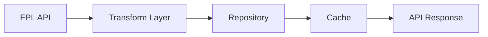

# Player Domain Implementation Guide

## 1. Overview

This guide outlines the implementation of the player domain following functional programming principles and domain-driven design.

### 1.1 Data Flow



### 1.2 Directory Structure

```
src/
├── types/
│   └── players.type.ts      # Domain types and transformers
├── domains/
│   └── players/
│       ├── index.ts         # Domain exports
│       ├── routes.ts        # HTTP routes
│       ├── operations.ts    # Domain operations
│       ├── repository.ts    # Data access layer
│       └── cache/
│           ├── cache.ts     # Cache operations
│           └── invalidation.ts # Cache invalidation
├── services/
│   └── queue/
│       └── meta/
│           └── players.job.ts  # Job implementation
└── infrastructure/
    └── queue/
        └── config/
            └── queue.config.ts # Queue configuration

```

## 2. Type Definitions

```typescript
// types/players.type.ts
import { z } from 'zod';
import { pipe } from 'fp-ts/function';
import * as E from 'fp-ts/Either';

// API Response Schema (snake_case)
export const PlayerResponseSchema = z.object({
  id: z.number(),
  code: z.number(),
  now_cost: z.number(),
  cost_change_start: z.number(),
  element_type: z.number(),
  first_name: z.string().nullable(),
  second_name: z.string().nullable(),
  web_name: z.string(),
  team: z.number(),
});

// Element Type Enum
export enum ElementType {
  GK = 1,
  DEF = 2,
  MID = 3,
  FWD = 4,
}

export const ElementTypeNames: Record<ElementType, string> = {
  [ElementType.GK]: 'Goalkeeper',
  [ElementType.DEF]: 'Defender',
  [ElementType.MID]: 'Midfielder',
  [ElementType.FWD]: 'Forward',
};

// Domain Schema (camelCase)
export const PlayerSchema = z.object({
  element: z.number(),
  elementCode: z.number(),
  price: z.number(),
  startPrice: z.number(),
  elementType: z.nativeEnum(ElementType),
  elementTypeName: z.string(),
  firstName: z.string().nullable(),
  secondName: z.string().nullable(),
  webName: z.string(),
  teamId: z.number(),
});

export type PlayerResponse = z.infer<typeof PlayerResponseSchema>;
export type Player = Readonly<z.infer<typeof PlayerSchema>>;
export type BootstrapStrategy = 'players' | 'values' | 'stats' | 'all';

// Validation
export const validatePlayerResponse = (data: unknown): E.Either<Error, PlayerResponse> =>
  pipe(
    E.tryCatch(
      () => PlayerResponseSchema.parse(data),
      (error) => new Error(`Invalid player response: ${error}`),
    ),
  );

// Transformation
export const transformPlayerResponse = (response: PlayerResponse): E.Either<Error, Player> =>
  pipe(
    validatePlayerResponse(response),
    E.map((validated) => ({
      element: validated.id,
      elementCode: validated.code,
      price: validated.now_cost,
      startPrice: validated.cost_change_start,
      elementType: validated.element_type as ElementType,
      elementTypeName: ElementTypeNames[validated.element_type as ElementType],
      firstName: validated.first_name,
      secondName: validated.second_name,
      webName: validated.web_name,
      teamId: validated.team,
    })),
  );
```

## 3. Repository Layer

```typescript
// domains/players/repository.ts
import { pipe } from 'fp-ts/function';
import * as TE from 'fp-ts/TaskEither';
import { PrismaClient } from '@prisma/client';
import { Player } from '@types/players.type';
import { APIError, createDatabaseError } from '@infrastructure/errors';

export const createPlayerRepository = (prisma: PrismaClient) => {
  const findAll = (): TE.TaskEither<APIError, ReadonlyArray<Player>> =>
    pipe(
      TE.tryCatch(
        () => prisma.player.findMany(),
        (error) => createDatabaseError({ message: `Failed to fetch players: ${error}` }),
      ),
    );

  const findById = (id: number): TE.TaskEither<APIError, Player> =>
    pipe(
      TE.tryCatch(
        () => prisma.player.findUnique({ where: { element: id } }),
        (error) => createDatabaseError({ message: `Failed to fetch player: ${error}` }),
      ),
      TE.chain((player) =>
        player
          ? TE.right(player as Player)
          : TE.left(createDatabaseError({ message: `Player not found: ${id}` })),
      ),
    );

  const upsertMany = (players: ReadonlyArray<Player>): TE.TaskEither<APIError, void> =>
    pipe(
      TE.tryCatch(
        () =>
          prisma.$transaction(
            players.map((player) =>
              prisma.player.upsert({
                where: { element: player.element },
                create: player,
                update: player,
              }),
            ),
          ),
        (error) => createDatabaseError({ message: `Failed to upsert players: ${error}` }),
      ),
      TE.map(() => undefined),
    );

  const updateValue = (id: number, price: number): TE.TaskEither<APIError, void> =>
    pipe(
      TE.tryCatch(
        () =>
          prisma.playerValue.create({
            data: {
              playerId: id,
              value: price,
              timestamp: new Date(),
            },
          }),
        (error) => createDatabaseError({ message: `Failed to update player value: ${error}` }),
      ),
      TE.map(() => undefined),
    );

  const updateStats = (id: number, stats: Player): TE.TaskEither<APIError, void> =>
    pipe(
      TE.tryCatch(
        () =>
          prisma.playerStats.upsert({
            where: { playerId_timestamp: { playerId: id, timestamp: new Date() } },
            create: {
              playerId: id,
              ...stats,
              timestamp: new Date(),
            },
            update: stats,
          }),
        (error) => createDatabaseError({ message: `Failed to update player stats: ${error}` }),
      ),
      TE.map(() => undefined),
    );

  return {
    findAll,
    findById,
    upsertMany,
    updateValue,
    updateStats,
  } as const;
};

export type PlayerRepository = ReturnType<typeof createPlayerRepository>;
```

## 4. Cache Layer

```typescript
// domains/players/cache/cache.ts
import { pipe } from 'fp-ts/function';
import * as TE from 'fp-ts/TaskEither';
import { RedisClient } from '@infrastructure/cache/redis';
import { CacheTTL } from '@infrastructure/cache/config/cache.config';
import { Player } from '@types/players.type';
import { APIError, createCacheError } from '@infrastructure/errors';

export const createPlayerCache = (redis: RedisClient) => {
  const createKey = (type: 'all' | 'value' | 'stats', id?: number) =>
    id ? `players:${type}:${id}` : `players:${type}`;

  const getPlayers = (): TE.TaskEither<APIError, ReadonlyArray<Player>> =>
    pipe(
      TE.tryCatch(
        () => redis.get(createKey('all')),
        (error) => createCacheError({ message: `Failed to get players from cache: ${error}` }),
      ),
      TE.chain((data) =>
        data
          ? pipe(
              TE.tryCatch(
                () => JSON.parse(data) as ReadonlyArray<Player>,
                (error) => createCacheError({ message: `Invalid cache data: ${error}` }),
              ),
            )
          : TE.left(createCacheError({ message: 'Cache miss' })),
      ),
    );

  const setPlayers = (players: ReadonlyArray<Player>): TE.TaskEither<APIError, void> =>
    pipe(
      TE.tryCatch(
        () => redis.set(createKey('all'), JSON.stringify(players), { ttl: CacheTTL.METADATA }),
        (error) => createCacheError({ message: `Failed to cache players: ${error}` }),
      ),
      TE.map(() => undefined),
    );

  const getPlayerValue = (id: number): TE.TaskEither<APIError, Player> =>
    pipe(
      TE.tryCatch(
        () => redis.get(createKey('value', id)),
        (error) => createCacheError({ message: `Failed to get player value from cache: ${error}` }),
      ),
      TE.chain((data) =>
        data
          ? pipe(
              TE.tryCatch(
                () => JSON.parse(data) as Player,
                (error) => createCacheError({ message: `Invalid cache data: ${error}` }),
              ),
            )
          : TE.left(createCacheError({ message: 'Cache miss' })),
      ),
    );

  const setPlayerValue = (id: number, player: Player): TE.TaskEither<APIError, void> =>
    pipe(
      TE.tryCatch(
        () =>
          redis.set(createKey('value', id), JSON.stringify(player), { ttl: CacheTTL.DERIVED_DATA }),
        (error) => createCacheError({ message: `Failed to cache player value: ${error}` }),
      ),
      TE.map(() => undefined),
    );

  const invalidateAll = (): TE.TaskEither<APIError, void> =>
    pipe(
      TE.tryCatch(
        () => redis.del(createKey('all')),
        (error) => createCacheError({ message: `Failed to invalidate cache: ${error}` }),
      ),
      TE.map(() => undefined),
    );

  return {
    getPlayers,
    setPlayers,
    getPlayerValue,
    setPlayerValue,
    invalidateAll,
  } as const;
};

export type PlayerCache = ReturnType<typeof createPlayerCache>;

// domains/players/cache/invalidation.ts
import { pipe } from 'fp-ts/function';
import * as TE from 'fp-ts/TaskEither';
import { PlayerCache } from './cache';
import { APIError } from '@infrastructure/errors';

export const createCacheInvalidation = (cache: PlayerCache) => {
  const invalidateOnUpdate = (): TE.TaskEither<APIError, void> => cache.invalidateAll();

  const invalidateValue = (id: number): TE.TaskEither<APIError, void> =>
    pipe(
      cache.invalidateAll(),
      TE.chain(() => cache.getPlayerValue(id)),
    );

  return {
    invalidateOnUpdate,
    invalidateValue,
  } as const;
};

export type CacheInvalidation = ReturnType<typeof createCacheInvalidation>;
```

## 5. Operations Layer

```typescript
// domains/players/operations.ts
import { pipe } from 'fp-ts/function';
import * as TE from 'fp-ts/TaskEither';
import { PlayerRepository } from './repository';
import { PlayerCache } from './cache/cache';
import { CacheInvalidation } from './cache/invalidation';
import { Player, PlayerResponse, BootstrapStrategy } from '@types/players.type';
import { APIError, createInternalServerError } from '@infrastructure/errors';

export const createPlayerOperations = (
  repository: PlayerRepository,
  cache: PlayerCache,
  cacheInvalidation: CacheInvalidation,
) => {
  // Core processing functions
  const processPlayers = (data: ReadonlyArray<PlayerResponse>): TE.TaskEither<APIError, void> =>
    pipe(
      data,
      TE.traverseArray((response) => pipe(transformPlayerResponse(response), TE.fromEither)),
      TE.chain((players) => repository.upsertMany(players)),
      TE.chain(() => cacheInvalidation.invalidateOnUpdate()),
      TE.mapLeft((error) => createInternalServerError({ message: error.message })),
    );

  const processValues = (data: ReadonlyArray<PlayerResponse>): TE.TaskEither<APIError, void> =>
    pipe(
      data,
      TE.traverseArray((response) => pipe(transformPlayerResponse(response), TE.fromEither)),
      TE.chain((players) =>
        pipe(
          repository.findAll(),
          TE.chain(() =>
            pipe(
              players,
              TE.traverseArray((player) => repository.updateValue(player.element, player.price)),
            ),
          ),
          TE.chain(() => cacheInvalidation.invalidateOnUpdate()),
        ),
      ),
      TE.mapLeft((error) => createInternalServerError({ message: error.message })),
    );

  const processStats = (data: ReadonlyArray<PlayerResponse>): TE.TaskEither<APIError, void> =>
    pipe(
      data,
      TE.traverseArray((response) => pipe(transformPlayerResponse(response), TE.fromEither)),
      TE.chain((players) =>
        pipe(
          repository.findAll(),
          TE.chain(() =>
            pipe(
              players,
              TE.traverseArray((player) => repository.updateStats(player.element, player)),
            ),
          ),
          TE.chain(() => cacheInvalidation.invalidateOnUpdate()),
        ),
      ),
      TE.mapLeft((error) => createInternalServerError({ message: error.message })),
    );

  // Strategy selector
  const processBootstrapData = (
    strategy: BootstrapStrategy,
    data: ReadonlyArray<PlayerResponse>,
  ): TE.TaskEither<APIError, void> => {
    const strategies: Record<BootstrapStrategy, TE.TaskEither<APIError, void>> = {
      players: processPlayers(data),
      values: pipe(
        processPlayers(data),
        TE.chain(() => processValues(data)),
      ),
      stats: pipe(
        processPlayers(data),
        TE.chain(() => processStats(data)),
      ),
      all: pipe(
        processPlayers(data),
        TE.chain(() => processValues(data)),
        TE.chain(() => processStats(data)),
      ),
    };

    return strategies[strategy];
  };

  // Query operations
  const getAll = (): TE.TaskEither<APIError, ReadonlyArray<Player>> =>
    pipe(
      cache.getPlayers(),
      TE.orElse(() =>
        pipe(
          repository.findAll(),
          TE.chain((players) =>
            pipe(
              cache.setPlayers(players),
              TE.map(() => players),
            ),
          ),
        ),
      ),
    );

  const getById = (id: number): TE.TaskEither<APIError, Player> =>
    pipe(
      cache.getPlayerValue(id),
      TE.orElse(() =>
        pipe(
          repository.findById(id),
          TE.chain((player) =>
            pipe(
              cache.setPlayerValue(id, player),
              TE.map(() => player),
            ),
          ),
        ),
      ),
    );

  return {
    processBootstrapData,
    getAll,
    getById,
  } as const;
};

export type PlayerOperations = ReturnType<typeof createPlayerOperations>;
```

## 6. Job Implementation

```typescript
// services/queue/meta/players.job.ts
import { pipe } from 'fp-ts/function';
import * as TE from 'fp-ts/TaskEither';
import { MetaQueueService } from '@infrastructure/queue/meta';
import { JobOperation } from '@infrastructure/queue/types';
import { PlayerOperations } from '@domains/players/operations';
import { FPLClient } from '@infrastructure/api/fpl';
import { BootstrapStrategy } from '@types/players.type';
import { createQueueProcessingError } from '@infrastructure/errors';

export const createPlayerJob = (
  metaQueue: MetaQueueService,
  operations: PlayerOperations,
  fplClient: FPLClient,
) => {
  const handleSync = (
    strategy: BootstrapStrategy,
    options?: JobOptions,
  ): TE.TaskEither<Error, void> =>
    pipe(
      TE.tryCatch(
        () => fplClient.getBootstrapData(),
        (error) => new Error(`API error: ${error}`),
      ),
      TE.chain((response) => operations.processBootstrapData(strategy, response.elements)),
    );

  const processJob = (job: Job<MetaJobData>): TE.TaskEither<Error, void> => {
    const { operation, options, strategy = 'all' } = job.data.data;

    switch (operation) {
      case JobOperation.SYNC:
        return handleSync(strategy, options);
      default:
        return TE.left(createQueueProcessingError({ message: `Unknown operation: ${operation}` }));
    }
  };

  const scheduleSync = (
    strategy: BootstrapStrategy = 'all',
    options?: JobOptions,
  ): TE.TaskEither<Error, Job<MetaJobData>> =>
    pipe(
      TE.right({
        operation: JobOperation.SYNC,
        strategy,
        options,
      }),
      TE.chain((data) => metaQueue.addPlayersJob({ data })),
    );

  return {
    processJob,
    scheduleSync,
  } as const;
};

export type PlayerJob = ReturnType<typeof createPlayerJob>;

// Job registration
export const registerPlayerJobs = (job: PlayerJob): void => {
  // Register job processor
  metaQueue.process('players', job.processJob);

  // Schedule initial jobs
  pipe(
    job.scheduleSync('all'),
    TE.match(
      (error) => console.error('Failed to schedule player jobs:', error),
      () => console.log('Player jobs scheduled successfully'),
    ),
  )();
};

// Create dependencies
const metaQueue = createMetaQueueService();
const fplClient = createFPLClient();

// Export singleton instance
export const playerJob = createPlayerJob(metaQueue, playerOperations, fplClient);
```

## 7. Routes Implementation

```typescript
// domains/players/routes.ts
import { Router } from 'express';
import { pipe } from 'fp-ts/function';
import * as TE from 'fp-ts/TaskEither';
import { PlayerOperations } from './operations';
import { PlayerJob } from '@services/queue/meta/players.job';
import { BootstrapStrategy } from '@types/players.type';
import { createValidationError } from '@infrastructure/errors';

export const createPlayerRoutes = (operations: PlayerOperations, job: PlayerJob) => {
  const router = Router();

  // GET /players
  router.get('/', async (_req, res) => {
    const result = await pipe(
      operations.getAll(),
      TE.match(
        (error) => res.status(500).json({ error: error.message }),
        (players) => res.json({ data: players }),
      ),
    )();
  });

  // GET /players/:id
  router.get('/:id', async (req, res) => {
    const id = parseInt(req.params.id, 10);

    if (isNaN(id)) {
      return res.status(400).json({
        error: createValidationError({ message: 'Invalid player ID' }).message,
      });
    }

    const result = await pipe(
      operations.getById(id),
      TE.match(
        (error) => res.status(500).json({ error: error.message }),
        (player) => res.json({ data: player }),
      ),
    )();
  });

  // POST /players/sync
  router.post('/sync', async (req, res) => {
    const strategy = (req.body.strategy || 'all') as BootstrapStrategy;
    const options = req.body.options;

    const result = await pipe(
      job.scheduleSync(strategy, options),
      TE.match(
        (error) => res.status(500).json({ error: error.message }),
        () => res.status(202).json({ message: 'Sync job scheduled' }),
      ),
    )();
  });

  return router;
};

// domains/players/index.ts
import { createPlayerOperations } from './operations';
import { createPlayerRepository } from './repository';
import { createPlayerCache } from './cache/cache';
import { createCacheInvalidation } from './cache/invalidation';
import { createPlayerRoutes } from './routes';
import { createPlayerJob, registerPlayerJobs } from '@services/queue/meta/players.job';
import { prisma } from '@infrastructure/prisma';
import { redis } from '@infrastructure/redis';
import { metaQueue } from '@infrastructure/queue/meta';
import { fplClient } from '@infrastructure/api/fpl';

// Create dependencies
const repository = createPlayerRepository(prisma);
const cache = createPlayerCache(redis);
const cacheInvalidation = createCacheInvalidation(cache);
const operations = createPlayerOperations(repository, cache, cacheInvalidation);
const job = createPlayerJob(metaQueue, operations, fplClient);

// Create and export router
export const playerRouter = createPlayerRoutes(operations, job);

// Register jobs
registerPlayerJobs(job);
```

## 8. Testing Strategy

```typescript
// __tests__/domains/players/operations.test.ts
import { pipe } from 'fp-ts/function';
import * as TE from 'fp-ts/TaskEither';
import { createPlayerOperations } from '@domains/players/operations';
import { PlayerResponse, Player } from '@types/players.type';

describe('Player Operations', () => {
  const mockRepository = {
    findAll: jest.fn(),
    findById: jest.fn(),
    upsertMany: jest.fn(),
    updateValue: jest.fn(),
    updateStats: jest.fn(),
  };

  const mockCache = {
    getPlayers: jest.fn(),
    setPlayers: jest.fn(),
    getPlayerValue: jest.fn(),
    setPlayerValue: jest.fn(),
    invalidateAll: jest.fn(),
  };

  const mockCacheInvalidation = {
    invalidateOnUpdate: jest.fn(),
    invalidateValue: jest.fn(),
  };

  const operations = createPlayerOperations(mockRepository, mockCache, mockCacheInvalidation);

  beforeEach(() => {
    jest.clearAllMocks();
  });

  describe('processBootstrapData', () => {
    const mockResponse: PlayerResponse = {
      id: 1,
      code: 123,
      now_cost: 100,
      cost_change_start: 0,
      element_type: 1,
      first_name: 'John',
      second_name: 'Doe',
      web_name: 'J. Doe',
      team: 1,
    };

    it('should process players only', async () => {
      mockRepository.upsertMany.mockResolvedValue(undefined);
      mockCacheInvalidation.invalidateOnUpdate.mockResolvedValue(undefined);

      await pipe(
        operations.processBootstrapData('players', [mockResponse]),
        TE.match(
          (error) => {
            throw error;
          },
          () => undefined,
        ),
      )();

      expect(mockRepository.upsertMany).toHaveBeenCalled();
      expect(mockCacheInvalidation.invalidateOnUpdate).toHaveBeenCalled();
      expect(mockRepository.updateValue).not.toHaveBeenCalled();
      expect(mockRepository.updateStats).not.toHaveBeenCalled();
    });

    it('should process all data', async () => {
      mockRepository.upsertMany.mockResolvedValue(undefined);
      mockRepository.updateValue.mockResolvedValue(undefined);
      mockRepository.updateStats.mockResolvedValue(undefined);
      mockCacheInvalidation.invalidateOnUpdate.mockResolvedValue(undefined);

      await pipe(
        operations.processBootstrapData('all', [mockResponse]),
        TE.match(
          (error) => {
            throw error;
          },
          () => undefined,
        ),
      )();

      expect(mockRepository.upsertMany).toHaveBeenCalled();
      expect(mockRepository.updateValue).toHaveBeenCalled();
      expect(mockRepository.updateStats).toHaveBeenCalled();
      expect(mockCacheInvalidation.invalidateOnUpdate).toHaveBeenCalled();
    });
  });
});

// Add more test files for repository, cache, job, and routes...
```

## 9. Error Handling

The implementation uses a consistent error handling strategy:

1. **Domain Errors**:

   - Validation errors
   - Business rule violations
   - Data transformation errors

2. **Infrastructure Errors**:

   - Database errors
   - Cache errors
   - Queue processing errors
   - API errors

3. **Error Types**:

   - All errors extend from `APIError`
   - Specific error types for different layers
   - Error messages are descriptive and actionable

4. **Error Propagation**:
   - Using `TaskEither` for async operations
   - Using `Either` for sync operations
   - Proper error mapping between layers

## 10. Performance Considerations

1. **Caching Strategy**:

   - Players: 30 days TTL
   - Values: 24 hours TTL
   - Stats: 1 hour TTL
   - Cache invalidation on updates

2. **Database Operations**:

   - Batch operations for updates
   - Transaction support
   - Proper indexing

3. **Job Processing**:

   - Parallel processing where possible
   - Rate limiting for API calls
   - Proper error recovery

4. **API Response Times**:
   - Cache-first strategy
   - Minimal database queries
   - Efficient data transformations
